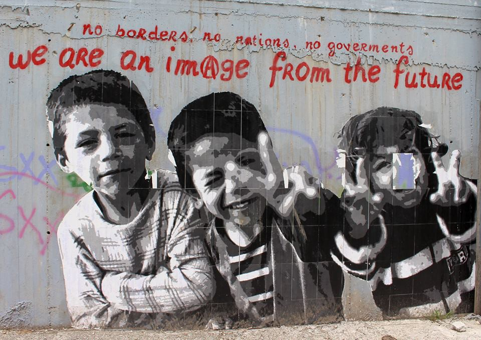
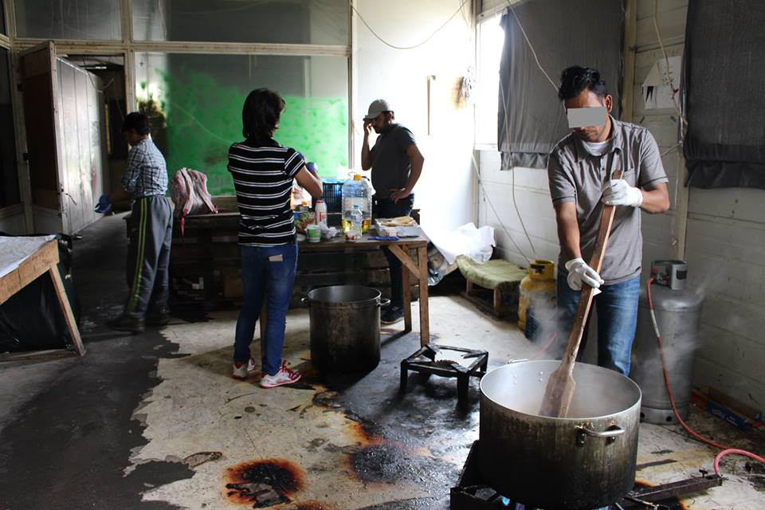

### DEBATE: Who do you think you are?
#### After we published a [letter from Shoufu volunteer group](debate-what-to-do-when-volunteers-become-lackeys-of-authorities-765b45e561f8) , some other volunteers from Lesvos contacted us wiling to continue this debate we had opened\. 
Read their story, and join the debate\.

_After the decline of emergency situation, there is space for work that goes beyond addressing basic needs\._

**_By Martin Wähler und Clara Graulich, independent volunteers_**

“If the medication comes from Aid Relief we are not taking it,” says Fabian\. His conviction could be admirable, would the situation be less serious\. But we are talking about medication for sick refugees living in squats with activists on Lesvos\. Aid Relief is another organisation on the island and is well funded\. But their approach to assisting refugees is different\. Misunderstandings and conflicts between the two groups occur frequently\. Aid Relief would not abide by agreements and swipe over other support structures on the island, activists say\. Moreover, their publicity and constant media attention exploits the vulnerability of people, the argument continues\. Aid Relief, on the other hand, accuses the activist of being naive and disorganised\. Tensions between the two groups have now reached a point where rivalries override the actual aid for refugees\.

In the past two years, Greece was overwhelmed with what seemed to be an unmanageable situation\. Thousands of people stranded in places like Lesvos, Athens’ harbor, and Idomeni, without tents, food and medical aid\. Many volunteers and NGOs offered basic support that was desperately needed\. We worked with a collective of independent volunteers in Idomeni, that provided food for up to 10,000 people on a daily basis\. Other groups took responsibility for clothes distribution or allocation of tents\. The immediate emergency situation required good coordination between all of the groups active on the ground\. It worked pretty well — and it had to\. Because lives directly depended on it\.

Now, one year after the EU\-Turkey deal, the situation has changed\. A structure for basic needs is established in most places\. Some NGOs and collectives have started to move towards organizing support that goes beyond addressing the basic needs\. Because now, past the emergency situation, there is finally room for that\. But visions can diverge fundamentally\. Do you work within the political framework and, for example, build a community center to combat the dull every\-day boredom? Or do you try to break the framework by organizing protests and inform the people about potential ways out of Greece? Those are two very different approaches, and only two out of many\.

_Self\-organised cooking by refugees on Lesvos_

But no matter how different the projects are, every single one is still vital and addresses different needs\. In one way or another, they restore dignity and give some freedom back to the lives of hundreds of refugees\. However, differences between approaches have increasingly become subject to rivalries and resentments against one another\. In the case we witnessed on Lesvos, a refugee suffered from toothache for over a week\. Only because two groups don’t cooperate anymore ‘as a matter of principle’\. But to insist on principles does not acknowledge that unpolitical and political support can actually complement each other very well\. What one group cannot provide is given by another\. In one way or the other we have the same goal: solving the refugee crisis\. Everyone involved in the support structures has witnessed the deprivation of basic rights from refugees\. The fact that this has to stop is consensus among unpolitical volunteers and political activists alike\.

Projects might be doing that with different means and different visions, but eventually we all pull together\. We also understand that, as long term volunteers, personal differences can get in the way\. It’s hard to cooperate with a person you dislike, day in and day out\. However, let’s not forget that this is not about us\. This is not about who has more fans on Facebook, who has more money, who gets the better feedback\. This is about people who came here seeking safety and a better life\. This is not a playground\. It is a serious matter and childish rivalries like that are playing with people’s lives\.

If someone offers to buy medication — who are you to refuse for someone in need, out of a matter of principle?

**_\(Names of people in the story are changed in order to preserve the integrity of people and organisations\)_**

> **_We strive to echo the correct news from the ground, through collaboration and fairness, so let us know if something you read here is not right\._** 

> **_Anything you want to share — contact us on [Facebook](https://www.facebook.com/areyousyrious/) or write to: areyousyrious@gmail\.com_** 

_Converted [Medium Post](https://areyousyrious.medium.com/debate-who-do-you-think-you-are-1fa2bfc43b74) by [ZMediumToMarkdown](https://github.com/ZhgChgLi/ZMediumToMarkdown)._
