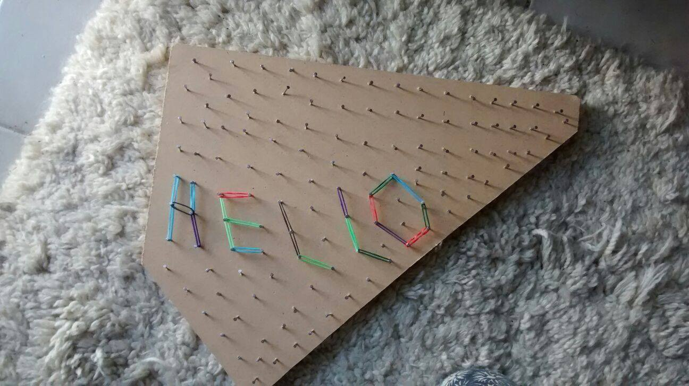
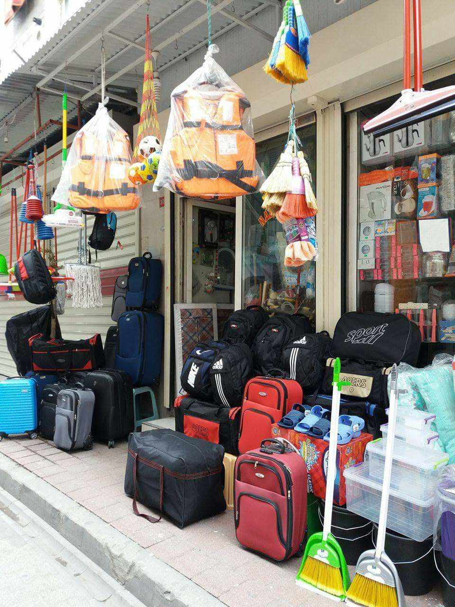
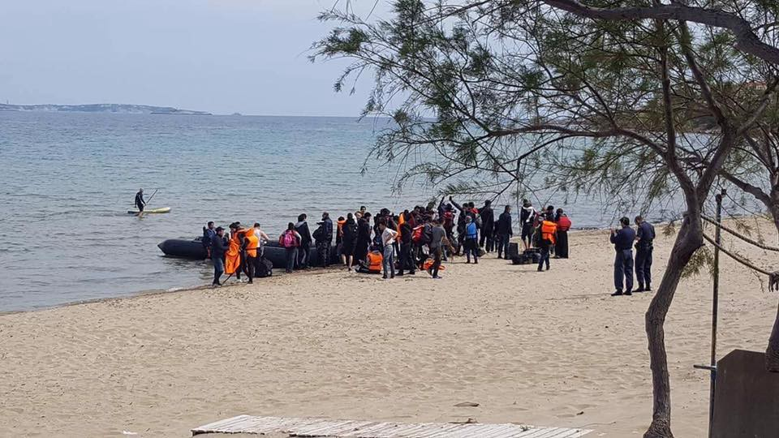
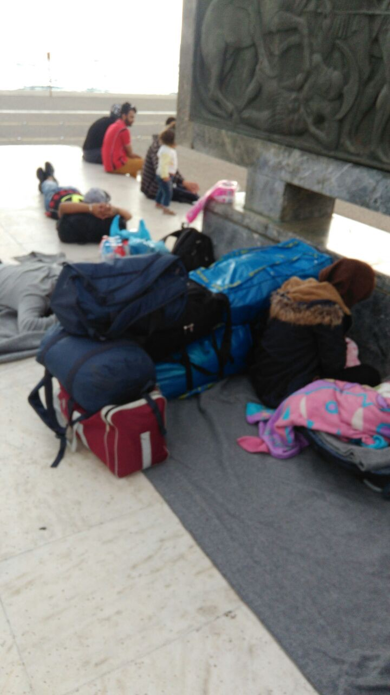
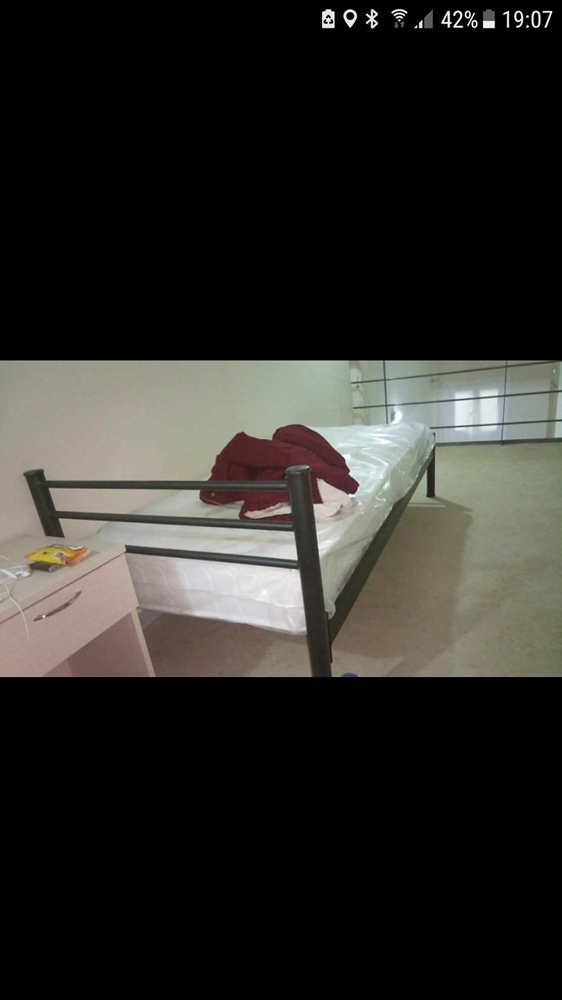
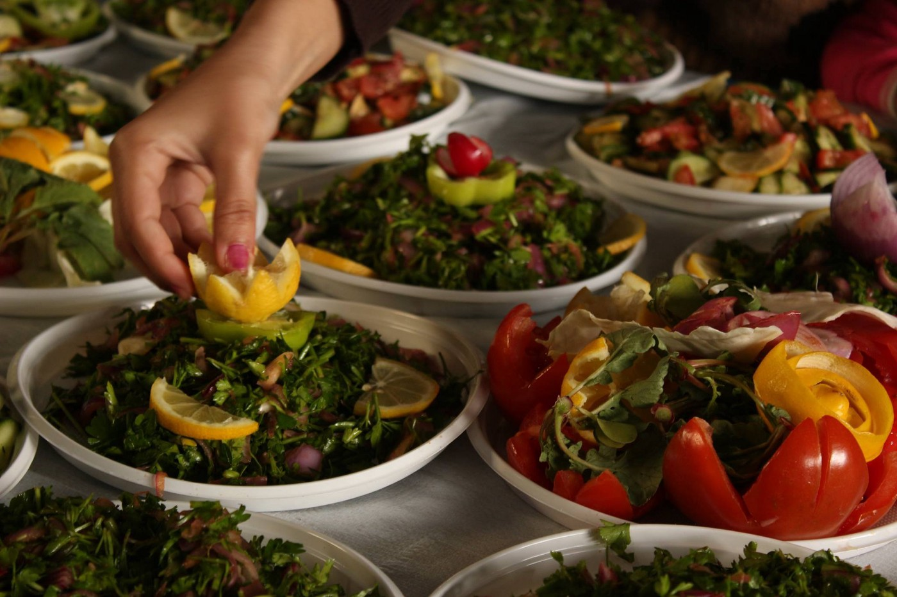
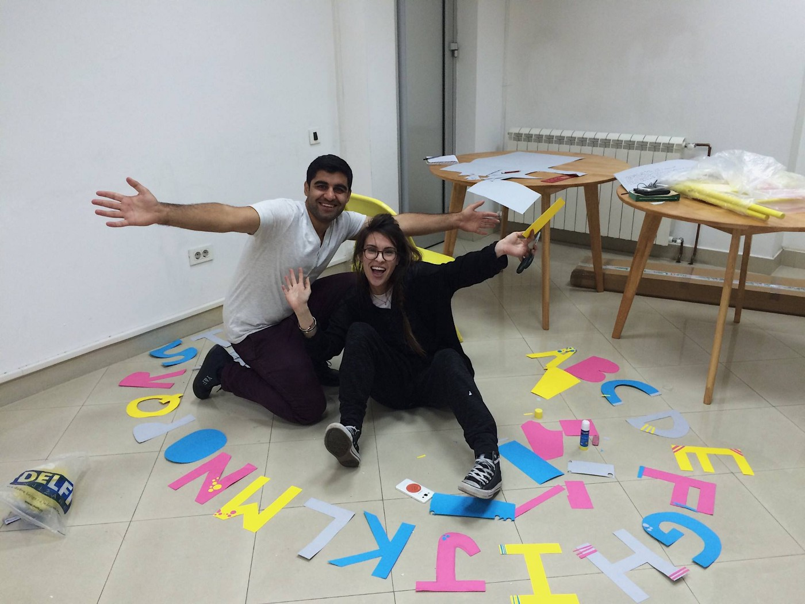

### AYS Daily Digest 12/04/17: Europe’s “wake up call” comes too late\.

_FEATURE: Europe’s response to Child Trafficking — too little, too late\. Refugees returned to Turkey bearing wounds from their time in Greece\. New arrivals increase in Greece\. Serbia shifting refugees from camp to camp\. Volunteers in France scrambling to recover after Dunkirk fire\._

### FEATURE: Europe’s response to Child Trafficking — too little, too late\.

The relief efforts for Dunkirk after the devastating fire that leveled the camp are ongoing, however [Calais Action](https://www.facebook.com/calaisaction/?fref=nf) released sobering information — 129 children still remain missing, most likely driven into the hands of traffickers lying in wait\. Although we all anxiously wait for the recovery of these children, we know that the reality remains — that legislation targeting and marginalizing refugees only strengthens the power of evildoers\.

This came on the same day that the [European Commission](http://europa.eu/rapid/press-release_IP-17-906_en.htm) issued a press release detailing their priority actions for child migrants and refugees\. Although the report contains many niceties, the comprehensive action plan seems lacking in any significant, realistic strategies, instead relying heavily on sweeping statements such as:

“Member States should put in place the necessary procedures to systematically report and exchange information on all **missing children** \.”

“The needs of each child must be assessed as early as possible upon arrival and all children need to have **access to legal assistance, healthcare, psychosocial support and education** without delay and regardless of their status\.”

“The EU has stepped up its work with partner countries on mainstreaming child protection in migration under the **Migration Partnership Framework** \.”

Such broad statements require time and lack the immediacy required to respond to the horrifying reality\. The Commission further states: “A **determined, concerted and coordinated follow\-up** to the key actions set out in this Communication is required at **EU, national, regional and local level** , also in cooperation with civil society and international organisations\.”

> Let it then also be upon us, as citizens and actors, to provide a determined, concerted, and coordinated follow\-up to the promises laid out by the European Commission\. Lives depend upon it\. 

### TURKEY

The following is a report by an AYS volunteer in Turkey:

We met a guy today in Aksaray, the so\-called Little Syria of the Turkish megacity\. In Aksaray you can find everything you need — especially if you are refugee and want to travel to Europe via Greece\. It was Mustafa that intervened when I tried to take a picture of the life jackets on sale\. The turkish salesman was very angry although there was no sign about prohibited photos\. Mustafa tried 3 times\. Not to take a picture, but to cross the Aegean with such a life jacket\.

“They are very good,” he told me\. Is it unusual to meet a “yunani” in Istanbul\. Especially unusual for the guy is to be a solidarity person living on the islands\.
We found a quiet corner to drink tea and he promised me to answer my questions\. Mustafa spent 5000 euros to cross the sea\. When he came to Rhodes, he did not know anything about this place\. When he was arrested and forced to go back to Turkey he promised to do it again\. But now he has changed his mind\. When I saw on his body why I realised that wounds speak louder than words\. The Greek authorities delivered this man injured to the Turkish border police on Evros line\. There are still signs of the wounds all over his body\. Why? He tried to find a better way of life…

The urgency and desperation of Mustafa’s situation is only heightened by the impending [constitutional referendum in Turkey](ays-special-syrians-set-to-lose-in-the-turkish-referendum-42f839bc6fd5) which will only further complicate the political landscape\.

Photo Credit: Are You Syrious
### GREECE

After days of calm, several new arrivals on Chios\. The first two landed in the morning and totaled sixty\-eight people\. The driver of the first boat was arrested as a smuggler\. The third boat arrived in the afternoon with a total of fifty\-six people\.

People arriving today on Chios Photo credit: Leslie Meral Schick

Additionally, one boat was picked up by Frontex and guided to Lesvos, with forty\-six people aboard\. Another boat of thirty\-eight people arrived on Samos\. This makes for a grand total of 208 people\. According to FRONTEX, 1690 people arrived in Greece during March\.

](assets/c1ec6a5007b0/1*4mY4gt8EWse4m_DpVtF5JQ.jpeg)

A new guest in Greece\. Photo credit: [**Chios Eastern Shore Response Team**](https://www.facebook.com/groups/421759534684819/)
#### Mainland

GENERAL — Easter Travel Advisory

> Please be aware that on the 14th, 15th, 16th and 17th of April most shops in Greece will be closed and there will be less public transport than usual\. This is because it will be the holiday of Easter\. Easter is the most important holiday in Greece\. It is a religious celebration that lasts many days and local people go to church, eat traditional food, burn special candles, give each other chocolate, paint eggs, hide eggs and look for them\. Many people who are not Christian also celebrate it\. Easter is always in spring but is usually on different dates each year, so every year you have to check the dates to know when the shops will be closed\. 

Information from Mobile Info Team for Greece
#### Thessaloniki

According to [**Marianna Karakoulaki** ‏](https://twitter.com/Faloulah) : A group of refugees was camping in Thessaloniki after their camp was evicted yesterday\. They say UNHCR promised to take them to private housing but instead they were taken to a different camp\. They later ended up in the camp\.

Waiting for a response from UNHCR\. Photo credit: Marianna Karakoulaki
#### Athens

Call for artists in Athens

> ARTISTS who are also refugees, we will be having an art show in Athens in June, and we welcome your art\. If you are on the islands or in North Greece we will find a way to transport your art to Athens\. open to women, men and young people\. All welcome\. Drawing, painting, textiles work, jewelery, knitting… Contact ATHENS REFUGEES ART ON FB or email athensart2017@myphone\.coop\. Please join us\! There are 2 other shows later this year\. 

#### Drama

DRAMA camp has reopened 2 days ago\. Volunteers say a few hundred kurdish people were moved from a hotel in mouries where they had been hosted for the winter\. A volunteer also sent a photo a room at the camp that he compared to elpida \(which is much nicer than “normal” camps \) the official numbers for the camp are now 234\.

#### Nea Kavala

The We Are Here team posted a detailed report on their activities in Nea Kavala\. In the report, one can see a bit more of how regular life is there, and the challenges remaining\.

_Welcome to another news update of We Are Here — Nea Kavala team\! We’ve been very busy the past few weeks, with more arrivals, more classes and more on offer\. Just as well we have more volunteers to help manage this workload\!_

_This week we had two days of arrivals from the islands, with over 120 new residents to the camp\. The reception routine is well\-established in our ‘big white tent’ Open Community Space now\. Many camp organisations are present to register, distribute things or information and simply to welcome people to their new home\. We Are Here hopes to be just that — present and friendly with a cup of tea, a kid’s zone and plenty of useful information about their reception and the camp in general\._

_However it’s still an extremely stressful experience for many, and a long trip of around 24 hours from Lesvos, with little to no food or water provided\. There seems to be a huge lack of communication between the authorities and the refugees being relocated to another camp\. Many were promised a camp in Athens or Thessaloniki and have ended up here in the countryside in Northern Greece\. We only hope with regular activities, support and community building they will come to accept Nea Kavala and not resent it\._

_In this vein, the UNHCR organised a camp community food, music and dance event on Friday\. Food to be prepared was provided to volunteer cooks from different communities around the world as well as barbecues and cooking equipment\. Food and food culture is a great talking point to bring people together, especially over some barbecued chicken\! Interestingly, one woman from Syria believes all Europeans to be vegetarian: after inviting many European volunteers to eat in her container our eating habits seem conclusive\! Our speaker worked hard on Friday too, playing world music for hours\. Hundreds of people enjoyed dancing their traditional dances and learning about others\. The day was a great success and we hope well\-worthwhile to create a community feeling between all ethnic groups\._

Photo from Camp Community, Food, Music and Dance festival in Nea Kavala\. Photo courtesy of “We Are Here”

_We Are Here have a new and improved schedule\! With more volunteers here and more pending, it’s possible for us to offer more to Nea Kavala\. We now have four different levels of English lessons for adults five days a week, an immense task in itself\! As well as this, there are conversation classes and an English games and chatting class\. Well done team English\!_

_In addition to other language classes, music classes for children, theatre group and of course Saturday, we now want to do more for mixed adults in the afternoon in our new Open Community Space\. We hope this will be a flexible space for people to entertain themselves, bringing people and groups together with us providing the tools to do so\. To start this off one afternoon, we offered our speaker and microphone to be used for music and dance as people pleased, which went down very well\. Last night we also screened a Disney classic for children, Mulan, as well as a football match, and we hope to regularly screen children’s and adults films, somehow fairly rotating languages and subtitles\. More on this soon\!_

_The Women’s Space is going stronger than ever with women from many ethnic groups joining everyday to learn English and take part in a recreational activity\. One day this week they concocted a body scrub to take home and use in the shower\. The small team of volunteers is very creative in lessons, activities and workshops: proof of popularity is in the attendance\! The opportunity to escape camp life everyday for a few hours, to learn and laugh, make friends, create, dance, sing, sweat and make something beautiful and worthwhile can hopefully absolutely change many women’s experience in Nea Kavala\._

_And finally, our beautiful library is slowly growing in popularity especially with children\! Many thanks to you book donors\! However we desperately need books in the languages of the camp’s new residents: French, Farsi, Tigrinya, Urdu…And not just books: magazines, newspapers, encyclopedias, picture books, simple language learning books, children’s books and especially dictionaries from a native language to English, Greek, German…If you can acquire any of the above and wish to send them to We Are Here, please get in touch — every little adds a great deal to our library\! Apart from building language skills, books can be a great form of escapism from camp life, and we are proud the book borrowing system is working well\. We’ve also started lending games to children and adults, hopefully providing hours of entertainment even in our absence\._

_Thanks for reading everyone\! From all at We Are Here, Nea Kavala team\._
### SERBIA

According to Borderfree Association: 200 new [Refugees](https://www.facebook.com/hashtag/refugees?hc_location=ufi) arrived in Presevo\. 300 more to come\. Camp Presevo is going to be filled up with rejected people from Sid\.

Apparently, residents of Šid are going to be moved to other camps, including Preševo, in order to make room for new people to be accommodated\. However how shifting people from one camp to others and then bringing in new residents rather than just taking new residents to other camps directly seems a bit of a roundabout way of doing things, and the proximity of Šid to the Serbian\-Croatian border might indicate that some other intentions are at work\.

In Belgrade, NorthStar and Refugee Aid Serbia are teaming up to create a new refugee education and well\-being center called “The Workshop\.” Follow their [progress](https://www.facebook.com/NorthStarSerbia/photos/a.1659052551032663.1073741830.1655468981391020/1852194568385126/?type=3) \!
### FRANCE

[Care4Calais](https://www.facebook.com/care4calais/) provides a more detailed update on the ongoing aftermath of the Dunkirk Fire:

> Over 900 of Dunkirk’s refugees are in temporary accommodation in gymnasiums in the area, but only until Friday\. Today they began to be bussed to French accommodation centres around the country, but there is no information about what will happen next\. There is little information being given directly to the refugees and the only certain thing seems to be that the camp will not be rebuilt\. Over 600 residents have disappeared into \[the\] countryside\. 

_Converted [Medium Post](https://areyousyrious.medium.com/ays-daily-digest-12-4-europes-wake-up-call-comes-too-late-c1ec6a5007b0) by [ZMediumToMarkdown](https://github.com/ZhgChgLi/ZMediumToMarkdown)._
