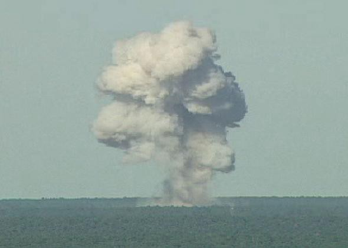
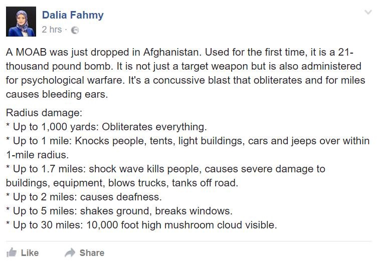

### AYS Daily News Digest 13\.04\.17: US uses ‘safe country’ Afghanistan as a testing ground for its strongest non\-nuclear bomb

The smoke following the detonation of the weapon\. If anything screams ‘safety’ it’s definitely an enormous mushroom cloud seen from several miles away\.

_US deploys its most powerful non\-nuclear bomb in Afghanistan // 97 missing, likely dead, off the coast of Libya // Syrian refugees serve as scapegoats in an unstable Lebanon // Relocation program from Greece picks up the pace // Denmark to deport over 100 people to Afghanistan, among them a senile 70 year old woman // A report on the progress of the relocation program_
#### Feature: Are you serious?

The myth of Afghanistan’s designation as a safe country is extremely convenient for Europe\. Such a definition means that the EU can deport refugees to Afghanistan without fear of repercussions\. The fiction has been held up quite actively, even as events make it increasingly clear that the facts on the ground say otherwise, despite the wishes of the EU charlatans\.

Although chaos continues to reign in the country as a result of warring factions battling amongst themselves and against the government, refugees are sent back\. Even as the Afghan economy, already one of the weakest in the world, is strained by the pressures of reintegrating the 1\.6 million refugees expelled from Pakistan, and future prospects are low, the deportations continue\. It is expected that this year the EU will send thousands of refugees back to their homeland, after deeming them undeserving of protection\. If all of this weren’t enough, the US continues to flex its muscles on the ground, this time deploying what may very well constitute a weapon of mass destruction: the dreaded Massive Ordnance Air Blast\.

The MOAB is the strongest non\-nuclear weapon currently in the US arsenal, and its impact is deadly\. First developed shortly before the invasion of Iraq, the MOAB explodes with a deadly force equivalent to 11 tons of TNT\. Until now it had only been tested, but today it was first used in combat against a local ISIS affiliate known as Khorasan, in the Nangarhar province\. The bomb was detonated near a mountain complex which the group was believed to be using as a training camp and tunnel complex\.

The MOAB delivers a powerful shockwave which covers a radius of 150 meters, but its impact extends beyond that\. The detonation of such a weapon is extremely careless at best, as it is by its very nature imprecise\. In using this weapon, it is simply impossible to account for everything that can possibly go wrong\. Civilians are almost guaranteed to be caught within such a large zone of impact\.

The deployment of the MOAB punctures yet another hole in the myth of a safe Afghanistan\. American willingness to use such a weapon could signal an escalation in combat in the country, which in itself means that further unrest is inescapable\. To continue deportations to a country in the midst of such a brutal war is shameful, and future Europeans are sure to look back on the actions of the forefathers with disgust\. It is little surprise that fear is rampant among Afghan refugees who may at any moment be deemed unworthy of asylum and sent back to a country from which they escaped for a good reason\.
#### Lebanon
### The victimization of Syrian refugees in Lebanon continues

UNHCR reported on April 10 that the Lebanese army, citing security concerns,has ordered the eviction of 10,000 refugees from makeshift settlements in the Bekaa Valley\. There are some who fear that this eviction may serve as a cover for the deportation of refugees to Syria, where the war is far from settled and violence is ongoing\. This is just one facet of the marginalization of Syrian refugees in Lebanon, and the country has long been recognized as unwelcoming towards refugees\.

Lebanon is currently home to at least 1 million refugees, who constitute 20% of the population in the small country\. Lebanon does not receive much support from the international community, and as a result refugees are forced to live in substandard conditions\. Lebanese Prime Minister Hariri warned of this last week, and sought aid from wealthier countries so that refugees can live in decent conditions\. As the situation currently stands, payments to refugees are far below what they need to cover even their most basic needs, and as a result as many as 90% of Syrian refugees in Lebanon are in debt\. Refugees are liable to be exploited and massively underpaid\.

Among the Lebanese people too, many have negative views of the refugees\. Some believe that refugees are responsible for the slowing of economic growth in Lebanon\. Even those in the top echelons of power have espoused such ideas, such as president Michel Aoun, who has called refugees a heavy burden and demanded their return to “safe zones” in Syria\. Others believe that Syrian refugees are disproportionately responsible for criminal activity, even as statistics show that crime is not disproportionately committed by them\. Such inflammatory rhetoric is convenient to the Lebanese government, which is widely unpopular and seeks to direct the peoples’ frustration elsewhere\.
#### Greece

■■■■■■■■■■■■■■ 
> **[Miss Montag](https://twitter.com/miss_montag) @ Twitter Says:** 

> > The drinking water station in #Souda, #Chios. Cheers! https://t.co/1lChhEYjR5 

> **Tweeted at [2017-04-12 15:19:57](https://twitter.com/miss_montag/status/852179487005560833).** 

■■■■■■■■■■■■■■ 

### Relocations to continue at a faster pace

A number of announcements have been made recently\. According to European Commission announcements, the process of is picking up the pace to make good on the promises made two years ago\. March 2017 saw an increase in the number of relocations, over 1,600\. This is an improvement over the three previous months, which saw an average of 1,200 people relocated each month\. One can only hope that this rate will continue to steadily increase\.

One can expect a further increase in the coming months, as Sweden has pledged to relocate an additional 600 refugees, and it is expected that this round of refugees will be accepted starting from June\.

Finally, the Austrian government has disavowed its refusal to take part in the refugee relocation program, and is expected to begin taking people in the future\. It is not yet clear when the program for relocation to Austria will begin, nor the quantities of people involved\.
#### Be careful with the clothing that you donate\! A warehouse volunteer in Greece has written a piece about what does/does not constitute an acceptable donation\. If you or anybody that you know is donating clothing, please be sure to read this piece beforehand\. It is important that only clothing fulfilling the criteria outlined here are sent in, as it takes time and money to transport it to the site, and then to sort out what does or does not fit\. Donated clothing must be clean without significant wear and tear, as refugees deserve to dress with dignity as well\!
### Numbers

According to the UNHCR, the overall picture is as follows:

Total Mainland: 35,356 people with 67,672 capacity
Total Islands: 12,767 people with 8,696 capacity
UNHCR accommodation scheme: 14,134 people

A detailed map including the numbers for the various camps may be found [here](https://data2.unhcr.org/en/documents/details/55917) \.

A total of 205 refugees have arrived to the islands in the past 24 hours\. 46 have landed on Lesvos, 38 on Samos, and another 121 have come to Chios\. This marks the first time in 2017 that more than 200 people were registered in a day\.
### Rohingya translator needed on Lesvos\!

A speaker of the Rohingya language is needed on Lesvos to aid in the interview process of asylum applications for Rohingya asylum applicants\. Please contact [Emma Bakkevik](https://twitter.com/allworldtravels) if you know the language and are available\.
### City Plaza Squat calls for donations\!

Hygienic products are the main focus of this collection\. The items most immediately needed include shampoo, shower gel, shaving cream, and toilet paper\.
### Greeks in Ioannina are encouraged to sign up for Refugee Twinning Program

The Refugee Twinning Program is aimed at connecting Greek people with their refugee counterparts for the purpose of giving both parties something fun to do together\. The program will be running from April 22 until June 2, and families with children are especially encouraged to apply\. Participants will have the chance to participate in a number of fun activities and outings, all for free\. Some examples of excursions include dinner, cinema, museums, games, and trips to the beach\.

The Refugee Twinning Programme is run by the non\-for\-profit organisation Second Tree in cooperation with INTERSOS and is funded by the UNHCR — the United Nations Refugee Agency\.

For more information about how you can participate contact us at info@secondtree\.org or call us at 698 423 5489\.
#### Serbia
### BelgrAid seeks shoe donations

### Mobile showers ready for Belgrade, Serbo\-Hungarian border tomorrow

#### Switzerland
### Afghan refugee living in Switzerland for 25 years to be deported

A Swiss court has ruled that the 27\-year\-old man is to be deported to Afghanistan as a result of his criminal record\. The man in question came to Switzerland with his family in 1992, when he was only two years old, and does not know his country of origin\. His residency was revoked in 2015 after having been convicted for his convictions for violent behavior and crime, and his lawyer had been appealing the decision\.

Last month however, the court rejected the appeal, and the deportation will seemingly go through\. The court and psychiatrists believe that the man has a high risk of reoffending\. His defense argues that he has no connection to Afghanistan, not knowing the language, and is in a unique risk as an ethnic minority\. The court rejected these appeals, and has ruled that he would not be at risk upon returning to the country after having left as a toddler\.

A person’s criminal record must not be used as a justification for expulsion from what is for all intents and purposes his country\. Indeed, there are thousands of people of native Swiss ancestry who similarly have a history of crime and violent tendencies\. They are not threatened with expulsion to a country that they have never resided in\. To deport an Afghan man who has spent the vast majority of his life in Switzerland for the same reason is therefore unjust and smacks of the persistent biases against refugees\.
#### Denmark
### Elderly woman faces deportation to Afghanistan

A 70 year old woman from Afghanistan has been ordered to report herself to Ellebæk Center, which is a deportation center\. Her children have protection in Denmark, and she has no family in Afghanistan\. She is mentally ill after having suffered from numerous strokes, and has been in Denmark for a number of years\.

Her daughter is afraid that she would die in Kabul after just two days, because she can no longer take care of herself\. This is just one of many deportation cases from Denmark to Afghanistan\.

In 2004, Denmark made an agreement with Afghanistan and UNHCR about deportations to Afghanistan, and it was agreed that Afghanistan would be designated as a safe country\. The group “Welcome to Denmark” is working alongside others to stop the deportation by engaging in civil disobedience and raising awareness about the harsh deportations politics which the foreign minister Inger Støjberg is pushing the department to follow\.

Sources have revealed to “Welcome to Denmark” that a new big deportation to Afghanistan is in the works, and as many as 109 Afghans may be deported\. The previous one took place on February 28th, and 16 where deported\. However, authorities had to return four of those back to Denmark, because the man was from Iran\. The people in question were a father and mother with their children, whom Afghanistan refused to take on the grounds that there was doubt of their nationalities\.
#### Italy

### Baobab to hold a collection drive in Piazzale Spadolini

Collections will be taking place from Monday to Friday, 18\.30 until 21, as well as Saturday and Sunday from 12 to 14 and from 18\.30 to 21\. The following is a list of needed goods:

Blankets
Hydrating Cream
Canned tomatoes/tomato sauces
Oil
Tuna 
Whole milk 
Biscuits/snacks
Sugar
Plates
Glasses \(plastic\)
Disposable Gloves 
Kitchen rolls
Razors
Big bin bags \(110x70\)
### 36 refugees detained by police in Rome

Police took 36 people to the Questura for identification\. The idea is to clear the areas around the Tiburtina station, but the authorities are doing it with a with an unusually large deployment of police forces\.

### “No one is illegal” march takes place in Milan

There was a “No one is illegal” demonstration today in Milan, organized by migrants who claim the right to a fair reception\. Around 100 people demonstrated through the streets of the city center, surrounded by a great many police officers\. They then orchestrated a sit\-in in front of the social policy department, to claim their right to be moved from Cas \(centres for extra ordinary reception — many of them housed in former barracks\) to Sprar \(smaller centres which provide the possibility of integration\) \.
#### France

### Help Refugees reports that Dunkirk refugees to be resettled

On Friday, it is expected that the residents of five gymnasiums, which are occupied by refugees from the Grande\-Synthe camp will be relocated to centers across France\. There is expected to be confusion and fear from people, as they remain unsure of what their future holds\. Furthermore, a number of people are expected to go unaccounted for, as they have left the camp after being threatened by criminal gangs in the area\.
#### UK
### Donation collection taking place in Brighton, to be delivered to Dunkirk on Saturday

This collection seeks specifically food items with long shelf\-life, namely nuts, cereal bars, biscuits, and bottled water\. The location of the collection and more information on needed goods may be found [here](https://olioex.com/food-waste-in/united-kingdom/brighton/45305-nuts-cereal-bars-savoury-biscuits-bottled-water/) \.
### “Right to Remain” hosts workshops preparing refugees for their Home Office interview

“Right to Remain” as well as “Early Asylum Support”, [have hosted](http://www.righttoremain.org.uk/blog/learning-friendship-and-solidarity-blossom-in-sheffield/) a multilingual information session in Sheffield for newly\-arrived asylum seekers\. Around 70% of asylum claims are rejected by the Home Office, and the workshops seek to go over the common misunderstandings and mistakes which might prevent one’s claim from being seen as legitimate\. Keep an eye on [“Right to Remain”](http://righttoremain.org.uk/toolkit/index.html) for news of more workshops, and be sure to visit their “Right to Remain Toolkit” to stay aware of the common pitfalls made by asylum seekers\.
#### Libya
### 97 missing as boat capsizes off the coast of Libya

On Thursday morning, as yet another boat was leaving the shores of Syria to the make the dangerous crossing to Italy, the boat tipped over\. The majority of those on board have been reported missing, which, given the circumstances, may as well be an announcement of death\. The Libyan coastguard saved 23 of the passengers, who reported that among those on board were at least 15 women and at least 5 children\. As of late March, at least 590 refugees were reported dead or missing along the Libyan coast\.
#### EU
### A report on relocations

While governments initially promised to relocate 160,000 refugees within two years, this number was later amended to 98,000 and has now dropped to just 33,840, despite thousands being still stranded in Greece and Italy\. The European Commission argues the number of people eligible for relocation is far lower than foreseen and yes, the restrictive criteria has allowed the EU to exclude Afghans and other nationalities from the program\. However, even with these revised numbers, it remains to be seen whether relocations will be completed by September 2017 as initially planned\.

In December 2016, the European Commission had asked member states to relocate at least 2,000 people each month from Greece in order to end the program by September 2017\. Instead, relocations stagnated around 1,100 until March, when numbers jumped to 1,600\. Now, the Commission has revised the target to 3,000 per month, warning that member states could face penalties if they do not participate\.

Hungary and Poland for example, have still to relocate one single refugee\. The Czech Republic has not relocated anyone since August 2016 while Bulgaria, Croatia and Slovakia have relocated around 2% of their allocation\. Belgium, Germany and Spain have relocated a little more than 10%\.

Already back in September, Ana Gomes, an MEP highly involved in relocating refugees to Portugal, told us she was frustrated by the slow relocation process and asked why the Commission, which has the necessary political authority, was not doing more to speed up the system\.

Member states have many ways to slow\-down the process, including restrictive preferences\. Some countries are willing to accept only single mothers with children, others refuse to accept single men and Bulgaria simply refuses to accept Eritreans\. The EC insists that only national authorities from Greece and Italy should carry out the matching procedure taking into account any social or cultural links\. It does however point out countries like Croatia as positive examples, as they provide useful preferences like professions and qualifications that could facilitate integration\.

Still, with the end of the program in reach and little progress made by countries to increase relocations, the Commission already anticipates that the program could go on longer than expected, as it insists that “member states’ legal obligations do not stop after September 2017”\. Despite the obvious failure of the program, Commissioner for Migration Dimitris Avramopoulos has praised member states for setting a “new record on relocation” and described the program as “solidarity in action”\.

_Converted [Medium Post](https://areyousyrious.medium.com/ays-daily-news-digest-13-04-17-5ee88d9d6e3b) by [ZMediumToMarkdown](https://github.com/ZhgChgLi/ZMediumToMarkdown)._
