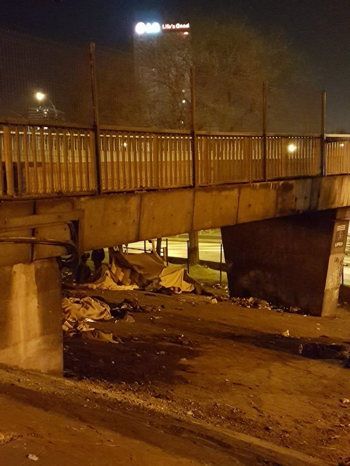
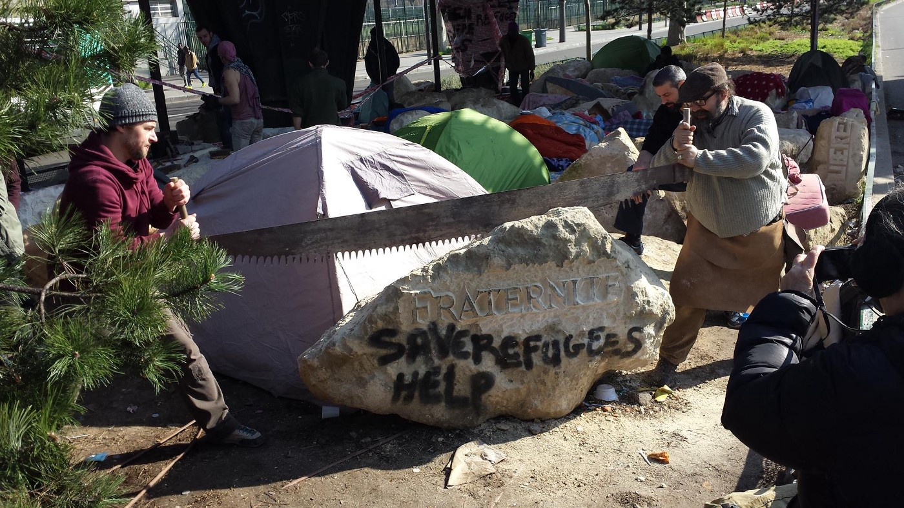
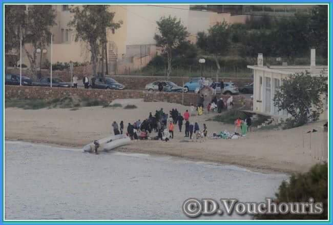
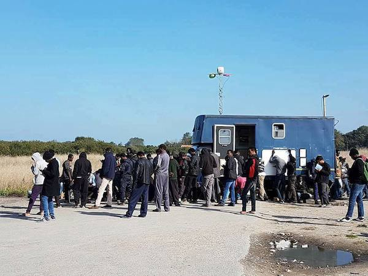
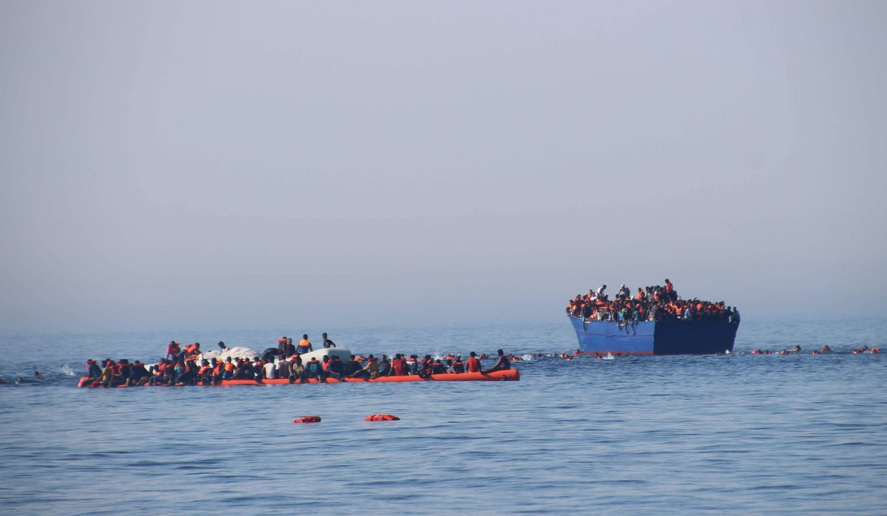

### AYS Digest 16\.04\.17 — Misery in Paris

Photo by Joao Pequeno

_Attempted suicide in Paris and desperate situation for unaccompanied minors\. Volunteers needed in Greece\. At least 3,000 refugees rescued in the Mediterranean on Saturday\._
#### France
### Attempted suicide in Paris

Three associations, _Quartiers Solidaires, Les p’tits dejs à Flandre_ and _Encrages_ , say that an Eritrean refugee attempted to kill himself in Paris on Wednesday, after months of sleeping in the streets\. The groups denounce the terrible living conditions that have led to this situation\. In particular, refugees in Paris are faced with institutional ill\-treatment, as delays in procedures, overburdened structures and arbitrary decisions seem to have the goal of spreading despair and confusion\. Some discouraged and disoriented refugees now say that they prefer to go home rather than continue living in misery, some simply remain stuck in French bureaucracy and others yet are deported to other European countries\.

The groups denounce the French state for multiplying hurdles and obstacles, given the lack of shelters and complicated procedures, while using its power to “repress” and “hide” refugees from the public\.

Photo by Cœurs de Pierres et Solidaires

The statement also points out the particular situation of unaccompanied minors, who should be protected and sheltered by the state but are often left abandoned in the streets as the administration refuses to acknowledge their age\.
### Situation of unaccompanied minors

A recent account made by a volunteer illustrates this situation\. One 16 year\-old Afghan kid was refused help by the French administration, forcing him to sleep in the streets, despite having a Taskera \(Afghan ID card\) proving he is underage\. He called the volunteer crying for help, as a fight was taking place near where he was sleeping — he tried to run away but was nevertheless caught up in the fight\. While he finally found someone who could shelter him for the night, it remains to be seen where he will be able to sleep in the future\. A Parisian group does try to shelter unaccompanied minors through a network of volunteers, but there will never be enough space for everyone\. In any case, it should be the French state’s responsibility to protect these kids, be it simply as a signatory of the UN Convention on the Rights of the Child\.

This problem has been going on for a while now, with the DEMIE, the organism in Paris that is supposed to evaluate their situation, turning down between 60% and 80% of kids looking for shelter, arguing that they cannot prove they are underage\. Those who are not considered underage or unaccompanied, sleep in the streets, where they are at the mercy of traffickers and are deprived of food, access to care and education\. The Refugee Rights Data Project notes that 21% of children have also faced physical violence by the police while more than 30% have experienced tear gas\. Two volunteers already denounced this back in [August 2016](https://blogs.mediapart.fr/la-chapelle-en-lutte/blog/030816/mineurs-isoles-etrangers-paris-une-tragedie-par-nadimi-et-morgann-b-pernot) , adding that even when children are sheltered, they are often forced to sleep in dirty and bed bug infested “hotels”\. One child for example [explained:](http://observers.france24.com/fr/20170317-hotel-miteux-mineurs-migrants-paris-isoles-etrangers-mise-abri)

> When I arrived, everything was dirty \(…\) I cannot sleep at night: the bed bugs wake me up when they bite, I see them climb up my body\. 

### Minors put into detention centres

[Passeurs d’hospitalités](https://passeursdhospitalites.wordpress.com/2017/04/15/calais-nouvelles-saisines-contre-les-violences/) reports that five young refugees will appear in court on Thursday in Calais, to decide whether their detention is legal and whether to extend their detention\. The refugees claim to be minors but were declared as “adults”, with the police report saying all five were born on 1\.1\.1999, allowing them to be put in a detention centre and later deported from the country\. On Friday, a camp close to Calais was destroyed, including the tents and personal belongings of around 20 people\. There was no legal decision for the eviction and the destruction of personal belongings is illegal anyways\. Three NGOs, Cabane juridique, le Réveil Voyageur and Utopia 56 have published a press release protesting against police violence in Calais, the lack of access to shelter, especially for minors, and the acceleration of placements into detention centres\.
### Greece
### Registrations & Arrivals

69 refugees arrived on Chios this Sunday, including 32 children\. 40 people including many children arrived in Lesvos\. 38 refugees were registered on Chios and 12 in Lesvos yesterday\.

### Volunteers needed

Photo by Refugee Info Bus

The [Refugee Info Bus](https://www.facebook.com/RefugeeInfoBus/) is looking for someone who speaks English and Farsi/Dari to come to work with them for one week on Chios\. They will be leaving on Tuesday the 18th from Athens and coming back on the overnight Ferry on the following Monday night\. All expenses plus an additional weekly stipend will be covered\. The Bus has been providing legal information in Athens for a month now, in addition to running a digital literacy and a citizen journalism programme\.

The [Athens Volunteers Information and Co\-ordination Group](https://www.facebook.com/groups/AthensVolunteersInformation/) has collated information on short\-term volunteering \(two weeks or less\), including how to help in the warehouse, street outreach and more\. The full list can be found [here](https://www.facebook.com/groups/AthensVolunteersInformation/permalink/1068019279997035/) \.

As usual, other volunteering needs can be found on [Greecevol](http://greecevol.info/) \.
### Mediterranean

MOAS rescued over 1,500 people from 9 vessels across 24 hours, from Friday to Saturday morning\. With its boats over capacity, MOAS had to supervise over 1,000 people still crammed on the remaining boats into the night, as they waited for assistance to arrive\. MOAS director Regina Catrambone says:

> _“Every day people continue to risk their lives while we, as civil society, stand witness\. We must continue to call on European governments to act so that people, such as those rescued by us today, do not die, not in Libya nor in the Mediterranean Sea”_ 

WatchTheMed Alarm Phone says that NGOs rescue boats were over capacity and both the Iuventa boat from Jugend Rettet and Sea\-Eye had urgently signaled MAYDAY and requested support from the Italian Maritime Rescue Coordination Centre \(MRCC\) in Rome\. The Iuventa’s message came as it had more than 400 people on board, with the weather deteriorating and many more refugees in rubber boats surrounding them\.

Photo by Jugend Rettet

[DW](http://www.dw.com/en/thousands-of-migrants-saved-from-mediterranean-sea-for-second-day/a-38441975) reports that at least 3,000 refugees were rescued on Saturday and six people were found dead, while [Repubblica](http://www.repubblica.it/cronaca/2017/04/16/news/migranti_msf-163145494/?ref=RHPPLF-BH-I0-C8-P5-S1.8-T1) reports many refugees showed signs of war, like gun shot wounds and signs of torture they encountered in Libya and elsewhere on their journey\. Médecins Sans Frontières has criticised the Frontex response, saying

> “Many more people could have died in a day like this if we arrived a few hours later\. We are where we’re needed, what’s the EU doing meanwhile?”\. 

_Converted [Medium Post](https://areyousyrious.medium.com/ays-digest-16-04-17-misery-in-paris-ff415bb2d47a) by [ZMediumToMarkdown](https://github.com/ZhgChgLi/ZMediumToMarkdown)._
