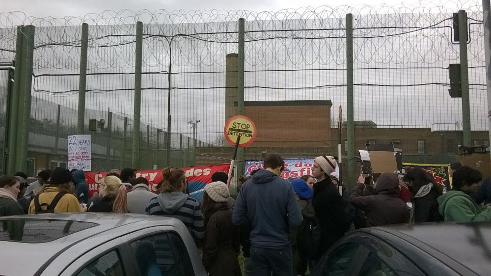

### AYS SPECIAL: Mental torture of asylum seekers detained in UK

_There are 12 immigration removal centers around UK and around 3000 people are detained inside\. One of the places is in the village Kidlington, close to Oxford here 216 men are detained for months\. The UK government reserves the right to detain them for as long as it takes\._

Photo by independent volunteers in Kidlington\.

Five miles north of Oxford in the village of Kidlington, at the end of a long drive lined with conifers, is a place called Campsfield House\. Stately though its name may sound, this is no country pile\. Confronting approach with a twenty\-foot\-high steel fence topped with barbed wire, what it resembles at first sight is a prison\. And on closer inspection the buildings behind seem to agree that yes, this is a place for punishing people\. But Campsfield House is not a prison\. It’s an Immigration Removal Centre, one of twelve around the country\. Of the 3000 or so immigrants detained in the UK, Campsfield accommodates 216\. All of them men\.

Penned in like convicts though they are, these men are not here on the order of a court\. Many of them — asylum seekers — haven’t even done anything illegal\. **They’re here because the Home Office finds it convenient to store them somewhere secure while it decides whether to deport them\.** The trouble is, this decision can take months or even years\. And unlike every other government in the EU, the UK government reserves the right to detain them for as long as it takes\. So whereas convicts have their liberty suspended for a time proportionate to their crime, these detainees’ right to liberty doesn’t even enter into the Home Office’s equation\.

You might think it’s a bit rich of the Home Office to commit to respecting detainees’ right to humane treatment having abducted and imprisoned them, but that’s exactly what the 2001 Detention Centre rules bind them to do\. **Detention centres, the rules state, must provide ‘secure but humane accommodation of detained persons in a relaxed regime\.’** The reason I’ve come to speak to inmates of Campsfield is to find out how humanely they are treated, and indeed whether it’s a contradiction of terms to call extra\-judicial imprisonment ‘humane’\.

The first detainee I speak to is a man named _Jawad Hussein_ , an earnest young man who after three months inside is brimming to tell his story\. He came from Pakistan to the UK to study at London School of Economics \(LSE\), but was detained after he was found to be seventeen, not eighteen as his passport said\. Not exactly the kind of misdemeanour to merit three months in prison you might think, but that’s how long Jawad has been in Campsfield\. He’s eager to tell me about the medical care in Campsfield — or lack thereof\.

_‘This is a bad place to get sick’_ , he says _‘the staff simply don’t care about you\. It can take weeks to make an appointment with the nurse\.’_ He mentions a detainee called _Sultan_ , who awoke one night to a terrible pain in his mouth\. Detention Centres are rule\-bound to have a doctor on call 24/7, but when he asked the staff to call one all they did was give him a single pill of paracetamol\. Jawad was kept awake the rest of the night by Sultan’s howls of pain\.

Many of the detainees I speak to, Jawad included, are distressed that they don’t know whether, when, or even where they will be deported\. One man I speak to isn’t sure whether he’ll be sent back to Italy, where his family lives, or to Afghanistan where he was born\. Another was told four times that he was to be deported, only to be told at the airport that he was to be returned to Campsfield\. This climate of constant uncertainty would be enough to fray your nerves where, but within the confines of Campsfield it’s enough to drive you mad\. This is no mere figure of speech: rates of mental illness are higher in detention centres than they are in prisons, and two days before my visit to Campsfield three detainees tried to take their own lives\. In 2015, 394 detainees across the country tried to do the same\. **_‘We are being mentally tortured\.’_** Jawad says\. _‘We don’t know what the future holds for us because there is no clarity in the system\.’_

The detention system doesn’t have to be this way\. If, like every other government in the EU, Westminster were to set a limit on how long people can be detained for, then its promise to make the detention system ‘humane’ wouldn’t seem so patently vacuous\. A time limit of 28 days was in fact proposed by a parliamentary committee in 2015, but never made it into the 2016 Immigration Act\. It may be that such a time limit would inconvenience the Home Office\. But if so — too bad\. Detainees are living feeling vessels of hopes and fears and pain, with the right not to be driven to suicide, not cargo to be warehoused for as long as its exporter finds convenient\.

**_\(By Ben Cooke, independent volunteer\)_**

> **_We strive to echo the correct news from the ground, through collaboration and fairness, so let us know if something you read here is not right\._** 

> **_Anything you want to share — contact us on [Facebook](https://www.facebook.com/areyousyrious/) or write to: areyousyrious@gmail\.com_** 

_Converted [Medium Post](https://medium.com/are-you-syrious/ays-special-mental-torture-of-asylum-seekers-detained-in-uk-a61bf7fca1ed) by [ZMediumToMarkdown](https://github.com/ZhgChgLi/ZMediumToMarkdown)._
