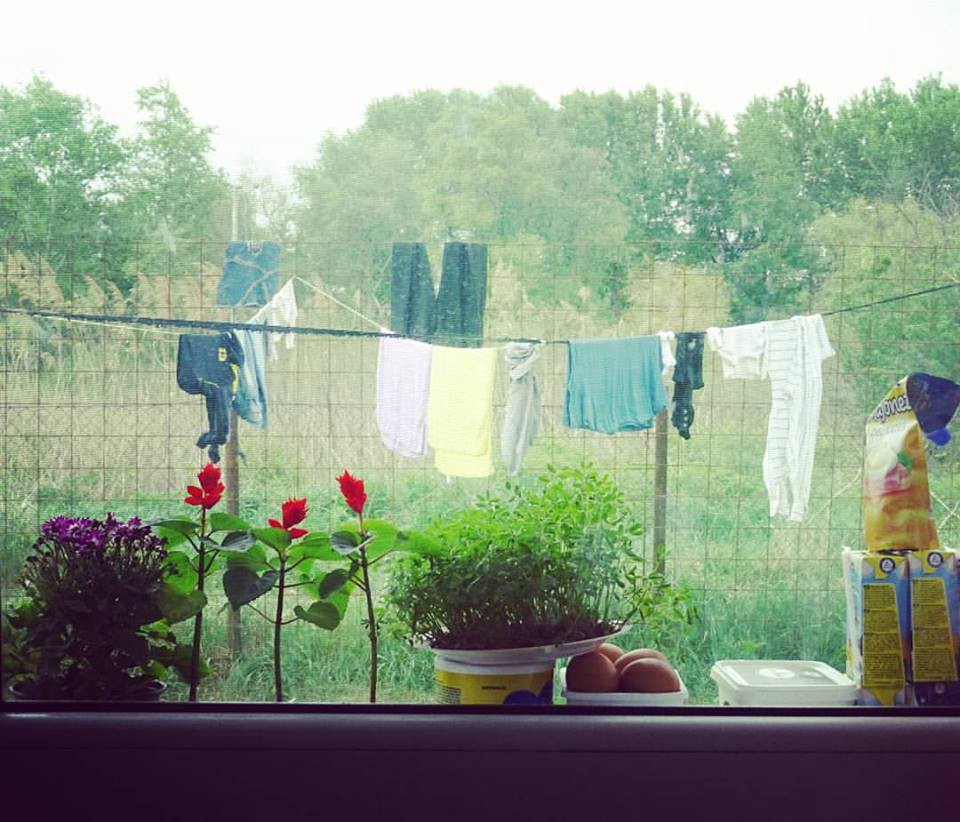
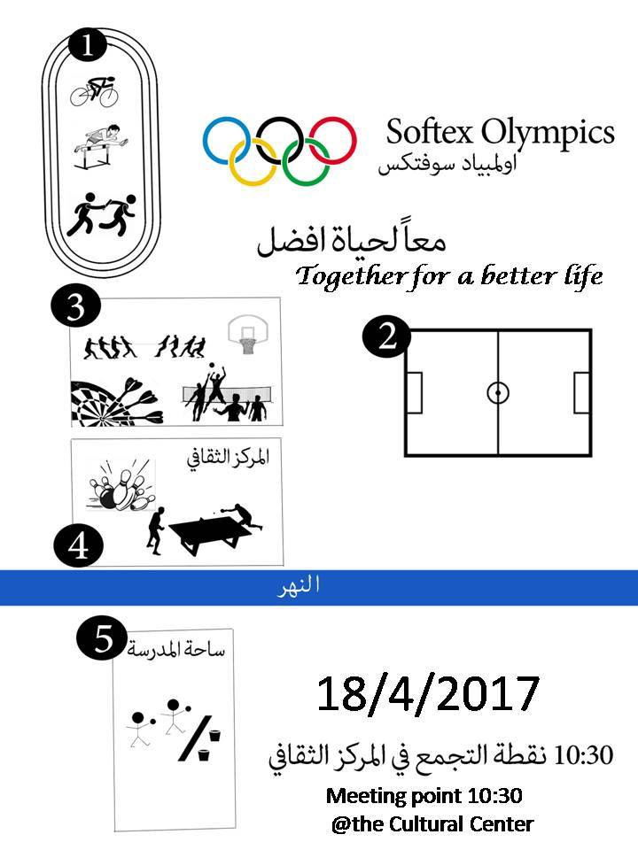
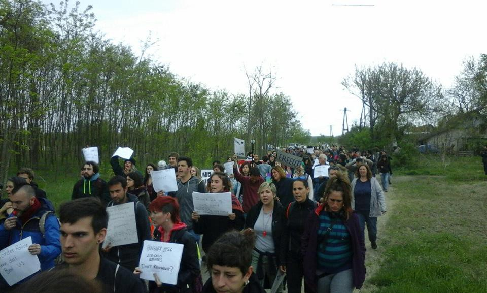
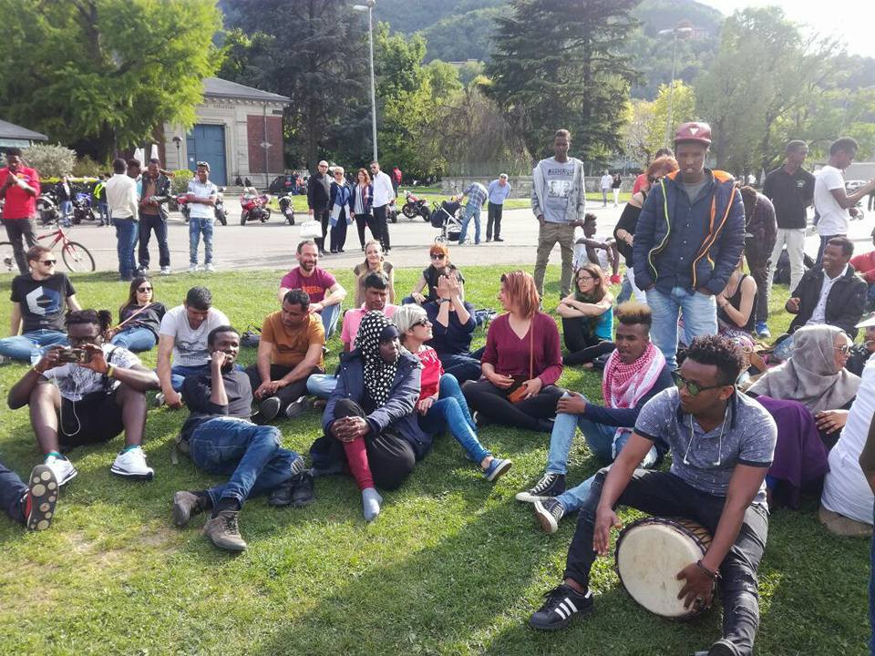
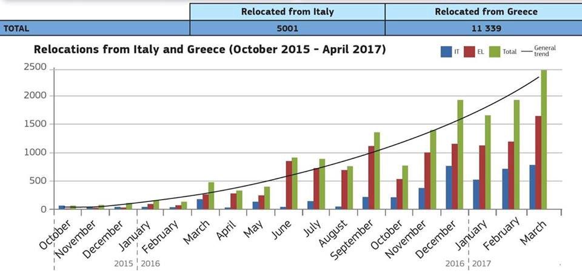

### AYS DAILY DIGEST 17\.04\.2017 — Possible relocations from Serbian Šid camp?

_Volunteers needed on multiple positions in Greece / BelgrAid volunteers needed / Arrests and relocations in Serbia / New boat rescues bring thousands to Italy / ERCI reports on relocation and resettlement_

Refugee window in Krnjača, Serbia, photo by Žarka Radoja

After last week’s reported incident with one camp resident in Šid entering a family house, following arrests of a number of refugees and an organized petition seeking the relocation of the town’s refugee reception center, municipal authorities in Šid have launched an initiative for the relocation of the town’s refugee center\.

“ _The situation is sensitive, but we need to know that the number of incidents was negligibly small, if we take into account how many migrants are staying in a small local community\. Therefore, it is time to show a high degree of solidarity with these people, because until now our people showed a high degree of tolerance\. We hope it will remain so in Šid”_ at the moment said Ivan Mišković from the Refugees Commissariat\.

The reception center remains in place for now, what seems necessary since it is the temporary home of about 500 refugees who have not made a single incident so far\. Nenad Ivanišević, the State Secretary in the Ministry of Labor, said that migrants do not aim to do crime since it prevents them in their further path, and that the incident in Šid was a rare example of violations of the law\. He also added that the aim is making reception centers smaller\.

At the same time, local volunteers inform about possible new police arrests in Serbia\. People are reportedly being taken to prison for up to three months with their phones and money taken away, leaving them without a chance to communicate with their families\. Afterwards they are let go with a paper saying they must leave Serbia in a period of 30 days\. If detained again, they can be put back in prison or deported from the country\. There will be more coverage once we learn more about the situation\. It’s important to note that people need to register with the police within 72 hours upon arrival\.

We also received information from local volunteers on the situation near Šid and the borders close by\. Similarly as the Hungary border, displaced people \(mainly men\) were heading to the Croatia border as the Hungary border became a big problem mainly because of the police violence\. There are three official camps in this area, varying in size and how much they are providing, the one in Šid is pretty poor \(many have been declined access to camp\)and the food/space maintained by the official camp is not great\. There are many men trying to cross the border, either on the trains or crossing by foot, with some success but a real risk — specially by train\. We hear many stories of injuries, and the men going without water for days as the trains can take 5 days to reach their destination\.

Here there is also a risk as the Serbian police are coming daily to show themselves, and a raid last week took 140 men to Preševo camp, maybe there will be another soon as the numbers continue to rise\. It’s a really hard thing to say how many refugees are living in the makeshift camp in the area because numbers change everyday, as people arrive, leave to cross the border, enter the official camp, leave the camp… between 50–100, the source said\.

The camp in Subotica is now empty\. Some refugees are in the villages close by, but there are less than 10 people\.
#### TURKEY
#### Sewing workshop for refugee women in Izmir

A sewing workshop by [İmece İnisiyatifi Çeşme](https://imeceshop.jimdo.com/about-imece/) is set to provide women the opportunity to work and earn their own living, regaining a daily life routine, something a lot of refugees struggle with while far from home\. You can give your support for the project [here](https://www.raklet.com/imece/Donations/Details/2bd52a5e-bdd9-4c5a-82ba-9a43a2a83fe1) \.

[Workshop for Refugees](http://www.youtube.com/watch?v=N1chEYp7nWY)
#### GREECE
#### In case of rejected asylum request

News That Moves [issued](https://newsthatmoves.org/en/rumour-five-days-before-deportation/) new Rumors on what can be done if your application gets rejected\. As confirmed by IOM, people hosted on Lesvos, Chios, Samos, Leros and Kos, who have entered Greece **after March 20th, 2016** and whose asylum request has been rejected, have five days to either appeal against the rejection decision or ask for assistance from IOM for [voluntary return](https://newsthatmoves.org/en/reintegration-package-for-returnees-from-islands/) to their home country if eligible, writes NTM\. Find more information [here](https://newsthatmoves.org/en/rumour-five-days-before-deportation/) \.

Police have arrested three Pakistani nationals, members of a human traffickers’ network, for holding hostage 16 migrants, three of them minors, and demanding 2,500 euros \($2,654\) from each for their release\. All of them crossed into Greece from Turkey about two weeks ago according to the police, [reports](http://www.ekathimerini.com/217711/article/ekathimerini/news/migrants-held-hostage-spurs-arrests-in-greece) Ekathimerini\.
#### Help needed in Chios

Chios Eastern Shore Response Team in need of help in form of volunteer work or donations\.

> We need your help\!
 

> No Easter vacation for the people in CESRT \.The team is working hard 24/7\.
 

> We need long term volunteers and we need financial support\.
 

> For volunteering you can contact us via Facebook or the email chiosesrt@gmail\.com
 

> Volunteers pay their own way, every donation is spent helping refugees\.
 

> For donations the following account has been set up:
 

> Account name — Verein fur konkrete Fluuchtlingshilfe\. Zip Code 8126, Zumikon
 

> Account number 91–479106–6
 

> IBAN — CH85 0900 0000 9147 9106 6
 

> The account will be administered from Switzerland, but accessed from Chios by a nominated long term member of the team\. The Humansnation organisation will also have a continued roll both in Switzerland and Chios to ensure full accountability\. 

■■■■■■■■■■■■■■ 
> **[Եհҽմɾցíɑ_ցօҽԵíɑ ⛧](https://twitter.com/Theurgia_Goetia) @ Twitter Says:** 

> > Souda #refugee camp full of tents
#Refugeesgr #Chios https://t.co/knmPw6yL5k 

> **Tweeted at [2017-04-17 13:09:15](https://twitter.com/theurgia_goetia/status/853958534693883904).** 

■■■■■■■■■■■■■■ 

#### Samos

There were 32 new arrivals to Samos at 2\.30am this morning, among which eight babies, 3 under the age of 2 and five under 3 months, also ten women among which one heavily pregnant woman who was taken to the hospital for observation upon arrival\.
#### Thessaloniki

InterVolve will be hosting the Softex Olympics tomorrow\.

> There will be volleyball, ping pong, basketball, an obstacle course and much more\. If you are a resident of Softex camp we hope to see you in the cultural centre at 10:30 tomorrow to register\. We are also extending the invitation to all organisations in the camp, bring your sneakers if you want to participate\! 

#### Truck Shop looking for interns

> We are on the LOOKOUT for skilled individuals to join TruckShop’s team for a few exclusive one month internships\! We provide accommodation, you provide your skills and creativity\! 
 

> Internships available for:
 

> o Photography students with an interest in fashion 
 

> o Marketing students with a flair for fundraising 
 

> o Web design students who can think outside the box 
 

> o Graphic design students/animators who ooze creativity 

> Please contact us via Facebook or email us at mobileclothesproject@gmail\.com for more information and share with your friends\!
 

> Intended commencement — MAY 

See more about their work [here](https://www.facebook.com/mobileclothesproject/?fref=nf) \.
#### RefuComm in need of volunteers for South\-eastern Greece

> We are looking for volunteer assistants to aid our partner ‘One Quiet Warrior’ \(OQW\) with the awesome tasks involved in bringing vital information to the people trapped in camps in the Southeast of Greece\. This includes showing our animated videos explaining the asylum process, how to prepare for their interviews to refugees in the camps, and of community engagement tasks\. You will be based in South\-eastern Greece and travelling by van each day to various refugee camps that have agreed to allow us to help their residents by showing our videos, where you will set up the equipment for the video screenings and workshops and assist in fielding any questions the refugees may have concerning the asylum processes and how they can prepare for their relocation, family reunification or asylum interviews\. Yes, you’ll get to play with the kids too, make friends with some of the residents, meet other volunteers who are doing terrific work, and even swim in the sea after your day is finished\! 

More information on requirements and project details available [here](https://www.facebook.com/notes/refucomm/awesome-volunteers-required/424071257944682/) \.

Some good news from Dråpen i Havet\. The mother and son injured badly in the [Moria camp fire accident in November](https://www.theguardian.com/world/2016/nov/25/fire-breaks-out-at-lesvos-migrant-camp-moria) are recovering from their injuries, they [report](https://www.facebook.com/drapenihavet/posts/1626067474077362?hc_location=ufi) \.

> Bahez was released from hospital Tuesday last week\. The 2\-year old boy now lives in a hotel with his parents, where they get medical attention and assistance from Praxis daily\. He will need a lot of training for the next months\. He can sit up, supported with some pillows, he eats with a fork like a little prince\. He charms absolutely everyone around him\! Even though he was released, he spent the weekend back in the hospital after having a stomach infection\. Now he feels much better and is back with his parents at the hotel\. His mother, Bayan, is getting a little bit better every day, but her wounds and scars from the fire are still giving her a lot of pain\. Especially at night\. She and Nabaz are caring for their little boy, happy for every little step forward\. At the same time, facing the everyday life without their eldest son is a pain that can\`t be described\. 

#### MACEDONIA

After a long time, new people were placed in camp Gevgelija\. Five people from Syria, 2 couples and a baby, who were pushed back from Serbia and will probably have to go back to Greece\. Less people passed through Macedonia this week, about 10 daily\. Usually it is between 20 and 50\.
#### SERBIA
#### BelgrAid — cooks, drivers and volunteers needed

The new centre with an industrial kitchen and distribution center is looking for cooks, drivers and team leaders\. Experience is helpful but not necessary\. Accommodation is available to volunteers who are staying one month or longer\. Numerous volunteers are needed starting from April 19th, but as this is a long\-term project you can start whenever you’d like\. For more information please email Miranda at volunteer@belgraid\.org

![“In the NoNameKitchen we open the mouth not only to eat … In this kitchen we also speak, shout, denounce\! The NNK feels we may report on the political and social situation of migrants in Belgrade and around the world, to denounce the responsibles for this problem, and to make visible the violations of human rights suffered by migrants\. We believe that in order to change the situation, we have to be critical and offer you all the information we have the privilege to know\. We want to be aware of what is happening in the world\. We are hunger for change\. We are hunger for peace\. We leave you some photos of the international demonstration in which we participated yesterday, in the border of Hungary with Serbia, denouncing the closing of the borders, the torture and police violence\.” — No Name Kitchen](assets/e9a796c142b6/1*rTwl_PWWUvGC0u5wNNKnHg.jpeg)

“In the NoNameKitchen we open the mouth not only to eat … In this kitchen we also speak, shout, denounce\! The NNK feels we may report on the political and social situation of migrants in Belgrade and around the world, to denounce the responsibles for this problem, and to make visible the violations of human rights suffered by migrants\. We believe that in order to change the situation, we have to be critical and offer you all the information we have the privilege to know\. We want to be aware of what is happening in the world\. We are hunger for change\. We are hunger for peace\. We leave you some photos of the international demonstration in which we participated yesterday, in the border of Hungary with Serbia, denouncing the closing of the borders, the torture and police violence\.” — No Name Kitchen
#### ITALY

This morning, ship Chimera arrived in Porto Empedocle with 447 migrants \(352 men, 83 women and 13 minors\) \. The people rescued from three boats totaled 451 \(145, 157 and 149 migrants respectively\) \. Four migrants were taken to Lampedusa\. In the last two days, a total amount of 4,500 people have been rescued, including children\.

The children showed signs of torture on their skin, [reports](http://www.agrigentonotizie.it/cronaca/approdo-migranti-porto-empedocle-aprile-2017.html) Italian Agrigento\. Also, German military ship Rhein landed in Catania with 1,181 people on board and military ship Phanter landed at Molo Marconi \(Messina\) carrying 1,267 migrants rescued yesterday in different operations in Strait of Sicily\. Among them was a 35 year old woman from Ivory Coast, pregnant and suffering from severe bleeding\. She has been transported to the hospital emergency Modica and hospitalized\.

The police has stopped four people, suspected to be the smugglers of the dinghies which transported 526 people taken to Pozzallo last Sunday\. At one of dihghies, the corpse of a 20\-year\-old Nigerian died of dehydration and two Nigerians who had already been to Italy and expelled through repatriation measures were found\.

People on the boats were coming from central Africa, and have been taken at Pozzallo’s hotspot to be visited, identified and moved to other centres, [reprots](http://video.ilmessaggero.it/cronaca/migranti_526_sbarcano_pozzallo_fermati_4_scafisti-2385406.html) Il Messaggero\.

Baobab Experience write about a meet up with Cédric Herrou and the French activists:

> While the government and the institutions worsen the debate and keep clearing the camps, we went and met the friends migrants and the activists working relentlessly on the borders\. First stop in Ventimiglia to meet the associations and the collectives which try to help the migrants among difficulties and threats\. We have seen many of the guests that decided to travel last winter\. Meeting them has been exciting, for them and for us, as it was exciting to meet Cédric Herrou and the French activists\. 

> Many migrants we had met before are now with him, hosted with the same care, in a much more pleasant context of a farm in the Maritime Alps\. To find them calmer and smiling shows the centrality of a receiving approach with dignity in the migratory phenomenon\. We will keep with our battle, because it is not a matter of security or urban decency, but of humanity\. Solidarity does not recognize any barriers, and soon Cèdric will be our guest in Rome\. 

](assets/e9a796c142b6/1*16nHrz0qv_pIPurXtLbdbg.jpeg)

photos from [Baobab Experience](https://www.facebook.com/BaobabExperience/)
#### UK
#### Councillors urge government to allow accepting child refugees

Green and Labour councillors in Brighton and Hove are calling on the Government to continue to fund councils so they can accommodate more child refugees, [writes](http://www.theargus.co.uk/news/15226547.Brighton_and_Hove_councillors_urge_government_to_let_them_accept_more_child_refugees/) The Argus\. The council received four young people under the plan but offers to re\-house more have been turned down, while thousands of unaccompanied refugee children are staying in European camps\.

■■■■■■■■■■■■■■ 
> **[Refugee Council 🧡](https://twitter.com/refugeecouncil) @ Twitter Says:** 

> > A beautiful thank you letter from a refugee who'd received a welcome pack from @[Refuweegee](https://twitter.com/Refuweegee) #RefugeesWelcome https://t.co/VPqqeyD1ho 

> **Tweeted at [2017-04-17 08:45:00](https://twitter.com/refugeecouncil/status/853892036981694464).** 

■■■■■■■■■■■■■■ 

[ERCI](https://www.facebook.com/ercintl/) reports on relocation and resettlement in the past months\.

> “The past months have seen progress on both relocation and resettlement\. But for our efforts to match the scale of the challenge in both the EU frontline Member States as well as our neighbourhood, more needs to be done, and faster\. Relocating all those eligible in Italy and Greece is possible but it takes political will, commitment and perseverance of all Member States to make it happen\.” — Dimitris Avramopoulos — Commissioner for Migration, Home Affairs and Citizenship\. Under the emergency relocation scheme, adopted by the Council in September 2015, asylum seekers with a high chance of having their applications successfully processed are relocated from Greece and Italy, where they have arrived, to other Member States where they will have their asylum applications processed\. This table below present the latest state of play of the implementation of the scheme\. 

16,3 K persons relocated & 15\.5K resettled by EU States \(ERCI\)

_Converted [Medium Post](https://areyousyrious.medium.com/ays-daily-digest-17-04-2017-possible-relocations-from-serbian-%C5%A1id-camp-e9a796c142b6) by [ZMediumToMarkdown](https://github.com/ZhgChgLi/ZMediumToMarkdown)._
