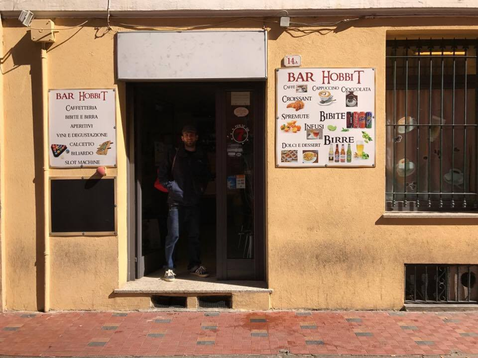
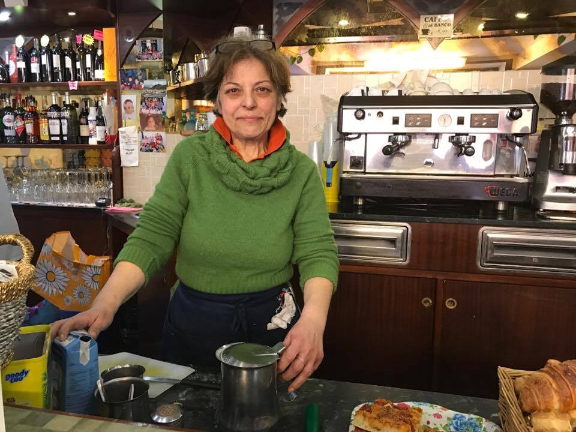

### Stories from Ventimiglia \(1\): An Unexpected Journey

_This is a story about Delia and her bar “The Hobbit”, the forefront of helping refugee and migrants in Ventimiglia\. The bar is a safe place for many people whose lives have taken an unforeseen twist and who have travelled so far to find refugee and freedom\. Europe shot its borders to them, but many European opened their doors and hearts sharing everything they have\._

The Hobbit, sanctuary for many who arrived to Italy\. Photo by Peggy Whitfield

Ventimiglia is a small, pretty town on the Italian Riviera, a place where nothing much happens and the rhythms of life have remained constant over the years\. Even the name is functional — Ventimiglia means ’20 miles’ in Italian and the clue of the town’s growing importance in the last few years is in this name, because that is how far it is from the French border and this is why it has become the focus of migrants and refugees trying to enter France and also the site of numerous human rights abuses\.

I arrived in late in the pouring rain and had arranged to meet several individuals from groups working in Ventimiglia in “The Hobbit,” a bar which was holding a fundraiser that night for refugees and migrants in the town\. **To call it a bar is a bit of a misnomer; it began life as one but has metamorphasised into a kind of social centre for people on the move\.** Situated close to the train station, where many refugees and migrants have been forced to sleep over the last few years, The Hobbit is run by the formidable Delia\. The outside is unassuming, a typical Italian bar which has been open for 10 years, a place to catch up on local gossip, eat panini and have an espresso before returning back to the office\. But in the last 18 months, Delia and her bar has been at the forefront of helping refugee and migrants in Ventimiglia\.

**The lack of women**

For people who have worked with refugees mainly in Greece, like myself, the people I met in Ventimiglia are very different; whilst the vast majority of people I worked with Athens and Lesvos were Syrian, Afghan or Iraqi, who arrived in Europe in dinghies from Turkey, the people I met in Delia’s bar overwhelmingly came from African countries — mainly Sudan, but also Nigeria, Mali, Eritrea, the Gambia, Boko Haram controlled areas of Nigeria — and the vast majority were young men\. Most of those I spoke to hoped to travel onwards to France and the UK, though many did want to begin their lives again in Italy\.

Everyone I met had arrived in Italy in boats from Libya that resemble the horrendous slaving ships of yore\. The smuggling route runs all the way from Niger and in my brief conversations with customers at Delia’s, I learned that deaths in the desert, forced detention for money by smugglers and extreme violence was commonplace\. The lack of women, as everyone explained to me, was due to the fact that many were disappeared into brothels in northern Africa or forced into sexual slavery on their arrival in Sicily\. It’s accepted as fact that most African women who arrive in Europe on this route will have been raped at least once\.

The first chapter of Tolkien’s novel, “The Hobbit” is called _“An Unexpected Journey”_ — it’s ironic that a bar of the same name serves so many people whose lives have taken an unforeseen twist and who have travelled so far\. I was intrigued as to why Delia started on her own unexpected journey to help these desperate people passing through Ventimiglia\. She explained that that she felt very emotional about the plight of so many people sleeping on the floor of the train station platforms cold and hungry but that she didn’t make a conscious decision to help: _“I did not decide to act, my heart decided that I must do something,”_ she says\.

Delia _“I did not decide to act, my heart decided that I must do something\.” Photo by_ Peggy Whitfield\.

So Delia started handing out leftover food at the end of every day and the police allowed her to do this as there were so many men, women and children sleeping outside\. But in August of 2016 a new law was passed that forbid people from distributing food, citing hygiene reasons\. Delia then began to allow people to charge phones and use the bathroom in the bar\. Last summer, there were so many women and children sitting in the baking hot sun, without food or water, that Delia brought them inside and offered free food and drinks\. To this day, women and children don’t have to pay at “The Hobbit,” and the men just pay at cost prices, although if someone is clearly starving or has no money at all, she also gives them food and drinks for free\.

**In spite of local opposition**

Delia persevered and has now started offering Italian courses to those who are intending to stay in Italy and attendees get a free meal\. The menu has been totally restructured to cater for the tastes of her new customers, so pork is off the agenda\. But it’s clear that her new customers are extremely grateful — her nickname amongst the young men who frequent her establishment is “African Momma,” something which she laughs at, but also plays to perfection, often telling young migrant and refugee men to pull their trousers up so she can’t see their boxer shorts\.

But these acts of kindness have had a high cost for Delia\. Her business is suffering as she is paying for so many things out of her own pocket and many locals from Ventimiglia no longer frequent “The Hobbit”\. She even had to close for several days last August as she didn’t have the money to pay the utility bills\. The authorities have begun to create problems for her and the bar\. Several days before my visit, Delia had lost a close family member and the Italian ‘political police’ filmed activists comforting her at the funeral, and a few days after I left the town, the police came into the bar demanding that all the customers show their papers\. Luckily, no one was detained and the police left\. Delia is defiant though; when asked how long she would continue to help, she laughed and said

“I will do this until I can’t pay the bills anymore\. Other expenses like colouring my hair and going to the dentist will just have to wait\.”

Her spirited, tolerant attitude is a lifeline for people passing through Ventimiglia; The Hobbit is a place that welcomes them, where they can relax and be treated with dignity, as well as somewhere that serves more practical needs, like washing and eating and drinking\.

**Just like you**

Whilst local activists have started to support Delia and “The Hobbit” by giving their custom and starting fundraising projects to support her, more help is needed\. The pool table and television are broken and there are no funds to repair and/or replace them\. Delia thinks basic things like these are vital to help often traumatised young men to pass the time and not fall into depression, although it is clear that the very existence of “The Hobbit” has helped numerous people, as one young man explained to me: “I am human, just like you\. I want a job, a life, a family\. Sometimes people in Europe, they treat me like an animal\. Here, in this place, I am treated like a human being, just like you\.”

> _\(If you would like to find out how to support Delia and “The Hobbit”, please contact [Peggy Whitfield, the author, via Facebook](https://www.facebook.com/peggy.whitfield.77) \) \._ 

> _Author’s note: I have referred to people on the move in Ventimiglia as both refugees and migrants for several reasons; Italians generally use the word ‘migrante’ as a catch all term and also because of the varied reasons people on the African route give for coming to Europe\. What is clear is that everyone deserves to be treated with respect and compassion, whatever their reasons for leaving their home countries\._ 

> **_We strive to echo the correct news from the ground, through collaboration and fairness, so let us know if something you read here is not right\._** 

> **_Anything you want to share — contact us on [Facebook](https://www.facebook.com/areyousyrious/) or write to: areyousyrious@gmail\.com_** 

_Converted [Medium Post](https://areyousyrious.medium.com/stories-from-ventimiglia-an-unexpected-journey-59a8ac8b37aa) by [ZMediumToMarkdown](https://github.com/ZhgChgLi/ZMediumToMarkdown)._
