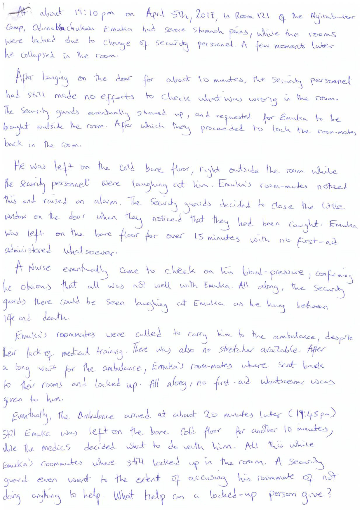
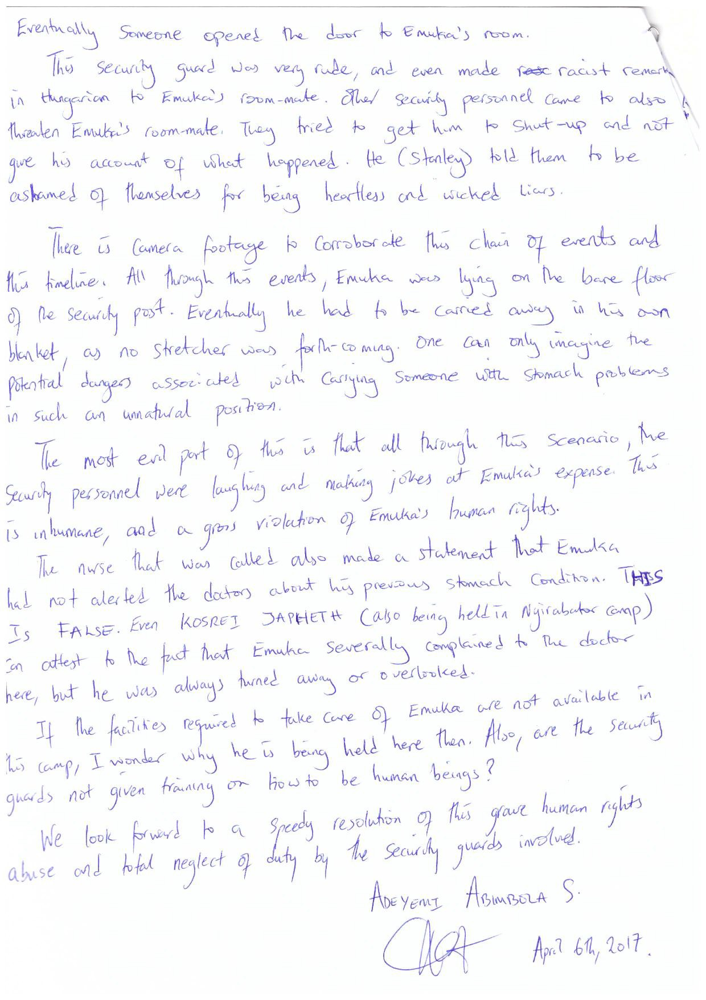
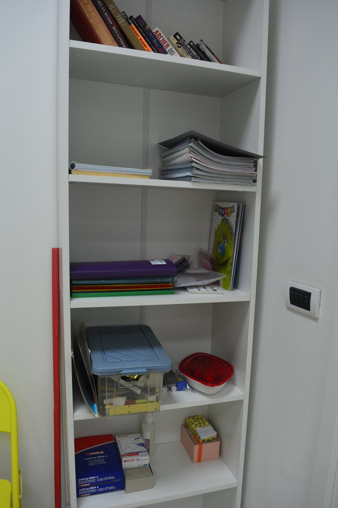
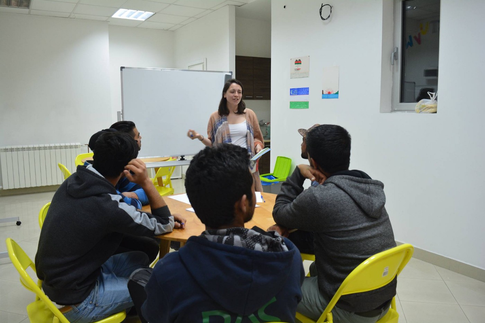
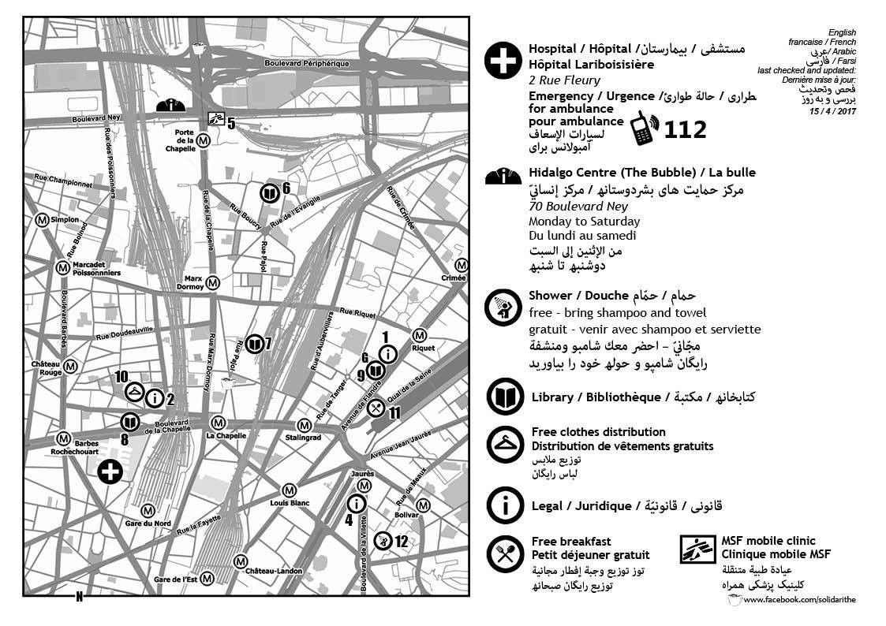

### AYS Daily Digest 18/4/17: A letter from the inside of the detention camp in Hungary
#### Recent surge in the Mediterranean waters — where is the EU at the sea? \| Translators needed in Greece \| A letter about negligence, racism and lack of solidarity from the Hungarian detention camp \| Accounts on what happened in the north of France in the past days \| Denied healthcare to asylum seekers in the UK

 \)](assets/926c86187b8c/1*azl_UQelR_0304npRIoHIQ.jpeg)

Belgrade, April 2017 \(Photo: [Lisa Bosia Mirra](https://www.facebook.com/Lisa-Bosia-Mirra-780272888726800/?fref=nf) \)
### “The guard closed the small window” — A letter from the inside of the detention camp

An open letter from an asylum seeker detained in Nyarbator in Hungary, after he had been pushed back from Austria, reached us\. 
This is another one in a line of scenes depriving people of dignity and their rights, described by the people held in the notorious Hungarian detention camps — in 2017\. The letter was signed by many people staying in the camp\.

We are all allowing those people to be kept locked up like that in the heart of Europe\.

#### SEA
### The only question is: life or death?

About 8,300 migrants were rescued in the Mediterranean over Easter weekend\. According to the Italian coast guard, only on 15 and 16 April a total of 7,000 people arrived in the operational area of the rescue ships\. 
The IOM says 666 people were documented as dead or missing off the Libyan coast so far this year\. 
It is estimated that about 27,000 people have tried to reach Italy from Libya\. While the NGO boats are present just outside of Libyan territorial waters that end 12 nautical miles from the coast, the EU Frontex vessels [reportedly](http://www.reuters.com/article/us-europe-migrants-ngo-idUSKBN17K22R) still patrol much further and can take a half\-day or more to reach the boats in distress\. Therefore, private rescue organizations keep on filling up existing state gaps on the EU level and if it weren’t so, this year’s Easter would probably enter history as a very sad one and a huge stain on the leftovers of the collective conscience\.

> “Our demand for an EU rescue program remains as relevant as ever in the course of recent developments\. Although our organization has been operating sea rescue for a year, there is no improvement in the situation in sight\. The NGOs, on the other hand, reach their limits under certain circumstances\. The extreme numbers of the last few days show that very clearly\. As a private organization, we provided 2,147 people with rescue tools within three days\. The European Union must participate in the rescue of people on the run with a clear mandate\. The sole focus on the elimination of the trafficking networks does not help the people, who at this moment have to flee from war and violence\. Their lives should never be taken at risk for a policy of deterrence and closed borders\.” — _statement by the crew of [Jugend Rettet IUVENTA](https://jugendrettet.org/en/)_ 

> “The priority needs to be saving lives, not patrolling a make\-believe border\. The further they stay away, the more people will die\. Saying there is a pull factor is just ignorance\. It’s avoiding responsibility,” _the founder of MOAS said\._ 

■■■■■■■■■■■■■■ 
> **[MSF Sea](https://twitter.com/MSF_Sea) @ Twitter Says:** 

> > UPDATE: #Prudence has just taken on a transfer of 143 #people including three pregnant women from a @[guardiacostiera](https://twitter.com/guardiacostiera) fast boat. https://t.co/dPrXSzAwos 

> **Tweeted at [2017-04-18 18:14:44](https://twitter.com/msf_sea/status/854397800129458177).** 

■■■■■■■■■■■■■■ 

#### GREECE
#### Registration of arrivals

101 person was officially registered today on the Greek islands: 69 on Chios and 32 on Samos, making a total of 802 people registered in April so far\.

### Assisted Voluntary Return and Resettlement

Updates and information about applying for those who chose to go back to their country of origin are available [**here**](http://bit.ly/2oHrTAm) **\.**
### Support and translators needed

The [Mobile Info Team for refugees in Greece — الفريق المتنقل لمعلومات اللاجئين](https://www.facebook.com/mobileinfoteam/) was born a year ago in Idomeni, after the borders closure, aiming to provide the people stuck in Greece with verified, reliable information on asylum procedures\.

> We’re a grassroots, crowd\-funded initiative based in Thessaloniki and our team is built and mantained only of volunteers\.
 

> If you:
 

> \- speak and understand advanced Arabic and English;
 

> \- can commit to at least 3 months \(the work is so specific that it really takes some time to get into\)
 

> \- have good people skills and understanding of the arabic culture
 

> … we are waiting for you to share:
 

> \- a truly unique work experience
 

> \- free accommodation \(in a sometimes cramped but fun flat\)
 

> \- free food
 

> \- refunds for Greek mobile costs
 

> If you’re able and willing to come over and help, we’d love to speak to you\!
 

> Drop us an email at contact@mobileinfoteam\.org
 

> Also check out our [Facebook page](https://www.facebook.com/mobileinfoteam/) as it gives a pretty good idea of who we are and what we do\. 

Reliable information is sometimes more valuable than food or clothes\. It empowers people and gives them an overview about their rights, obligations and options\. It prevents them from taking unnecessary risks and gives them the ability to act in dignity\. The work of this invaluable team requires means and mobility\. Please, consider [supporting The Mobile Info Team](https://www.youcaring.com/refugeesandmigrants-785142) \.

[Translators without Borders](https://translatorswithoutborders.org/) offer opportunities for volunteer Arabic translators \(from English\) to support their efforts in Greece\. 
If you are interested in joining the team that has actively been supporting the refugees since 2015, regardless of where you live at the moment, please fill out the [Rapid response translation application form](https://translatorswithoutborders.org/rapid-response-translation-teams-application-form/) \.

Volunteers are still needed across Greece, check out the [updated lists](http://greecevol.info/task.list.php) to find out whom to join and help — volunteer\.
### Refugee feedback review: Vulnerabilities of single males

The assumptions related to single male refugees, among other things, usually drive organizations to focus on other specific groups, leaving single men in a critical assistance gap\. Their feeling of being neglected exacerbates their frustration\. By providing a platform to express the opinions and experiences of single men, a [special issue by the News That Moves](https://newsthatmoves.org/en/in-the-loop-40-special-challenging-assumptions-vulnerabilities-of-single-males/) team aims to provide the opportunity to dig deeper into vulnerability factors \(…\) \.
### Rumours&Answers: Family reunification, fines, …

](assets/926c86187b8c/1*EBmk4qLLhn0ioaN-s1DTjg.png)

Information by [News That Moves](https://newsthatmoves.org/en/rumours-65-family-reunification-camp-on-islands-fines/)
#### SERBIA
#### Volunteers needed

BelgrAid organization is about to start doing the food distribution in the city centre, taking up the work that has been done amazingly by the Hot Food Idomeni team\. The new group is looking for volunteers: cooks, drivers and team leaders\. If you wish to get more information or apply, write to: volunteer@belgraid\.org
#### A new point for informal education opened in Belgrade

 and powered by international and local volunteers, the centre will be open five days a week to provide English language lessons and skill building workshops for migrants in and around Belgrade\.” \(Photos: RAS\)](assets/926c86187b8c/1*-nHaRW2dS7iPnYd7c2aFoQ.jpeg)

“We’ve been slightly quiet preparing everything, but we can now happily announce that this week we opened up our dedicated education centre, ‘The Workshop’\! Ran in collaboration with [NorthStar](https://www.facebook.com/NorthStarSerbia/) and powered by international and local volunteers, the centre will be open five days a week to provide English language lessons and skill building workshops for migrants in and around Belgrade\.” \(Photos: RAS\)
#### HUNGARY

A bold priest in the border area of Hungary spoke openly against the current policies and in favor of everyone standing up to politics of fear and closure, setting one of the not so many public examples of support for the refugees\. Read his speech [here](https://www.facebook.com/schillingarpad/posts/1827552067462601) \.
#### ITALY

A young migrant in Sicily, suffering from schizophrenia, has been taken from the hospital straight to the police station, and then to a detention centre, [volunteers](http://Help Refugees) [report](https://www.facebook.com/HelpRefugeesUK/photos/a.123267671367248.1073741830.111893659171316/417570945270251/?type=3) \.

> We’ve just heard that the judge has confirmed his deportation and it’s likely to be today\. Deportations are easier to carry out against the most vulnerable people, the people least likely to be able to protect themselves against mistreatment\. 

#### FRANCE
### Grande \-Synthe — A lack of information and atmosphere of mistrust

French Immigration Officials were in the past days encouraging people to board buses leaving from the provisional accommodation places in the area and the people were told that they would be taken to welcome centres around France\. People were told this would be for one month, it was not clear what would happen after that nor what choices or alternatives there were regarding making a claim for asylum in France, [People in Motion](https://www.facebook.com/peopleinmotion15/?fref=nf) team reminded\. Two gymnasiums in Grande \-Synthe were emptied, volunteers working in the area wrote:

> In the first one, there were 120 Afghans, among them a dozen minors\. The minors were taken to a center for minors, but it seems that their age was decided too quickly, the volunteer says\. Around 50 adults who stayed in the bus continued towards an accommodation center, the other 50 got scattered in the surrounding area\. 

The second gymnasium hosted 300 people, mostly families with up to 60 young children\. Four buses left from that spot, but with only about 20 people on board\. The officials later told the remaining people housed there that they must leave the place and get on the last bus\. 
Almost everyone decided to leave on foot, pushing the strollers loaded with blankets, clothes, some food, with really young children on top of the things\.

> Men had folded some of the camp beds from the gymnasium and were carrying them along with big bags, even with mattresses… 

> It was exactly the scene of an exodus during war time…
 

> There are now hundreds of refugees scateered throughout Dunkerque region…with no place to sleep\. 

Due to the lack of information, very serious pressure from people traffickers, and personal choice, many people did not board buses and instead were seen leaving on foot with personal belongings to find alternative spaces to be\. This means many refugees are sleeping on the streets, woodland and ditches\.
People have been displaced further both within northern France and beyond\. This puts people at even higher risk for a number of reasons\.
1\. Lack of support network and access to vital aid items such as food and clothing\.
2\. Without a support network, people smugglers have even more freedom to continue to intimidate and take advantage of extremely vulnerable people\.
3\. People not being able to access their human rights goes unwitnessed allowing for the targeted persecution of refugee groups — PIM [concluded](https://www.facebook.com/peopleinmotion15/photos/a.448991821950623.1073741829.447904162059389/658861697630300/?type=3&hc_location=ufi) after the happenings\.

](assets/926c86187b8c/1*JiIZAKNul0ZEubnpCXWUfg.jpeg)

Photo: [People in Motion](https://www.facebook.com/peopleinmotion15/)
### Paris
#### Updates & opening hours

MSF Mobile Clinic:
Tuesday, 12 pm\-17 pm @ Porte de la Chapelle
Friday 14 pm\-18 pm @ Porte de la Chapelle

Here’s what we’re distributing on the streets of Paris this week\. It includes the updated times and locations of where people can get food, a shower, legal support, internet access and more\.

See the rest of the maps and infographic [here](https://www.facebook.com/solidarithe/posts/1789522871365827) \.
#### UK

It seems that many refugees — asylum seekers have been wrongly denied NHS healthcare in the UK, in some cases being refused treatment despite suffering from life\-threatening conditions such as cancer and heart disease, doctors have warned\. Someone was reportedly told by a hospital in Sheffield that they weren’t going to treat his stomach ulcer, but that he should come back when it bursts\. Hospital overseas departments have also charged asylum seekers up to thousands of pounds in bills for medical treatment NHS guidelines state they should be exempt from\. Read the entire story in the [media](http://www.independent.co.uk/news/uk/home-news/asylum-seekers-migrants-wrongly-denied-nhs-healthcare-cancer-doctors-phil-murwill-a7672686.html) \.

The UK justice secretary has proposed new limit for appeals by failed asylum seekers and foreign criminals after previous scheme ruled unlawful, preliminary details are available in [the story](https://www.theguardian.com/uk-news/2017/apr/18/liz-truss-makes-fresh-attempt-to-fast-track-deportations) \.

An initiative to collect information and build a database of refugee support across the UK, search and contribute on [their page](http://database of refugee support across the UK,) \.

We strive for collaboration and fairness and we appreciate feedback\. 
Please send us your comments, corrections and important news to: areyousyrious@gmail\.com or write to us on [Facebook](https://www.facebook.com/areyousyrious/) \.

_Converted [Medium Post](https://areyousyrious.medium.com/ays-daily-digest-18-4-17-a-letter-from-the-inside-of-the-detention-camp-in-hungary-926c86187b8c) by [ZMediumToMarkdown](https://github.com/ZhgChgLi/ZMediumToMarkdown)._
