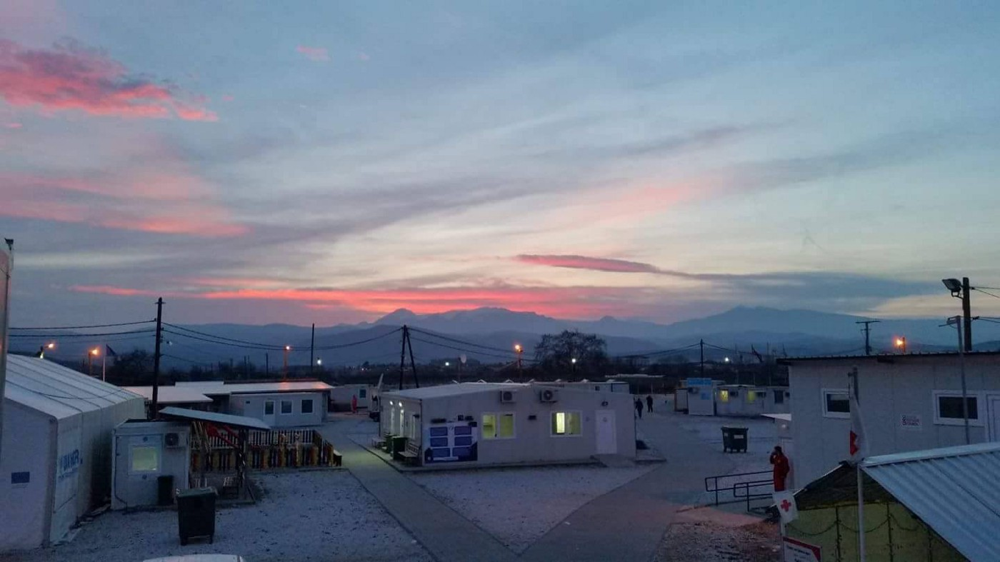

### AYS SPECIAL: Story from Macedonian camps and about push backs

_Taher Al Mohammad is a Syrian man, 31 years old, coming from the province of Idlib, the city Moarado El Noman\. He left his city in February 2016, taking his family, what they hope, is better future\. He has four children, and the youngest is two years old baby\. They believed that once they reach Europe, it will mean they finally found safety\. Unfortunately, until today they are still looking for that and trying to start a new life\._

By anindependent volunteer in Macedonia\.

In Syria, Taher was a construction worker and lived comfortable life until the bomb destroyed his house and they lost almost everything\. This incident pushed them to leave Syria\. But, in order to go to Europe, they needed money, 11\.500 only to reach Greece\.

The first stop, like for many others, was Turkey where from they left on a small boat over the Agean on the 8th of March\. He remembers that the, when the boat was in international waters, the Turkish coast guards came and hit it with the stick\. The boat started sinking and people jumped into the water\. Some were picked up by other refugee boats, and others by Greek coast guard\.

To Greece, they arrived on the 8th of March 2016, and went to Idomeni, only to arrive couple of days after the EU — Turkey deal that sealed the borders was concluded\. However, he and his family, with a group of friend, payed to smugglers to take them over the borders and they ended up in Macedonia where police took them to the camp in Gevgelija\. His wife and kids were sick when they arrived\. For all of them, this was the beginning of eight months long painful struggle and life in detention\.

**The Gevgelia Detention Centre**

Gevgelia camp, like all other in Macedonia, is run by the government\. However, inside of the camp, many big international organizations are present on a daily basis\. Their presence, according to Taher, did not prevent local authorities to detain and treat refugee inhumanly\. Even more, their silence turned them in accomplicities in violation of basic rights of people who are looking for refugee from war\.

Taher told us story about the UNHCR and Red Cross\. According to his story, both organization at the very beginning did not show needed attention to him and his family, as well as to the other refugees\. Even though Taher informed both organizations of his wife and kids health condition, little to nothing has been done to address this issue\. His kids, as he explains, have type of eye disease that impede them to see properly\. The medical help in the camp was only basic, and despite doctor who was careful, it was not enough to respond to existing needs\.

The family was moved to one of the UNHCR plastic shelters and they lived there for several months during the summer\. It was too hot, and the place was full of snakes and rats who entered tents\. The UNHCR, even though they were asked for help, have not done enough to improve this situation\.

At the end of the summer, people were moved from tents to Isoboxes\.

There was around 90 people, mostly families, and one dozen of single men, but the number was going up and down\.

But the biggest issue for all the residents was that they did not have freedom of movement almost all the time they were kept inside\. Only during the last couple of months, they were allowed to go out for shopping, but only if escorted by the Red Cross employee\.

Legal assistance was lacking as well, but lawyers were not helpful in clarifying asylum procedures in Macedonia\. Even more, the lawyers kept telling to the residents that obtaining the asylum was extremely difficult and that, even if they make it, the government will not providing any assistance\.

The food was of extreme bad quality, and sometimes not even eatable\. Additionally, no cloths distribution was done regularly\.

**The International Assistance in the Camp**

Residents of the camp relied on the UNHCR staff to get help, but, as Taher said, they were disappointed by their reaction\. Even more, a UNHCR staff openly told to residents in July their destiny depends “on the outcome of the upcoming elections in Macedonia”\. They explained to them that “the opposition party was pro refugees and it would have been better for them to wait to see the results”\. Additionally, they were threatened that, if consider insisting on changes in the camps, they could be pushed back to Greece, “without informing anyone”, which made them afraid\. More than once, tensions between residents of the camp and UNHCR staff escalated and burst into open conflicts\. The refugees are blaming the UNHCR for unwillingness to engage in the relocation program, saying that the attitude staff in Gevgelija camp had is “destroying the name of the organization”\.

Additionally, the camps regulations forbid entrance to any independent volunteers or journalists, except those by the state run \(heavily controlled\) media in Macedonia, so the residents did not have a chance not only to tell their story but also to get much needed information\.

However, during the visit of the Slovenian politicians, some of the residents managed to speak with him only to discover that the UNHCR informed him that the place is “a detention camp for Afghans and Pakistani that represented a threat to the state security”\. The truth was that only Syrians and Iraqis, and couple of Afghan families were living inside\. most of the visitors were not allowed to have direct contact with residents\. Contact with the Slovenian politician was made after protest during which residents pushed security away\.

**The push backs in January 2017**

The situation changed after 5th January 2017 when the residents were given, by the authorities in the camp, two options:
1. to ask for asylum in Macedonia
2. being pushed back to Greece

Taher and his family, as well as number of others, decided that pushed back is better than staying in Macedonia, being afraid that it would mean staying in the detention for a longer time\. Nevertheless, they tried to get help from the UNHCR, one more time, asking them to take all the people in some camp in Greece\. Not even that was done\. Taher and his family were pushed back on 15th of January\. The weather conditions were harsh on that day and it was very cold\.

They left together with one other family and two single men\. Before leaving they went to the organizations working in the camp asking for money in order to pay public transports once they would have been arrived in Greece\. UNHCR refused to provide any money but eventually some volunteers done that, without being seen by other the other groups\.

It was the Macedonian police that physically managed the push back\. The families were put in a close van, while the two young men were transported in a police car\. The police drove then until the border, close to a river, and stopped before the border showing them road they had to walk for reaching Hotel Hara\. They walked around two or three hours before finally reaching the place, and called local police to pick them up and register, and take to the camp\. However, Greek police that arrived used harsh manners, put them in the car and took to the police station in Idomeni\. It was around 11–12 am\. The temperature outside was \-12°C\. The entire group, including children, was left in the yard behind the police station, basically outside, with no protection from the cold\. The refugees bagged police to move them somewhere else, only to be told that they had to stay there overnight, because it was Sunday and the offices for registration were closed\.

In the evening, a person came and let the kids and the women sleep in the corridor of the old small building in the back yard behind the police station\. The men spent the night awake, sitting on the soil, waiting for the morning to come\. The women and the kids were sent back to the yard around 4–5 am the next morning\.

Around 11 am on 16th January a bus came and brought the refugees to Vasilika refugee camp where they stayed at the moment we recorded this story\.
### The UNHCR answer

We contacted the UNHCR office in Macedonia asking to clarify some of the information Taher give to us\. Here is their answer:

> “Thank you for following and reporting on events surrounding refugees in the country and beyond\. 

> Regarding your question about the Gevgelija/Vinojug Reception and Transit Centre, please be informed that UNHCR is not the manager of that centre\. Throughout 2015 and 2016, we have assisted the Government of the country to set up both the Vinojug and the Tabanovce centres, by providing much of the facilities as well as services in it\. The following services were enabled throughout the past two years due to the support of UNHCR: medical aid, psycho\-social support, legal aid, food, water, non\-food items such as clothes, blankets, shoes, etc\. Our support has mainly been channelled through partners such as the City Red Cross \(for medical aid and distribution of food and non\-food items\), Open Gate La Strada \(for psycho\-social support\), the Macedonian Young Lawyers’ Association \(for legal aid\), as well as some other NGOs and activists for whom we have been covering fuel costs in order to be able to continue to support the refugees through countless activities \(Legis, NUN, Help the Refugees in Macedonia\) \. In addition to that, the majority of the operation of the two centres in 2015 and 2016 was supported by UNHCR, by paying the local salaries of cleaners, workmen, distribution staff, etc\. 

> What has been a point of concern regarding the stay of the refugees in the Vinojug Centre has not been the quality of services, but rather the whole concept of having a long\-term stay at a centre constructed for short\-term stay only\. This, together with the limited freedom of movement, has created psychological pressure for the refugees accommodated there\. That is why we have repeatedly appealed to the government who manages the two transit centers and is responsible for the refugees in the country, to remove them from the transit centers and provide a more suitable solution for long\-term stay\. 

> In terms of your second question, we have not received any complaints about the operation of UNHCR — on the contrary, we have had a lot of positive feedback from refugees and a very fruitful cooperation with the civil society working on helping refugees, just like we have cooperated with the other international and UN organizations and the national authorities\. 

> Finally, I would kindly invite you to follow our Facebook page where we have posted over the past 2 years the accomplishments and advocacy regarding refugees in the country: [https://www\.facebook\.com/UNHCRSkopje1/](https://www.facebook.com/UNHCRSkopje1/) For example, the last advocacy activity we did was in January 2017, when we organized the first art show of two Syrian refugees from the Vinojug Transit Centre in the country capital, Skopje\. This activity was met with a lot of support both from refugees and from the public\. Previously, in November and December 2016, we did an awareness raising campaign in 4 towns throughout the country which also raised significant support from the local population\. For all of these activities, you will find information and photos on our Facebook page\. 

> Ljubinka Brashnarska 

> Senior Public Information Assistant, PI/ER” 

**_\(The report was made in cooperation with The Mobile Info Team in Greece\)_**

> We strive for collaboration and fairness and we appreciate feedback\. 
 

> Please send us your comments, corrections and important news to: areyousyrious@gmail\.com or write to us on [Facebook](https://www.facebook.com/areyousyrious/) \. 

_Converted [Medium Post](https://medium.com/are-you-syrious/ays-special-story-from-macedonian-camps-and-about-push-backs-ec026bc54026) by [ZMediumToMarkdown](https://github.com/ZhgChgLi/ZMediumToMarkdown)._
