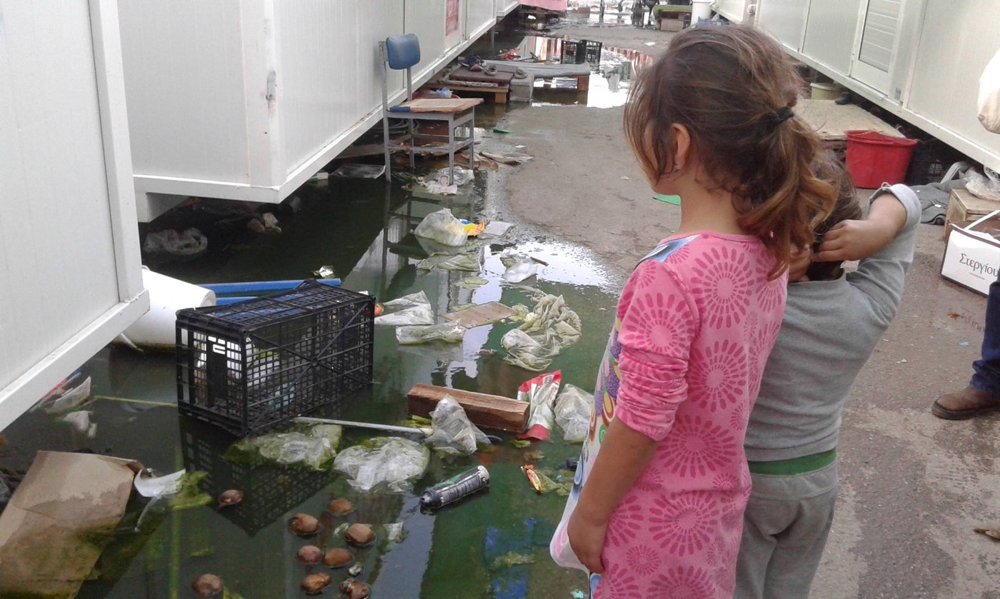
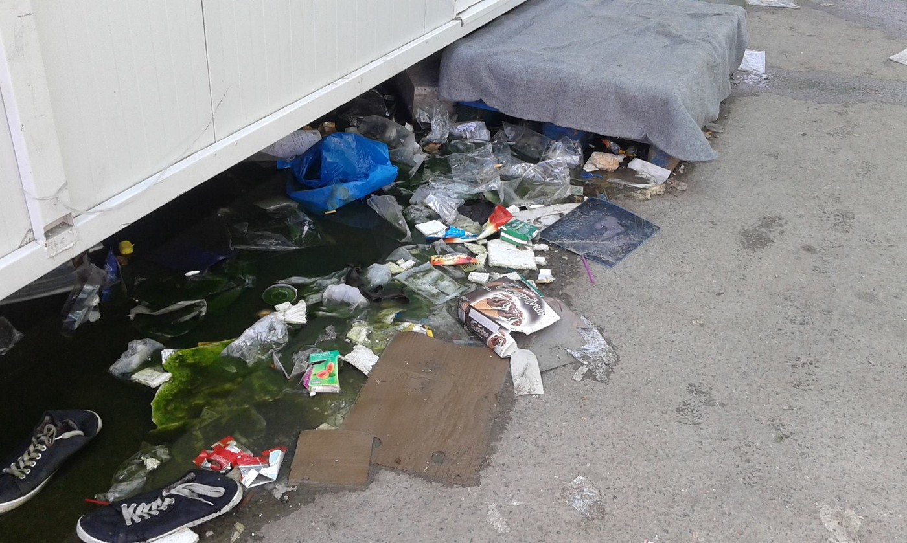
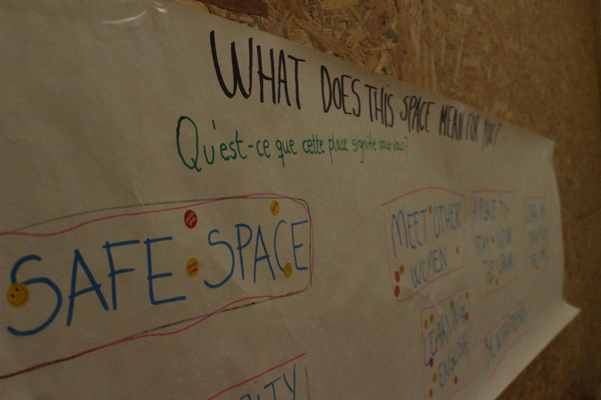
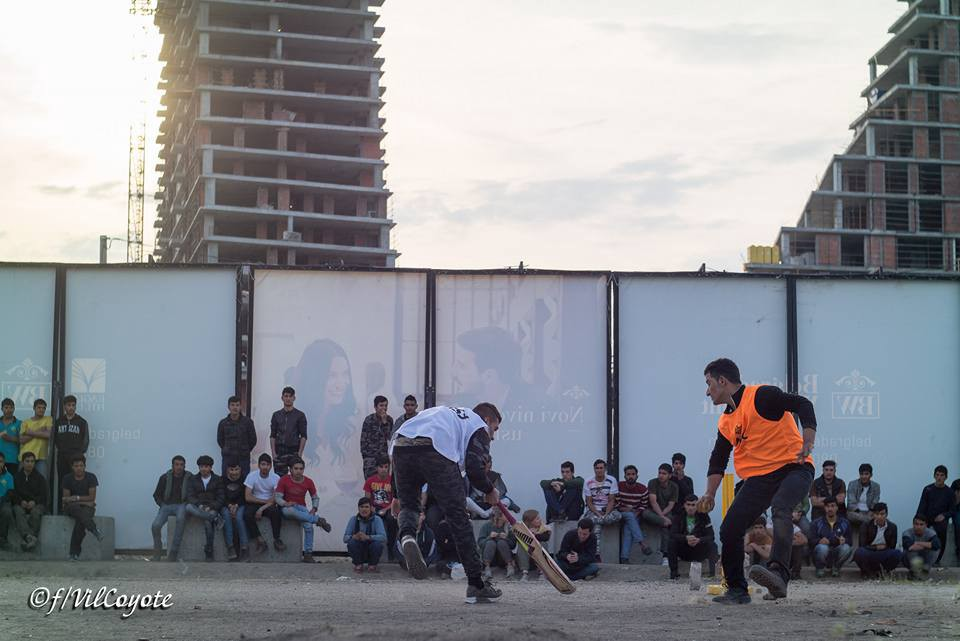
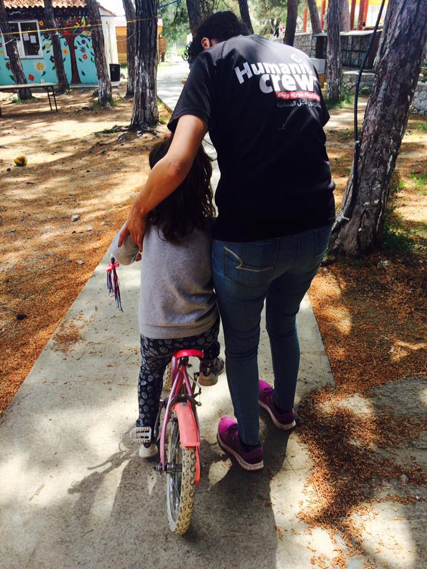
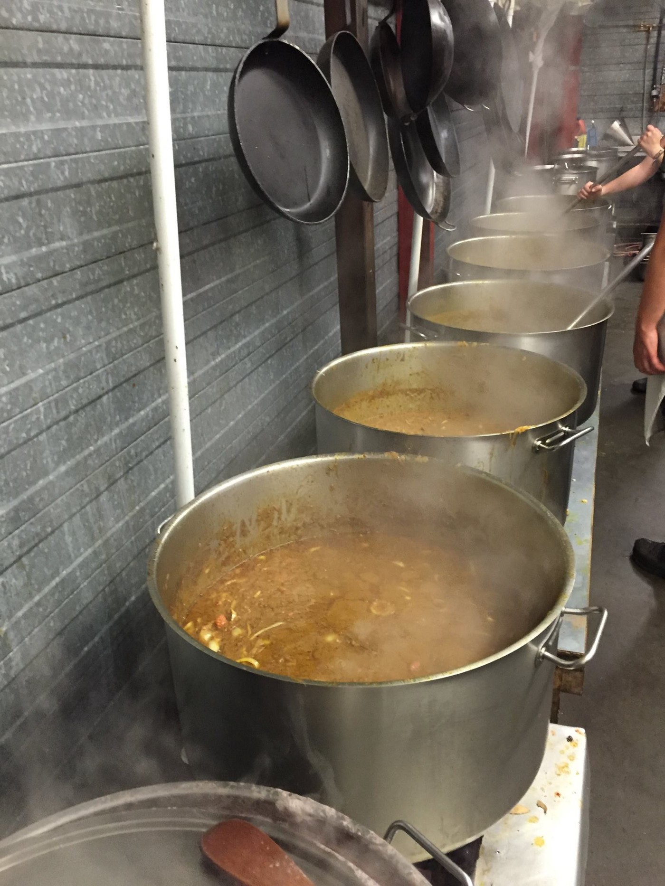

### AYS Daily Digest 19\.04\.2017: Housing reshuffles and sanitation problems in Greece, the blame game\.

_Proposed relocation of refugees throughout Greece /sanitation in Skaramangas disturbingly absent / workshops continue across Greece / commercial vessels save refugees in the sea / German state Hessen proposes more controlled residency of refugees / New ways to coordinate and collaborate in France / Bring a refugee into your home or circle of friends in UK\._

Skaramangas Camp\. Photo courtesy of ART Angels Relief Team
### FEATURE: Housing reshuffles and sanitation problems in Greece, the blame game\.

The Mayor of Athens has stated that the current distribution of refugees in Greece [is making specific areas unfairly pay the price](http://www.ekathimerini.com/217746/article/ekathimerini/news/athens-mayor-calls-for-fair-nationwide-distribution-of-migrants) and calls for more equitable distribution of camps and housing of refugees across Greece\.

> “According to the mayor, the Greek capital is currently home to roughly 18,000 refugees, of which 2,600 are staying at a camp in Elaionas, 1,600 at apartments rented under a program by the UN’s refugee agency and the municipal authority, and between 2,500 and 3,000 at squats or shelters run by NGOs, among other facilities\.” 

In spite of the mayor’s comments, the same report showed that 2/3s of Athenians do not find the refugee population present to be a problem \(although [44% of people found refugees to be a “potential threat\.”](http://www.ekathimerini.com/217759/article/ekathimerini/news/surveys-shows-divided-opinions-on-refugees) \); however, the [Migration Policy Ministry is in the stages of concocting a plan](http://greece.greekreporter.com/2017/04/18/greeces-migration-policy-ministry-to-spread-migrants-in-small-towns/) to redistribute 20,000 refugees into small, rural communities across Greece, offering economic incentives to the local communities\.

Although this plan is pragmatic, there may be understandable resistance from refugees themselves as access to transit lines and other metropolitan amenities will inevitably prove to be more limited\. The decisions as to who participates in what scheme remain unclear and disorganized to many refugees, and so any effort made in this direction will require clear communication in order to prevent feelings of favouritism and taking sides\. It remains notable that some of the greatest success stories of cooperation between refugees and their host communities grow out of rural housing of refugees, although an important difference to highlight is that most of the people in Greece are still technically on the move and not planning to be settled in Greece, meaning that a plan along the lines of those that have worked in Italy may not be applicable\.

Regardless of where refugees end up, the overloading of the current situation is evident, especially when it come to infrastructure and maintenance of camps\. On a visit to Skaramangas camp, ART Angels Relief Team snapped these photos, highlighting the worsening sanitation conditions of the camp\. In the context of how perpetually concerned official bodies across Europe are of health and sanitation when it comes to the activities of informal groups not under their control, the true hypocrisy becomes evident\.

Skaramangas\. Credit; ART Angels Relief Team

In general, refugees are truly in a catch\-22 as they are often blamed for lack of care of their surroundings, yet are rarely provided the sufficient means to tend them\. With limited spending cash, many would be hard\-pressed to invest that money into sanitation equipment especially when this should be one area that is managed by the fat pockets of “the professionals\.” Whose job is it to clean communal property?

If it is up to the community themselves, then why are there not greater efforts to empower and equip them to do so? For being the true professionals, many managing organizations often carry out their responsibilities in an environment divorced from awareness of media context and public opinion, in spite of ongoing efforts to survey and measure\. In addition to the first and foremost reason for sanitation, health and dignity of refugees, lack of hygiene infrastructure in camps can only serve to stigmatize refugee communities trapped in the situation, reinforcing negative stereotypes about people from “not from here\.”

> The excuses of last year are worn out — the situation is not in rapid flux, and we are all in this situation now\. Truly sustainable and committed practices of sanitation must be put in place in order to affirm the dignity of and preserve the health of refugee residents\. A lack of commitment to either providing sanitation services or helping empower the community to manage it themselves, as many wish to, only jeopardizes the health of residents, but also makes them a target for media smear campaigns\. 

### GREECE

UNHCR released updated total of arrivals to Greece for 2017\.

> Total arrivals in Greece \(Jan — Apr 2017\): 4,548
 

> Total arrivals in Greece during Apr 2017: 540
 

> Average daily arrivals during Apr 2017: 45
 

> Average daily arrivals during Mar 2017: 49
 

> Daily estimated departures from islands to Mainland: 35
 

> Estimated departures from islands to Mainland during Apr 2017: 535 

This marks a significant drop from last year’s arrivals; however it should be noted that now Italy is seeing an ever\-increasing number of arrivals from across the Mediterranean\.
#### Mainland: Athens

The Khora Freeshop has put out a call for supplies\! Please help keep it stocked\!

We are looking for Pampers \(especially sizes 1, 3, 4 and 5\), Baby milk \(especially number 1\), Baby wipes, shampoo, and new underwear for men, women and children\.

For more information, contact them [here](https://www.facebook.com/KhoraAthens) \.
#### Mainland: Thessaloniki

> On Sunday a big football tournament with/for refugees will take place in the Helexpo in **Thessaloniki** \. The Open Community Center is looking for volunteers to help conducting it\. The tournament will take place from 12 to 23 o’clock, core time is from 12 till 18\. After that there will be concerts and broadcasting of a match\. Volunteers should get in touch with Didac from OCC via WhatsApp \+34 667 82 14 72 and be there for introduction on Sunday at 10 am\. 

#### Mainland: Nea Kavala

As usual, the We Are Here team has provided a comprehensive update as to their activities and the daily life in Nea Kavala:

_Welcome to another update from We Are Here at Nea Kavala\. This week’s been busy but very rewarding\. Many newish classes and activities are becoming more established and are working better and better as people settle in\. This week we had no new arrivals, as they usually arrive on a Friday and this long weekend was Easter, a big holiday for Greece\. From Friday morning till Tuesday morning, there were greatly reduced services on camp, leaving many lacking\. Most organisations on camp are present Monday — Friday, and while everyone needs time off, two days of nothing in a refugee camp every week is too much\. So we’ve decided to change our day off in order to be present Saturday — Thursday\. So far, so good\!_

_…\._

Nea Kavala Photo Courtesy of We Are Here

_Our new English literacy class has grown immensely over the past few weeks\. Yesterday a woman was looking for her small class of last week, was shown which room it was in, and didn’t recognise it because of so many new faces\! Learning to read and write English, this group seems to have overcome any shame, and concentrates on conquering the letters and sounds together\. Many in camp can speak basic English and have picked up useful words, but without the ability to read the Roman alphabet, will face huge difficulties in Europe, before they even begin to learn the language of their host country\. So while they are here, waiting to be interviewed and accepted, they can learn a skill to change their future \(and even present\) lives\. This is no small task, as English is notoriously irregular with spelling and pronunciation, but now they’ve started that task and are learning quickly\. We are extremely proud of this group\._

_We also have a new music class, with thanks to The Shropshire Music Foundation\. Since the summer, we’ve been continuing with regular harmonica classes, although almost all of the students moved on to apartments and hotel rooms elsewhere\. The remaining two students are still keen to learn and we hope to carry on teaching them a little harmonica, while shifting concentration to the penny whistle\.…_

Read the full report [here](https://www.facebook.com/WeAreHereCentre/posts/1985927941628801) \.

Refugees play cricket behind a facade for the Belgrade Waterfront building project\. Photo Courtesy: f/VilCoyote via John Refugee
### MEDITERRANEAN SEA

Horror and grief on the sea again as MSF Sea reported that a woman had a miscarriage after watching her husband drown as they attempted to cross the sea\. Additionally, a boat with the bodies of 28 people was found floating off of Libya, highlighting that the dangers at sea are not only in the water\.

Commercial ships continue to pick up the slack for EU as Opielok Offshore Carriers picked up a total of nine boats on the sea, rescuing a total of over one thousand people\. Much thanks and support to the commercial ships who are saving lives around the clock\.

Additionally, two boats carrying 199 people were intercepted by the Turkish coast guard on the 19th of April\.
### ITALY

We know that the struggles have often just begun for those that have crossed the sea\. The following is a report from Italy:

_Ship Gregoretti, which reached Molo Manfredi in Salerno this morning, was carrying 400 migrants, coming mainly from Sub\-Saharan Africa and rescued in more operations\. As said before, the ship was carrying 354 men, 40 women and some ten children, both accompanied and not\. Many women were pregnant, they will be checked at Hospital Ruggi\. Also two women’s bodies were onboard, picked up in the two operations\._ 
_No health emergency was found, but there were several cases of burnt people\._ 
_A hundred migrants will stay in Campania \(including pregnant women and minors\) \._

The mayor of Lampedusa will be awarded the Félix Houphouët\-Boigny Peace Prize by UNESCO due to her efforts to assist throughout the refugee crisis in her city\. The city has an Official Remembrance Day for Migrants to mourn those lost on their way to safer shores\. It is hoped that more government officials will follow her lead and that this publicity will provide more support to the reception center in Lampedusa which is horrifically overcrowded\. In a camp of 200 beds, 1000 people reside, a situation that will only get worse with time\.

Baobab experience is also expecting an increase of those needing aid and has put out a call for sporting shoes \(40–44\) and jackets \(S — M\) \! Follow [their page for more details](https://www.facebook.com/BaobabExperience/posts/1307436202666462) \.

Lesvos Solidarity — Pikpa
### GERMANY

The German State of Hessen plans [mandatory residence for refugees](http://www.fr.de/rhein-main/landespolitik/zuwanderung-in-hessen-auflagen-fuer-fluechtlinge-geplant-a-1262226) \. Political parties plan to dictate the place of residency for refugees in order to prevent the formation of ghettos in major cities, to ensure that no one can receive their social welfare more than once \(by only paying it out at the mandatory place of residence\), and to fight rural depopulation\. As such, the entities behind the plan view it as a “win\-win\.” German integration law allows the States to issue such directives\.

The directive for Hessen is still not final, but is estimated to pass before the summer break\. However, NGOs are opposing this move, as it violates the right of free movement and is discriminatory\. Politicians are also considering expanding the directive not only to refugees, but to all migrants who are on welfare and not integrated either socially or linguistically\.

Three Afghan refugees, a 30 year old father with his two children \(8 and 10 years old\) spent two days and two night in the trailer without any food or drink\. A driver heard knocking coming out of the truck at a rest stop close to Ulm and called the police\. People smugglers/human traffickers \(it is unclear which the perpetrators are as of now\) had placed the refugees in the truck in Serbia, telling them that the the journey would only last 2 hours\.
### FRANCE

Sursaut Citoyen has launched an interactive web map of relief and support efforts for refugees in France\. It has a phonebook in order to help put everyone in touch with one another and speed communication and coordination\. Check it out [here](https://sursaut-citoyen.org/) \.

In a [report by Europe 1](http://www.europe1.fr/societe/entre-700-et-800-migrants-campent-dans-le-nord-est-de-paris-3303953) , information about the informal and formal camps around **Paris** was published\.

_At the moment, about 700–800 persons camp near Porte de la Chapelle, mainly from Afghanistan, Sudan and Eritrea\. The number has been slowly increasing during the last couple of weeks, but not “exploding”, said the Prefecture\. Some of the tents are at rather dangerous locations, directly next to a highway exit with heavy traffic and pollution from exhaust pipes\. The prefecture said that they are working on a solution to shelter these people\._

_A smaller number of refugees are in an informal camp at Rue Pajol\. The Center at Porte de la Chapelle has capacity for 400 persons \(from where they get transferred to other centers in the rest of France or emergency shelters\) \. AT the moment, 200 persons per week are taken in, but lately this number has decreased to 150 persons weekly\._

_Anne Hidalgo, the mayor of Paris said she is worried about the situation and requests from the State to take over their responsibility and increase the number of places to allow a “fluid reception” and and to develop measure to grant the security in the public space in Paris\. There has been tensions among refugees around Porte de la Chapelle last Thursday, with several people being hospitalized\._

[**Refugee Community Kitchen**](https://www.facebook.com/refugeeCkitchen/?fref=nf) conducted a salvage mission from Dunkirk camp, searching for any and all renewable material\. Keep up the good work\!

> We are currently feeding approx\. 600 people a day in Calais town and are in need of volunteers especially chefs/cooks please share to anyone that wants to join our hardworking volunteer teams in Calais\!
 

> Email us refugeecommunitykitchen@gmail\.com 

### UK

New opportunities to get involved in supporting newly\-arrived refugees\! Both [Refugees at Home](https://www.facebook.com/refugeesathome/posts/1916894295209792) and [Host Nation](https://www.facebook.com/HostNationUK/) are looking for volunteers\. Refugees at Home seeks people who can host refugees in their home specifically in Manchester, Birmingham and London\. Go to the Refugees at Home facebook page \(linked above\) to offer accommodation to a refugee in need\.

Host Nation is looking for participants in their newly\-launched “online befriending scheme\.”

> We’re looking for people in the Greater London area who can befriend newcomers to the city over a minimum period of 3 months\. A weekly phone call or a fortnightly outing may seem like a simple thing, but for people who may not know anyone in London, and whose families and friends are far away, it’s also intensely powerful\. 

> If you would be interested in meeting with an asylum seeker or refugee, and spending an afternoon walking, or sight\-seeing, or just talking\- helping them practice their English, and making them feel a little more welcome and valued, then go to HostNation’s website to register\. 

via [Help Refugees](https://www.facebook.com/HelpRefugeesUK/?fref=nf)

_We strive to echo the correct news from the ground, through collaboration and fairness, so let us know if something you read here is not right\. Anything you want to share — contact us on Facebook or write to: areyousyrious@gmail\.com_

_Converted [Medium Post](https://areyousyrious.medium.com/ays-daily-digest-19-04-2017-housing-reshuffles-and-sanitation-problems-in-greece-the-blame-game-f9542d9e6f01) by [ZMediumToMarkdown](https://github.com/ZhgChgLi/ZMediumToMarkdown)._
