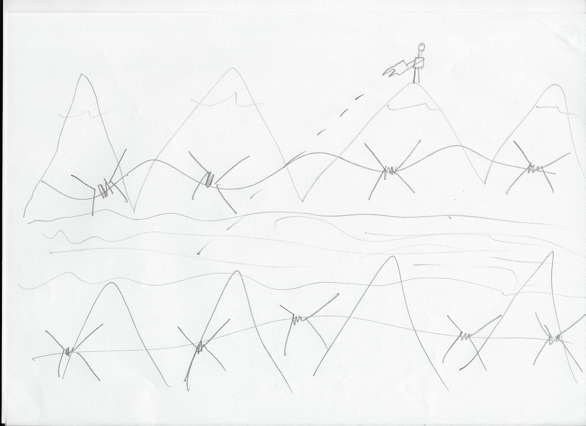

### AYS Daily Digest 20/04/17: Racist attacks on Chios
#### Aircraft surveillance on the Mediterranean sea // Hungary to stop feeding refugees in camp // Evictions and violence in France

By a 16 years old Syrian Boy living in Samos Refugee Camp, Samos Island, Greece\. His Today
### Feature

Today a group of local radical right winged militants, reportedly Golden Dawn, attacked refugees whilst they held a protest against [**Salvamento Marítimo Humanitario**](https://www.facebook.com/smhumanitario/?fref=ts) , a Spanish NGO that has been helping refugees on Chios\. The NGO is in the process of opening a new clinic on the island and was targeted today by a group of fascists that started protesting at in the morning and physically attacked some refugees outside the Chios Labor Center before they proceeded later in the evening to surround Souda camp and throw stones at the compound\.

This obviously made some refugees very angry and some came out of the camp to defend themselves and their families and at that point, according to witnesses, just after 10 pm, riot police showed up to try to calm the situation down as there was a lot of tension\. There seem to have been further aggression as six of these militants attacked a group of refugees that were standing neat the waterfront, chasing them through the streets of Chios\. There is also reports of some women and children leaving the camp at that time to stay out of the trouble\.

By midnight the situation was calm but the result, once more was not in favor of the refugees since 7 were detained by the authorities according to volunteers reports and at least 2 were injured but the attacks, one of them, a boy with 22 years old, was badly injured in one leg\. None of the attackers were reportedly arrested as they seemed to have managed to ran away from the scene\.
### Mediterranean Sea

Two NGOs have got together and managed to get and start using a plane to help in their rescue missions at sea\.

[Sea\-Watch](https://www.facebook.com/seawatchprojekt/) together with the [Humanitarian Pilots Initiative — HPI](https://www.facebook.com/humanitarianpilotsinitiative/) deployed a small airplane in the area of the Mediterranean where most shipwrecks happen in order to patrol the Mediterranean graveyard as well from the air\. “The “moonbird” will be operating the whole summer to help coordinate rescue missions, to reinforce the pressure on the EU which is letting people die in the Mediterranean and to prevent more shipwrecks from happening, as happened during this Eastern weekend\.

](assets/9b8f92b2d5ae/1*DZghy7bfmz2t_WYoSQsUmA.jpeg)

Photo by [**Humanitarian Pilots Initiative — HPI**](https://www.facebook.com/humanitarianpilotsinitiative/)

The NGOs have been using the patrol aircraft for a week now and thinks to it they were able to find and rescue more than 100 refugees in trouble at see on Easter Sunday\. The dinghy was spotted far away from any other rescue vessel and the situation was critic for all those people as the boat was already sinking but the majority was able to be saved\. Unfortunately 7 people had already drowned by the time the rescue boats arrived at the site\.

](assets/9b8f92b2d5ae/1*Em0zgEZ90KBQV59hw_VGbQ.jpeg)

Photo by [**Humanitarian Pilots Initiative — HPI**](https://www.facebook.com/humanitarianpilotsinitiative/)

> “Our goal is to prevent boat catastrophes by using our aircraft\. The first operational days have already shown clearly that we are also in a position to do so\. In addition, we want to build pressure on the European Union, which here knowingly drowns people by blocking safe routes and denying sea rescue\.” The Cirrus SR22 search aircraft is able to do so whenever necessary, the sea area north of the Libyan coast In order to discover boats in distress, even if there are no ships nearby\. We are very well equipped with safety features such as a parachute parachute system and special communication technology, some very experienced pilots have already reported to support our mission\. After a few attempts last year, we have now found a good solution\.“ 

](assets/9b8f92b2d5ae/1*kSCaQz-6ak7Bsnr2Y33niQ.jpeg)

Photo by [**Humanitarian Pilots Initiative — HPI**](https://www.facebook.com/humanitarianpilotsinitiative/)

It’s a great effort by these two groups to get together and increase their capability to save lives in the Mediterranean\.

[**MSF Sea**](https://twitter.com/MSF_Sea) also brings us good news from their missions today stating they had a quiet day yesterday and and managed to rescue 143 refugees that they will be taking to Italy on board of Prudence, one of their boats\.

](assets/9b8f92b2d5ae/1*QjQiuHcwCd1L3ABgvgXpBQ.jpeg)

Photo by [**MSF Sea**](https://twitter.com/MSF_Sea)
### Greece

There was another busy day for the teams on the islands as boats keep arriving\.

Today one boat landed on Samos in the morning with 27 people on board, 19 men, 3 women and 5 children from Egypt, Syria, Afghanistan, Kurdistan, Dominican Republic and Iraq\.

On Chios on boat arrived last night with 12 people on board, 4 men, 3 women and 5 children, all in good health\.

Unfortunately, the reception in the centres on the islands aren’t very welcoming as we all know and today there were reports of a family having to wait outside in the cold, in Vial, until they got registered and found a place where they could be hosted, in Vial itself or in Souda camp\.

> Again
 

> More people still coming to chios island
 

> This time the police did not put people in the cage
 

> but threw them in the street in this cold weather 
 

> I want to ask only one question
 

> if there is helpers
 

> Do They have the power to change?
 

> The photo of this girl explain what is have to change 

](assets/9b8f92b2d5ae/1*xEKY8fKYh4iraZZIw4pjbg.jpeg)

Photo on [Midnight Helpers](https://www.facebook.com/groups/ROYartsaveslives/)

According to reports of a refugee the police didn’t let them get in and wasn’t helpful at all so in the end this refugee that is also helping new arrivals found this family a place herself but they have to share it with another family\.

We also get pictures that show how unwelcoming is the other camp, Souda where the facilities are very basic and in some cases are run down and represent a real danger for guests of the camp\.

](assets/9b8f92b2d5ae/1*llbebXEC8DZvB4AbPqoChw.jpeg)

Water and electricity — the municipality seems to have its own standards for hygiene and safety — photo by [**Miss Montag**](https://twitter.com/miss_montag)
#### Registrations

There were 21 registrations today one the Greek islands, 12 on Chios, and 9 on “other islands”
#### Fake rumors

Recently [**Mobile Info Team for refugees in Greece**](https://www.facebook.com/mobileinfoteam/?fref=nf) have noticed a lot of people talking and asking questions about a rumoured “new relocation program”\.

We would like to clarify that **there is no new relocation program** \. People who have applied for relocation will continue to be in the exact same program, which is not changing in any significant way\. Relocation will also not stop until all applicants have been relocated\. People who arrived after the 19th March 2016 \(after the EU\-Turkey deal\) will not be included in relocation in future\.

For more information about relocation, please read their updated info sheet [here](http://bit.ly/2opFR7v) \.

**Volunteers are needed** in Greece as [**InterVolve**](https://www.facebook.com/InterVolve-219418945063168/?fref=nf) is recruiting dedicated Community Development Volunteers and Translators \(Greek/Arabic\) to join the team as soon as possible\. As they put it, if you want to make a lasting difference by building resources alongside residents living on camp click [here](https://docs.google.com/…/1TfyZ2Q02eu_uUKMuMXINyz1Fzl…/edit…) for more information\.
### Balkans

A series of NGOs has made a joint brief on the situation for unaccompanied and separated children in the Balkans are\.

This advocacy brief is a joint effort by 12 national and international humanitarian agencies responding to the needs ofrefugees stranded in or on the move throughout the Balkans, specifically Bulgaria, FYROM, Serbia and Croatia\. The information and recommendations outlined in the paper are based on field observations, daily programming, and regular interaction with refugees in the area\. Our hope is that through this brief we can raise awareness about this ongoing but hidden crisis in the Balkan region, and provide concrete recommendations for all relevant stakeholders to measurably improve the response for this most vulnerable group\.

You can read the whole manifesto [here](https://www.rescue.org/sites/default/files/document/1489/outofsightexploitedandaloneweb.pdf) \.
### Hungary

Hungary has notified refugees living in Kiskunhalas camp, in the south of the country, last week that the funds they receive from the Hungarian state for purchasing food will be withdrawn\. Now refugees were told that the camp will **not offer them food provisions** either\.

According to the Hungarian Helsinki Committee, individuals currently in their first asylum procedure and those with protection status will be taken Thursday to Vámosszabadi refugee camp, near the border with Slovakia\. An estimated eight to ten people, including a pregnant woman, will remain in Kiskunhalas but will not be provided with any food or medical services after the end of April\. The same committee said that revoking the daily food ration of certain asylum\-seekers in the open reception facility is **inhumane and irrational** and would only mean that officials want to push everyone to leave\.

Many of the previous residents of the camp have already left to Austria, fleeing ahead of the implementation of the law of mandatory asylum detentions but for those that remained, even though the governments decision to not send them to closed container camps yet brought relief, now face great uncertainty\.

It’s unclear whether the government’s new policy will be extended to refugees in other locations who are waiting for decisions in their asylum cases\.
### France

The Police continues to crack down on volunteers in France unnecessarily overusing its powers and today [**Solidarithé**](https://www.facebook.com/solidarithe/?ref=page_internal) is calling for help has its headquarters is being evicted in Paris\.

They are asking for help to find another place where they can continue their work and heat water and store supplies and a place for their four members to live so if you know of affordable spaces in/around Paris or have a room to spare please get in touch with them to allow them to got back to work soon\.
#### Dunkirk

[Help Refugees](https://www.facebook.com/HelpRefugeesUK/?ref=page_internal) has done an update on the amazing emergency response from volunteers and donors to the fire in the Dunkirk camp\.

> During the eviction, with our partners we distributed over 12,000 items including 800 backpacks containing emergency supplies of water, blankets, socks, underwear, dry food, an information card for accommodation centres and a hygiene pack\. 

Now, the vast majority of those who were placed into emergency accommodation have gone into state protection across France although some still remain in the area\. The team and their partners continue to work also in Calais where the number of people increased recently after the destruction of the camp in Dunkirk and need your support to continue their wonderful job so please consider making a donation [here](http://www.helprefugees.org.uk/news/volunteers-deliver-12000-emergency-items-refugees-dunkirk-1-week/) \.

The Refugee Women’s centre is asking also urgently for phone credit as after the fire, people are unable to easily access shelter and protection so being able to contact family and friends is very important\. They have completely ran out of vouchers so if you can please donate on their page on the [link](https://www.facebook.com/groups/1709109339334305/) \.
#### Calais

Once again we see scenes of unjustified brutality by the police, scenes that became too common and outrageously continue to happen all over Europe without consequences\.

This time at a sunny evening food distribution done by [**Care4Calais**](https://www.facebook.com/care4calais/) , CRS arrived in large numbers, without warning and arrested a few boys whilst the majority ran away\.

One of the boys arrested was about 16 years old and was pinned down to the ground and dragged whilst being kicked and screamed at towards the police van\. The kid had a broken wrist and was already in pain to start with\. It’s difficult to imagine that law officers that are supposed to protect everyone, especially the most vulnerable, do such things to someone that has done nothing except look for food, shelter and human contact\.

](assets/9b8f92b2d5ae/1*i2AyN00Wb2X0iKw6l7zmLg.jpeg)

Photo by [**Care4Calais**](https://www.facebook.com/care4calais/)
### Italy

In another report of abuse of power, [Baobab Experience](https://www.facebook.com/BaobabExperience/?ref=page_internal) told us how the police in Rome took 60 refugees to the station while their belongings were put in the trash\.

](assets/9b8f92b2d5ae/1*0FTvoN6dVjHR1-qAMhj9vA.jpeg)

Photo by [Baobab Experience](https://www.facebook.com/BaobabExperience/?ref=page_internal)

At the same time, volunteers are asking for donations, particularly shoes, size between 40 and 44 for so if you have some shoes in good condition please contact them [here](http://Baobab Experience) \.

> **_We strive to echo the correct news from the ground, through collaboration and fairness, so let us know if something you read here is not right\. Anything you want to share — contact us on Facebook or write to: areyousyrious@gmail\.com_** 

_Converted [Medium Post](https://areyousyrious.medium.com/ays-daily-digest-20-04-17-racist-attacks-on-chios-9b8f92b2d5ae) by [ZMediumToMarkdown](https://github.com/ZhgChgLi/ZMediumToMarkdown)._
