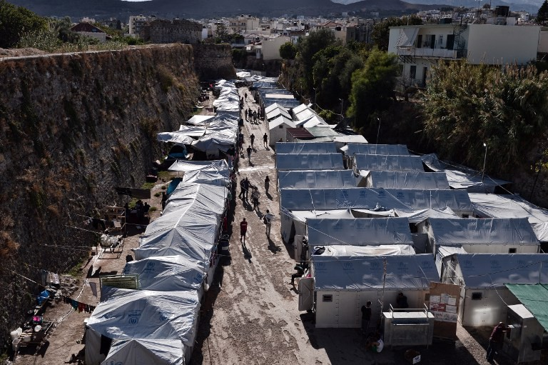
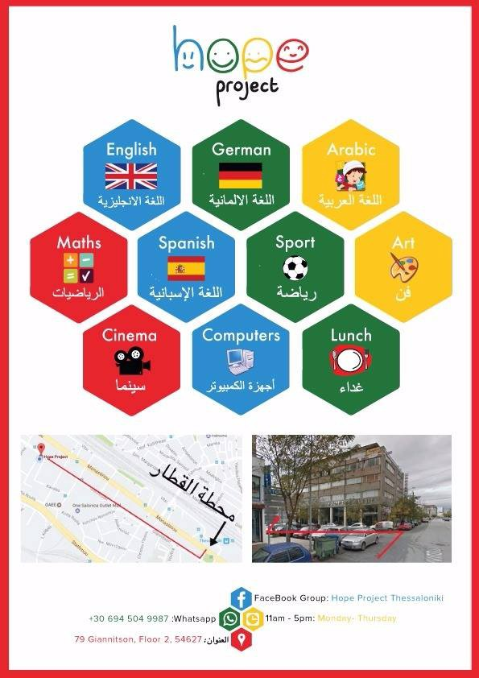

### AYS Daily News Digest 21\.04\.2017: Fascists arrested following assaults at Souda Camp
#### 60 deported to Turkey // Syrian refugees begin hunger strike in Moria // Timisoara Camp in Romania leaves refugees hungry // More refugees are sleeping on the streets of Paris // 150 children have drowned in the Mediterranean

The Souda Refugee Camp\. Photo Credit: Louisa Gouliamaki
#### Feature

The police have arrested two fascists who took part in assaulting refugees the previous night\. It is believed that they are members of the Golden Dawn political party, a group notorious for its violent racist actions in Greece\. The two men were identified by their victims, one of whom had to be transferred to a hospital to receive treatment\. The two were also involved in throwing stones and Molotov cocktails at the camp, alongside a larger group of people\. Last night’s atmosphere was incredibly tense, to the point where residents of the Souda camp began gathering sticks and stones in the event that they would need to defend themselves\.

Yesterday’s attack on the camp was preceded by protests by locals against a Spanish NGO’s initiative to open a healthcare clinic in the Chios city center, which was to provide free healthcare for both refugees and locals\. A group of around 50 protesters gathered outside of the town hall where the creation of the clinic was being debated\. The protesters demanded that Souda be cleared of refugees\. By 9pm, the crowds began to disperse, and some of the protesters formed a mob and marched towards Souda\. At around 10pm, the fascists had reached the camp and an explosion was heard near the entrance\. Then the rock throwing and assaults began\. Local witnesses claim that the police stood by for much of the course of the evening\.

This is far from an isolated incident\. Yesterday’s attack was the third such attack on Chios by the Golden Dawn party against refugees\. Xenophobic sentiments are prevalent both throughout Greece as well as across Europe, where this vulgar, thuggish form of racism is finding an increasingly accessible and vulnerable target for its attacks\. Refugees find themselves the target of smear campaigns by tabloids \(although their crime rates are generally about the same as that of the local population\), and such sentiments seep down into the popular conscience, until something as innocent and beneficial for all as a healthcare clinic is shouted down by fascists\.

Refugees must be protected as their rights come under threat\. The police’s inaction during the assault on Souda should be shameful\. Police forces across Europe \(and worldwide\) are heavily permeated by those with right wing politics, and sympathy towards outright fascists is far too common\.
#### Greece

> **\* \*IMPORTANT NOTICE\* \* \*** 

> **The Greek National Weather Agency has issued an extreme weather warning for this weekend\. Strong winds and a large drop in temperature is to be expected\. Stay safe\!** 

### Numbers

A total of 62 people arrived this morning on Chios, 24 men, 15 women, and 23 children\.
### 60 refugees were deported to Turkey

The group is comprised entirely of men, 56 of whom were from Pakistan, 3 from Bangladesh, and 1 from Nepal\. The deportations seemingly took place on Thursday\.
### Turkish refugee sentenced to three months in prison for illegal entry into Greece

A 27\-year\-old Turkish man was recently arrested in the Simi area and afterwards detained in Rhodes\. Yesterday, he was sentenced to 3 months for illegal entry into the country\. The man was forced to flee Turkey because he is a member of an anti\-AKP and anti\-Islamist human rights group in Turkey, and he was being persecuted for opposing Erdogan’s politics\. [Oasis Rhodes](https://www.facebook.com/groups/OasisRhodes/) calls for legal help in a case where the man is clearly at risk of punishment by the state, and demands that the Greek government does not attempt to deport him back to Turkey\.
### 11 Syrian Kurdish refugees have begun a hunger strike in Moria

The group has spent 10 months in Moria, and they are asking that the reexamination of their asylum claims be expedited\.

### Hope Project community center now open in Thessaloniki city center

The poster above outlines the subjects taught at the center as well as the activities that people will be able to partake in, as well as the address and contact information of the center\.
### Reminder for refugees waiting for family reunification: do not buy your own plane tickets\!

You cannot buy your own flight tickets for family reunification\. Buying your own flights will not speed up the process\. The Greek Asylum Service has said that family reunification cases involve a lot of paperwork and coordination in the country where you are going\.

Before you can fly, the country must buy your flight tickets, prepare the special documents you will need, and coordinate with the airport\.

If you buy your own flight tickets for family reunification, you will likely not be allowed to board the plane\.
### The TruckShop project is a cause worth supporting

TruckShop is an NGO providing an important service for refugees living in Greece\. Refugees often come to Greece with very few personal belongings, especially the most important ones: clothes\. Having access to good, clean clothing is a requirement for basic human dignity, and thanks to the work of the people of TruckShop, refugees find themselves in good hands\. The TruckShop is, as the name suggests, a truck which travels around mainland Greece and allows refugees to choose clothing which they believe suits them from a wide selection\. More information about TruckShop as well as volunteering opportunities may be found on their [Facebook page](https://www.facebook.com/mobileclothesproject/?fref=ts&hc_location=ufi) \.
#### Romania
### Romanian border camp leaves refugees starving

On Sunday April 16, rumors began to hit Belgrade that Timisoara, a camp on the Romanian border, was not providing food to the refugees\. When “Dandelion” decided to investigate this claim, it was found to be true\. Upon arriving at the camp, the team observed that most of the basic needs of refugees were not being met\. The camp is home to around 100 people, most of whom are of Afghan or Pakistani origin\. As food is not provided, refugees are obliged to go to the supermarket and buy food with their own money\. The team also found that the camp followed a very strict curfew, and all who did not report to the camp by 10pm were left to fend for themselves on the streets\. One Pakistani refugee named Sanwal was expelled from the camp after having been absent for a few days\. Sanwal had tried to cross the border into Hungary, and he is now forced to sleep in the forest\.

### Pushbacks are reported

A number of refugees have reported being pushed back into Serbia\. The refugees had been sleeping in Vrsac, near the border with Romania\.
#### France
### Following the closing of the Grand\-Synthe camp, more are sleeping rough in Paris

The number of people sleeping on the Parisian streets has increased considerably according to local volunteers\. Currently, somewhere between 700 and 800 refugees are living on the streets of northeast Paris, a majority of them hailing from Afghanistan and Sudan\. This number speaks to the woeful underdevelopment of the infrastructure to support asylum seekers, and should be a sign to French authorities that more camps need to be built, where refugees can live in comfort and dignity, being able to maintain a standard of cleanliness and access to good food\.
#### Mediterranean
### UNICEF reports that 150 children have died since the beginning of the year

Children are the most vulnerable of the refugees who find themselves forced to flee their homes\. But when it comes to the sea, all are equally victims\. Thousands of refugees drown every year trying to cross the Mediterranean in flimsy, overcrowded boats launched by smugglers from North Africa with little regard for the people making this crossing\. According to UNICEF, a total of 150 children have drowned this year as a result of capsized vessels in the Central Mediterranean\. This number comes from a total of 898 refugees reported missing from January to April 19, according to the IOM\. As the number of refugees making the crossing has increased by 44\.8% over last year \(25,353 in 2016 vs\. 36,703 in 2017\), deaths have also increased \(from 853 to 898\) \.

_Converted [Medium Post](https://areyousyrious.medium.com/ays-daily-news-digest-21-04-2017-fascists-arrested-following-assaults-at-souda-camp-4f2f6a385d24) by [ZMediumToMarkdown](https://github.com/ZhgChgLi/ZMediumToMarkdown)._
