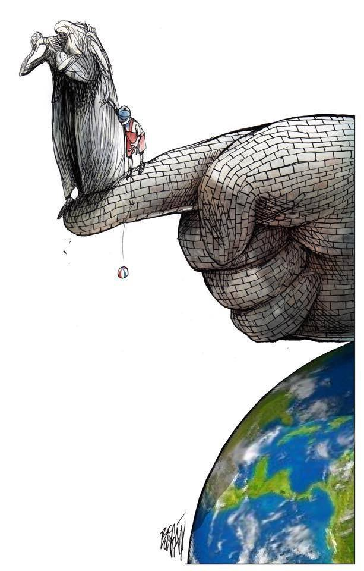
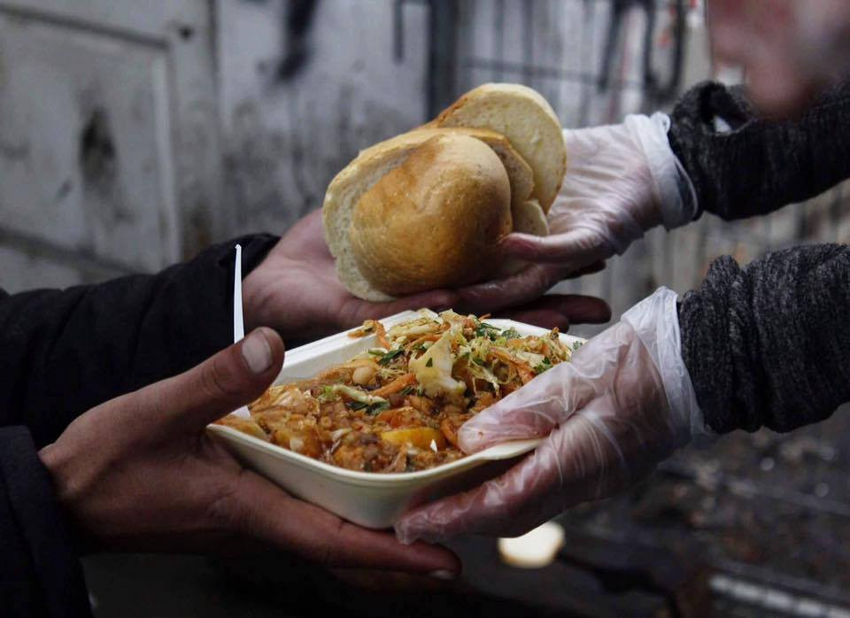

### AYS Daily News Digest 22\.04\.2017: Refugee minors sexually exploited in Greece

Further displacements in Syria // Boat left in distress in the middle of the Mediterranean Sea // Report from Sid camps // Hunger strike continues in Moria // Last day of support in Kiskhunalas camp

Harvard University’s [FXB](https://fxb.harvard.edu/) , _Center for health and human rights_ , recently published the results of a [research](https://cdn2.sph.harvard.edu/wp-content/uploads/sites/5/2017/04/Emergency-Within-an-Emergency-FXB.pdf) on abuse and sexual exploitation of refugee children in Greece\.

The report’s more sensational findings were quickly [re\-launched](http://www.independent.co.uk/news/world/europe/refugee-crisis-trapped-greece-children-girl-raped-boys-selling-sex-prostitution-eu-athens-a7695971.html) by several news agencies across Europe, leaving behind the general setting of this _emergency within the emergency_ \.

Data is far from being conclusive, for the sensitivity of the issues, the difficulty to collect information and the modalities of the research, undertaken through “rapid assessment methodology”\. The global picture is appalling: exposure to violence, physical and sexual abuses, _survival sex_ commerced in exchange for shelter, food or money, in a context of complete lack of governmental support, overcrowded and inhumane living condition, lack of will in addressing the issues\.

Throughout 2016 children were approximately the 37% of the over 170\.000 migrants who entered Greece\. In the same time 5174 unaccompanied minors were referred to EKKA for child protection services\. At the beginning of 2017 21300 minors are waiting for the completion of their asylum process, 1443 of them are in state\-custody: “detention centres, police stations, open air facilities commingled with adults”\.

In larger camps both accompanied and unaccompanied minors are at high risks of abuses and exposure to violence\. Poor living conditions, especially through the winter, facilitate the outburst of violent episodes\. While only a little number of sexual abuses have been reported, the general mistrust of governmental care and response hints to a wider number of unreported situations\. In some camps the fear of reprisal from criminal groups is an important factor in the silent victimization of minors and women\.

Regarding the population living in a large city like Athens, the report highlights the risks for unaccompanied minors linked to commercial sexual exploitation\. Areas of the city became notorious for it in the last couple of years\. Minors, forced to live in a limbo that seems endless and can last years, draining the financial resources they have, are pushed towards illegal activities from the lack of any legal money\-making scheme available to them\. If months ago minors engaged with “survival sex” to raise money for fleeing Greece, now they do it for food and shelter, the report states\.

Repercussions of sexual abuses and exploitation are physically and mentally severe: risks of STDs contraction, “depression and a deep sense of shame are the most common”, self\-harming behaviours and a higher risk of PTSD are also linked to it, with social ostracization and stigmatization\.

While the report records the high number of Afghani minors involved in sex trade it is important to stress, with [Suhail Abualsameed](http://www.unhcr.gr/nea/artikel/59db01238af3b47222edfa0c8c39638d/we-debunked-some-myths-about-the.html) , that this has nothing to do with mythologized cultural predispositions, but is far more likely to be linked to the modalities of European asylum system, that more and more excludes Afghani from the chance to access the relocation program\.

**Syria**

Further displacement within Syria

Another [2500 people are being moved from al’Wa’er to Jarablus](http://www.shrc.org/en/?p=29342) in line with the agreement made on the 13th of March with the Assad regime to allow fighters and their families to leave the town\. [The North Aleppo town of Jarablus](http://syriadirect.org/news/after-regime-takes-waer-one-resident-chooses-exile-in-syrias-north-then-regrets-it/) on the Turkish border now has a large refugee camp which houses nearly 4000 people\. People are living in tents with limited access to support and services\. Although they are given food they are not provided with any financial help\.

**Sea**

Boat carrying approximately 100 people left in distress and danger for a day and a half\.

 [www\.hpi\.swiss](http://www.hpi.swiss) \)](assets/7be427ce2325/1*UZ5EfNvNywUwwTA9N9w5ww.jpeg)

Moonbird is finally spotting the boat\-people \(Photo: Moonbird Airborne Operation / [www\.sea\-watch\.org,](http://www.sea-watch.org,) [www\.hpi\.swiss](http://www.hpi.swiss) \)

On Easter Saturday [Watch the Med](https://web.facebook.com/watchthemed.alarmphone/posts/1902856826655218) were informed about a boat in distress in the Mediterranean sea\. They were in contact with the people on board for 12 hours before contact was lost\. Having informed the appropriate authorities they expected rescue to be attempted and yet no action was taken for over 24 hours as no appropriate ship was available\.

_This absence of rescue forces in the most dangerous area of the deadliest border zone of the world, however, is not a coincidence\. Nor can it simply be attributed to a particularly exceptional situation, considering that the simultaneous departure of tens of boats from the Libyan coasts has been, for several months now, a relatively frequent event\. It is instead the result of precise political decisions taken by the EU and its Member States, which first deny migrants legal ways to enter Europe, thus forcing them into the sea, to then consciously limit the presence of rescuing assets, hoping that mass dying would act as deterrent\._

**Greece**

[City Plaza’s Birthday\!](https://web.facebook.com/events/424474824583722/)

This weekend City Plaza are celebrating their 1st anniversary with 2 days of discussions, food and music\. All the income from the event will go to the ex\-workers of City Plaza who have been fighting to get compensation since 2010\.

[_We live all together\. We struggle together\. We party together\._](https://web.facebook.com/events/424474824583722/)

Greek Islands

[Moria hunger strike continues](http://www.legalcentrelesbos.org/2017/04/21/syrian-kurds-on-hunger-strike-in-moria-refugee-camp/) as Syrian Kurds fight for fairer treatment because their asylum claims have been turned down on admissibility grounds\. This means they can now be returned to Turkey even though many Kurdish people face persecution under the Turkish regime\. The 13 guys involved have been held in Moria for 8 or nine months without the ability to leave the island\. They are tired of waiting but also know it is unsafe for them in Turkey\. They are trapped in an impossible situation\. The EU Turkey deal has meant that this situation is becoming an increasing reality for many people on the Greek islands and recently led to a young man on Chios setting himself on fire\. It is unacceptable that the EU maintains this policy when it endangers so many\.

Deportations

The situation about the deportations is as follows\. Yesterday the head of the Hellenic police came to Leros for a visit\. Most likely as a gesture to him, they wanted to send a group of people to Kos whose second appeal had been rejected\. The arrests started at the hotspot where riot police entered the camp fully geared up, which caused a lot of fear and stress amongst the residents\. There was a premade list of whom should be arrested, unfortunately nothing was checked with any of the other actors nor was the deportation announced to any of them\. This resulted in several illegal arrests and some of the arrested were pulled out of the hands of the police by UNHCR\. This resulted in many people being arrested and being released and made the whole operation fairly messy\.
 According to a reliable source the head of the police himself lined up a group of men that got arrested to tell them that about 60 people got sent back to turkey that day and they will be the next ones\. After the hotspot the police searched the town for missing individuals and went to open detention center Pikpa where 2 Pakistani minors were illegally arrested\. At the moment it is difficult to give exact numbers of those arrested\. Yesterday it is believed that 9 pakistani people, 1 person from Jordan, 1 algerian person and several Nigerian people were arrested and are now in Kos\. We also just heard that two women got arrested today\. The two minors who were arrested will stay on Kos for at least for one week for investigation of the legality for this arrest\.

Hellenic police at Leros hotspot

**SERBIA**

Belgrade sees temperatures drop once again\.

Colder weather in Belgrade \(AYS team photo\)

The last couple of days in Belgrade have been colder than usual for this time of year, down to just a few degrees, and came after a period of good weather\. In the barracks people have done their best to stay warm by wrapping themselves with blankets\. Unfortunately a lot of people still lack proper shoes to protect their feet from the wet and the freezing temperatures\. Regardless of that people living under these dreadful conditions manage to make the best of the situation\.

This week a transition from Hot Food Idomeni’s to BelgrAid’s has been ongoing\. Volunteers from both kitchens have been working together to make the change as smooth as possible\. Chefs and coordinators from both kitchens have also worked together to hand over old well working routines and food preparation tips\. Everything to make sure that the quality of the food and services remain at the same high level as before, and that the people most in need of a home cooked hot meal will continue to receive it\.

BelgrAid are looking for volunteers\!

[_We are looking for DRIVERS, COOKS, TEAM LEADERS and LONG\-TERM VOLUNTEERS to start working with us in our kitchen and doing food distribution\!_](https://web.facebook.com/belgraid/?fref=nf) 
_We are looking for people who are open to staying long\-term\!_ 
_We are looking for people with and without kitchen experience\!_

We have subsidized accommodation available to people who are staying one month or longer\!

Email us at volunteer@belgraid\.org

Food distribution by BelgrAid \(AYS team photo\)

Report from an independent volunteer in Sid:

_In Sid there are 3 open camps\. One is a little bit outside, 10 minutes driving\. It is not really sure how many refugees are living in Sid\. NGOs are guessing that in all camps there are a total of 1\.500 people, but there are also a lot of people who sleep outside\. On the one hand because the camps are full, on the other hand because people from Algeria and morocco were not allowed to enter\. The refugees who are sleeping outside are living in non\-permanent camps in the “jungle”\. There is a lot of moving because of the police repression\. Adm is there since a few weeks\. They cook every day hot food\. Fresh response just arrived in the last week\. They are bringing clothes and want to do food packages, with long life things and fruits\._

**Croatia**

Pushbacks

Volunteers in Zagreb have been supporting refugees to make asylum claims in Croatia as many people are being repeatedly pushed back to Serbia by the police\. But a large number of people are still alone, have no contact civil society organizations and are daily returned to Serbia without being granted access to asylum, to which they have a legal right\. Yet the state still allows illegal pushbacks of innocent people by authorities who are supposed to protect them\.

Unaccompanied Minors

On the 20th of April the department of family, youth and sports discussed the topic of unaccompanied minors\. Members of the advisory board for unaccompanied children and the center for domestic abuse and missing children presented the report which will soon be released\. The report reviews the current child protection issues in Croatia and provides a series of recommendations\. Some of its basic findings indicate the following:
 Resources for supporting unaccompanied children lack coordination actors
 Unaccompanied children are kept in inappropriate accommodation
 There is an absence of professional competencies for working with unaccompanied children
 There is a lack of available legal guardians 
 There are difficulties involving unaccompanied children accessing education and health care
 
 Unaccompanied minors who were interviewed for this report pointed out that they feel unequal treatment compared to Croatian children\. Some have been in Croatia for two years without access to education\. This is every child’s right\!

**Hungary**

Yesterday at 6:27pm · 
 _TODAY IS THE LAST DAY WHEN REFUGEES GET ANY SUPPORT AT THE REFUGEE CAMP IN KISKUNHALAS_ 
_Today is the last day when refugees get any support at the refugee camp in Kiskunhalas\. From tomorrow there will be no meals, no hygiene products, no clothes, nothing\. This is the consequence of the new legal amendment since March\. According to it who seeks for asylum for the second time is not entitled to anything\. “Second applicant” is someone whose asylum application was rejected by the Immigration and Asylum Office, therefore she/he applies again\. Charity organization is not allowed to warm meal, so yesterday we gave ingredients \(potato, rice, onion, pasta, tomato and vegetable oil\) for the people to prepare meal for themselves\. This is just a temporary solution, because from next week on we can enter the camp but we can’t donate anything\. But we do not give up\! We are looking for solutions\. We will try to give the food parcels and other donations by the entry gate\._ 
_If you can help let them know [here\.](https://www.sirius.help/donate-now/)_

**Romania**

On the 21st of April 111 refugees from Syria, Iraq, Afghanistan, Pakistan and India were found in a truck at Nadlac border crossing to Hungary, among them were children and young people\. After they were discovered they were taken to the notorious Timisoara Camp in the west of Romania\.

**General**

[The Central European University](https://www.ceu.edu/academics/academic-outreach-programs/OLIve) is offering a fully funded ‘higher education preparatory program’ from September 2017 to June 2018 for people with a refugee status in one of the EEA countries \(for MA or BA studies\) to help people access degrees in European universities\. The course covers academic tutoring, academic English, developing academic skills, and advocacy and human rights training\.

Deadline to apply: 15 May\. If you have any questions, you can contact them at olive\_admissions@ceu\.edu\.

> **_We strive to echo the correct news from the ground, through collaboration and fairness, so let us know if something you read here is not right\. Anything you want to share — contact us on Facebook or write to: areyousyrious@gmail\.com_** 

_Converted [Medium Post](https://areyousyrious.medium.com/ays-daily-news-digest-22-04-2017-refugee-minors-sexually-exploited-in-greece-7be427ce2325) by [ZMediumToMarkdown](https://github.com/ZhgChgLi/ZMediumToMarkdown)._
