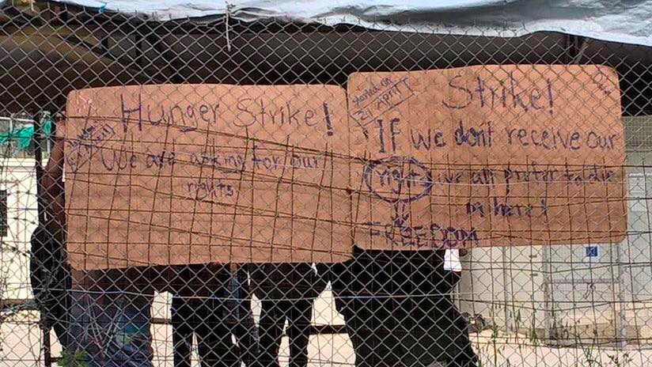
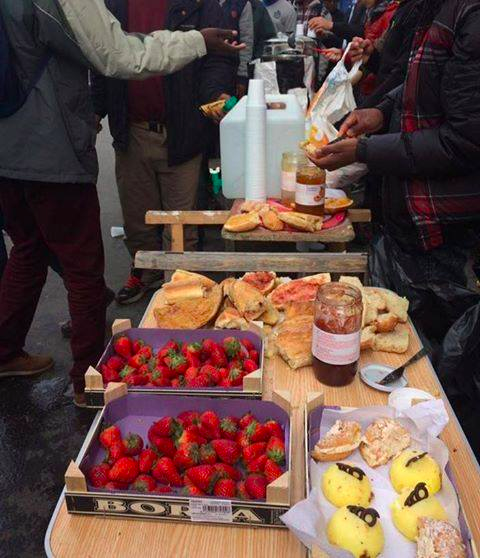

### AYS Daily News Digest 23\.04\.2017: 3rd day of hunger strike in Moria

_Hunger strikes continues in Moria//Long\-term volunteers needed in Calais//Austrian government pushes for closure of Mediterrenean Route_

 project\.](assets/ca72f4d64412/0*Jb9Jy0NwP9d5Slu9.)

Drawing by a 17 years old Afghan boy in Samos\. Taken from the [Yesterday\-Today\-Tomorrow](https://www.facebook.com/yesterdaytodaytomorrowyesterdaytodaytomorrow/?hc_ref=PAGES_TIMELINE&fref=nf) project\.
#### Greece

One refugee was rushed to the hospital with first symptoms of dehydration on the third day of the hunger strike in Moria, Lesvos\. The twelve Syrian hunger strikers are neither eating nor drinking\. The Legal Centre Lesbos says they have been in Moria for up to ten months and are protesting the rejection of their applications on admissibility grounds, as the administration claims Turkey is a “safe country”\. The centre also notes that eleven of them are Kurdish and could be deported to Turkey, where Kurds are “systematically persecuted and repressed”\. One of the hunger strikers is an unaccompanied minor and should be excempt from the procedure, but doesn’t have a way to prove his age\. They also criticise their inability to move from Lesvos to the mainland\.

This is their latest statement:

> We are 12 Syrian Kurds\. We started our hunger strike on 21 April\. 
 

> Our complaint is about the unfair conditions and the delay with our papers for such a long time, even up to 10 months\. 
 

> Our requests are to be given our rights, to receive our travel documents and to move to the mainland of Greece\.
 

> We are so tired\. We are in pain\. 
 

> But we prefer to die instead of living without rights\. 
 

> Our request is very simple: to get our travel documents for the 12 people who are on hunger strike\. 

Photo by PIKPA

Meanwhile, the Pope, while talking about last year’s visit to Lesbos, compared some of Europe’s refugee camps to “concentration camps”, given “the great number of people left there inside them”\.
### Pre\-detention jail in Kos almost full

After the massive deportation on the 20th April of 60 people from Kos to Turkey, the pre\-detention jail has already filled up with about 35–40 new people\. Of the 60 who were deported, 36 had not applied for asylum, despite the possibility to do so\. Volunteers complain about the lack of information given to refugees about their right to apply for asylum and their right to receive visitors\. Six solidarity groups for refugees in Kos held their first meeting this Saturday and discussed how to provide legal support and medical help\.

 \.](assets/ca72f4d64412/0*kKxEYP5_bU0SFBbi.jpg)

Trapped\. Picture by a a 18 years old Syrian Boy living in Kara Tepe Refugee Camp, as part of the [Yesterday/Today/Tomorrow project](https://twitter.com/Yester_Today_T) \.
### Salvamento Maritimo Humanitario to leave Chios

[Ana\-MPA](http://www.amna.gr/english/article/18221/Basque-NGO-to-leave-Chios-after-municipality-opposes-plan-for-refugee-clinic) reports the Basque NGO Salvamento Maritimo Humanitario announced on Saturday it is ending all its activities on Chios and leaving the island after local residents opposed the group’s initiative to operate a health center for refugees\. The mayor said the municipality had not been informed about the NGOs plans to build a clinic and that local residents had voted against the plan in a council meeting\.
### Sailing boat tries to reach Italy

[Keep Talking Greece](http://www.keeptalkinggreece.com/2017/04/23/boat-with-93-refugees-among-them-30-children-located-off-parga/) reports a sailing boat carrying 93 refugees was spotted off the coast of Parga, Western Greece, on Sunday morning\. The majority of passengers were women and children and the boat’s destination was Italy\. It was stopped by the coast guard and led back to the port of Parga\.
#### France
### Long\-term volunteers needed in Calais

Photo by Solidarité migrants Wilson

Long\-term volunteers are needed at the Calais warehouse \(email calaisvolunteers@helprefugees\.org\.uk for more information\) \. [Donations are also needed](https://mydonate.bt.com/events/mobileyouthcentre) for the new Mobile Youth Centre, a partnership between Refugee Youth Service, Help Refugees and L’Auberge des Migrants, which will provide support to unaccompanied minors in Northern France\. The centre will provide a safe\-space for minors, legal support and information on asylum as well as access to WiFi and phone charging\. In its new report, Refugee Rights Data Project says that almost half of the survey’s respondents were children and are forced to sleep rough without adequate services or protection\. 92% of them had been woken up and forced to move by police, an incident described as “violent” by 77% of them\.

In Paris, Solidarité migrants Wilson which distributes breakfast in front of the Porte de la Chapelle centre needs volunteers to sign up and come help, as numbers have dropped in recent days\. People can sign up for shifts [here](https://docs.google.com/spreadsheets/d/1CDTu2aZcuhldwhfPfrch75FxfsIFTbe97SN17bq2MQc/edit?ts=5849bb00#gid=0) \.
#### Austria
### Government pushes for closure of Mediterrenean Route

In an interview with „Presse am Sonntag“ Austrian Chancellor Christian Kern \(SPÖ\) said he supports the creation of refugee camps outside Europe, in countries like “Libya, Senegal, Mali and Afghanistan” and insisted Austria would be willing to make a “substantial contribution” and could even imagine sending Austrian soldiers to “defend these camps”\. Meanwhile, the 
 Interior Minister Wolfgang Sobotka said that the closure of the Western Mediterranean route has become crucial, arguing that “rescue in the open sea cannot be a ticket to Europe, because it gives organized crime every argument to persuade people to escape for economic reasons”\. His party, the ÖVP, suggested a resolution to expand the Frontex mission, improve cooperation with NATO, and implement a common European asylum system with „migration centers“ in North Africa, while the ÖVP secretary general Werner Amon said boats aiming for Europe should be prevented from leaving the ports, and military forces from the EU should be allowed to conduct “supporting interventions” to protect outside borders\.

The remarks come as [La Stampa](http://www.lastampa.it/2017/04/23/italia/cronache/abbiamo-le-prove-dei-contatti-tra-scafisti-e-alcuni-soccorritori-3fCnqLKWWRHBVUiygHv65K/pagina.html) reports Catania chief prosecutor Carmelo Zuccaro claims to have evidence that certain NGO are colluding with Libyan smugglers\.

Similar claims have already been rejected by NGOs operating in the area, who also argue that many more lives would be lost without their presence The death toll is likely to increase this year if the EU does not do more to create legal pathways to Europe and to save lives at sea\.

_We strive to echo correct news from the ground, through collaboration and fairness, so let us know if something you read here is not right\. Anything you want to share — contact us on Facebook or write to: areyousyrious@gmail\.com_

_Converted [Medium Post](https://areyousyrious.medium.com/ays-daily-news-digest-23-04-2017-3rd-day-of-hunger-strike-in-moria-ca72f4d64412) by [ZMediumToMarkdown](https://github.com/ZhgChgLi/ZMediumToMarkdown)._
