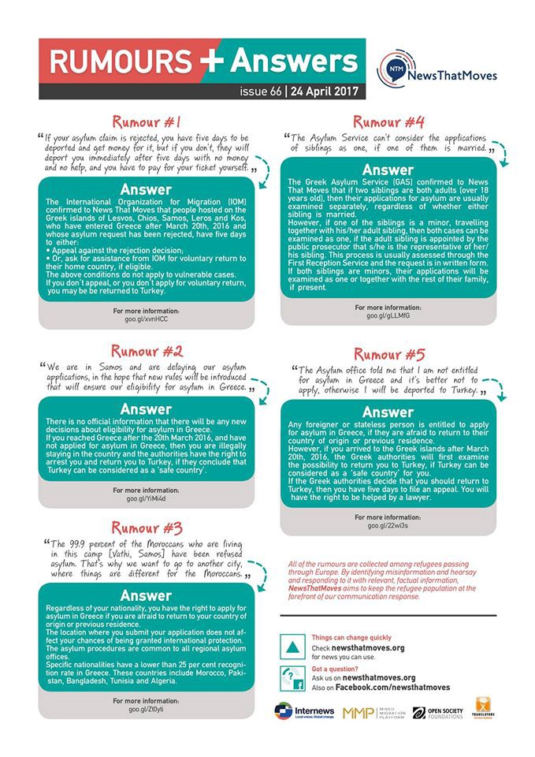

### AYS Daily News Digest 24\.04\.2017: UN reports on widespread torture in Afghanistan
#### Refugee boat sinks in the Aegean Sea off Lesvos / Update on hunger strike in Moria / Volunteers needed at Nea Kavala / Update on prohibited food distribution in Ventimiglia, Italy/ Six months from the demolition of Calais “Jungle”

](assets/3381d371f7a3/1*tCXftlyFGGca-l3joiPpzw.jpeg)

Protesters gathered outside Munich airport, photo taken from [DW](http://www.dw.com/en/protestors-rally-at-munich-airport-to-decry-deportation-flights-in-afghanistan/a-38572088)
#### UN reports on widespread torture in Afghanistan while Europe accepts fewer and deports more Afghan asylum seekers

While deportation of Afghans seeking asylum in European countries has been continuing and even increasing as of late, with Afghanistan marked as a “safe country of origin”, a new UN report published today shows detainees continue to face torture and ill\-treatment in government detention facilities\. The report is based on interviews with 469 conflict\-related detainees conducted from 1 January 2015 to 31 December 2016 in 62 detention facilities across the country, [states](https://unama.unmissions.org/torture-detainees-afghanistan-persists-%E2%80%93-un-report) UNAMA\. More than a quarter of the 77 detainees who reported being tortured by the police were boys under the age of 18, according to UN, while almost 60 percent of detainees very severely beaten, [writes](http://in.reuters.com/article/afghanistan-torture-idINKBN17Q0IY) Reuters\. Full report is available [here](https://unama.unmissions.org/treatment-conflict-related-detainees-afghan-custody) \.

After the parliamentary request of the German Left Party, claiming that [Afghani asylum seekers are being unfairly deported](http://m.dw.com/en/a-look-at-deportation-policy-in-germany/a-37475912) and in danger of facing harm or persecution, information on number of denied applications has been released\. In the first two months of 2017, Germany has granted asylum to only 48 percent of Afghan migrants, a drop of 30 percent since 2015 and rejected 14,403 of 27,639 applications, DW [reports](http://m.dw.com/en/germany-accepting-fewer-afghan-asylum-seekers/a-38560468) \. German government declared Afghanistan to be a safe country, while only last week, [a Taliban attack on a military compound in northern Afghanistan](http://www.dw.com/en/afghanistan-in-mourning-after-taliban-attack-on-army-base/a-38543263) killed around 140 and injured more than 160 people\.

Protesters gathered today outside Munich airport to protest government’s deportation policy\. Refugee aid agency Pro Asyl called for today’s flight from Munich to Kabul to be cancelled immediately, [reports](http://www.dw.com/en/protestors-rally-at-munich-airport-to-decry-deportation-flights-in-afghanistan/a-38572088) DW\.

Eight children’s and human rights organisations, including UNICEF and Amnesty International, have also called on the Netherlands to stop deporting families with young children to Afghanistan, DutchNews [reports](http://www.dutchnews.nl/news/archives/2017/04/the-netherlands-is-urged-to-stop-deporting-children-to-afghanistan/) \. “The security situation in Afghanistan has worsened,” Amnesty’s Horia Mosadiq said in a [statement](https://www.unicef.nl/pers/2017-04-24-stop-uitzettingen-van-kwetsbare-mensen-naar-afghanistan) \. “Areas which were safe are safe no longer and the number of children being killed has risen sharply… most people are living in an extremely precarious situation”, Mosadiq said\.
#### GREECE
#### Refugee boat sinks in the Aegean see off Lesvos

“Boat sank off the coast of Eftalou\. They have found 6 dead and a living pregnant woman that I can confirm so far” said a first hand report from leading member of [Lighthouse Relief](https://www.facebook.com/lighthouserelief/?hc_location=ufi) Lesvos North\. The boat was spotted around midnight, 1AM and then visual contact was lost\. No one could locate them, even though the coastguard was out patrolling\. Then they started washing up this morning, they said\. Death toll from boat sinking increases to 16; 9 bodies recovered in Greek waters, 7 in Turkish waters, journalist in the area [updated](https://twitter.com/Faloulah?ref_src=twsrc%5Egoogle%7Ctwcamp%5Eserp%7Ctwgr%5Eauthor) on the situation\. The boat left the Turkish coast last night\. A pregnant woman was saved and now in critical condition\. Nationalities of those on board are not known so far\. The bodies of two men, two women and one underage child were first found floating in the waters\. Any effort by rescuers to bring them back to life were in vain, KeepTalkingGreece [writes](http://www.keeptalkinggreece.com/2017/04/24/at-least-ten-dead-boat-refugees-capsizes-in-the-aegean-sea/#.WP3bnEQ-msY.facebook) \. Estimations are made that the boat was carrying 25 refugees, the number of dead is increasing by hour while rescue operation continues\.
#### Volunteers for Nea Kavala needed ASAP

> We in A drop in the ocean need 3–4 volunteers \(25 years old or over\) to work in Nea Kavala from 11\.05\- 21\.05… and then from 25\.05 onwards\!
 

> If you are interested please send a mail as soon as possible to connie@drapenihavet\.no or apply directly at our website \(but read [this](https://www.drapenihavet.no/en/locations/) before you apply\) 

A Drop in the Ocean is present at the island Chios, in northern Greece and in the area of Athens\. They work directly inside the refugee camps, mainly distributing food, clothes and non\-food items, but also in planning and organizing activities, assisting in teaching English and providing material and logistics for bilingual education\.
#### Update from Souda camp, Chios

The court of Chios convicted, based on the anti\-racist law 4285/2014 \(article 1\), to 18 months imprisonment and 5\.000 euro fine Matheos Mermigousis and 7 months imprisonment Kommata Anastasios\. They were accused that on Thursday 20th they beat refugees while one pretended to be a policeman, Astraparis [reports](http://astraparis.gr/apofasi-minima-me-ton-antiratsistiko-nomo/) \.
#### Update on hunger strike in Moria, Lesvos

Day 4 — Still nobody came and talked to the hunger strikers or checked on them, despite promises yesterday, writes Lesvos Solidarity — Pikpa\. One of the hunger strikers was brought to the medics this morning\. He had to be taken in on a wheelchair because he was too weak to walk\. Some of the remaining are now drinking water with salts\.

12 Syrian refugees went on hunger strike over the weekend lead by many months of waiting in rough camp conditions following rejections and deportations\. [United Rescue Aid](https://www.facebook.com/unitedrescueaid/?fref=nf) made an interview with two of the protesters, Murad and Chero, to give a better understanding of their issues\.

#### Kos report

[Information Point of Solidarity in Dodecanese islands](http://dodecanesesolidarity.blogspot.fr) reports from Kos\.

> In the morning we visited people in Hot Spot Kos, mostly from Pakistan\. We were not allowed to enter the detention center but I tried to see inside as much as I could\. Nobody was there: no legal team, no medicals, no supplies…
 

> We met a lot of men and minors and they were happy to see us bringing food supplies and donations\. I realized that all men are disappointed and heavily affected psychologically by the time waiting for nothing and the brutal and depressing conditions of life in the camp\. The recent waves of deportations spread terror and fear in their faces\. While talking to them I was told that at least 4 men and 16\-year\-old boys have tried to cut their veins\. There is evidence in the attached photos\. Other people suffer malnutrition that is caused by allergies due to the bad food provided\. 

> Call for donations: Nissiros supports refugees visits the detained people every week and asks for help in bringing fresh food, vegetables, oil, chicken and other items\. The facilities in the hot spot are very primitive: there is no card phone available although it is an obligation according to international laws\.
 

> Last but not least, people lack information about applying for asylum or for revisions in case of reject\. Pakistan is not safe; there is terror in the streets, in the villages, in the families\!
 

> Call for legal help: Any availability of legal help is essential at the moment\!
 

> CLOSE DOWN ALL CONCENTRATION CAMPS AND LET PEOPLE TRAVEL\! 

#### Incident outside the northeastern city of Xanthi

Greek authorities say that a man identified as an Iranian man in his 30s has died and three others have been hospitalized with injuries in Northern Greece when a van transporting 14 migrants from near the Turkish border crashed after being chased by police, AP News [reports](https://www.apnews.com/56fb229574a74cbf9b5f1c7d7e93c72d) \.
#### Athens

As hundreds of migrants continue to be hosted in squats across Athens, the owners of the properties being occupied are struggling to gain access, [writes](http://www.ekathimerini.com/217841/article/ekathimerini/news/squats-hosting-migrants-prompt-ire-of-owners) Kathimerini\. While conditions at refugee camps remain bad, police sources say there are plans for vacating properties occupied by members of leftist and anarchist groups\. Actions are being delayed due to a lack of alternative accommodation\.

One migrant was injured near Victoria Square in central Athens late Sunday following violent clashes between different ethnic groups\. 12 people were briefly detained, [reports](http://www.ekathimerini.com/217856/article/ekathimerini/news/clashes-between-migrants-leave-one-injured-in-central-athens) Kathimerini\.

You can now make your volunteer calls or any other needs on [www\.greecevol\.info\.](https://l.facebook.com/l.php?u=http%3A%2F%2Fwww.greecevol.info%2F&h=ATPj79l-iZbKvWuESzhFpCKtPBixSN9wvwNvWnlpdDOEtrjSdXqAQQyIaY9BHV37MqzfvKyFVOCHyI9mVuSWqD9NxKZIYKTlF-Oo6LLb57i8Pwbwz2_gJTIKZLiSPN5kdodIz-TwbyQyX0c&enc=AZNWsIbk1JBSH41H22jWsWgJUuO66jKApmVr_9TyrEr9QdfEHYte-PepGR4e7g-NSpl9wsIw9dUhGUDugnFXM_SIymmrgy-Z0dl90KMsXaoJNdoAbY37PQ-I1c1ys3gUvK5iryYIb58k7J6W3UDy9jG6WcXaiDjGFe3Nrdl-AibogxLVlqUBqUrL8aly32sBgDU&s=1)

> This site is the manifestation of the collective efforts of our group to bring valuable information on how to help with the refugee crisis in Greece as an independent volunteer\. We all come from different backgrounds and nationalities, but we have worked together for over a year to bring this resource to you, because we are all committed to supporting individuals to respond to the refugee crisis in an effective and humane manner\. 

News That Moves published their weekly answers to the latest questions and rumors related to asylum in Greece\. Newsletter is available in Arabic, English, Farsi and Greek [here](https://drive.google.com/drive/folders/0B-_rJ_0o5IZIS0NXM0t4VjFTUDQ) \.

#### SERBIA
#### Introductory training session for volunteers teaching at ‘The Workshop’ this Friday 28th\.

Refugee Aid Serbia will be holding an introductory training session covering:

> \- Humanitarian aid theory
 

> \- Legal issues in Serbia and the European Union
 

> \- Distribution, safety and security
 

> \- Personal wellbeing 

> The free training session will start at 10:30 am Friday 28th — places are limited so if you’re interested please sign up [here](http://doodle.com/poll/puckrdaqnu328za5) \. 

#### BULGARIA

53 Iraqis, Syrians and Afghans, mostly coming from the accommodation center in Harmanli, were caught on a bridge above Danube river on Friday, trying to cross border illegally and aiming to reach Netherlands\. 22 men, 13 women and 18 children between 3 and 6 years old were found inside the loading wagons of a truck when stopped at a border check, Novinite [reports](http://m.novinite.com/articles/179921/53+Illegal+Migrants+Caught+When+Trying+to+Pass+Danuv+Bridge) \.
#### ITALY
#### Update on prohibited food distribution in Ventimiglia

On the 22nd of April the local administration revoked the ordinance that since the August 2016 prohibited food distribution in Ventimiglia\. The decision was taken the day after the announcement of a protest demonstration “against the criminalization of solidarity”\. for April 30th\. Multiple groups, all listed in this [article](http://genova.repubblica.it/cronaca/2017/04/23/news/ventimiglia_revocato_il_divieto_di_distribuire_cibo_ai_migranti-163684319/) , voiced their protest against the ordinance \(among them, even a police union\! \) \. In march No Borders activists were fined\. The decision is formally explained as a consequence of “a change of the situation, as in the ‘Roja camp’ the Red Cross is not able to provide food for everybody…”, still suggesting to use formal channels of Caritas and Red Cross\. A demo is launched for April 30th at 12, in front of the Ventimiglia train station, R\.it [writes](http://genova.repubblica.it/cronaca/2017/04/23/news/ventimiglia_revocato_il_divieto_di_distribuire_cibo_ai_migranti-163684319/) \.
#### FRANCE
#### Six months from the demolition of Calais camp

Refugee Rights Data Project published a comprehensive and alarming [report](http://refugeerights.org.uk/wp-content/uploads/2017/04/RRDP_SixMonthsOn.pdf) on the situation six months after the closure of Calais “Jungle”\. Hundreds of refugees and displaced people, many of them minors, continue to reside in the region, still facing severe levels of police brutality including beatings, use of tear gas and reportedly tasers\.

> “Six Months On” investigates the issues that both adults and minors face, including police and citizen violence, and an absence of legal advice\. The report is based on interviews with 213 individuals — some 43% of the displaced people thought to be living in the region, including 42% of estimated minors\. This makes it the largest study of its kind in Calais and the surrounding area since the camp’s demolition\. 

> Some of the key findings in our report include: 

> \- 99% of the children living in the Calais area are unaccompanied
 

> \- 56% of the children previously lived in the Calais ‘Jungle’ camp
 

> \- 43% said they have family in Europe, and 37% have family in the UK
 

> \- 86% “don’t feel safe” or “don’t feel safe at all” 

> More details from our report:
 

> In English: [http://refugeerights\.org\.uk/…/…/2017/04/RRDP\_SixMonthsOn\.pdf](http://refugeerights.org.uk/wp-content/uploads/2017/04/RRDP_SixMonthsOn.pdf) 
 

> In French: [http://refugeerights\.org\.uk/…/2…/04/RRDP\_SixMoisPlusTard\.pdf](http://refugeerights.org.uk/wp-content/uploads/2017/04/RRDP_SixMoisPlusTard.pdf) 

In the largest independent study to be conducted in Calais since the demolition of the Jungle migrant camp, the Refugee Rights Data Project surveyed about 53 per cent of the refugees in the area, and found that authorities were taking a “heavy\-handed” approach against displaced people, warning the situation was “particularly harmful for children”, [writes](http://www.independent.co.uk/news/world/europe/refugees-calais-northern-france-police-brutality-daily-basis-unaccompanied-minors-children-a7696076.html) The Independent\.
#### NETHERLANDS

Possibility for undocumented refugees to get glasses and eye checks in Amsterdam, in two weeks\.

> Where: Wereldhuis
 

> When: Wednesday 3 May and 10 May, from 10 till 3\.
 

> More info at: [http://www\.doktersvandewereld\.org/need\-help](https://l.facebook.com/l.php?u=http%3A%2F%2Fwww.doktersvandewereld.org%2Fneed-help&h=ATPO7j-sdyDdTjLH0ilVIDo8xwX7Ye0KEHDO9NkqXwc8ADreRNKA7PuMODIHv0IkEiwV1xVdfGj5MlNmIyzPBSKC11mswhGbllJkgzTaY9O1m12OQ94D7y3WbDIuDDVFX-RcUlXOeLhQOV8Yz6M&enc=AZPBPwTD6Wazfh3spYHYO5n0ldsy4r6NYQupltwlgC4WsmGzfKEUVtCBBt9XBn5E8DcD_3GAajgRzyMk_BvbOmgELJBd0a3Xy-8irdoQKY-mvoLks50NYjue9bYuINcp-HCY4HyyOqrG-LLv3G1RvMc3trBoXRzf5OAyg1yh0awIDlRLgDgkyWS1jiKrPcm762A&s=1) 

**We strive to echo the correct news from the ground, through collaboration and fairness, so let us know if something you read here is not right\. Anything you want to share — contact us on Facebook or write to: areyousyrious@gmail\.com**

_Converted [Medium Post](https://areyousyrious.medium.com/ays-daily-news-digest-24-04-2017-un-reports-on-widespread-torture-in-afghanistan-3381d371f7a3) by [ZMediumToMarkdown](https://github.com/ZhgChgLi/ZMediumToMarkdown)._
