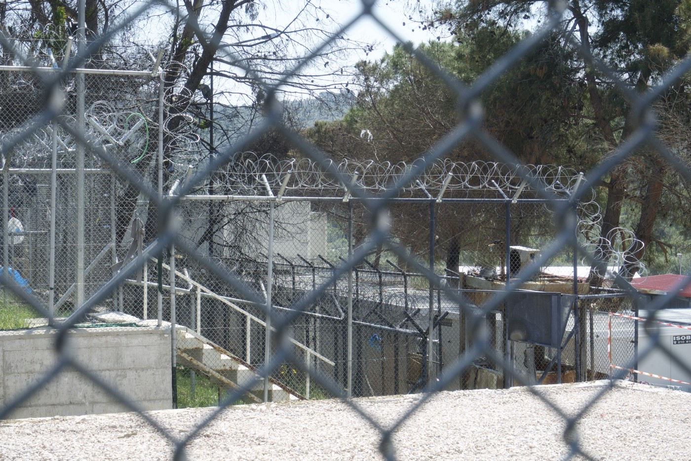
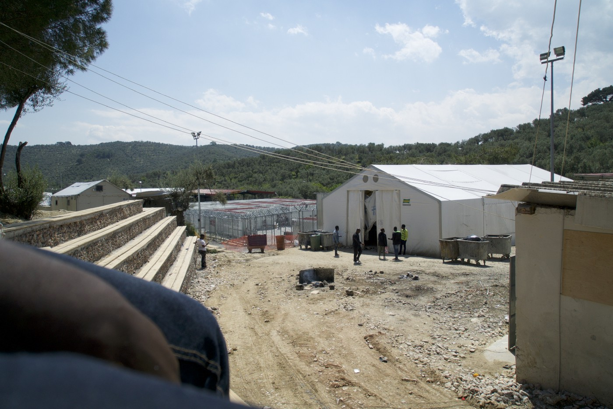
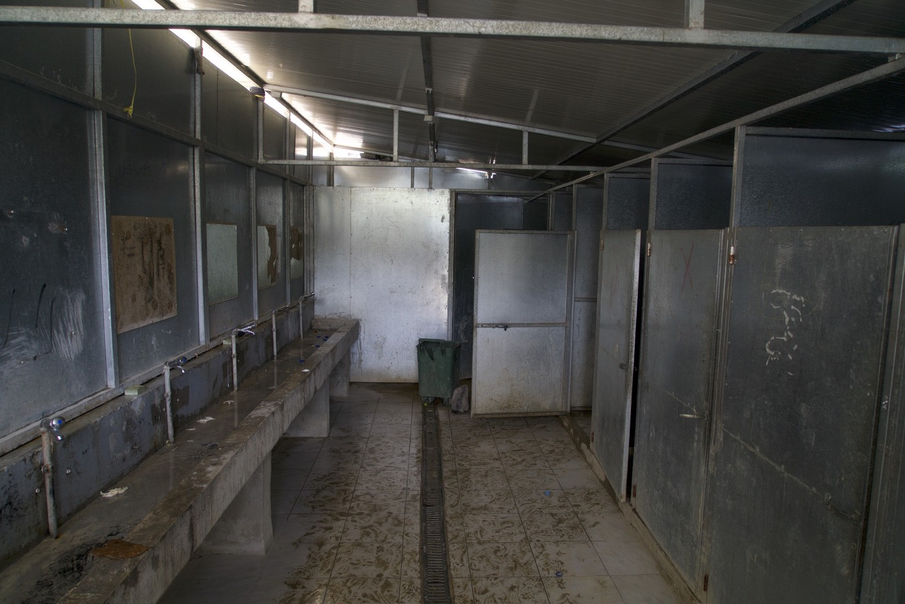
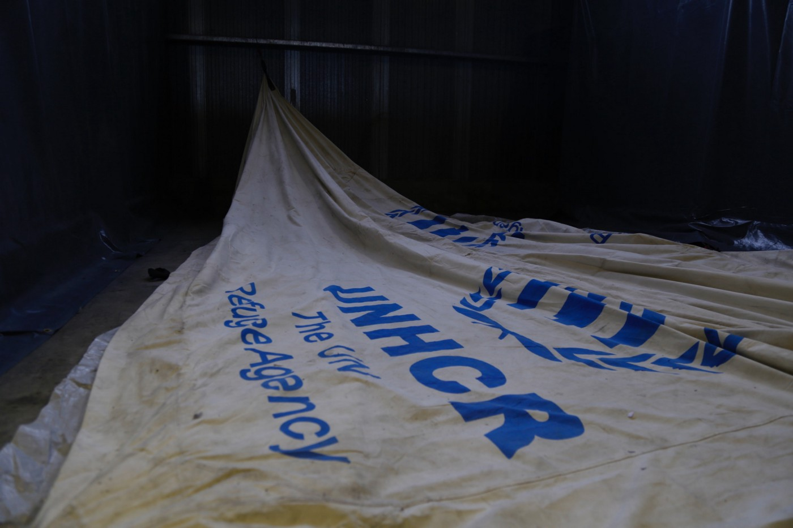

### AYS SPECIAL: For some people Lesvos is all they will ever know of Europe\.

_Painting a picture of the situation on Lesvos through a recount of conversations I had with strangers, friends and acquaintances in my last four months spent there\._

Moria\. A tiny basketball court in the minor’s detention facility — blocked off by a double barbed wire fences\. The minors are not permitted to leave this premises\. PHOTO CREDIT: Loys Haemmerle

I looked at Sunni’s face, his right eye is totally blind\. His skin disfigured from, I don’t know what exactly, I never asked him, but I guess either acid or fire\. I met him at our first clothing distribution we did by the port of Mytilini\. At this time there were close to 200 refugees living there inside a military ship\. They preferred staying here to Moria Hotspot, Greece’s most notorious asylum detention centre\.

**Nobody likes Moria** \. The first conversation I had with a refugee stuck on Lesvos went something like this “ _Moria big problem, big problem girl, Moria is a prison”_ … I didn’t’ say anything\. I had nothing to add\. He was right\. Before the refugee crisis Moria was prison\.
#### Straggler of Europe

The hotspot is an eerie place\. High double wired fences\. Everything is fenced off\. The colour scheme is metallic\. Everything inside is grey\. But not just any sort of grey, it’s a sad grey\. An exasperated, fading grey that only accentuates the hopelessness of those stuck there\. It gives it substance\. **For most Moria is the end of the road\.** For most, Lesvos is all they will ever know of Europe\. Those currently on Lesvos and the other Greek Islands are stragglers\. A forgotten chapter of the migration story that the media is no longer interested in\. Once a gateway to Europe, and now a black hole for thousands stuck with diminishing hope and no solutions\.

The 4 or 5\-metre\-tall double wire fences consume you when you walk inside the camp\.

Every part is sectioned off and guarded by military and police personnel\. Even the people are sectioned off\. Segregated by nationalities\. “ _you know they took down the fences when Angelina Jolie came to visit?”_ A long\-term volunteer informed me when I arrived\.

Organisations also refer to the sections based on which nationalities occupy them\. For an unassuming passer by, you wouldn’t pay too much attention to it, but the segregation is unknowingly harmful for those living in Moria\. It’s harmful because it makes it easier for the authorities to fulfil their directives, for them segregation is used as a tool\. It’s easy when you know where the sub\-groups of people you have been told to arrest live\. **Nearly all the Algerians I met in January are now in prison in Moria, have been deported to Turkey or have returned back to Algeria** through voluntary deportations\. It’s easy to do this when the people are segregated based on nationality\.

The failure of the EU\-Turkey deal is psychologically damaging to many, even the most optimistic\. Photo Credit: Loys Haemmerle\.

On one of my first days on Lesvos I met a really nice Greek owner of one of the small cafeterias outside the camp\. With his small pay check I found out that he houses a Syrian refugee\. Without huge grants to spend, I found out that he was on Lesvos helping those who made it across the sea from Turkey on small dinghy boats before any big international organisation arrived to the island’s shores\. I considered him to be a better human than most… that’s why I was taken aback when he began to warn me about Algerians “ _I feel very bad for the Syrian’s, but the Algerian’s are a real problem for us on Lesvos, be careful, they break into people’s houses and steal lots of things\._ ” It took some internal rhetoric but I decided that this statement didn’t make him a bad person\. It just showed that even good people are prone to prejudice , even they group people into senseless subgroups that don’t make any sense\. Not all Algerians are a problem\. Not all Algerian steal things\. I dismissed his warning\. One of the best friends I made on Lesvos was Algerian\.
#### No winners on islands

Abdo is a light hearted, creative and kind young man who I am eternally grateful to have met\. He hoped to one\-day reach France\. He spent nearly a month working tirelessly with our team and helping us with translation, construction and welding railings for a permanent clothing store we established together in Moria\. He developed a close friendship with all of us, and we miss him dearly\. His help was of critical value and we could not have done it without him\. **He was arrested 3 weeks ago by police who raided a squat he was living in\.** I visited Abdo in prison a few times since then _“hello miss, are you a lawyer, I need to speak to a lawyer, please miss I need a lawyer,”_ Was the only thing I heard from other inmates\. They are not provided with any legal assistance as many legal organisations are not permitted access to Moria camp by the Ministry\.

The head of a big organization working in Moria told me once during a conversation: _“You know Greek people are in no way bad… look at him, he is from Algeria… no Greek person in their right mind would intentionally want any harm to come to him, look how sweet he is… but it’s just too much for them\. They can’t handle it anymore\. They have had enough\.”_ I agreed, I have had this conversation with many people before him and have reached similar conclusions\. But there needs to be a distinction made in one aspect of his opinion… Greece may be carrying the brunt of Europe’s ‘refugee crisis’… but the Greek Islands are carrying the brunt of the crisis in Greece\. The locals on Lesvos feel like they are being attacked from all sides, even from Greece itself\. There appears to be no winners on the Greek ‘transit’ islands\. Their situation is also ignored by the media\.

The shower facility in Moria Camp PHOTO CREDIT: Loys Haemmerle

Sunni is from Pakistan and he speaks English well\. He is a funny guy\. I was registering the people living inside the ship on my laptop\. Once registered we give them a ticket which permits their entry to our mobile clothing shop in our truck\. At one point while doing this I lit up a cigarette\.

_“YOU SMOKE?\!” burst out Sunni\._

_“Sometimes,” I replied\._

_“What\! \!?? I have been wanting to smoke a cigarette for the last ten minutes but you have a big NO SMOKING sign on your laptop… I thought I better not do that\! This girl must really hate smokers or something\!”_

I laughed and gave Sunni a cigarette\. We became immediate friends\.

I saw him again a few weeks later in Moria\. By this point all the people living in the ship were returned to the Hotspot\. _“Mon, hello\! Let me buy you a coffee\!”_

I was happy to see him\. _“I am illegal here you know? My papers expired now but if I try to renew them I will be sent back to Turkey\. So I’m in hiding now,”_ he told me cheekily\. _“Let me show you my bedroom, I made it last week, it’s perfect, the police will never find me there\. You can’t tell anyone where it is\!”_ I walked with him a hundred meters or so to the back of one of those big UNHCR tents\. He lifted a piece of tarp and wedged between a small thick tree and a brick wall was a 2mx1m space that housed a tiny mattress\-less bed covered in more grey UNHCR blankets, with a small bag that contained all his possessions and a solar lamp\. _“Its good isn’t it?”_ He asked\. It wasn’t\. No insulation from the cold and dangerously positioned, but at least out of police vision\.

Over the winter seven people died in Moria\. The predicted cause of death — choking from using gas heaters within a closed space\. They died from trying to warm up the inside of their uninsulated summer tents\. The same uninsulated summer tents that were so “generously” supplied to them upon their arrival to Europe\. The same uninsulated summer tents they had no choice but to sleep in during the winter\. The same uninsulated summer tents that collapsed due to weight of the snowfall\. The same uninsulated summer tents that brought seven refugees an untimely death\. One of those seven deceased lived in the same uninsulated summer tent as Sunni before Sunni moved to the Port\.

We talked some more about the asylum procedure\. _“You know you can see my eye, it’s completely destroyed\. Pakistan is not safe for me\. At my interview they didn’t even ask me about it\. Look at it, everyone can see it\! They didn’t even ask me what happened to my eye\.”_

I couldn’t understand it, how was it possible that this topic did not come up in an asylum interview? But I understand now\. The asylum procedure on the islands is completely different to the one on mainland Greece where I normally work\. A lawyer explained it to me only recently _“The problem with the islands is that everyone who entered irregularly has an ‘admissibility interview’ in which they determine if that person is vulnerable\. If they are not considered vulnerable he or she is \(supposed to be\) returned to Turkey\. They do not examine asylum cases in this interview\.”_

A disassembled UNHCR uninsulated summer tent PHOTO CREDIT: Daniel Billinghurst
#### Who will listen to me?

The disillusioning stories of this loophole in practise are endless\. Endless rejections and appeals and rejections\. A young man from Syria that I met in his early twenties told me his version of it\. _“I came here with my mum six months ago, my mum in Switzerland now, they didn’t let me go with her\. I was rejected on my first interview… Turkey is safe for me they said\. I am Kurdish and from Syria, this is impossible\! I have my second interview in two days, then who knows, I’ll probably be in prison soon\. Turkey is not safe for me, but who will listen to me?” He paused\. …”Nobody\.”_

_“Actually there’s one thing I could do that might work… but I don’t know if I want to try it\.”_

_“And what is that?”_ I asked\.

He motioned with hands to his wrists\. He didn’t want to say it aloud… but I understood him… A suicide attempt\. There have been increased reports of suicide attempts on the Greek Islands, especially by those who are pursued by the police\. Another young Syrian male in his early twenties who was volunteering with an organisation that offered free legal aid when I met him had a different story to tell _“I’m lucky,”_ He began\. _“I got really badly beaten by smugglers on my journey to Lesvos, I was totally unconscious when I arrived\. When I woke up I couldn’t even walk\. I didn’t know it then but that was really a blessing, I was immediately listed as vulnerable… because of that I think I will get to the mainland\.”_

The situation changed during the intermittent periods I worked on Lesvos\. Winter’s hold eased and Moria dropped from housing close to 5000 men, women and children — to under 2000 men and only very few women\. The only improvements I saw in the camp during this time were renovations to the prison facility\. Moria prison was in the process of expansion and arrests and deportations intensified in frequency\. Especially by those living in self managed squats around the island\. _“Moria is not safe, police wake you up at 5am asking for papers, if you don’t have any they arrest you, that’s why we live here, it’s safer here\.”_ Thinking about it now, I heard more police brutality reports in my time working on Lesvos than I can even remember\. But the squats are not safe anymore either\. Arrests are consistently made there now\. If you don’t have papers or if your papers are expired, you are at great risk\.

**A common fear for many is that Moria will once again become a closed detention facility as it was when borders closed in March 2016\.** Contracts of NGOs working in the camp such as _Medecins De Monde,_ which provides medical care and hygiene items, have been foretold to end soon\. And it appears that mass deportations are likely to follow too abiding to the EU\-Turkey agreement, only for most, over a year too late\.

What strikes me about this whole situation is the genuine fear I feel in people when reminded of the possibility of deportation to Turkey\. It is a tense topic to discuss\. The long wait and false hope that this damaging deal has fuelled for those that will be deported now is debilitating\. And their fear of deportation to Turkey is not unwarranted\. _“They go off the radar, we totally lose track of those that are deported\. We have no idea what happens to them,”_ a long term volunteer explained to me during a conversation we shared\.

Despite this, the atmosphere in Moria is calmer than it was in the winter months\. Calmer, but heavier\. _“How is the mood in the camp?”_ I asked a volunteer from an organisation we worked in collaboration with upon my latest return\. _“It’s much quieter,”_ she began to explain\. _“But I don’t know it’s hard to put into words…there is less commotion, it is less turbulent, less fights, but in a way it is worse now\. The people are losing all hope\. Since they removed the women and children from the camp, it is as if they removed all remnants of joy and of life\. There is no life in Moria anymore\. The men are tired, there is nothing left here to give them hope, to remind them of what they were hoping to find in Europe\.”_

The patterns she explained are exactly what I saw in the friends I had made in my time on Lesvos\. At the same distribution on the port where I met Sunni I also met a bright, young man called Joseph from the Democratic Republic of Congo who helped us with French translation\. He spoke five languages and was an endowed writer and talked to me about recent projects he had been working on and his ambition to write a book and, some day, to study in Europe\. _“I came to Europe for many reasons, but I am most excited for the culture and education that exists here\. I want to learn more than I want to do anything else\. In Congo we do not have the possibilities you have in Europe\.”_

Joseph was always in an upbeat mood\. Whenever I walked with him in the camp, there was always a wave of greetings, handshakes and smiles that followed him everywhere he went\. He returned each and every one of them with warmth\. He didn’t have the time to lament his situation, he was a grounded rock that people relied on to lift their own spirits, and he did that for them\. Until the day came when his mood also changed… He too began to be swallowed up by the sad, metallic grey barbed wire fences of hopelessness that surrounded him\. The last time I saw him there was no more trace of the optimistic, positive person I had met at the port who made fun of me for misplacing all of my possessions\. _“How is the writing going Francis?”_ I asked him\. _“Not good\. I don’t write anymore… I am not in a very good way, I can no longer find any inspiration to write\.”_

**The situation on Lesvos is becoming more and more grey and the fences around Moria seem to be getting bigger and bigger\.** The people are starting to feel increasingly helpless regarding their future and more and more desperate to be heard\. This week twelve Syrian Kurds whose cases were rejected on admissibility grounds went on Hunger Strike\. _“Some of us have been here for over a year, some of us have been rejected, and after appealing…rejected again\. We don’t know what to do anymore\. We are told we could be sent back to Turkey but we are Kurdish, from Syria\. It is impossible and unsafe to be returned\. We won’t stop this hunger strike until we get our rights\.”_

A friend sent me a video of the situation with a voiceover:

> “The people are still waiting, nobody is here to attend to them, no food no water\. Nobody is here to talk to them, nobody is here to help them…\. The authorities are just passing by, the police are just passing, everyone is just passing by and nobody is here to tell them anything about their problem\. They slept in the rain, there was rain last night\. They slept all day\. It is getting worse\. They need help… they need doctors to help them\. The police are coming now… I have to cut this video\. Bye\.” 

I watched the video a few times\.

_“Everyone is just passing by…”_

Watching good people and good friends swallowed up by a corrupt and unlawful system which functions to separate them, to break down their spirit and make their voices unheard is something I will never really come to terms with\. I can see how the situation on the Greek islands is destroying peoples’ will to live\. I’ve seen it in a lot of situations and none of them are isolated events\.

And I fear that it is only about to get worse as desperation, tension and hopelessness continue to grow\. Keeping people in conditions such as Moria for over a year without any answers, without any information, without any reassurance regarding their situation and with the looming fear of deportation based on ‘admissibility grounds’\- is a breach of very basic human rights\. We should not condone it\.

The world has forgotten about the once hot media star gateway to Europe, but the harrowing situation on the islands remains\. We must not be surprised by the outcomes if these unresolved tensions are not addressed\.

_\(By Manja Petrovska, independent volunteer in Greece\)_

_Converted [Medium Post](https://medium.com/are-you-syrious/ays-special-for-some-people-lesvos-is-all-they-will-ever-know-of-europe-186c96f8ffd1) by [ZMediumToMarkdown](https://github.com/ZhgChgLi/ZMediumToMarkdown)._
