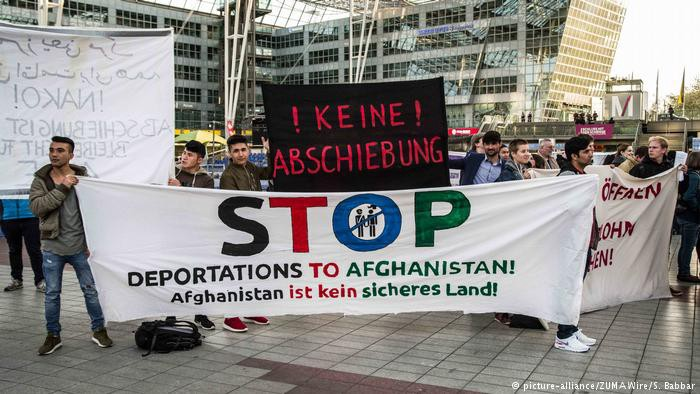

### AYS DAILY NEWS DIGEST 25\.04\.2017 Majority of Afghan asylum seekers have their applications rejected
#### Merkel panders to far\-right, targets Afghan refugees // Another hospital was bombed in Syria // Bodies from yesterday’s deadly boat crash have been recovered // Hundreds live in the forests outside of Dunkirk // Report sternly criticizes hotspot system

Yesterday’s demonstration outside of Munich airport
#### Feature

Shocking new numbers reveal that Germany has become far less hospitable towards refugees from Afghanistan\. In January and February of 2017, only 47\.9% of refugees from the country had their application accepted\. This is a stark drop in acceptance rates, as in 2015 77\.6% of asylum seekers had their applications accepted\. By 2016 the number had dropped to only 60%\. These latest figures reveal a deeply upsetting downward trend towards\. The move comes at a time when German Prime Minister Angela Merkel is seeking reelection, and as a sizable minority of the population is deeply opposed to Germany’s granting of asylum, now is the time to appear tough for the incumbent\. Angela Merkel hopes that by doing this she will prevent the rise of the far\-right AfD \(Alternative für Deutschland\) party, but the move only serves the interests of the violently xenophobic element\.

Merkel’s pandering has taken many forms, from support to a “burqa ban” \(even as women wearing the burqa in Germany is practically unheard of\), to the increased enforcement of deportations for those whose asylum applications have been rejected\. Although such a move is calculated to weaken the hand of the far\-right, they only entrench the politics of the far\-right deeper into the German political arena\. Taking a “tougher stance” against refugees in need will not weaken the AfD, they will only take the position of what is little more than a fringe party and push it into the mainstream\. This is, in a word, the AfD\-ization of German politics, and continuing to follow their lead will guide Germany towards the dark abyss of reactionary politics\.

Because of the German official position that Afghanistan is a “safe country” the Afghans make a convenient target for Merkel to express her “tough” stances\. The fact that a very large portion of the country is embroiled in a state of war, and that the job and educational opportunities are extremely lacking, makes little difference\. But the German government shows no regard for this, as yesterday around 50 refugees from Afghanistan were forcibly repatriated to their homeland after failing to secure asylum\. Local activists protested outside of the Munich airport from which they were flown out to Kabul, but to no avail\.
#### Yemen
### MSF calls for increased funding for operation in Yemen

As the Yemeni healthcare system is teetering as a result of the barbaric assault of Saudi Arabia and its allies against alleged Iranian proxies, the people who feel greatest threat are, as always, ordinary people\. The situation in Yemen is indeed dire, as millions continue to be on the verge of starvation in the country as a result of the reckless destruction of transportation infrastructure and ports needed to bring in food\. Little if any action is taken by western governments, as the uncomfortable truth is that not only are these governments deeply supportive of the Saudi government, others like the US and the UK are taking a direct part in abetting the Saudi war machine by providing logistics\.

In the midst of this, the Yemeni people naturally are in great need of medical help which is very difficult to come by\. MSF is one of the groups that has done the most over the course of this two\-year\-long crisis\. According to a [statement released today](http://www.doctorswithoutborders.org/article/msf-statement-humanitarian-crisis-yemen?utm_medium=social&utm_source=twitter&utm_campaign=social) , the organization has treated 60,800 trauma patients\. But they do not have enough money to provide people much\-needed aid in a country where medical supplies are difficult to access\. To add to the difficulty, several MSF facilities have been targeted in attacks\. A donation to MSF will inevitably save lives, and all who are in a position to help should do so\.
#### Syria
### Idlib hospital bombed in airstrikes

A hospital in the town of Kafr Takharem in Idlib was bombed last night in two airstrikes\. This sort of deplorable action is far from new, as the Syrian regime and its Russian allies have long been targeting hospitals\. The video below is shot by a witness, who shows the destruction that has leveled the hospital\.

#### Greece
### Two hospitalized from Moria hunger strike

Two people were taken to the hospital last night after getting sick from the hunger strike currently taking place in Moria owing to the poor living conditions and unacceptable wait times to be transferred to the mainland\. After being discharged, the two have continued their strike\. This is the fifth day of the hunger strike, and there are a total of 12 participants\. Please see [our special report](ays-special-for-some-people-lesvos-is-all-they-will-ever-know-of-europe-186c96f8ffd1) on the situation for more information\.
### Bodies from yesterday’s shipwreck have been found, 7 still missing

### Amnesty urges the shutting down of Elliniko Camps in Athens

Amnesty reports that the conditions in the camps servicing over 1000 people are so dreadful that they warrant an immediate shutdown of the camp and the relocation of its residents to other residences\. Women and girls in the camp find themselves incredibly unsafe and liable to assault\. Please follow Amnesty’s instructions to affect the status of the camps [here](http://www.amnestyusa.org/get-involved/take-action-now/urgent-action-refugees-at-great-risk-due-to-unsafe-camps-greece-ua-9317) \.
### MSF opens health services in Athens

Starting Monday April 24th 2017, Doctors Without Borders is offering services of Primary Health Care and Mental Health at Ferron 22, 10434, Athens \(near Victoria square\) \.
### Numbers

38 refugees, among them 20 children, have arrived on Chios at 3 in the morning\.

16 arrived on Leros in the morning and were detained by the port police\.
### Khora reaches record numbers of refugees fed, requests donations

### Refugee radio station created

#### Serbia
### BelgrAid issues urgent call for volunteers

> _Are you currently in Belgrade, or considering coming here in the near future? Do you enjoy working as part of a team? Do you enjoy seeing the benefits of long\-standing, sustainable projects? THEN WE NEED YOU\! We have several really crucial volunteer positions that need filling as early as THIS THURSDAY\! If you can commit to 2\+ weeks, we are looking for team\-leaders who can take responsibility for a small team and project \(full hand over will be provided\! \) Please contact \+381616468891 if you are interested in finding out more \(WHATSAPP ONLY\! \)_ 

> _We are also searching for DRIVERS with a licence to TOW a TRAILER to join the team over at BelgrAid\! This is a central role in their food distribution\. Please contact volunteer@belgraid\.org if you have the necessary skills\!_ 

### Refugee Aid Serbia to hold training session for volunteers

Join Refugee Aid Serbia this Friday, April 28 to learn more about becoming an effective and helpful volunteer\. The session will cover such topics as humanitarian aid theory, legal issues in Serbia and the European Union, distribution, safety and security, and personal well\-being\. The training will begin at 10:30am\. Spaces are limited and all who wish to attend should sign up beforehand at the following [link](http://doodle.com/poll/puckrdaqnu328za5) \.
### Numbers

In the last week, 117 new arrivals that were met and assisted by UNHCR and partners during the week\. Of them, ten were unaccompanied and separated refugee children \(UASC\), boys from Afghanistan, Pakistan and Libya\. All were referred by UNHCR and partners to Centres for Social Work\.

149 intentions to seek asylum in Serbia were registered in the reporting period, which makes a total of 419 during April and 1,803 since the beginning of the year \(compared to 2,484 during the same period in 2016\) \. Since the beginning of the year, the Asylum Office has not yet made any positive decisions on granting refugee status or subsidiary protection

**West Serbia**

Transit Centres \(TCs\) in the West sheltered 1,625 refugees and migrants: 863 in Adasevci, 495 in Sid and 267 in Principovac\. Their residents are mainly from Afghanistan, followed by Pakistan, Iraq, Syria and Iran\. In addition some 50 men and boys were sleeping rough in and around Sid area\.

As authorities continue to reduce occupancy of Sid TC, 2,500 local citizens petitioned to close it\. On 19 April, authorities apprehended 21 unregistered migrant/refuge men in Sid\. Misdemeanour courts referred most back to the police for asylum registration as they could demonstrate that prior requests to register for asylum had not been entertained by authorities\.

72 asylum\-seekers reported to have been collectively expelled from Croatia, without being granted access to asylum procedures there, having entered Croatia irregularly from Serbia\.

**North Serbia**

41 asylum seekers, mainly families but also single men, were admitted by Hungary\. Only six were camping outside Horgos \(5\) and Kelebija \(1\) “transit zones”\.

Subotica TC sheltered 132, Sombor TC 167 and Kikinda TC 151 asylum\-seekers, all families from Afghanistan, Iraq and Syria, awaiting entrance into Hungary\.

**Belgrade**

Over 3,000 refugees and migrants were counted in Belgrade\. Krnjaca AC accommodated 906 asylum\- seekers, mainly families from Afghanistan, Iraq or Syria\. 1,071 male refugees and migrants \(including 339 unaccompanied/separated boys\) were sheltered in Obrenovac\. Most were from Afghanistan, followed by Pakistan and very few from Iraq, Syria, and other countries\.

Some 1,000, mostly Afghan and Pakistani men and boys, appear to sleep rough in the city centre\.
### Psychologist needed in Belgrade\!

Jesuit Refugee Service is looking for a psychologist who can come work with them in Belgrade\. Details about the position may be found [here](https://poslovi.infostud.com/posao/Psychologist/Jesuit-Refugee-Service-JRS/167998?dist&last_search_time&page=0&submit=1&q=Psychologist&city%5B0%5D=35&vreme_postavljanja&rok_konkursa&firma_uid&education&vrste_kategorija_posla&jezik&item_index=1) \.
#### Switzerland
### Arabic language guide details how to go about preparing for second asylum interview

AsyLex has released a helpful guide in Arabic explaining how asylum applicants can prepare for their interviews\. The guide may be found in full [here](https://www.dropbox.com/s/2csz76a6n21gcw4/Swiss%20asylum%20procedure%20%28Arabic%29.pdf?dl=0) \.
#### Germany
### German crime statistics for 2016 show an increase in violent crime

The German Interior Minister commented yesterday on statistics showing an increase in violent crime in Germany\. The statistics show that there has been a 6\.7% increase in violent crime over the previous year, from 181,386 cases to 193,542 cases in 2016\. The overall number of crimes shows a slight increase of 0\.7% over 2015\. De Maziere was careful not to blame the influx of refugees for the problem\.

A great many of the crimes committed by refugees are done against other refugees, and part of the problem can be attributed to the stressful conditions associated with the mass shelters that are found across Germany\. According to the Interior Minister of Saxony, in the state 40% of crimes committed by refugees are the result of the 1% who were known to be repeat offenders\.

It is important that we do not allow these crimes to serve the xenophobic far\-right’s narrative\. Indeed, a rise in a country’s population will inevitably prefigure a rise in the number of crimes\. Refugees must not be romanticized, they are just like the rest of us people, and as such there will always be shady figures found in their midst\. The same could be said about any other group of people, and yet the far\-right spews its vitriol against the people who are, as a group, the most vulnerable in Europe\.
#### France

### Following fire and subsequent closing of the Dunkirk camp, hundreds of refugees must live in the woods

Around 200 mostly Kurdish refugees are now forced to live in the woods without basic amenities such as tents or running water, according to [a new report](https://www.facebook.com/groups/CalaisMigrantSolidarityActionFromUK/permalink/1465044860236923/) by volunteers from One Human Race and Donate4Refugees\. Care4Calais stops by once per day to bring them a hot meal, but aside from this they are left almost entirely unaided\. In addition to their difficult lifestyle, the refugees must also stomach regular harassment by the CRS special police\. Volunteers are urged to not head out there at this moment, as they too may very well become targeted by the police\.
### Report details the results of the closing of the “Jungle” camp in Calais on children

Six months after the shutting of the “Jungle” camp, there are still many questions left to be answered\. Namely, what became of the child refugees who were not lucky enough to secure asylum in the UK? [A new report](http://refugeerights.org.uk/wp-content/uploads/2017/04/RRDP_SixMonthsOn.pdf) by the Refugee Rights Data Project seeks to shed light on what became of the people following their eviction\. The report finds that hundreds of people are now sleeping rough around Calais while the British and French governments eschew responsibility for their lives\. A shocking 96\.5% of child refugees report being the targets of violence at the hands of police, from tear gas to verbal abuse and even physical abuse\. The report is well worth reading for those who are interested in learning more about the state of refugees in France\.
### Dunkirk Legal Services Team needs your help\!

The organization is looking for a place for its volunteers to stay from April 28, a car, and donations\. Their appeal for help may be found below\. Donations will be used to fund the operational costs that come as a result of the organization’s very important work, providing legal help for refugees who otherwise do not have access to lawyers\.

### Hygiene products needed in Paris\!

Shampoo, shower gel, laundry soap, deodorant, razors, shaving foam, sanitary towels, nappies are all needed for volunteer efforts\. The collection effort is taking place in St\. Bernard’s Chapel\. For more information, please contact Pedro Pablo Naranjo at 0603028372\.
#### Algeria
### Algeria expels group of 55 Syrian refugees, Morocco refuses to take them in

55 Syrian refugees have found themselves stranded in a no man’s land after they were kicked out of Algeria\. The refugees are currently in the desert town of Figuig\. Morocco has condemned Algeria’s “cruel behavior” but refuses to allow the refugees to enter its territory\. The refugees have been living in the oasis town for a week awaiting a resolution to their legal limbo\.
#### EU
### Malta proposes a plan to resolve reluctance of countries to accept refugees

Malta has proposed today that EU governments should be paid 60,000 euros for each refugee accepted above the current quota, and that the same amount be charged to those countries that do not meet the quota\. The ambitious plan hopes to greatly speed up the pace of transfer programs from Italy and Greece, which were supposed to relocate 160,000 over the course of two years but have only successfully resulted in 17,000 transfers\. The proposal will be discussed by EU representatives on Wednesday\.
### Report highlights the problems of the hotspots of Italy and Greece

In a [report released today](http://www.eca.europa.eu/Lists/ECADocuments/SR17_6/SR_MIGRATION_HOTSPOTS_EN.pdf) , it has once again been found that the hotspot systems of Greece and Italy are greatly overloaded and continue to face serious problems\. The authors found that, “there are still more migrants arriving at the hot spots than leaving, and they are seriously overcrowded\.” Although the hotspots proved instrumental during the high point of refugee migration in 2015, the system is deeply flawed and undermanned, according to the report\. Although the hotspots are supposed to process approximately 8,000 people within the course of a few days, they are regularly dealing with twice that number\. The report recommends that an additional two hotspots be opened in Italy and that the conditions in Greece be improved\.

_Converted [Medium Post](https://areyousyrious.medium.com/ays-daily-news-digest-25-04-2017-1971890c9ebd) by [ZMediumToMarkdown](https://github.com/ZhgChgLi/ZMediumToMarkdown)._
