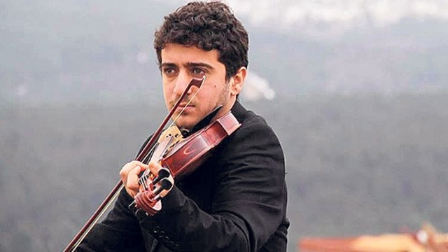

### AYS DAILY DIGEST 29\.4\.2017: The European Union members states responsibility

_Numbers, the only thing that matters for the EU // Update on evictions and arrests in Lesvos // The “Hub Sammartini” in Milan to transformed into the immigration center // Help needed in Serbia and Greece_

 r](assets/a8abe4ee54cf/1*21AIUoya6tPHnmbJ6ce83g.jpeg)

A very big queue waiting for food at ‘No Name’ kitchen\. Photo by [Abdul Sabou](https://www.facebook.com/profile.php?id=100007864985647&fref=search) r
### FEATURE
#### EU must provide safe routes\!

This week, on the night of 23rd, 16 people lost their lives when the boat, carrying refugees, drowned in the Aegean between Sirvice Burnu, Turkey, and Lesvos, Greece\. Among those who lost their lives was a young Turkish violinist **Barış Yazgı** , \(22\) \. He dreamed about going to Belgium to study music\. His body was found hugging a violin box, with his instrument and handwritten compositions\.

“ _As numbers are the only thing that matters for Europe, how many people must die in order for Europe to react responsibly?”_ asks [the Greek Forum for Refugees in their press statement](http://refugees.gr/aegean-sea-continues-graveyard-refugees-urgent-need-legal-safe-pathways/) reacting the the latest incident\. The Forum is urging the European Union, as many times before, to provide safe routes for all those who are coming to Europe, looking for safety and peace\.

_“Despite the continuous denunciations, no alternatives have been found by the International Community to end the root causes that turn human beings into refugees\. People would not endanger themselves by crossing the sea on inappropriate boats if they had options to live peacefully in their country of origin\. If nothing changes, the European Union will continue being accountable for the innumerable losses at its sea borders\.”_

The statement concludes that there are solutions, but _“no strong political will to implement them\.”_

Young Barış Yazgı saved for months to pay smugglers to take him on a dangerous trip\. Like many others are doing every day\. The EU Member States are primarily responsible for the border control and asylum processing\.

Barış Yazgı
### Greece

We learned that the two Yemeni swimmers who crossed from Turkey to Greece a couple of days ago, are in good spirits and well\-rested after spending over 10 hours in the water\. No reports about new arrivals today\.
#### Update on eviction on Lesvos

The [No Border Kitchen Lesvos published](https://www.facebook.com/NBKLesvos/posts/924014941071629?hc_location=ufi) that the people who were arrested yesterday in the Old Squat raid, were not informed by the police whether they will be charged or not\. At the moment, it looks like they will ago to the court in approximately 5 months for vandalism and trespassing\. So far, everybody was released from prison\.

The NBKL issued [a statement condemning evictions and deportations](https://noborderkitchenlesvos.noblogs.org/post/2017/04/29/no-yoga-in-the-police-station-evicton-of-old-squat-april-28th-2017/) of people who need protection\.

_“This eviction didn’t come as a surprise\. In the last four months the repression on refugees, especially people without valid papers and from certain nationalities, as well as solidarity movements has become worse each week\. The destruction of any autonomous spaces for people to live was expected\. Many friends we support living out of the camps have been checked and arrested in the last months\. There have been many steps taken in order to clear the streets and the city of refugees and keep as many people as possible within the confines of Moria camp\. They were tightening security at Moria, police presence on streets became stronger, many people are and were detained during their asylum procedure, deportations happen on a regular basis and so on\.”_

](assets/a8abe4ee54cf/1*Pjnt6iMxCvZ7ilg33L1rXg.jpeg)

Inside Section B, Moria prison\. “IOM cames every morning asking us to sign up for voluntarily deportations\.” Photo by [Voiceless on Lesbos?](https://medium.com/u/652776407e1b)

Criticism of living conditions and treatment of people in need on Lesvos came today from [the European Court of Audits in their latest report on hot spots](http://www.eca.europa.eu/Lists/ECADocuments/SR17_6/SR_MIGRATION_HOTSPOTS_EN.pdf) in Greece and Italy\. The report confirms that the situation continues to deteriorate by the day\. The [ECRE reacted concluding](http://www.ecre.org/conditions-in-hotspots-is-chilling/) that the whole Common European Asylum Systems “needs to be reformed”\.

_“Collectively, Europe can cope with the movements of people from other regions seeking protection here — indeed we would benefit\. Warehousing people in the hotspots or in countries surrounding Europe is not a solution and can only lead to increasing despair, self\-harm, health problems, and even suicide, ”_ said Catherine Woollard, Secretary General of the European Council on Refugees and Exiles, in her statement\.
### HELP NEEDED

A [Drop in the Ocean](https://www.drapenihavet.no/en/home/) needs more volunteers on Chios, as soon as possible\!

> “If you are over 25y and can stay for min 10 full days please register at their website [www\.drapenihavet\.no](http://www.drapenihavet.no) or send an email to [jeanette@drapenihavet\.no](mailto:jeanette@drapenihavet.no) ” 

[The Get Shit Done Team](https://www.facebook.com/The-Get-Shit-Done-Team-304001796641127/) needs volunteers, too\.

_“Do you have some spare time and can support yourself to join us to Get some Shit Done? We need help\. Summer is upon us and the temperatures are rising\. Shade needs to be built, schools need erecting, showers need building just to name a few\. No particular skills required, just a good vibe and energy to join in and Get Shit Done\.”_

[ERCI — Emergency Response Centre International](http://ercintl.org/volunteer/") needs a volunteer teacher, with experience in the classroom teaching English for the month of May\.

> “You must have a good understanding of how children learn well, you will be teaching 12–17\-year\-olds, and a background check is required prior to your arrival\. We will provide accommodation in Thessaloniki, Greece\.” 

### Italy
#### Shelter in Milan to be turned into asylum center

The “Hub Sammartini” registration in Milan will be transformed into a normal CAS immigration center \(Centro Di Accoglienza Straordinaria\), and will be accessible only for asylum seekers\. The consequence is that many people, who are on their journey, and who used to rely on this place for rest, will be left on the streets\.

The people who are already inside are allowed to stay but only if they apply for asylum within next 7 days\. No alternative is being given for the newcomers, for now\. Nevertheless, local media are announcing that in the next months, the number of SPRAR places \(secondary accommodations for people whose asylum process has already started\) will increase from 400 to 1000\.
### Serbia
#### Cooperation with EU on returns to Afghanistan and Pakistan possible

[Speaking for the local media, Minister of labor and social issues of Serbia, Aleksandar Vulin](https://www.srbijadanas.com/vesti/info/vulin-migranti-ne-zele-da-ostanu-u-srbiju-2017-04-29) , said that he recently met with Austrian internal affairs minister\. The two official spoke about the possibility for voluntarily return for people who came from Afghanistan and Pakistan\. According to Vulin, Serbia could become part of the EU plan to return people to this two country they consider to be safe, despite all the proves coming from the field saying contrary\.

However, Vulin told the media that only those who ask to be returned will be sent back, adding that also people who do not have asylum will have to go back\. _“We will be humane, but we have to take care of our laws and our population,”_ Vulin concluded\.
#### Help is needed for [BelgrAid](https://www.facebook.com/belgraid/)

_“We need your support\! Our team is working tirelessly on the front lines to provide for some of Europes most vulnerable people and they need your help\. Catering for 2000 people is no small task and comes with a lot of unseen costs\. Please donate\. Even a gift of as little as €/£5 can go a long way toward helping us to provide this much\-needed service\. None of this what we do would be possible without the kindness and generosity of our supporters\. Together we can make a difference\.”_
### EU

According to [the latest Eurostat data](http://ec.europa.eu/eurostat/documents/2995521/8001715/3-26042017-AP-EN.pdf/05e315db-1fe3-49d1-94ff-06f7e995580e) , our of the 406,000 Syrian refugees given protection in Europe last year, almost 300,000 are in Germany\.

Germany also offered asylum or subsidiary protection to three\-quarters of the 66,000 Iraqis who were offered protection during this time in the EU, and to around 60 percent of all Afghans\.

The second country that took in the big number of refugees from Syria is Sweden where 44,905 people are offered protection\. Additionally, last year 69,350 positive decisions on applications for protection were made in this country\.

The nationality most likely to be granted asylum in the EU last year were Syrians, who accounted for 57 percent\. Afghans accounted for nine percent, as did Iraqis\.

> **_We strive to echo the correct news from the ground, through collaboration and fairness, so let us know if something you read here is not right\. Anything you want to share — contact us on Facebook or write to: areyousyrious@gmail\.com_** 

_Converted [Medium Post](https://areyousyrious.medium.com/ays-daily-digest-29-4-2017-the-european-union-members-states-responsibility-a8abe4ee54cf) by [ZMediumToMarkdown](https://github.com/ZhgChgLi/ZMediumToMarkdown)._
