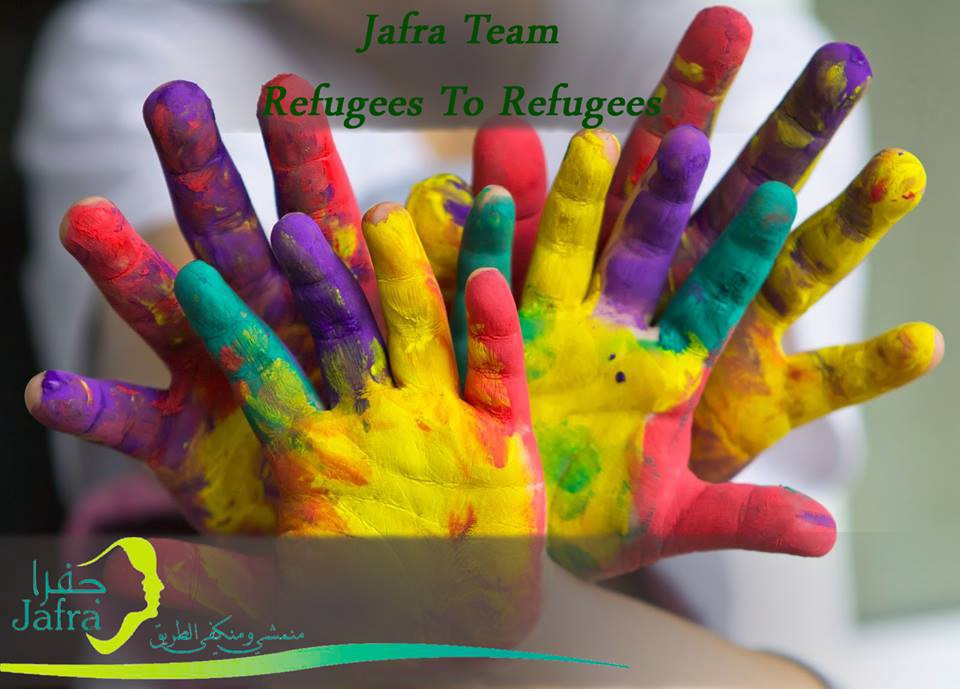
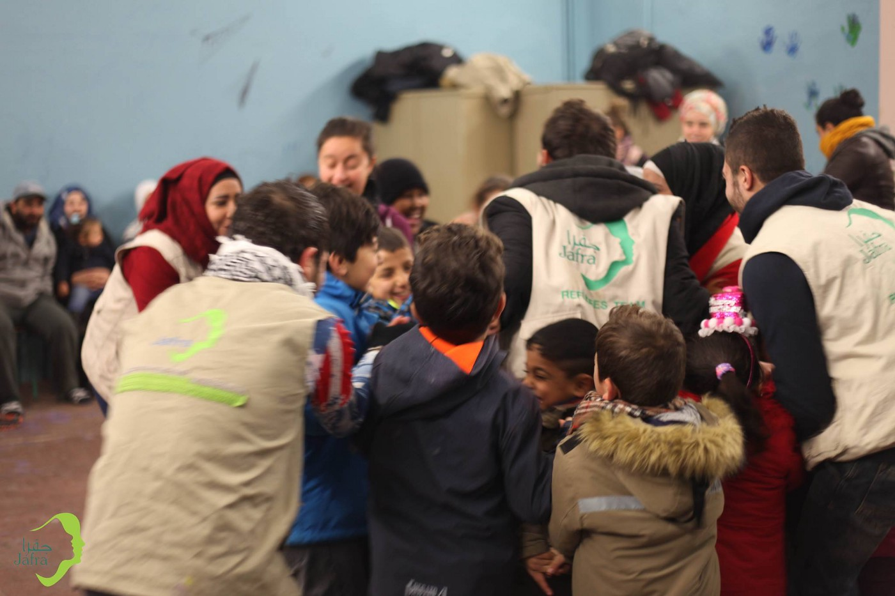
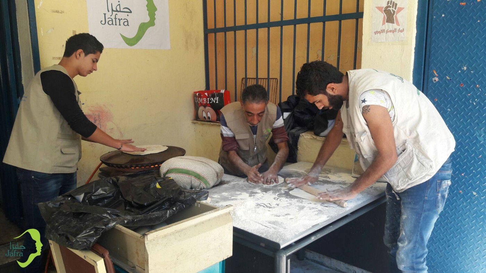

### AYS SPECIAL: Refugees helping refugees

_Almost one year ago, a group of young people from Syria formed Jafra R2R Team\. R2R stands for Refugees helping Refugees\. Their idea was to provide support from refugees for refugees, the idea that has huge support inside the community, but often lacks understanding from big INGOs and NGOs\. AYS visited the shelter which Jafra Team runs in Athens to hear some very important lessons about life, respect, being refugee…_

In February this year, a small house in Exarchia, Athens, was turned into the shelter for women run by refugees, mostly women, too\. House is placed in a very quite, small, narrow street, but close to squats and community centers in this area\. It is composed of a couple of small apartments, with kitchens and bathrooms, and the big yard that can be used as children playground\. When we visited [Jafra R2R Team in Greece](https://www.facebook.com/JafraGreeceR2R/) , which established and runs this shelter, couple of families were already living in, women and children without any man\.

_“Many people among refugees are coming from the culture in which women are left to take care of home and family,”_ Housam, one of the Jafra Team members explain to us\. “ _Reality is that many women are now alone, and they are having problems to live in camps and squats\. Sometimes it is not even safe for them\. That is why we decided to provide this shelter for women who need protection\.”_

But the shelter was only the first step for this team in Athens\. For over a year they are working to provide different types of support for refugees and asylum seekers in Greece\.
#### **Building community**

Nour, Montaz and Housam, are among a small group that established the Jafra team a year ago in Idomeni\. _“We all arrived in Greece and met in Idomeni when the borders were closed,”_ they are telling their story\. _“At the begging, we were just sitting there and talking about the moment when the borders will open so that we can continue our journey\. Then we realized we cannot just sit and wait, and we decided to start working\.”_

All three of them have had experience working with NGOs in Syria, Lebanon and Turkey\. In Idomeni, they met the different teams of volunteers who helped them to start working under one tent offering services for children\. Soon, the Idomeni was evacuated and the big group of people, including Jafra Team, were moved to Lakadikia camp\.

At the beginning, only UNHCR staff and personnel from the Ministry were present in the camp\. Jafra Team decided to work from the very beginning, trying to make the place livable\.

_“We were there to welcome people, to show them around, we make the distribution of food and other things, offering social support activities, and different things for kids\. Also, we started dressing like clowns and going out with instruments, waiting for buses and welcoming people to the camp,”_ Nour remembers\. While in the camp, team grows as well as a number of activities\. Soon, they found a way to build community center where a meetings were held, but they also organized cinema and theater, as well as number activities for kids\.

_“Only refugees were involved\. Our goal was to include as many people as we can to work\. People often forget that refugees are skilled people\. Some are doctors, some engineers… anything\. But, if you do not let them do anything, they will forget these skills and feel depressed\. If they have nothing to do, and they live under all that stress, people will become nervous and it can lead to many things nobody wants, including violence,”_ Housam explains Jafra philosophy\. _“Our goal is to create something for the people to feel like they belong to something\.”_

Photo Jafra Team
#### Connecting people

Soon the team started providing educational and psychosocial support, awareness campaigns for adults and children while doing also waste collection, providing relief and maintenance services, as well as women’s workshops and recreational activities\. And the whole community — composed of people from different countries — was involved\. Help came from different independent donors and volunteers groups\.

To create a community was the most important thing in Lakadikia camp, but also in squats, where they are working after the camp was closed down and they moved to Athens\. _“People who are here as asylum seekers or refugees, are very tired and they lost trust in other people,”_ Housam explains\. _“First, they were bombed in countries they are coming from\. Then some people took their money to bring them here, and that was not an easy journey\. Then borders closed\. And many of them lost their trust in anybody or anything\. Our idea is to make community they will feel like they belong to\. It should help them to start trusting people again\.”_

Unfortunately, on this journey, Jafra Team was often interrupted\. UNHCR and the NGOs that were in the camp did not trust in their method and were not willing to let refugees do everything by themselves\. But, with the help from the independent volunteers, they managed to continue\. But it was a period of constant obstructions and struggles to provide basic for their community\.

After six months, the camp was emptied and people send all over Greece\. All people from Jafra team ended in Athens in squats and immediately started with their activities, trying to make the transition for all the people coming from camps to live in squats easier\.

Photo Jafra Team

_“The first thing was to start making bread for all the people who were coming to squats\. It was the hard job that took us six hours a day\. After a while, the different solution was found, and we moved on to other activities in Athens,”_ Nour remembers\. Community building was again their focus\. _“Unlike in camps, in squats, there are no conflicts among different nationalities\. People live together\. Those conflicts are often created by NGOs\. They divide the people and create the same problems like our governments\. But we are against that\. We also understand that all of us are just numbers from asylum service, and nobody cares to have the community for juts numbers\. And we want that\. It is easy\. Just sit with people, talk to them, make them share everything and they will create community,”_ Nour and Housam believe\.

All their activities led them to opening of a shelter\. They found a way, with help from others, to rent the building and register the shelter in order to provide security for women they offer support\.

People who are running the place and providing support are refugees, but they are open for the independent volunteers\. _“We want to merge different cultures\. People need to meet each other and work together,”_ they told us offering the important lesson for all those involved in offering support for the refugees\. _“Also, NGOs have to learn to believe in refugees more\. We are people with the past, coming from different occupations, and we can do a lot\. Just trust in us\.”_

> The Jafra R2R Team has five core members and 15 volunteers\. Their main goal is to, through work and activities, enhance the skills and experience of all the refugee volunteers\. They rely on material and financial donations from civic society individuals and groups\. 

> In order to continue their work and to run the shelter, the Team needs your help\. Donations are going to cover rent and utilities for upcoming 4 months\! 

> [You can donate, by using this link](https://mydonate.bt.com/events/jafra/421618) \. 

> **We strive to echo the correct news from the ground, through collaboration and fairness, so let us know if something you read here is not right\. Anything you want to share — contact us on Facebook or write to: areyousyrious@gmail\.com** 

_Converted [Medium Post](https://medium.com/are-you-syrious/ays-special-refugees-helping-refugees-512c07ec2671) by [ZMediumToMarkdown](https://github.com/ZhgChgLi/ZMediumToMarkdown)._
