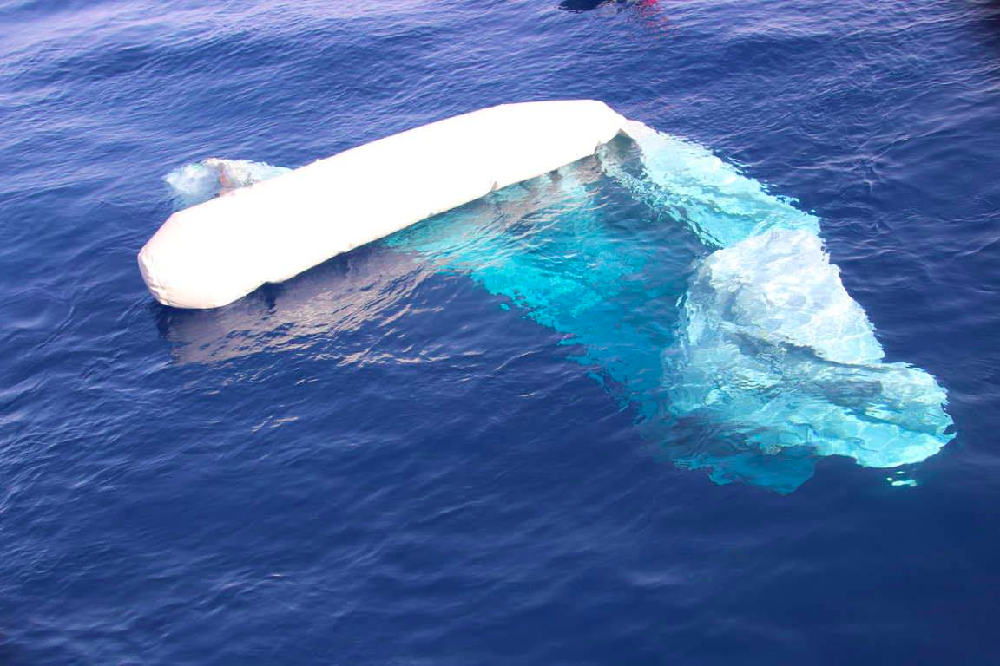
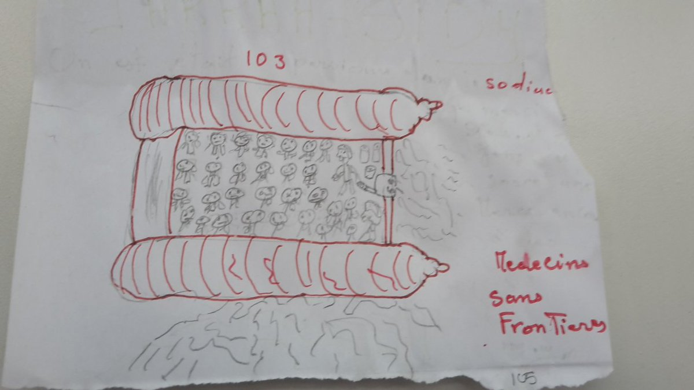
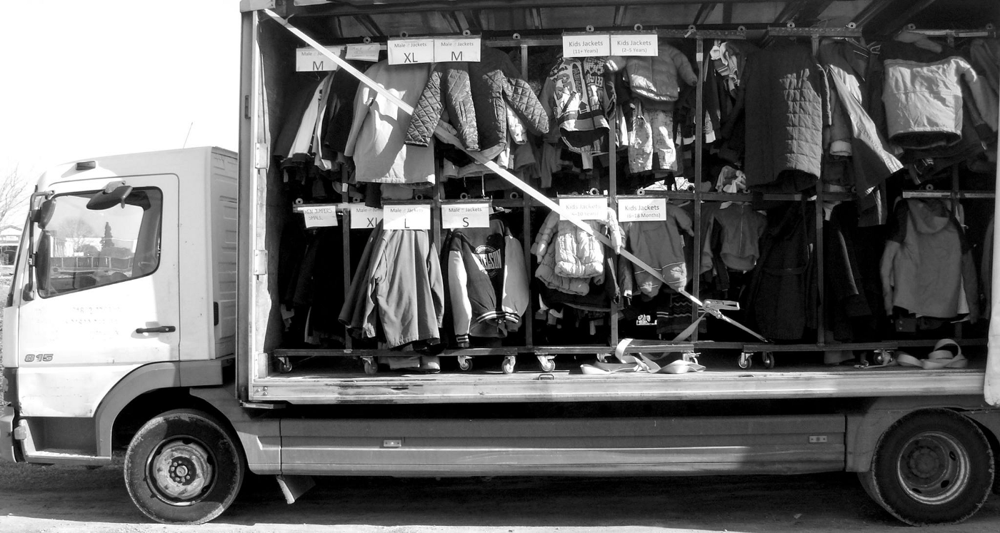
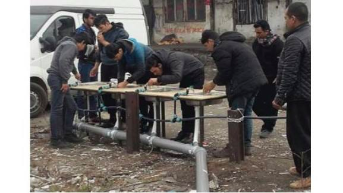
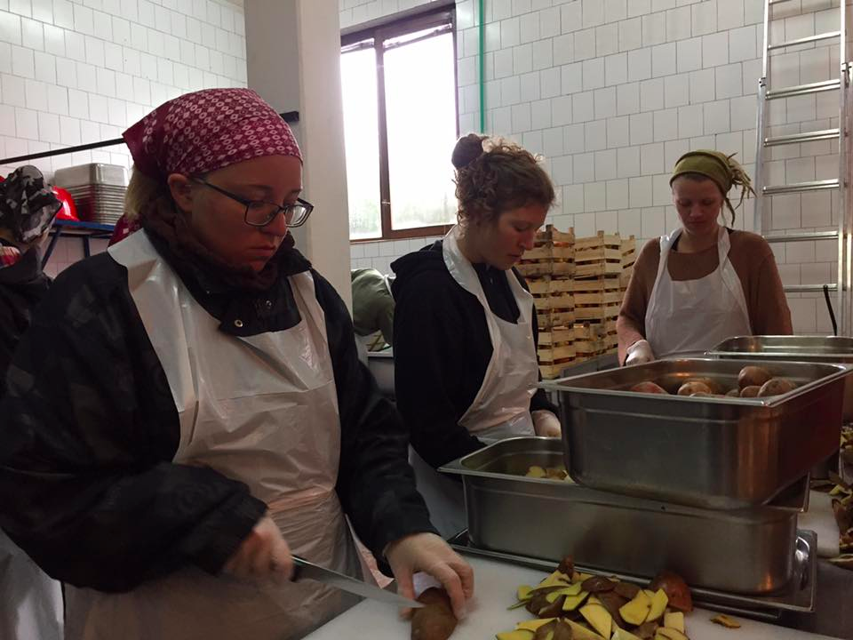
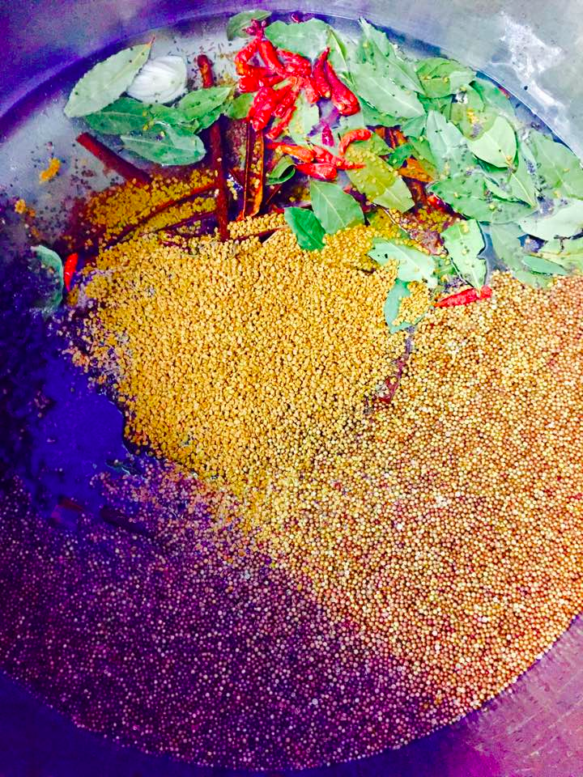

### AYS DAILY DIGEST 30\.4\.2017: Another possible tragedy in the Mediterrenean

_MSF rescue boat recovers four bodies off the Lybian coast//Donations and volunteers needed in Greece and Serbia//Police pressure on food distributions continues in France//_

Photo by Jugend Rettet
### Feature
### Another possible tragedy in the Mediterrenean

While the MSF’s Aquarius arrived safely in Italy with 187 people rescued off the Lybian coast, the NGO Jugend Rettet fears another tragedy in the Mediterrenean, as it discovered an empty dingy this morning which could have had between 120 and 150 people on board\. The group had looked all day for a boat in distress after getting an alert from the Italian coastguard\. Meanwhile, the MSF’s other boat Prudence recovered four dead bodies\.

Photo by MSF Sea

This new tragedy shows how vital NGOs are to prevent even more deaths\. Italian Foreign Minister Angelino Alfano however has decided to blame NGOs for the situation and has backed prosecutor Carmelo Zuccaro, who claimed without proof, that some aid groups are colliding with smugglers and could even be financed by them\.
#### Greece
### Arrivals on Samos

50 people arrived on Samos last night, including 20 children\. All of them had wet clothes and some had not eaten in a few days, while quite a few children were coughing and looked sick\. According to Samos Volunteers it is likely that they had to spend several nights in a hiding spot near the coast before making the trip\.
### Report from Moria

Advocates Abroad has relayed the testimony of one refugee, saying seven Africans were handcuffed on Friday after being selected seemingly at random by authorities on Samos, and later transported to the Section B prison of the Moria camp, Lesvos\. They were given food twice, while water was not offered and toilets were foul and infrequently available\. Worst of all, they were not given any information on what they were facing\.
### Donations & Volunteers needed

Happy Caravan, working in the Thermoplaye camp north of Athens, is looking for volunteers older than 21 for a minimum of two weeks and who have experience working with children\. The volunteers will assist their English and Music teachers and help build up their buddy system, to assure a support network of volunteers and organizations in the host country once families are being relocated\. You can contact them [here](http://happycaravan.org/our-story/) for more information\. Other volunteer needs in Greece can be found on [Greecevol](http://www.greecevol.info/) \.

The Truck Shop needs new clothes and hygiene donations in order to continue distributions and is ready to accept containers\. The full list of needed items is available [here](https://www.facebook.com/mobileclothesproject/?fref=nf) while other donation needs throughout Europe can be found on the [NeedsList](http://app.needslist.co/lists/) \(including an urgent call for sleeping bags in Calais\) \.

#### Serbia
### Update from the Get Shit Done Team

Photo by Get Shit Done Team

The Get Shit Done Team has recently installed 15 portable toilets and built a structure for hand washing for the refugees living in the Barracks in Belgrade\. The team is still looking for volunteers to build new showers, shade structures and other things that will become even more urgent during the summer months\.

Belgraid meanwhile is in [urgent need of donations](https://www.youcaring.com/belgraid-797342) for its new food and NFI distribution\.

#### France
### Police pressure on food distributions continues

[Passeurs d’Hospitalités](https://passeursdhospitalitesenglish.wordpress.com/2017/04/30/the-war-over-distributing-meals-it-is-constant/) reports on police pressure to prevent food distributions in Calais, with volunteers forced to undergo identity checks, vehicle control and security palpations\. The blog also writes that police are telling volunteers that distributions are prohibitedd and intervenes daily to disperse distributions, batons and pepper spray in hand\.

Volunteers nevertheless continue to cook and the Refugee Community Kitchen in particular is in desperate need of chefs and volunteers — you can contact them under refugeecommunitykitchen@gmail\.com

Photo by Vivien Dale
#### Germany

**1239 cases of church asylum in 2016**

[Neues Deutschland](https://www.neues-deutschland.de/artikel/1049458.immer-mehr-faelle-von-kirchenasyl.html) reports on the increasing number of cases of “church asylum” in Germany\. In 2016, 1139 people found protection against deportation in churches up from 1,015 refugees in 2015\. Most cases fall under Dublin, with people facing imminent deportation to Italy, Hungary or Bulgaria, but there is also an increased number of Afghan refugees as Germany accelerates its deportations to that country\.

German authorities respect the sanctuary of churches and will not deport someone who found shelter there, and instead re\-considering these cases individually\. In 2016, in 397 out of 417 completed cases refugees were finally protected from deportation\.

_Converted [Medium Post](https://areyousyrious.medium.com/greece-e516f12863a6) by [ZMediumToMarkdown](https://github.com/ZhgChgLi/ZMediumToMarkdown)._
