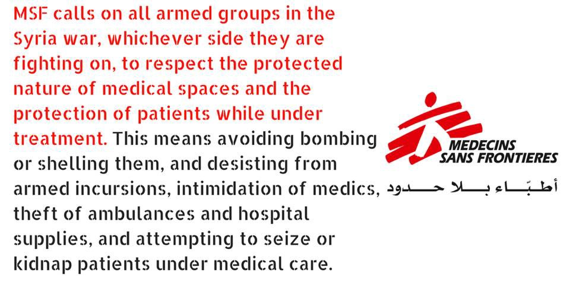

### AYS Daily Digest 01/05/17: Police raids and expulsions more frequent
#### Syria — MSF condemned armed conflicts invading the hospitals in Damascus / New arrivals and new police raids on Aegean islands / Moria hunger strike ends / Donations needed in Greece / News from Šid, Serbia / French police practicing violence and restrictions towards young refugees / Suspected arson attack in Italy / Worrying results of IOM’s survey

 , via: [Art Against](https://www.facebook.com/artagainstproject/?fref=nf)](assets/b107731d8df7/1*Ctf_mgN8E6rO_Qs-XQh-IQ.jpeg)

by: [Falko one](https://www.facebook.com/FalkoOneGraffiti/) , via: [Art Against](https://www.facebook.com/artagainstproject/?fref=nf)
#### FEATURE
### A report from Šid, Serbia

Volunteers from [Rigardu](http://www.rigardu.de) , who are active on the ground in Serbia have sent a detailed report on the current situation and circumstances the refugees in Šid are stuck in, also about the activities of fellow volunteer groups\. Here is what they say:

“For one week we have been in Šid and offered showers four times until now\. Every time we do it about 20 people come to take a shower and a few more to play card games and spend some fun time with us\. Some come every time we do the showers but there are also new people coming every time\. After the police chased us off the first place we have found a new hidden place in the jungle\. It is very unlikely the police will find us there unless they see the van, which we park at the street after taking out the equipment we need for the showers\. The negative effect is it is so hidden that some refugees do not find us or do not even know about it, so we walk around and tell as many people as possible about it and also spread the information at the food distribution\. After showering, the people get a new shirt, socks and underwear in exchange for their dirty clothes, which we wash in the afternoon at our apartment\. The clean ones are redistributed the next time\.

In the camp they offer showers as well\. We are not sure how many people stay there at the moment, the numbers we heard range from 250 to 400\. Apparently families and single men stay separately\. People in the camp have access to only two cold water showers which are open from 10 am to 4 pm\. Some people say it is no problem for them to shower, some say it’s hard for them to get access at all\. We were told that there are enough beds for those who officially stay in the camp but there is a big number of people who sneak in for showering and sometimes also sleeping\. Many people do not want to sleep in the camp as they are afraid of police deporting them to another camp\. We heard that especially Algerians and Moroccans cannot enter the camp, we are not sure whether this is an official rule\. At the moment there is a big insecurity among the people because there have been rumours that the camp will be closed, but probably not for families\.

It is hard to say how many refugees stay in the “jungle” \(the surrounding forest\)because apparently not everybody has official access to the camp and also people do not set up any kind of permanent housing as they are afraid of the police\. People are taken out of there on a regular basis, so it appears to be the aim to clear those woods completely\. Rumours say there are about 50 to 60 people living in this “jungle”, numbers changing due to permanent movement\.
ADM \(Aid Delivery Mission\) is cooking a warm meal on a regular basis, food distribution is every day at 4 pm\. We have met some Serbian women \(about a week ago\) who claimed to be inspectors and were very critical about the food distribution and said they wanted to do something about it but we have not seen them after that\. Other groups might come from Subotica to Šid for distributing clothes and NFI like sleeping bags, toothbrushes and tents\. There is definitely a need for that\. Some doctors from MedVint \(Medical Volunteers international\) came to the food distribution a few times and offered medical checks to the refugees\. They are staying in Belgrade and just come over for that\. We haven’t seen anyone of MDM \(Medicines du Monde\) in the last week\.”
#### SYRIA
### MSF condemns attacks on hospitals

During the afternoon of 29 April, makeshift hospitals supported by the MSF were attacked during the intense fighting that erupted between armed opposition groups in Damascus suburbs of East Ghouta\.

“As an ‘in\-extremis’ measure to underscore that such attacks on healthcare will not be tolerated by MSF, nor by the medics MSF supports, MSF will suspend its medical support to the East Ghouta region until there are clear signs that the fighting parties will respect healthcare”, the organization said in an [official statement](http://www.msf.org/en/article/syria-msf-condemns-incursion-armed-men-supported-hospitals-east-ghouta) concerning the attacks on hospitals\.

The White helmets have issued a statement after the recent attack on their base in Idlib\. **Read the statement [here\.](https://twitter.com/whitehelmets_sy/status/858820087255584768)**

New evidence supports the conclusion that Syrian government forces have used nerve agents on at least four occasions in recent months: on April 4, 2017, in a chemical attack on Khan Sheikhoun that killed at least 92 people, and on three other occasions in December 2016 and March 2017, Human Rights Watch said in a [report released today](https://l.facebook.com/l.php?u=https%3A%2F%2Fwww.hrw.org%2Fnews%2F2017%2F05%2F01%2Fsyria-new-evidence-shows-pattern-nerve-agent-use&h=ATOjkbS-mu0wuqY23iBLYTLGUOTXwuE5bq9O6vQ6EAi1wkuyr4klDkpJ1QaZC5BIYAcpPC-k_xwWDdpFWBFIV8mNyW1K1dCPL37qxRouTBjQdaeMWPcFm2vpaVn_PaEM8l8) \.
#### GREECE
### Arrivals

117 new arrivals were reported today\.
60 people arrived [‏](https://twitter.com/rspaegean) on Chios this morning: 48 men, 2 women and 10 children\. Later on, 57 people were in the second boat that arrived around 9pm today: 25 men,11 women and 21 children\.

 ‎\)](assets/b107731d8df7/1*bShPsiV_SKtuHMZdeiiMbg.jpeg)

The first arrival to Chios today \(Photo: [Pothiti Kitromilidi](https://www.facebook.com/pothiti.kitromilidi) ‎\)

According to the local sources, both Vial and Souda camp are full\. In Souda, the tents are occupying all the shore just outside the camp entrance\.

■■■■■■■■■■■■■■ 
> **[Miss Montag](https://twitter.com/miss_montag) @ Twitter Says:** 

> > The municipality in #Souda, #Chios avoids any maintenance and repair... or would you still call this a shower?! https://t.co/inc9IiM47H 

> **Tweeted at [2017-05-01 19:01:10](https://twitter.com/miss_montag/status/859120528627572738).** 

■■■■■■■■■■■■■■ 

Sleeping problems, stomach pains, feeling sick and serious problems like trauma, depression and stress related health issues are some of the problems that people in Moria camp are facing\. Among other things, the medical [staff](http://Stichting Bootvluchteling) volunteering there has recently delivered a baby of a 16 year old girl staying at the camp\. Here is [their story](https://www.facebook.com/stichtingbootvluchteling/posts/1765512483778791:0?hc_location=ufi) \.

 \)](assets/b107731d8df7/1*EEKWTPWMyLkCXhtURguhtA.jpeg)

Last Friday, after exactly one week, the 12 hunger strikers in Moria decided to end their hunger strike\. Their decision came after a meeting with the authorities, who again repeated that nothing would change\. “We stopped the strike, but we will never stop fighting for our rights”, the group said\. They are now getting their strength and health back\. \(Photo: [Lesvos Solidarity — Pikpa](https://www.facebook.com/pikpalesvos/?fref=nf) \)
### Police raids on Lesvos and Samos

35 people were arrested in the police raid last Friday in Mytilene, among them volunteers of a solidarity group and the refugees housed at the squatted house\. They were charged with disturbing domestic peace and damage to property, then released pending trial, NTM [reports](https://newsthatmoves.org/en/35-arrested-in-police-action-on-lesvos/) \. At the same time, the police carried out a raid on a refugee camp in the town of Vathy, on Samos, supposedly “to identify and locate individuals reportedly involved in criminal activities\.” 28 people of various nationalities were detained\.

According to some sources, the man who was deported to Turkey on Friday was told he would be imprisoned for a year and 6 months, with no visitors or possibility to complain\. Among those deported were 2 small children\. [Read more](http://www.era-aegean.gr/?p=26792) on the story\.
### Supplies needed

The TruckShop needs to refill their stock and are welcoming containers and shipments containing the items they distribute across the Greek refugee camps\. See [the list **here**](https://www.facebook.com/mobileclothesproject/photos/a.1808694196034799.1073741830.1798838400353712/1896628107241407/?type=3) and [contact them](https://www.facebook.com/mobileclothesproject/) in case you can help\.

Preparing for the summer months, the [United Rescue Aid](https://www.facebook.com/unitedrescueaid/?fref=nf) team also asks for help and donations on Lesvos\. These are the most requested items:

_▶ GENERAL ITEMS_ 
Bicycles for adults
Hammock
Backpacks and suitcases
Sunglasses

_▶ FOOD:_ 
Tea
Instant coffee
Sugar
Oil
Biscuits
Sardines
Couscous/Bulgur
Tahini
Juice
Milk
Flour
Tomato cans

_▶ CLEANING:_ 
Clothes detergent
Dishwashing liquid
All purpose\-liquid cleaner
Plastic trash bags \(big size\)

_▶ BABY CARE:_ 
Wipes
Diapers \(only no 5 and 6\) \.
Powder\.
Baby formula 1, 2, 3
Liquid milk for 1 and 2 years \(powder milk rather than the long life one\)

_▶ PHARMACY:_ 
Lice lotion
Sun block
Mosquito repellent
Snake repellent

_▶ CLOTHING:_ 
Flip\-flops: all sizes adults and children
Summer hats
Men shorts
Women shorts
T\-shirts
New underwear
Summershoes adults

_▶ HYGIENE_ 
Deodorant
Razors
Shaving foam
Lotion
Hair brushes
Nail cutters
Nail files
Shampoo
Conditioner
Shower gel

The [Mobile Info Team](http://Mobile Info Team for refugees in Greece - الفريق المتنقل لمعلومات اللاجئين) has new information regarding the family reunification procedure:

> Before you start to invest a lot of money in the procedure for getting a family reunification visa over the German embassy, first consult an experienced asylum counsellor to see if it makes sense in your case\! Normally the procedure over the Greek Asylum Service is much less complicated, as you don’t need as many documents to prove your family relations\. For example, a Syrian family book is enough\. To apply for a visa from the German embassy you need a lot more, including for example valid passports for every applicant, a marriage certificate and birth certificates for your children\. Each certificate must first be translated to German and then legalised in the German embassy in Beirut\. All costs for passports, certificates, transportation to appointments, visa fees and flights have to be covered by yourself, which can prove very expensive\. For some people, applying for a visa might be the better option but the vast majority of refugees in Greece will find the procedure over the Greek Asylum Service much more accessible and affordable\. If you are thinking of applying for a family reunification visa or have already started the procedure, you should definitely not do it alone\. You can seek help from an organisation or contact us via Facebook or on our Whats App \(0030 695 538 8283\) 

As usual, with the help of Translators without Borders, the News That Moves team has prepared answers to the latest rumours spread aroud

[These NGOs](https://docs.google.com/document/d/1as3YhkHjr5po7lxf9-ykji5pilFrCMfiqJ0bimaV3bU/mobilebasic) frequently employ refugees in various positions\. Please visit the Facebook below pages for current vacancies\. If you need help with the pages or the site or assistance composing a CV, please contact a Greek\-speaking volunteer\.
#### HUNGARY
### Figures…

As of 27 March 2017, asylum detention facilities run by the Immigration and Asylum Office were hosting a total of 225 persons: Nyírbátor currently accommodating 79 persons and Békéscsaba currently accommodating 146 persons\. Aliens detention facilities run by the police were accommodating a total of 192 persons: Nyírbátor accommodating 141 persons \(maximum capacity: 160\), Kiskunhalas accommodating 3 persons, Budapest Airport accommodating 15 persons \(maximum capacity: 23\), and Győr accommodating 33 persons \(maximum capacity: 36\) \. As of 27 March 2017, the two transit zones \(Röszke and Tompa\) at the Hungarian\-Serbian border were hosting 13 persons\.
For more details, follow [this link\.](http://reliefweb.int/report/hungary/hungary-population-movement-emergency-appeal-n-mdrhu004-final-report)
#### ITALY
### Fire set in a house intended to house refugees

An arson [reportedly](http://m.mattinopadova.gelocal.it/padova/cronaca/2017/05/01/news/bruciata-la-casa-destinata-ai-profughi-1.15276570?ref=hfmppdel-1) seriously damaged a private house destined to host migrants in Montagnana \(Padova\), during the night between Saturday and Sunday\. It took firefighters around 2 hours to secure the building\.

Responsibility for the event is still unclear\. It is so far considered a violent act of protest against the reception of refugees and asylum seekers\. It is not the first time events like this happen — in August 2014, eggs and tomatoes were thrown at a hotel that hosted refugees at the time\.
### More communities needed for solidarity, against intolerance

Italian Ventimiglia has formed a well known and open solidarity network welcoming and accompanying refugees on their way to safety\. [They now claim](http://www.ilfattoquotidiano.it/2017/05/01/migranti-cosi-la-strategia-alfano-trasforma-ventimiglia-in-un-vicolo-cieco-per-centinaia-di-persone/3554552/) they need more people and communities to get involved and contribute to solving the situation because a single community is unable to tackle the problem themselves\.

### Rome

Baobab volunteers are in a need of blankets, sleeping bags, covers and yoga mattresses or similar materials at the temporary “camp”\. Here’s how to find them:

#### FRANCE
### Exclusion and violence towards young refugees in France

In the Calais area, 96\.5% of the minor exiles were subjected to police violence\. This frightening figure reflects the reality on the ground, a reality put forward by the Refugee Rights Data Project [report](http://refugeerights.org.uk/) which conducted 213 interviews with exiles, including 86 minors\.

Lack of security in France seemed to have been the reason for choosing the UK as the designated country for more than 33 percent of [those questioned](http://refugeerights.org.uk/wp-content/uploads/2017/04/RRDP_SixMonthsOn.pdf) \. Most of them are young adults, minors who were disappointed by the false promises from the British side\. “For the 76\.01% who are exposed to tear gas, 41% experience it several times a week and 20% once a week\.”

On the other hand, the violent practice by the French police is not reserved only for the Calais residents\. On Friday morning a group of 15 young Sudanese refugees staying at a reception centre in Paris were asked to leave the centre and, even though they listened to the officials, they were teargassed, according to the witnesses\. They had no time or possibility to collect their belongings from the rooms\.

Some of the volunteers claim the refugees are generally not accompanied properly, they have no way of collecting their mail and keep missing important meetings related to their legal situation etc\. Some of those involved in the events have decided to organize a gathering on the coming Wednesday evening in order to invoke solidarity\.
### Paris

Volunteers present at the streets of Paris have asked for phones so that those sleeping rough on the city streets could be contacted by the teams on the ground providing aid\.

“If you are planning to help in Paris or are collecting donations, phones are urgently needed\. There are many very vulnerable people on the streets who can’t be contacted by volunteers and cannot contact help because they don’t have a phone\. This is particularly the case with minors\.”

For more information, write to [this contact](https://www.facebook.com/sarah.fenbydixon.1?fref=nf) \.
### Analysis: human trafficking and other exploitative practices prevalence indication survey

[IOM’s report](http://reliefweb.int/sites/reliefweb.int/files/resources/Analysis_Flow_Monitoring_and_Human_Trafficking_Surveys_in_the_Mediterranean_and_Beyond_26_April_2017.pdf) from April 2017 contains an analysis of the responses provided by migrants and refugees travelling along the Central Mediterranean Route and the Eastern Mediterranean Route\.
Some of the shocking results of the survey find that on the Central Mediterranean route:

— 64% of respondents reported having been held in a location against their will during the journey, by armed individuals or groups
 — 49% of all interviewees reported having worked or provided services for someone during their journey without receiving the expected remuneration in return
 — 36% of respondents stated they had been forced to work or perform activities against their will
 — 0\.4% of all respondents reported having been approached with offers of an arranged marriage
 — 72% of all respondents reported to have suffered from physical violence during the journey

Eastern Mediterranean route results display a different situation\.

As for the financial aspect, the journeys on the Eastern Mediterranean route costed between 2,500 and 5,000 USD in more than half of the cases \(54%\) and 31% who paid more than 5,000 USD, while those of the Central Mediterranean sample reported a wider range of prices, including 22% who paid more than 5,000 USD, 5% who stated to have traveled without paying, possibly incurring in a debt to be repaid upon arrival\. Read the entire report [**here**](http://reliefweb.int/sites/reliefweb.int/files/resources/Analysis_Flow_Monitoring_and_Human_Trafficking_Surveys_in_the_Mediterranean_and_Beyond_26_April_2017.pdf) \.

_Converted [Medium Post](https://areyousyrious.medium.com/ays-daily-digest-01-05-17-police-raids-and-expulsions-more-frequent-b107731d8df7) by [ZMediumToMarkdown](https://github.com/ZhgChgLi/ZMediumToMarkdown)._
