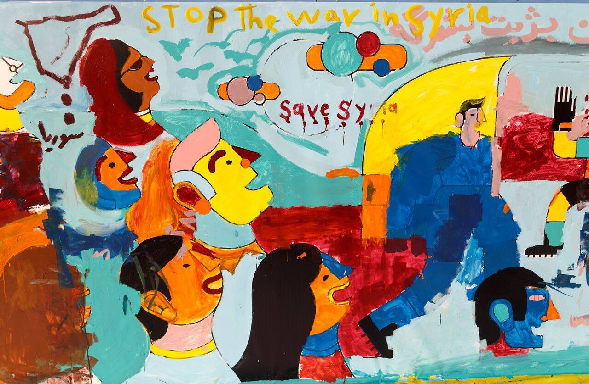
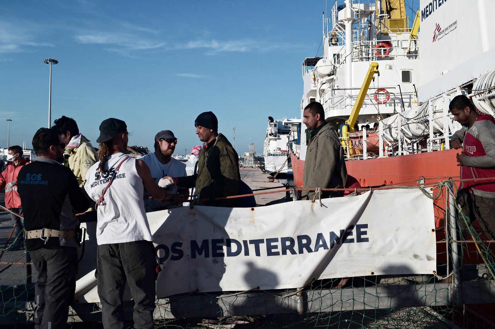
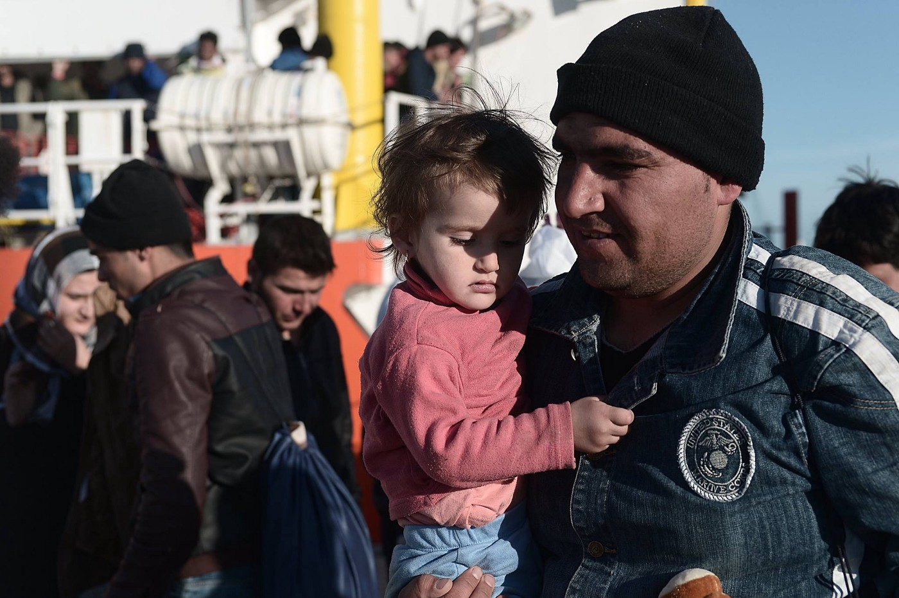
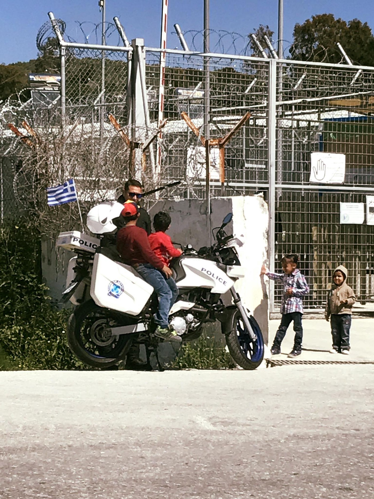
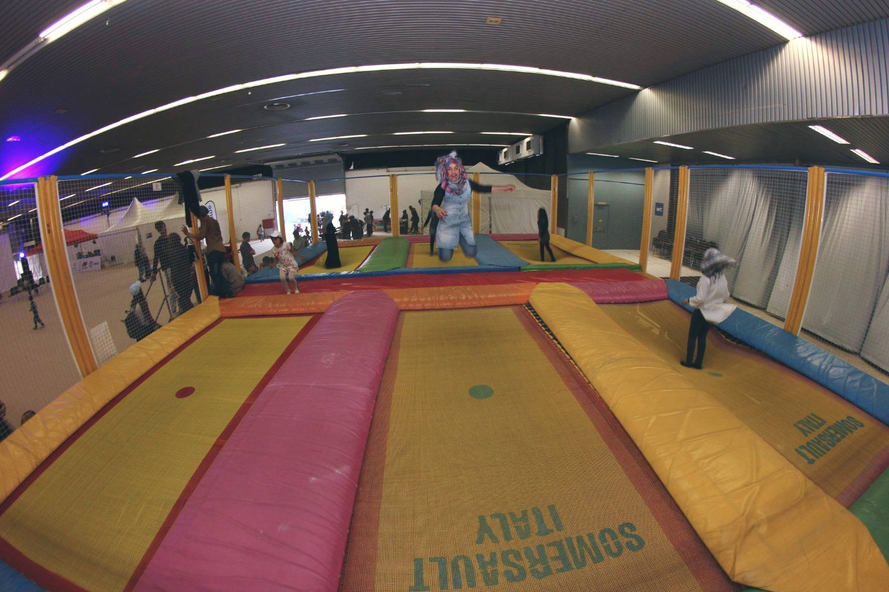

### AYS Daily Digest 02/05/17: Human rights group calls for suspension of EASO from involvement in Greece\.

_Aid reaches besieged city in Syria after six months\. Increased Schengen checks proposed to be lifted in November\. Greek medical system unable to properly treat injured refugee children\. Cultural centers seek to bridge gaps between refugee communities and the local community\. Implementation of food rations system leaves 10% of camp residents without food\. Continued evictions and paperwork hell in Italy\._

Photo credit: Open Cultural Center
### FEATURE

Legal human rights organization calls for suspension of EASO in Greece — citing overreach of power in interview misconduct\.

The European Center for Constitutional and Human Rights \(ECCHR\) has requested the suspension of EASO’s involvement in Greece, citing serious concerns over the interviews conducted by EASO\.

> According to ECCHR’s analysis of a series of admissibility interviews conducted on the Greek Islands, EASO officers fail to respect core standards of fairness\. The interviews do not permit a fair assessment of individual cases, they do not give room for a thorough investigation of vulnerability and they lack a critical evaluation as to whether Turkey qualifies as a safe third country for the person concerned\.
 

>  
 

> Thereby EASO not only violates its own guidelines for conducting interviews, but its involvement in the procedure goes beyond the scope of its powers under EU law\. Consequently, applicants for international protection are deprived of a fair hearing and denied the chance to present and substantiate their asylum case\. 

The condemnation is scathing, but as ECCHR remains an independent body, it remains unclear if their recommendation will be heeded or not\. Read more [here](https://www.ecchr.eu/en/international-crimes-and-accountability/migration/greek-hotspots/articles/international-crimes-and-accountability-migration-greek-hotspots.html) \.

_Over the years, human rights organizations have had no shortage of strong condemnations for various governments and European governing bodies\. From the illegal beatings of refugees transiting Bulgaria, to violent pushbacks from Hungary, organizations have teamed up to try and tear the mask off of the approaches taken by those who purport to hold onto “European values\.” Thousands of hours of meticulous documentation and analysis are going to continue to be cast aside the longer we enable the ambivalence of Europe\._
### SYRIA

After more than half a year of being cut off, the city of Douma finally received a convoy of medical and other emergency aid\. Being in the surroundings close to [fighting in Damascus and under siege by government forces](http://uk.mobile.reuters.com/article/worldNews/idUKKBN17Y2K7) , many smaller towns have suffered the brunt of being on the front line, with some not receiving aid since June of last year, affecting a total of 300,000 people\.

At least [37 people have been killed in a series of suicide bombings](http://www.zeit.de/gesellschaft/zeitgeschehen/2017-05/syrien-fluechtingslager-islamischer-staat-anschlag-tote) on a refugee camp at the Syrian\-Iraqi border\. This area is mostly a frontline between the so\-called Islamic State \(or Da’esh\), Kurdish forces from the YPG, as well as members of the Syrian Democratic Forces \(SDF\) \. The bombings had been carried out by Da’esh, and the camp holds mostly women and children\.
### GENERAL

In spite of rough waves, [SOS MEDITERRANEE](https://www.facebook.com/SOSMEDITERRANEE/?fref=nf) safely disembarked their passengers to Sicily before returning to the seas in search of more people in distress\. The photos of those rescued can be seen below\.

Photo credit: SOS Mediterranee

Photo Credit: SOS Mediterranee

The project “Sick of Waiting” is dedicated to holding European governments accountable to their refugee resettlement promises\.

> “In Europe, we clearly see that the relocation program, which was supposed to grant asylum to about 98\.255 refugees in EU countries before September 30th 2017, is not being fulfilled \(currently 12,5%\) \.” 

The project enables one to join either as a “welcomer” or as a refugee, with different options on how to support activism and holding Europe accountable\.

> September 30th, the deadline for the refugee relocation program, will make history, either as the end of an undignified chapter in the story of the European Union or as the proof of its failure\. In either case, we will be in Athens that day to bring the refugees, who have obtained their visa for displacement, to their countries of destination and, if necessary, to denounce a disgraceful legal and moral breach\. Come to Athens on September 30th, whether by car, plane, boat or walking, and join, together with people from all over the world, this unparalleled global event\. 

Check out their website for [more information](https://www.sickofwaiting.org/viaja.asp?i=2) \.

Due to the gradual stagnation of the Balkan route, the increased EU Schengen controls that were put into place in 2015 [have been recommended to be lifted in November](http://www.dw.com/en/eu-schengen-controls-to-be-lifted-by-november/a-38669172) , only allowing countries to request authorization to carry out additional border checks for only six months more\. This recommendation, however, has yet to be approved by all member states, and the commission further offered that in place of the enhanced checks, concerned states could rely upon police checks\.
### GREECE

Sky News recently published a report on the inability of the Greek healthcare system to care for injured Syrian children\. Many children are still suffering from the injuries and lasting effects that they received in Syria, with some of them being permanently disabled through chemical or regular bombardment\. The Greek healthcare system lacks the specialized care to support these children\. Read more [here](http://news.sky.com/story/greece-struggles-to-help-injured-syrian-children-10859948) \.

Mosaik Support Centre for Refugees and Locals is an innovative designed cultural center which caters to the needs of not only refugees, but also the residents of Mytilene\. The centre offers daycare, choir practice, arts and crafts, language courses on Greek, Arabic and English, and so much more\. Check out and [be inspired by this centre](https://newsthatmoves.org/en/integration-on-lesvos-mosaik-support-centre/) \. We’re all in this together\!
#### Oinofyta

The transition to food cards has left around 10% of refugees in Oinofyta camp with no stable source of food\. Read the urgent plea from Do Your Part below:

> The camp that Do Your Part is managing has received Army catering since it opened\. This food has been very high in starch and carbohydrates with no fresh vegetables\. For this reason, we have supplied supplemental food orders of fresh vegetables and rice, beans, lentils, tomato paste, salt and sugar for them since May of last year so that they can eat a healthy diet\. As of today, May 1st, the catering has stopped\. The government has given the residents an allotment of money in reloadable debit cards so that they can purchase their own food\. This sounds really good until you realize that 10% of the population of our camp do not qualify for these cash cards because of problems with their documents\. We were told that they would make special provisions for them, but that did not happen\. We now have 53 residents who do not have any money to purchase food and no meals are being provided for them by the government\. We have purchased food to give to them for the next week\. We are able to do this because of a generous donation from our volunteers from St Ethelburgas\. 

> We have priced out the food that we need, and we believe that for 100 euros a month per person we will be able to provide them a good, balanced diet\. Here is the urgent plea: We are in need of immediate donations to cover this cost\. 

If you wish to respond to this urgent call, go to their page [here](https://www.facebook.com/doyourpartdisasters/?hc_ref=SEARCH) \.

Greek Police Officer lets refugee children play on motorbike\. Photo credit: Ihab Abassi
#### Thessaloniki

A few weeks ago, Open Cultural Center, along with many other groups and partners, held a magnificent multicultural family day in Thessaloniki\. Read the full report [here](http://Open Cultural Center - OCC) \.

> “Almost 1000 people from Syria, Alger, Afghanistan, Congo, Pakistan and other nationalities including Greek families living in north Greece enjoyed the event with a range of workshops, theatre, clown & music performances, fun games, woman space and football activities…” 

The pictures of joy on everyone’s faces highlights how we can all pull together and make something beautiful in the face of a system that wishes to pit one against another\. In an environment that is oversaturated with stories about factioning within camps or hotspots, stories like this are important\.

Trampoline fun\! Photo credit: Open Cultural Center

The Hub and Echo100Plus fundraising for Leros football team\. These two organizations are responding to the deep and ongoing interest in organizing a football club on Leros, but lack the sufficient resources to make that happen\.

> Our goal is to buy shoes, an outfit, goalkeeper gloves, proper footballs\. We want to get more and more professional, train as a team and hopefully soon competing with the local teams, showing that even in this circumstance life cannot stop\. We have lots of hopes and determination towards this activity but we need a little support from the outside\. Every little penny will be greatly appreciated\. 

The project also aims to include the local community and source as many products as possible locally\. Watch more here\.

The kickoff of the fundraiser is Saturday 6th of May, with a deadline of Sunday 14th of May\! Don’t forget\.

The group LGBT Support Group for Refugees in Greece is in need of a graphic designer\!

_The LGBT Support Group for Refugees in Greece provides community support; legal, medical, and housing referrals; a professionally staffed and fully confidential helpline service; education courses; a drop\-in centre in Athens; and social activities to and for LGBT refugees, and their families and friends\._

If you are interested, go to their page [here](https://www.facebook.com/groups/LGBTrefugeesgreece/) and send them a private message\!

A free MOOC \(Massive Open Online Course\) on the topic of Children’s Human Rights is being offered by University of Geneva\. Although the course is not specifically focused on the context of the refugee crisis, a basic framework and understanding of children’s rights and human rights advocacy can go a long way toward helping us all become better supporters of humans near and far\. Check it out below:

Mural Painting\. Photo Credit: Open Cultural Center
### ITALY

In Italy, the situation is continuing to escalate with refugees and migrants being trapped in an endless cycle of forced evictions and frustrating paperwork loops, all facing threat of deportation\.

For example, as the blog Migrant Sicily points out, in the wake of the destruction of the makeshift camp Caltanissetta, only some refugees were taking to official reception centers\. Others faced no choice but to rebuild the camp the same night\. Others are trapped in residency loops which force them to reside at addresses that are not fit for living, and also put them at risk of targeted police action, yet residency at these addresses are required as part of their asylum application\.

Read more about the bureaucratic nightmare [here](http://migrantsicily.blogspot.hr/2017/04/after-latest-eviction-update-on-camp-at.html?m=1) \.

The following is a report from volunteers regarding the closing of the support hub in Milan\.

_The situation in the HUB \(VIA SAMMARTINI\) is changed\. Since the 28th of April, the Local Administration has decided that it is not possible anymore to register newcomers \(without any exception\) \. This it means that who was already registered in the center can live in the center, but for all the other people the entrance and the provision of all services is forbidden\. The decision has been taken by the Local Administration \(Comune di Milano\), not from Fondazione Progetto Arca Onlus \(the organization who was running the HUB\) \._

_All the newcomers should now go to the Help Center \(Centro Aiuto, Centre d’Aide\) \(CASC Via Ferrante Aporti 3\) \. This is a service provided from the Local Administration \(Comune di Milano\), now they are the ones in charge to answer to people needs\._

_Because of these changings many people \(around 100\) are sleeping in the streets around Sammartini area\._

_We are waiting for news from the Local Administration because the situation is critical\._ 
_Volunteers don’t know if registration will be restarted again\._

_Update:_ 
_Today more than 80 cops in Milano central station took migrants to bring them to the police station for the identification\. Police cars, police vans and one helicopter\. Everything well followed by a huge amoubt of media and Salvini, lega nord\. Is this the city that on the 20th of May is going to have a demonstration to say how good we are in welcome refugees ?_ 
_**On that day there will be a demonstration entitled “Milano like barcellona,” organised by the local administration, the same administration that closed access to newcomers at the hub\.**_

The hypocrisy of administrations that on one hand hem and haw over the wellbeing of refugees yet do nothing to stand in the way of a system designed to endanger them will continue to be a feature throughout the crisis\. More must be done to hold them accountable and face the repercussions of easy signatures to paper\.
### FRANCE

This morning at 5 am, a young migrant was electrocuted on the roof of an Eurostar train at Gare du Nord in Paris\. Police is still in the process of identifying him, due to severe burns this might take some time\.

Interestingly, the same night, a couple of hours before, there was an alarm at the same location when two young men managed cross the barriers to get on the international platform \(which is barred\) \. The two young men were arrested\. They didn’t have papers, and claimed to be from Yemen\.

This report was accessed and translated from [this article](http://www.leparisien.fr/paris-75010/paris-gare-du-nord-un-migrant-meurt-electrocute-sur-le-toit-d-un-eurostar-02-05-2017-6908805.php) \.

Last Friday, 17 persons from Eritrea, Sudan and Afghanistan were forcefully removed from a shelter in Boulogne\-Billancourt\. They had demanded peacefully to receive information why there administrative procedures were not followed\. There were threatened, teargassed and accused of terrorism by the directors\. The commissariat of Boulogne did not register their complaints, and since then they are sleeping on the street\. A demonstration later in the evening on May 2nd had been planned, but we do not yet have full information on it\. We will update you accordingly\.

_Converted [Medium Post](https://areyousyrious.medium.com/ays-daily-digest-02-05-17-human-rights-group-calls-for-suspension-of-easo-from-involvement-in-4a46d3e19c33) by [ZMediumToMarkdown](https://github.com/ZhgChgLi/ZMediumToMarkdown)._
