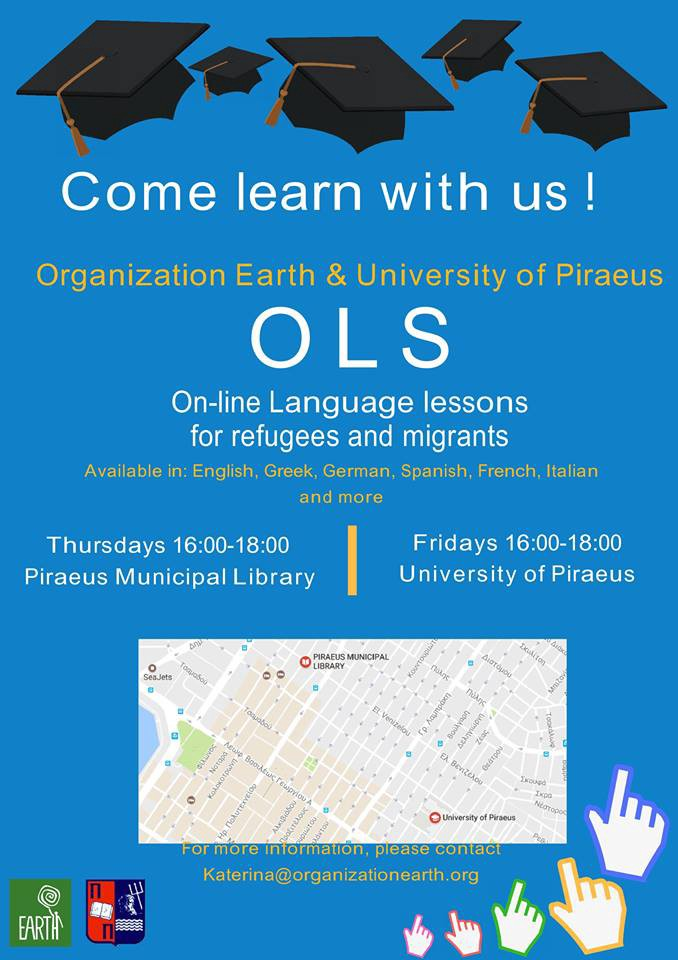
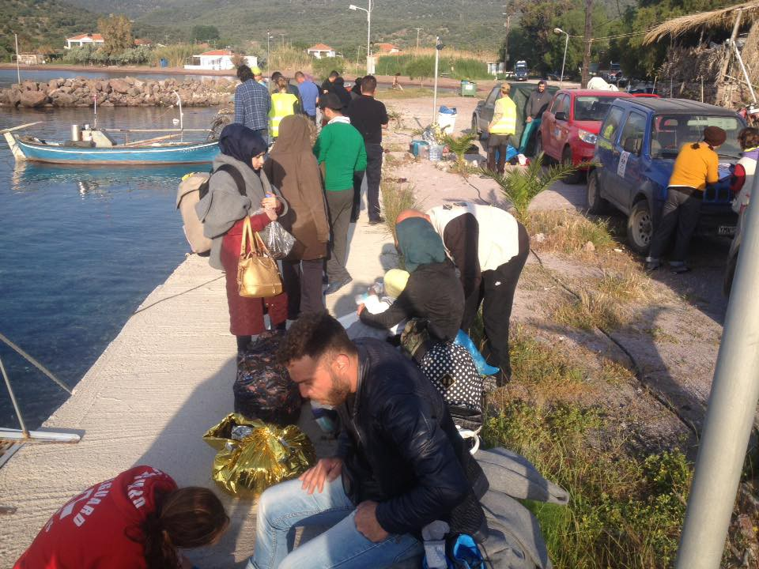
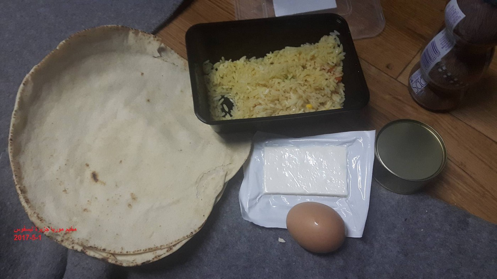
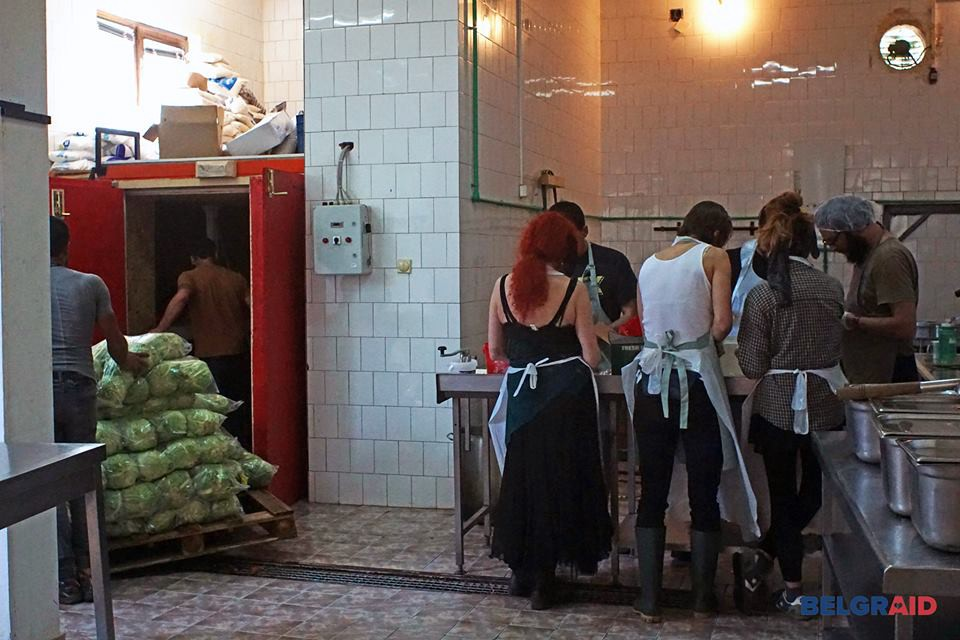
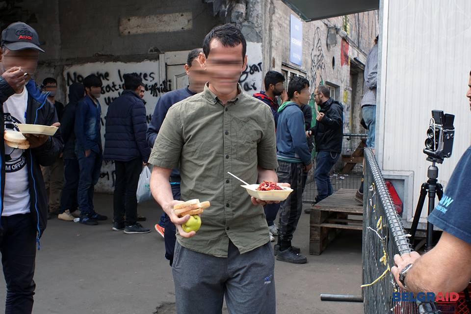
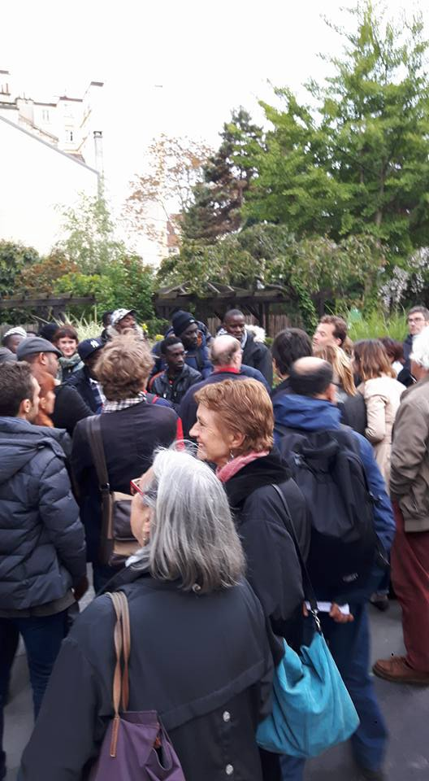
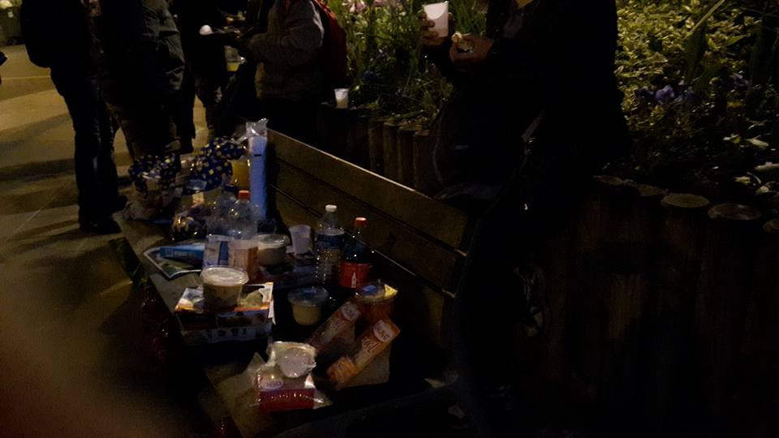

### AYS Daily Digest 03/05/2017 Families held in Kalamata

_Fascist attack on refugees in Leros / FGM in Greece / Lesvos deportation questioned / Senegalese worker dies while chased by the police in Italy / Berlin refugees forced into sex work / violent pushbacks on Serbian\-Romanian border_

Syrian Sysiphus \(by Yaser Ahmad — Art Against\)
### **Feature**
#### **Families held in Kalamata**

3 families may be forced to return to inhumane living conditions on Samos even though they require medical treatment in Athens

Independent volunteers report that group of 49 people were detained in Kalamata after trying to take a boat to Italy\. Their first attempt at the crossing, on the 23rd of April, was unsuccessful due to bad weather conditions and so they eventually took shelter in an abandoned house where the police found them\.

They were taken to the Kalamata Police Headquarters and made to sleep in the basement with no ventilation and dead rats\. They were not told when and if they would be released\.

Due to the inhumane conditions they were transferred to an abandoned hospital behind Kalamata’s Council House\. After two to three days \(numbers are unsure\) the majority of those held were released but 19 people from Syria and Iraqi Kurdistan, 9 of them minors, the youngest of which is two years old, are still being detained\.

They were charged for bottled water, given only two meals a day, not given access to a shower and made to live in unhygienic conditions with no pampers for the children and out of date milk\. One child has been taken to hospital due to flea bites and another because she was vomiting whenever she ate\. A woman with a fractured foot is having to share crutches with another person with mobility problems\. They were fingerprinted and made to sign a document in Greek with no translation, and no understanding of what it said, of which they were not given a copy\.

On the 3rd of May they were informed that they were going to be returned to Samos, where they were originally registered, even though they had papers allowing them to travel to Athens for medical treatment\. They were devastated by the decision and began crying, screaming and shouting that they would rather die than return to Samos\. The situation was covered live by local media\.

A bus arrived to take them to the ferry along with about 20 police officers\. Solidarity groups from Kalamata came to show their support to the families\. The situation became so intense that two women fainted\. This led to a clash between volunteers trying to help the women and police who were pushing the volunteers to make them go away\. Two ambulances arrived and took three women to the hospital while the other people in the group were held inside the building\.

Volunteers and the Greek lawyer who has been supporting the families have been contacting people from solidarity groups in Athens, UNHCR and the Police Headquarters in Kalamata to try and change the decision to remove the families to Samos\. They have now been informed that the transfer will not take place immediately and that the final decision will be taken by a higher authority\.

Two volunteers from the Khora Legal Support team have stayed in Kalamata with the lawyer to follow up on this abuse of human rights\.

**Correction**

> It’s important to note that the EU relocation program will not suddenly stop at a certain point\. When relocation was originally agreed between EU countries, September 2017 was the month by which it was expected that the program would finish\. However, the European Commission recently published information that “Member States’ legal obligations do not stop after September 2017\. Therefore, the relocation procedure set out in those \(relocation\) Decisions must still be carried out by the Member States for eligible applicants within a reasonable timeframe thereafter\.” 

> In practice, this means that if September comes and there are still people waiting, who have already applied for relocation, their applications will be continued for as long as it takes to complete their relocation to other countries\. It’s important to stress that there is no particular “deadline” before which people must be relocated and no one will be left behind if their relocation hasn’t been completed by September\. 

**GENERAL**

[Earth refugees](https://web.facebook.com/EarthRefugee) and [University of Piraeus](http://www.unipi.gr) launched OLS, on\-line language courses for refugees and migrants:

> Because it is not only necessary to learn a European language in order to work or study in Europe\.
 

>  It is absolutely necessary to have a certificate that proves it\.
 

>  And OLS provides a European Certificate to the participants\.
 

>  Basic English knowledge is required\.
 

>  
 

>  You can continue your lessons even after your relocation to other countries \(you just need WiFi and a PC/laptop/cell phone\) \. 

**EU**

EU Migration Commissioner Dimitris Avramopoulos announced to [the media](http://www.ekathimerini.com/218089/article/ekathimerini/news/eu-prolongs-migrant-border-controls) that “the time has come to take the last concrete steps to gradually return to a normal functioning of the Schengen area”\. Since 2015 Austria, Germany, Denmark, Sweden and non\-EU county Norway have introduced ID checks and intensified border controls, and they’ve been allowed to prolong them\. Today Avramopoulos called on “member states to phase them out” over the next six months, as this will be the last extension allowed\.

**SEA**

Watch the Med’s [Alarm Phone](https://alarmphone.org/en/) published a 6\-weeks report called _The production of disasters in the Mediterranean sea and its contestation_ :

> Despite the anticipated surge in sea crossings from Libya, adequate rescue capacities remain absent, so that it is only due to the courageous Search and Rescue \(SAR\) efforts of NGOs in the area that major shipwrecks have been prevented\. \[…\] According to media reports, at least 8,360 persons were rescued over Easter in the Central Mediterranean, mainly by the civilian rescue missions of MSF, MOAS, Sea\-Watch, Sea\-Eye and the Jugend Rettet’s ‘Iuventa’, in cooperation with the Italian Coastguard\. \[…\] cynically, we have recently witnessed how humanitarian NGOs have fallen victim to a heinous criminalisation campaign, pursued by European actors and politicians\. Following the Easter weekend, the European Border and Coastguard Agency Frontex stated that they had deployed all their available assets during the weekend\. However, while 11 vessels, 3 aeroplanes and 2 helicopters are part of Frontex’ Joint Operation Triton, only one vessel, the Norwegian ‘Siem Pilot’ was actually involved in rescue operations, according to the Italian coastguard\. 

> \[…\] Almost silenced by the ongoing border spectacle in the Central Mediterranean Sea, also in the Western Mediterranean and in the Aegean Sea, the desperate and often deadly struggle for freedom of movements continues\. Since the end of November 2016, the war against Sub\-Saharan migrants in Morocco and Algeria has intensified\. The Alarm Phone in Morocco monitors the situation on the ground in order to shed light on the tragedies that have been produced through the repression of migrants there: raids, arrests and mass deportations\. Also, the militarisation of the Algerian\-Moroccan border has increased the risks for migrants\. Along the border, the Algerian authorities have built trenches \(3 meters long, 3 to 4 meters deep\), and on the other side, Morocco has built a wall\. Moroccan authorities are also pushing back migrants into Algerian territory without giving them a chance to apply for asylum\. The Alarm Phone has documented 3 deaths between the end of 2016 and early 2017, and several people wounded, including broken bones, as a consequence of these anti\-migrant trenches\. 

Read the full report [here](https://alarmphone.org/en/2017/05/03/the-production-of-disasters-in-the-mediterranean-sea-and-its-contestation-alarm-phone-6-week-report-20th-march-2017-30th-april-2017/?post_type_release_type=post) \.

**AFGHANISTAN**

While European leaders don’t worry about the safety of the Afghan capital, 8 civilians were killed and 25 wounded in a suicide bombing earlier today in Kabul, media report\. A car exploded near a checkpoint in the area of Shashdarak\. The responsibility has been claimed by Daesh\.

**LIBYA**

[ReliefWeb](http://reliefweb.int/report/libya/iom-libya-helps-421-stranded-african-migrants-return-home) reports that as part of the AVRR program \(Assisted voluntary return and reintegration\) since April 25 IOM assisted 421 people to return to their home countries, Nigeria and Gambia\. Among them, many had been detained in Trig al Seka and Abu Slim detention centres in Tripoli, several minors and at least eight victims of trafficking\. 69 people were also eligible for the reintegration support once back home\.

So far 2924 stranded people in Libya have been joined the voluntary return program\.

German foreign minister and chief of African Union released a joint statement yesterday from Addis Ababa, promoting the stabilization of African countries, instead of the creation of camps in Libya\. The German minister stated that “ [The idea to set up in a country like Libya would be in utter disregard to the living circumstances of the people on the ground\.](http://hosted.ap.org/dynamic/stories/A/AF_ETHIOPIA_GERMANY?SITE=AP&SECTION=HOME&TEMPLATE=DEFAULT) ”

**GREECE**

**Arrivals**

Reports from independent volunteers on Lesvos suggest that 115 people arrived yesterday\. One boat arrived in the north at Tsonia with 25 people on board\. Another two boats were picked up by the Hellenic Coastguard in the south of Lesvos with 65 people and 25 people on board\. Everyone has now been taken to Moria\.

Arrivals on Lesvos \(Refugee Rescue / ‘Mo Chara’\)

**Islands**

**Leros Attacks**

On the night of the 2nd of May a group of refugees were attacked by 10 men who drove by on bikes with a driver and another person on the back with sticks or knifes\. 14 refugees were wounded and 4 are still in hospital\. The police and UNHCR are investigating the event\. On the 3rd of May there was another attack on a transgender refugee who was attacked with a bike lock, she is being operated on\. Many refugees are now afraid to leave their homes

The Dodecanese Solidarity Network written a [statement](http://dodecanesesolidarity.blogspot.gr/2017/05/blog-post.html) against the attacks:

> Stop the fascist attacks\! 

> Solidarity will win\! 

> With the refugees we will live together\! 

**Lesvos Deportations Questioned**

[The Lesvos police department have been criticised in local press, and Frontex has had a complaint filed against them, after two documented cases of wrongful deportation\.](http://www.lesvospost.com/2017/05/blog-post_2.html?m=1) One case was of a family with two young children whose asylum case was ongoing in Greece and who were deported without their lawyer being notified\. Another was of a young Iranian activist, whose asylum case was not completed, being put on the ship for deportation but rescued at the last minute by his lawyer when they were accidentally informed of what was happening\. Turkey is not a safe country for anyone to be returned to but to do so while an asylum case is still in process, and reports from independent volunteers suggest that this has happened many times before, goes against every article of law relating to refugee protection\.

**Lesvos Chamber of Commerce calls for prevention of Refugee Protests**

[Local media state that a report has been filed with the public prosecutor asking that protests by refugees are banned on the island of Lesvos due to a recent demonstration that delayed the departure of a ferry](http://www.lesvospost.com/2017/05/blog-post_66.html?m=1) \. As so often happens it is the refugees that are blamed and not the governments and policies which keep people trapped in these situations\. Though it is true that local economies and people’s livelihoods have been damaged by this situation, to complain that a ferry is delayed when thousands of people are held in hotspots for months on end and others still die in Aegean is ridiculous\. To prevent people protesting against the situations they are forced to live in would be one more step towards stripping these individuals of their only remaining human rights\.

**Food in Moria Camp making people ill**

On the 2nd of May an urgent appeal has been received from refugees in the Moria camp\. People have reported being given meals of uncooked rice with a boiled egg after which many were sick and say they are only given small bottles of water to drink\.

> [Where is the European Commission and the respect for humanity claimed by Europe, and where is the money being paid to the Greek government to spend on refugees?](https://web.facebook.com/%D8%B9%D8%B4%D8%AA%D8%A7%D8%B1-%D9%84%D9%84%D9%87%D8%AC%D8%B1%D8%A9-%D9%88%D8%A7%D9%84%D9%84%D8%AC%D9%88%D8%A1-687993924641223/) 

**Chios**

**Attack in Vial**

It has been reported by people in Vial camp that a pregnant woman has been attacked and may lose her child\. She has been taken to hospital\. The group that assaulted her has not yet been found\.

**Mainland**

**Female Genital Mutilation**

Reports in local media based on an anonymous source working for an NGO in Greece state that FGM is being practiced in hotspots and in Athens\. [Elias Zagoraios, the Prosecutor of the Supreme Court in Greece has asked for an investigation to be carried out\.](https://www.efsyn.gr/arthro/katepeigoysa-ereyna-gia-akrotiriasmoys-gennitikon-organon-koritsion) According to the source the majority of girls being forced to do this are under 15 and come from a wide range of countries and religions\. It is unfortunately unsurprising, given the lack of support and education that both adults and children receive, that this is happening or that it is largely undetected by the institutions who are supposed to be providing care for these people\.

**Spirou Trikoupi 17 kindly request donations:**
- baby milk numbers 1, 2 and 3
- pampers numbers 3 and 5
- milk \(powdered and liquid\)
- black tea
- Nescafé/instant coffee
- olive oil
- vegetable oil
- sugar
- clothing detergent \(liquid\)
- yogurt

If you can help you can contact them [here](https://web.facebook.com/spiroutrikoupi17/?hc_ref=SEARCH&fref=nf) \.

**Notara 26 need donations:**
- Sugar
- coffee
- tea
- pulses
- sunflower Oil
- tomato juice
- washing powder
- garbage bags
- toilet paper
- wet wipes
- disposable gloves

If you can help you can contact them [here\.](https://web.facebook.com/permalink.php?story_fbid=925682374238376&id=645186555621294&hc_location=ufi)

**Open Cultural Centre need volunteers for their new project:**
- Cultural Center Coordinator \(long term\)
- Teachers
- Teacher support volunteers
- Field volunteers to lead and support cultural activities and social work

Email them at [volunteers@openculturalcenter\.org](mailto:volunteers@openculturalcenter.org)

Internship opportunities are also available\!

**United Rescue Aid need donations** of summer clothes, men’s shoes and men’s clothes\. If you can help contact them [here](http://unitedrescues.eu/donations/) \.

**Solidarity Now free training**

Solidarity Now are offering free training for interpreters and intercultural mediators\. You must be a native speaker of Arabic, Farsi, Dari, Kurmanji, Sorani etc\. and speak either English and/or Greek as well as be a resident of either Athens of Thessaloniki\. More information [here](http://www.solidaritynow.org/en/future_interpreters/) \.

**ITALY**

The network [Nessuna persona è illegale](https://web.facebook.com/NooneisillegalMilano) \(No one is illegal\) formed by several associations, support groups, social centres and activists group published a joint statement against yesterdays raid at the Central Station in Milan and launched a public demonstration against raids and deportations for the May 4th at 18\.00 at Piazza della Scala\.

> With no valid reason, a huge deployment of police endowed with horses and helicopters has surrounded piazza Duca d’Aosta, closed the Central Station’s gates, blocked the metro station and implemented a real roundup of migrants and asylum seekers, dragging 52 of them to the police headquarters\. 

> Fourth fifths of them have proved to be regularly endowed with stay permit, so we are asking ourselves the criteria upon which they have been stopped, apart from their skin color\. 

> We believe that such an operation represents a critical step forward in the process of criminalization of the migration, seemingly the only method the institutions \(at least their majority\) concern and practice facing this phenomenon\. The criminalization of the foreign citizens adds upon the one directed to the NGOs operating in the Mediterranean Sea, to prevent them saving the migrants\. 

> This paves the way for the systematic application of Minniti’s decree: expulsions to show to a silent and increasingly angry public opinion that “now they are serious”\. 

> We believe that we shouldn’t stay silent in front of this, and we expect Milan government — which is promoting a model of receiving and social inclusion — would adopt a clear position, undertaking initiatives guaranteeing that nobody living on the municipality’s soil could be expelled on the basis of his/her clandestine condition, as previously done by other municipalities worldwide\. 

> This is especially necessary in this moment, when the municipality is reducing the migrants’ placements in hub Sammartini without having prepared an alternative solution, with the risk of increasing the number of homeless in a vicious circle, becoming subject to episodes like yesterday’s blitz\. 

> It’s clear to everybody that the issue of a livable and safe city cannot be solved by police’s interventions, but through actions supporting social inclusion, particularly to foreign citizens waiting for a resolution of their international protection’s request\.
 

> Who nurtures the war of the poor, availing xenophobia and racism, takes a dangerous way possibly slipping from rights abuse into crime against humanity\.
 

> What happened yesterday was an attack against the individual freedoms and a limitation of right of everybody, migrants and locals\. 

> We should know this to oppose, fiercely and determined, in all the possible ways, repeating that “no person is illegal”\. 

**Urgent call for donations from [Baobab Experience](https://web.facebook.com/BaobabExperience/) in Rome:**

> Arrivals carry on constantly and numbers are rising: 

> We urgently need MILK and BISCUITS for breakfasts\. 

> They can be delivered at the new _camp_ by the carpark in via Spinelli, next to the Africa hotel \(100 mt\. From Piazzale Spadolini\), everyday between 18:00 and 21:00\. 

As part of a exploratory inquiry on the “ [contribution of Italian soldiers to the control of migratory fluxes and the impact of the activities of non governmental organizations](http://www.senato.it/japp/bgt/showdoc/frame.jsp?tipodoc=SommComm&leg=17&id=1021894) ”, yesterday the attorney of Siracusa \(in Sicily\) Fancesco Paolo Giordano was heard by the Defence commission of the Senate\. He stated that “our office does not have any element supporting the alluded linkages between NGOs or parts of them and people smugglers\.” He also added that the “reticence towards institutional actors of some organization”, often used against NGOs in the last weeks debate, “can be better explained on the basis of their mission of safeguarding migrants, that brings them to distrust police forces for ideological reasons”\. \(Senato resoconto\)

The enquiry started after the statements repeatedly released by Carmelo Zuccaro, Catania attorney to the media since Febraury: “ [According to me, some NGOs could be funded by smugglers and I know of some contacts\.](http://www.rainews.it/dl/rainews/articoli/Migranti-pm-di-Siracusa-nessun-legame-tra-Ong-e-trafficanti-La-Cei-Fuoco-politico-ipocrita-ad4fb822-1162-4bfc-b3de-23ae3fbabc71.html) ”

Nian Maguette, a 53\-years\-old worker from Senegal, died today in Rome after a municipal police \(vigili urbani\) raid in the Trastevere neighbourhood\. A statement recorded by the activists of [Progetto Degage](https://web.facebook.com/progettodegage/?_rdc=1&_rdr) , reports that in the morning plain\-clothed agents arrived in the area, while Nian Maguette and other people were selling merchandise on the streets\. Maguette ran away, followed by the agents and was kicked by one of them\. He hit his head falling to the ground and died\. The statements carries on explaining that the agents quickly left the scene and the ambulance was called by some witnesses\. The body was left on the street for hours\. According to the police, Maguette fell to the ground while running, probably due to a heart attack\. [Other witnesses](http://www.dinamopress.it/news/roma-lavoratore-ambulante-ucciso-da-retata-dei-vigili-urbani) stressed the inconsistency of this version with the pool of blood on the ground where Maguette hit his head\.

Friends and colleagues gathered in via Arenula but where pushed away by a large number of policemen\. The Senegalese community in Rome launched a public meeting for tomorrow at 18\.00 in front of Maguette’s home, in via Campobasso, and called for a demonstration for Friday 5th in Piazza Venezia at 16\.00\.

**SERBIA**

Updates from [Belgraid Kitchen](https://web.facebook.com/belgraid/) :

> How time flies\! As we enter our third week of kitchen operations here at BelgrAid, so ends the period of transition between ourselves and the formidable [Hot Food Idomeni](https://web.facebook.com/Hotfoodidomeni/) \. After 9 months, they will be heading off to take a well deserved break and are leaving us carrying the torch \(or is it ladle?\), providing food for the 2000\+ people who live in the ‘Barracks’ and Obrenovac camps\. It has been an honour to work alongside them and we are grateful for all of the guidance and support they have given us over this time\. Needless to say they are leaving the operation here in safe hands and we are looking forward to continuing to provide the same high standard of sustenance to the people we serve\. 

> At this point it is important to extend our gratitude to the amazing individuals, organisations and volunteers who have supported us this far \(you know who you are\! \) without them, none of this would be possible\. This will become only more true as we move forward into this next stage of our life as an organisation\. Donations are the life blood of any independent aid organisation; without the kindness and generosity of the people at home, we wouldn’t be able to provide the desperately needed front line assistance that we do\. 

> Can you lend a hand? Even the smallest donations all go towards covering the costs of helping those who need it most\. Only by working together can we provide an effective response to this humanitarian crisis\. 

> Big love from us all 

> Team BelgrAid 

Currently BelgrAid are looking for a DRIVER with TRAILER experiences from the 16th of May onward, and they are searching for a CHEF as soon as possible\.

If you are interested, please contact them on facebook or by email: [volunteer@belgraid\.org](mailto:volunteer@belgraid.org)

Please donate:

[https://www\.youcaring\.com/belgraid\-797342](https://www.youcaring.com/belgraid-797342)

IBAN: RS35275001022882249455
 SWIFT: SOGYRSBG

While more people attempt to cross the Serbian\-Romanian border, MSF team reported violent pushbacks from Romanian police\.

■■■■■■■■■■■■■■ 
> **[MSF Sea](https://twitter.com/MSF_Sea) @ Twitter Says:** 

> > "After 7 hours the Romanian police caught us in the middle of the night &amp; beat us with sticks. Some of us got kicked in the sides &amp; back." https://t.co/FzNGYXihIy 

> **Tweeted at [2017-05-03 15:22:53](https://twitter.com/msf_sea/status/859790371282448384).** 

■■■■■■■■■■■■■■ 

■■■■■■■■■■■■■■ 
> **[MSF Sea](https://twitter.com/MSF_Sea) @ Twitter Says:** 

> > "We were a group of 4, including my 13-y/o brother, when we got caught we were beaten with batons &amp; flash lights and kicked." https://t.co/hZgMzwkuDl 

> **Tweeted at [2017-05-03 15:18:55](https://twitter.com/msf_sea/status/859789375693082627).** 

■■■■■■■■■■■■■■ 

■■■■■■■■■■■■■■ 
> **[MSF Sea](https://twitter.com/MSF_Sea) @ Twitter Says:** 

> > UPDATE: The @[MSF](https://twitter.com/MSF) team in #Serbia have met #people violently pushed back while attempting to cross into #Romania. One suffered broken ribs 

> **Tweeted at [2017-05-03 14:58:44](https://twitter.com/msf_sea/status/859784294604185600).** 

■■■■■■■■■■■■■■ 

**HUNGARY**

The Crowdfunding to support Yamen A\. and Ahmed H\. is still going on\. They were sentenced to 3 and 10 years of prison for acts of terrorism for crossing the Serbian\-Hungarian Border and clashing with the Hungarian police during a demonstration on the 15th of September 2015\.

Read the full story [here](http://freetheroszke11.weebly.com/) ; donate [here](https://www.generosity.com/fundraising/show-trials-in-hungary-help-the-accused) \.

**FRANCE**

[**Help Refugees**](https://web.facebook.com/HelpRefugeesUK/?fref=nf) **call for donations of Sleeping bags to Calais\.**

[**Belgium Kitchen — Jungle of Calais**](https://web.facebook.com/BelgiumKitchen) **is calling for urgent donations\.**

> Our building welcomes about forty men and, since yesterday, a dozen families\. The Samu social winter plan has indeed ended and several families are now housed in our building\. So there are about 15 children between the ages of 3 and 13 who are counting on you to eat their fill\. We also distribute about 200 meals at the Gare du Nord\. 

> The situation is really critical, we do not have enough to continue and the needs are increasingly important\. 

Donate [here](https://web.facebook.com/BelgiumKitchen/posts/840379079434188:0) \.

**Follow\-up on the eviction in Boulogne Billancourt**

A volunteer reports that after yesterdays demonstration refugees evicted from the Aurore Centre have slept rough for the 5th night\. This morning police came and dismantled the camp on the square\. Refugees were taken to La Boulangerie \(another centre, run by social service SAMU\) \.

The [Unofficial Women and Children’s centre, Jungle Calais](https://web.facebook.com/The-Unofficial-Women-and-Childrens-Centre-Jungle-Calais-160982470942565/?fref=nf) reported that the man who was pulled out from the fire that erupted in the jungle camp on October 26th 2016 has finally made it to the UK, after the inhumane treatment received in France\.

> Yesterday I was told that the man we pulled out of a serious fire in the jungle camp had ‘made’ it to the UK\. He is now having treatment in the UK\. That night he sustained serious burns in a fire that should never have happened\. It took forever for the ambulance to arrive\. When it did arrive the ambulance refused to come onto site\. In the chaos his friends tried to help him, pulling off the plastic sheeting that had burned into his skin, two of us had to carry him to the road adjoining the site, he was heavy and we kept falling over\. The hospital dressed his wounds and sent him back to the Jungle\. Him and the other victims and women who lost their homes stayed with us in the center, it was like a medieval war zone\. 

**GERMANY**

[Media sources](http://www.dw.com/en/disappointed-refugees-driven-to-prostitution/a-38566276) report an increasing number of refugees in Berlin resorting to prostitution\. Berlin’s central park, where hundreds of undocumented people take shelter is reportedly one of the centres of this sex trade\. “Once refugees turn 18, they no longer qualify for certain state benefits” and accommodation; “fear of deportation drives them into the streets”, and they see “few alternative for earning money”\.

> **We strive to echo the correct news from the ground, through collaboration and fairness, so let us know if something you read here is not right\.** 

> **Anything you want to share — contact us on Facebook or write to: areyousyrious@gmail\.com** 

_Converted [Medium Post](https://areyousyrious.medium.com/ays-daily-digest-03-05-2017-families-held-in-kalamata-6ff2c68c5880) by [ZMediumToMarkdown](https://github.com/ZhgChgLi/ZMediumToMarkdown)._
