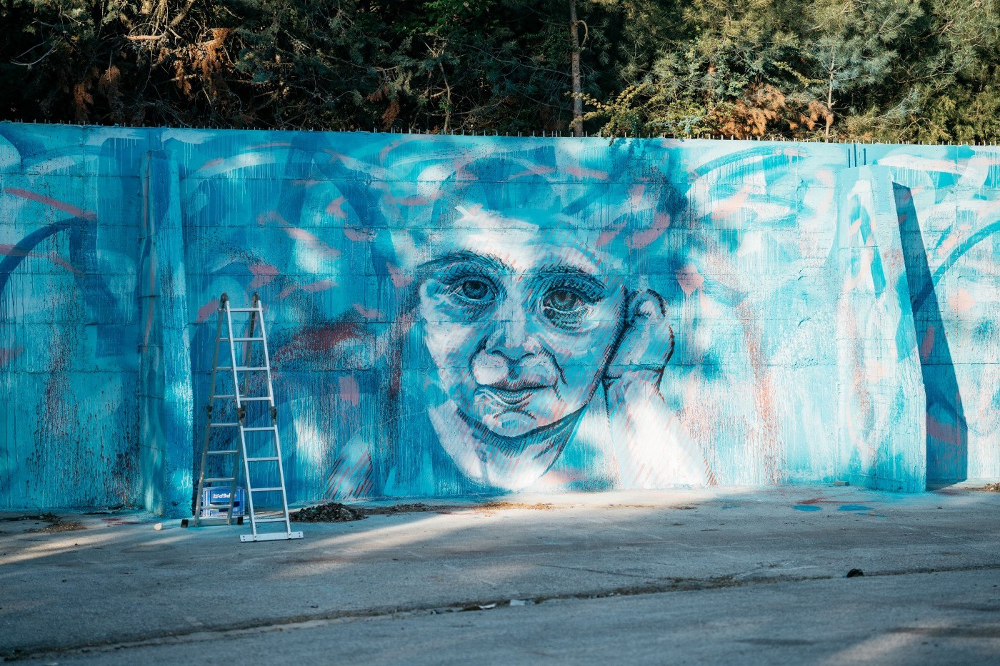
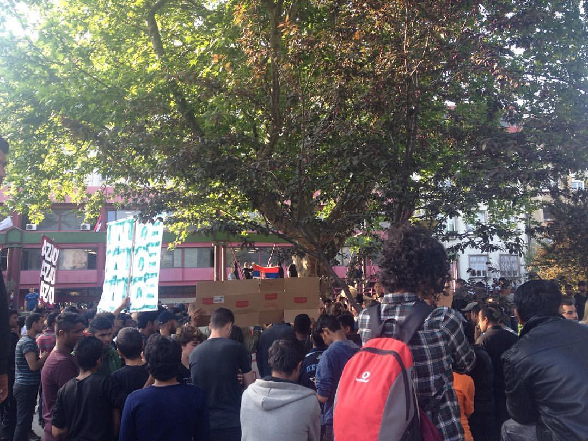
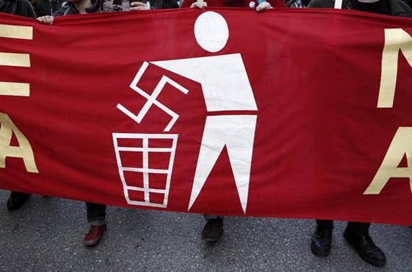
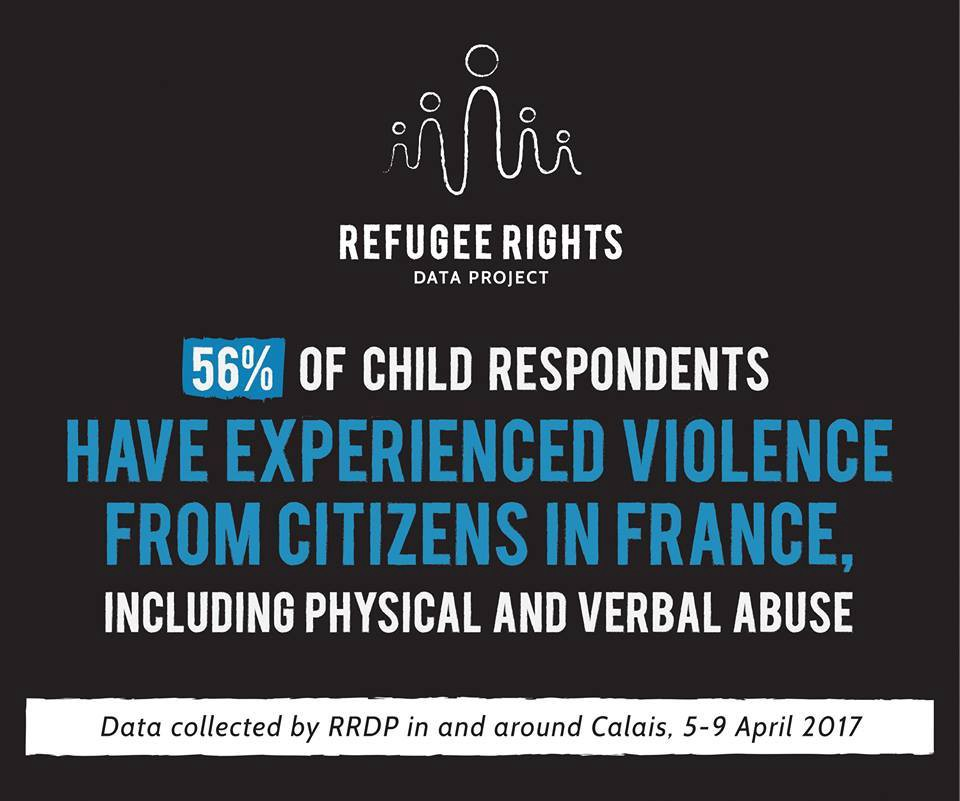

### AYS Daily Digest 04\.05\.2017: Several injured in various clashes and fascist attacks in Greece\.

Lesvos squat arrest update / EU Commissioner on Human Rights criticizes Greece law enforcement / “protracted limbo” affecting tens of thousands of refugees / detailed report on violent pushbacks to Serbia / pro refugee rally in Belgrade / new testimonies of violent pushbacks from Croatia / Croatia continues dodgy asylum denial / fascists attack IOM office in Italy / Nigerian refugees deported from Italy /

Photo Credit: Elpida Home
### FEATURE: Violence on Chios and Leros

_There are many reports coming out of Chios and Leros in response to increased violence and activity over the last few days\. Below is an attempt to collate that information to the best of our ability\. This is what we can put together so far, and we welcome any feedback\!_
#### Chios

In the aftermath of fights the day previous, violence continued to escalate on Chios\. Additionally, a young Syrian man attempted to self\-immolate, but was caught by police\. Ten individuals have been wounded in a clash between groups in complexes on Chios\. One man was injured with a knife in the foot, and another in the back\. Four others had been injured during a fight half an hour previous\. Shortly thereafter, women and children began to leave the area in order to escape the possibly escalating violent\. UNHCR busses were suspended between Souda and Vial, and taxis also refused to drive the route, meaning that people had to continue on foot\. There are other reports of fights that occurred in Souda and city center\. Police are present and are engaged with the situation, and according to sources approximately 34 people have been arrested in connection to the fights\.

Sources\. [1](http://astraparis.gr/nikta-epeisodion-me-traumaties-se-souda-vial/) , [2](http://www.protothema.gr/greece/article/676624/hios-exi-traumaties-se-sublokes-metaxu-metanaston-sto-kedro-tis-polis/) , [3](https://www.facebook.com/advocatesabroad/) ,
#### Leros

On Leros, the third day of attacks by right\-wing groups, which have also left refugees injured\. The perpetrators drove around on scooters with covered plates to avoid identification\. According to the last update, eight individuals have been arrested in connection to the attacks\. A total of twenty people have been taken to the hospital as a result of these attacks\. Many refugees feel unprotected by police and are anxious about the situation\.

[Source](https://www.facebook.com/groups/DodecaneseSolidarity/permalink/1347428938681154/) \.
### GENERAL

> “We are seeing single mothers and children stranded in Greece, Serbia and Bulgaria who have not seen their husbands and fathers for months or even years\. The family reunification process is slow, and its outcome uncertain, and it is this uncertainty which can cause significant emotional distress and anxiety for children and families, setting them back for years to come\.” 

_\- Afshan Khan, UNICEF Regional Director and Special Coordinator for the Refugee and Migrant Crisis in Europe\._

In a press release, UNICEF highlighted the dangers of the “protracted limbo” refugees across Greece, Bulgaria, Hungary, and the Western Balkans face\. By not having any clear way forward and potential risk of being sent back, the stress is ever\-present and is proving to be debilitating\. Especially dangerous are cases of family reunification where the stress of the situation is highlighted by the stress of being in a divided family\. Read the full report [here](https://www.unicef.org/media/media_95938.html) \.
### GREECE

The EU Commissioner for Human Rights published a letter to Greek authorities expressing deep concern over reports of ill\-treatment by police and other law enforcement agencies in Greece\.

> He stresses that these are well\-documented and very serious cases illustrating the long\-standing and systemic problem of excessive use of violence in law enforcement, which requires determined and systematic action by Greece\. 

Additionally, in the letter the Commissioner calls for additional preventative measures and further investigation, citing the Convention against Torture\.

Read both the Commissioner’s [letter](http://Read the Commissioner’s letter to the Greek government on ill-treatment by law enforcement) , and the Greek authority’s [response](http://Read the reply of the Greek government to the letter) \.

No Border Kitchen reports that the people arrested at the Lesvos squat will face court in approximately five months\. Contact them for information on how to show [support and solidarity](https://twitter.com/noborderkitchen/status/860223671360790532) \.

In some brighter news, [Elpida](http://Elpída Home) home was given a mural facelift by [aptART — Awareness & Prevention Through Art](https://www.facebook.com/aptarts/) , check out the photos below\!

](assets/fa1a013a3c08/1*JqC9mjJpv5VBH2YpbmKcvg.jpeg)

Photo Credit: [**Elpída Home**](https://www.facebook.com/elpidahome/)

](assets/fa1a013a3c08/1*c1uiFTX5tZBBOnMawaz6aw.jpeg)

Photo Credit: [**Elpída Home**](https://www.facebook.com/elpidahome/)

Additionally, in more art\-related projects, check out the following project by AMAKA and Art Emergency\.

> After our valuable experience and insight gained with Art Emergency, we noticed the need for special training and support of the professionals who work in the field with refugees \(social workers, psychologists, educators etc\. \) \. The Art Emergency workshops for professionals will cater to this lack and the participants will have the chance to learn by creating\. Core modules will include: Art as Therapy/ Applied Art Therapy for Refugees and Creative Methods/Ways to Design an Intervention/ Theory on Psychological Symptoms of Migration and War, with Focus on the Effects on the Teenagers\. 

Learn more [here](http://www.amaka.gr/en/events/two-day-experiential-workshop-in-athens-join-us-now/) \.
### SERBIA

The Humanitarian Center for Inclusion and Tolerance published a detailed report on violent pushbacks to Serbia from Hungary and Croatia which occurred in the period from May of 2016 to March 2017\.

According to the report, they “documented 212 cases of forcible collective expulsions from Hungary and Croatia relating to more than 4,000 foreign nationals that were reportedly unlawfully returned to Serbia\.”

The report also contains detailed information on smuggling activities as well as various testimonies of violence visited upon men and unaccompanied minors in traveling groups\.

The most frequent characteristics of pushbacks from Hungary are as follows:

_ Beating of asylum\-seekers with nightsticks by more than one official at a time_

_ Kicking and punching of asylumseekers, while they were laying on the ground_

_ Smashing of cell\-phones_

_ Pepper\-spraying in the eyes of asylum\-seekers either right after capture or before expulsion_

_ Release of attack dogs on asylum seekers_

_ Forcing asylum\-seekers to march in a straight line before expulsion, with those falling out of line being hit with nightsticks\._

_ Taking blankets and clothes from asylum\-seekers and throwing them away \(in some cases asylumseekers were even forced to strip into their underwear and stand in the cold, or in others, to stand barefoot in the snow for hours\)_

_ Pouring water on asylum\-seekers and making them stand in the cold for longer periods of time_

This list is in general agreement with reports from volunteers active at the border\.

The most common procedures in Croatian pushbacks are as follows:

 _Beating of refugees with nightsticks, punching and kicking_

_ Confiscation of mobile phones and cash_

_ Not facilitating access to the asylum procedure and other services \(with comments “this is not possible”\)_

_ Expulsions of refugees even after several days spent in Croatia, sometimes even in refugee centers_

The full report can be accessed [here](http://hcit.rs/wp-content/uploads/2017/05/HCIT-report-on-expulsions-to-Serbia-ENG-version.pdf) \.

In Belgrade, an anti\-refugee demonstration that was slated to happen on May 4th was cancelled; the pro\-refugee counter demonstration, however, was not\. The original demonstration was supposed to happen in front of the Faculty of Economics in Belgrade, close to where many refugees and migrants often gather\. The “refugees welcome” demonstration was visible and also included elements of critique against the Serbian government as a whole\.

Demonstration in Belgrade\. Photo Credit: Aleksandar Nastevski
### **CROATIA**

**Police start beating people at the border again**

Following our [report](http://welcome.cms.hr/index.php/en/2017/01/30/report-on-illegal-and-forced-push-backs-of-refugees-from-the-republic-of-croatia/) on illegal and forced push backs of refugees from the Republic of Croatia, which triggered an internal investigation within Croatian Ministry of Interior, the border violence seemed to decrease\. However, recently we are receiving new reports about people who were allegedly beaten by Croatian police\.

\-“In the last two weeks at the MSF clinic in Belgrade, we are again treating people beaten, coming back from the Croatian border\. While MSF from January, we did not have any cases coming back injured from the Croatian border” — a MFS staffer confirmed to AYS today\.

AYS will continue monitoring new cases of border violence, and we shall file new complaints to the authorities, so please let us know if you encounter any similar story\. It can be expected that the closure and increased police monitoring of Šid camp near the Serbian\-Croatian border bears some connection to the increased violence as many individuals have been attempting to cross in the previous several weeks\.

**Families with children rejected as «security obstacle»**

Today two more families with children got their asylum applications rejected due to a so\-called ‘security obstacle’ based on the assessment of the Security and Intelligence Agency\. Throughout the last couple of months, particularly in April 2017, AYS and the Center for Peace Studies have observed a sudden increase in the number of rejections of applications for international protection in Croatia made by applicants from Syria and Iraq, as well as rejections of requests to regulate foreigner status in Croatia \(citizenship, temporary or permanent stay\) \. What is common to all of the above\-mentioned rejections is the Ministry of Interior invocation of the Article 41 of the Security Vetting Act i\.e\. the rejection of the request due to a so\-called ‘security obstacle’\. Without questioning the need of the state apparatus to carry out security checks of individual foreigners for the purpose of national security, we have raided the problem of arbitrary and overarching interpretation of the so\-called “security obstacle”, the lack of independent supervision over the qualification of the “security obstacle”, as well as the increasingly difficult legal position of people whose application for international protection or foreigner status in the Republic of Croatia was denied\. These practices undoubtedly lead to violations of human rights of refugees and foreigners in the Republic of Croatia, and it is necessary to suspend these practices as soon as possible\. You can find a detailed report on this issue [here](http://bit.ly/2pb8qVV) \.

Photo credit: City Plaza Squat
### ITALY

ROME: Fascists demonstrated and occupied part of the offices of IOM in protest of all NGO action that are rescuing refugees and migrants at sea\. The rightwing groups Forza Nuova occupied the outer part of the Rome offices and hung a banner decrying the actions of those who rescue\. Additionally, they shouted anti\-refugee/migrant slogans and set off a smoking pyrotechnic\. The office director Federico Soda condemned the action, reminding the public that IOM is a partner with the United Nations\. Read more \(in Italian\) [here](http://www.ilfattoquotidiano.it/2017/05/04/migranti-assalto-xenofobo-di-forza-nuova-contro-lufficio-oim-di-roma/3562766/) \.

Meanwhile, representatives MOAS, a registered charity engaged in search and rescue operations in the Mediterranean, attended Italian Parliamentary hearings, while simultaneously, the field team continued to carry out operations\.

> Asked about the decision\-making process of our SAR operations in the Mediterranean, Plans and Operations representative Ian Ruggier clarified that “MRCC Rome has _de facto_ responsibility for the coordination of all search\-and\-rescue activities in the area of operations”, and that MOAS has operated under its direction since the start of our operations in 2014\. 

> Questions were also posed regarding possible contact between MOAS and individuals in Libya, which our representatives categorically denied\. Regarding questions on whether MOAS vessels have ever entered Libyan territorial waters, it was clarified that our vessels have only entered Libyan waters in rare emergency situations and only under the specific instructions of MRCC Rome, in consultation with Libyan authorities\. 

Read the full report [here](https://www.moas.eu/moas-representatives-attend-italian-parliamentary-hearings-phoenix-crew-conducts-rescues-mediterranean/) \.

Also in Rome, the Senegalese community gathered to protest against the mistreatment they are facing culminated with the death of Niam yesterday\. There was a similar demonstration in Naples as well\.

](assets/fa1a013a3c08/1*athbkF_pt0WiMWJXpSeTAw.jpeg)

Protesting mistreatment of refugees in Italy\. Photo Credit: [**Ex OPG Occupato — Je so’ pazzo**](https://www.facebook.com/exopgjesopazzo/?ref=page_internal)

In Lampedusa, the morning of the 4th, 40 people, most likely from Nigeria, were escorted onto a flight to Palermo and then Rome to be presumably deported back to Lagos, Nigeria\.

 \.](assets/fa1a013a3c08/1*pU4liWC7F-lM7hRz-Ntzxw.jpeg)

People starting a journey back to Nigeria\. Photo Credit: [**Mediterranean hope**](https://www.facebook.com/Mediterranean-hope-252231521632595/) \.

This weekend help and donations are needed for [Baobab Experience](https://www.facebook.com/BaobabExperience/) , from 10 to 19, on the 5th 6th 7th May\. You can help with SUMMER CLOTHES FOR MEN \(boxers, socks, t\-shirts, s and m, jeans, 28–32, sport shoes, 39–44, bags and backpacks\)
FOOD
\(canned food, plastic plates, plastic glasses and cutlery\)

P\.s\. Bring only food in sealed packages and clean clothes in good conditions, thank you\!

Baobab Experience
### FRANCE

The Refugee Rights Data Project conducted a survey with disturbing results\. The report discussed hate crimes against refugees as well as threats and harassment against volunteers and detailed how they are fueled by fascist Islamophobic and xenophobic sentiments\. However the percentage of respondents are shocking\.

Photo Credit: Refugee Youth Service\.
### BELGIUM

Volunteers wanted\! The Our House Project is looking for volunteers\!

> Dear Friends and good people, 
 

>  We are still looking for more French and Dutch speaking volunteers in Brussels and Antwerp to help us with our accommodation project\. The duties will include searching for properties, speaking with landlords and taking refugees to property viewings\. Interpreters will be provided for you where needed\. You will have an opportunity to form direct connections with refugees which can often blossom into lovely friendships\. Help us to represent refugees in a harsh real estate environment and to let them know they are not alone\. 

Contact their [page](http://Our House Project) for more information\.

_Converted [Medium Post](https://areyousyrious.medium.com/ays-daily-digest-04-05-2017-several-injured-in-various-clashes-and-fascist-attacks-in-greece-fa1a013a3c08) by [ZMediumToMarkdown](https://github.com/ZhgChgLi/ZMediumToMarkdown)._
