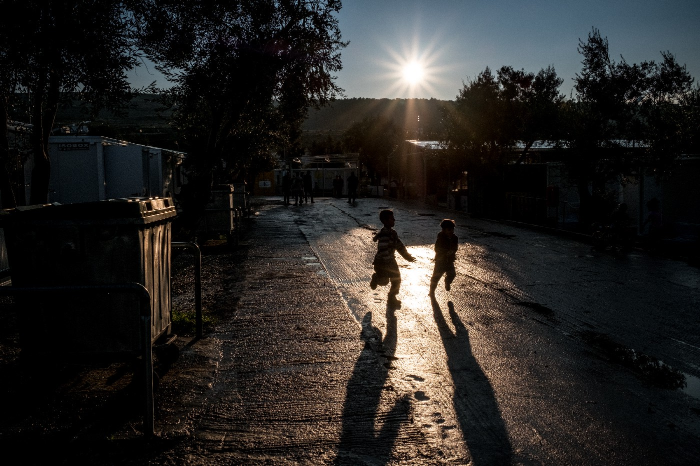
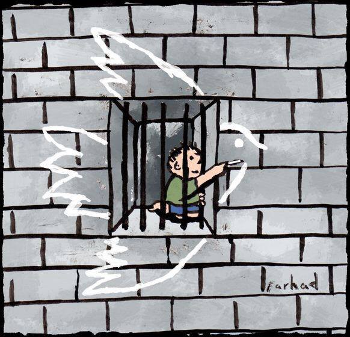
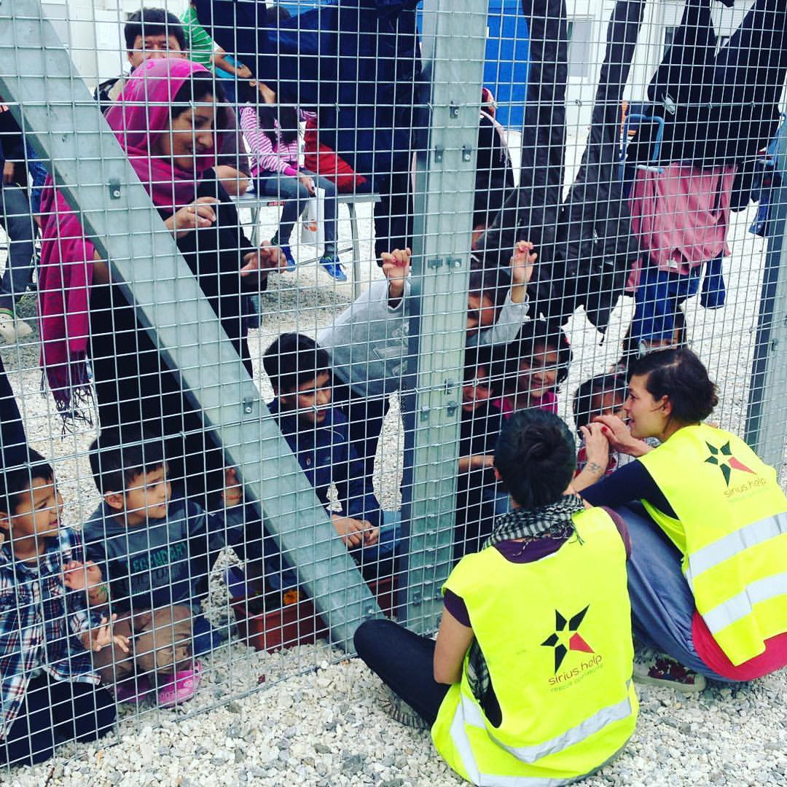

### AYS 06/05/2017: Frontex to be deployed to Serbia and Macedonia

_New plans to fortify EU // Children stranded at the European borders suffer psychologically // New arrivals and calls for help in Greece // Images from detention center in Hungary // British and French governments urged to act and help unaccompanied children from Calais jungle_

Boys play at Kara Tepe refugee camp on the outskirts of Mytilini, Lesvos, Greece, Monday 13 March 2017\. Kara Tepe is a space for the more vulnerable refugee including women, children, and families\. ©UNICEF/UN057951/Gilbertson VII Photo
#### Feature
#### Fortification

European union has a new plan to finalize fortification of its borders\. According to the media reports and the European Council on Refugees and Exile \(ECRE\), the agreement is being negotiated between the EU and Serbia on actions of the European Border and Coast Guard Agency \(Frontex\) \. Apparently, the agreement will allow the deployment of Frontex teams in Serbia to carry out border control activities, including returning people from Serbia\.

Additionally, the same kind of the agreement will be negotiated with Macedonia\.

Experts are saying that this agreement is very controversial becuase it considers the extension of Frontex’ powers\. So far, the Agency was allowed only to offer technical cooperation and support to third countries\. However, the new type of involvement was approved by the Council of the EU and the Parliament in September 2016\. According to this document, it is possible for the agency to take _“actions at the external borders involving one or more Member States and a third country neighboring at least one of those Member States, including on the territory of that third country\.”_ To do that, the EU has to sign an agreement with the third countries\.

The final text of the agreement is not made public, yet\. Nevertheless, the [Statewatch published](http://www.statewatch.org/news/2017/may/eu-frontex-serbia-macedonia1.htm) earlier versions of the proposed agreements with both countries, which are based on a “model agreement” produced by the Commission in November 2016\. Among other things, this document proposes that Frontex officer deployed for this task _“should enjoy a full immunity from the criminal jurisdiction”_ in both, Serbia and Macedonia _“under all circumstances”_ \. Additionally, the proposal is that they should enjoy immunity from civil jurisdiction _“for the acts performed by them in the exercise of their official functions”_ \.

Giving total immunity for armed officers in the foreign country was not success in more than one case in the recent past\.

_“The deployment of Member States’ border guards on the territory of neighboring states is yet another tool to implement the EU’s externalization and containment agenda”_ , [said ECRE Senior Legal & Policy Officer, Kris Pollet](http://www.ecre.org/frontex-2-0-deploying-armed-groups-on-the-balkan-route/) \. _“Notwithstanding the inclusion of a fundamental rights clause, these type of agreements effectively shift the EU’s external borders and may prevent refugees from accessing effective protection in Europe\. Operating such agreements in a country such as Serbia, which UNHCR considers not to be a safe third country, entails increased risks of Frontex’ and Member States’ complicity to serious fundamental rights violations\.”_

By Farhad Foroutanian\. From Art Against\.

So far, the increase of border controls has only made smugglers more rich and the trip even more dangerous\.
### Sea

](assets/315bd8baff5f/1*HlYk8YLkFuLSAf32oVnWFA.jpeg)

By [@MSF\_Sea](http://twitter.com/MSF_Sea)

On Sunday morning, he Aquarius should disembark 729 passengers they rescued from the sea\. The ship is heading toward Reggio Calabria\.
### General
#### Children suffering caused by the closed borders

The UNICEF issued a new report \( [“Refugee and migrant children stranded in European transit countries suffer psychologically in the face of uncertain future”](http://reliefweb.int/report/greece/refugee-and-migrant-children-stranded-european-transit-countries-suffer) \) according to which it is estimated that about 24,600 children are currently stranded in Greece, Bulgaria, Hungary and the Western Balkans\. And all of them are at risk of psychosocial distress caused by living in a protracted state of limbo\.

The situation is particularly acute for single mothers and children stuck in Greece or the Balkans waiting for reunification with family members in other EU countries\.

_“We are seeing single mothers and children stranded in Greece, Serbia, and Bulgaria who have not seen their husbands and fathers for months or even years,”_ said Afshan Khan, UNICEF Regional Director and Special Coordinator for the Refugee and Migrant Crisis in Europe\. _“The family reunification process is slow, and its outcome uncertain, and it is this uncertainty which can cause significant emotional distress and anxiety for children and families, setting them back for years to come\.”_

According to the UNICEF data, in 2016, there were nearly 5,000 family reunification requests\. Out of this number, only 1,107 applicants having reached their destination country by the end of the year\.

Find more about the rules for family reunification from the [News That Moves](https://newsthatmoves.org/en/qa-family-reunification-from-greece-to-malta/) \.

> You are eligible to apply for family reunification:
 

>  If you are an adult \(over 18 years old\), you can ask to live with your spouse or your child;
 

>  If you are under 18 years old and traveling without your parents or a legal guardian, you can ask to join to your mother/father, sister/brother, aunt/uncle, or grandmother/grandfather\. 

#### Police violence against children documented

[Refugee Rights Data Project issued the new report](http://refugeerights.org.uk/wp-content/uploads/2017/04/RRDP_SixMonthsOn.pdf) this time about children who are left alone after the demolition of the Calais camp in October 2016, six months ago\. Local charities are estimating that there are approximately 400 displaced people in Calais and the surrounding area\.

The report concludes that many problems remain unsolved when it comes to basic rights and protection of these children\.

_“The majority have suffered from police violence, including tear gas and beatings\. The lack of safety combined with an absence of recourse to information, advice, and support, is striking\.”_

The report concludes that many of these children are eligible for the reunification under the Dublin Regulation, but the UK is not doing enough for them\. At the same time, the report points out that there is _“an urgent need to provide more humane standards on French soil\. The current state approach of police brutality and intimidation does little to resolve the unsustainable situation that continues to unfold in and around Calais\._ 
_In sum, British and French governments have an urgent role to play in the development of this humanitarian crisis, six months on from the demolition of the camp\.”_

[According to the available data](http://m.bdnews24.com/en/detail/bangladesh/1330582) , people from Bangladesh are now the single largest group of migrants to Europe\. During the first three months of this year, more than 2,800 people from Bangladesh arrived on European shores\. They had to pay over $10,000 to be taken from Dhaka to Dubai or Turkey and onwards to Libya\.

After arriving in Libya, some of the people from Bangladesh had to stay for several years before being able to continue\.
#### Force deportation to Iraq possible in the future

The European Union leaders are discussing the possibility to forcibly deporting Iraqi refugees\.

The EU Ambassador to Iraq, Patrick Simonnet, [told the media in Baghdad](https://www.middleeastmonitor.com/20170505-eu-states-consider-deporting-refugees-back-to-iraq/#.WQ290RAZWSk.twitter) that the EU aims to avoid forced returns, adding that they will cooperate with the Iraqi government on this matter\.

According to the International Federation of Iraqi Refugees \(IFIR\), dozens of refugees in Britain and the United States are being reportedly prepared to be forcibly removed and deported back to war\-torn Iraq\.
### Greece

More people arrived on Friday and Saturday\. On Friday, two boats were picked up by Greek coast guard, one in Chios with 40 people and the other at Lesvos with 55 people\. On Saturday morning, one boat landed on the north of Lesvos at Karakas with 15 people and one at Chios with 37 people, and one on Samos with 15 people on board\.

](assets/315bd8baff5f/1*BvCpluqJYCQmzHBxq0yhug.jpeg)

When luxury meets despair\. Souda camp\. By [@Theurgia\_Goetia](http://twitter.com/Theurgia_Goetia)

CALLS FOR HELP

Solidarity group at Chios need help\. They run warehouse where from they distribute to Souda and Vial, where refugees themselves take to orders and distribute the bags because small teams do not have access\.

> What is needed: 

> \-Women’s underwear \(many pairs\)
 

> \- Men’s and women’s socks \(many pairs\)
 

> \- Boys underwear all ages
 

> \- Women’s and men’s pajamas \(not night clothes\) 
 

> \- Children’s sport shoes
 

> \- Boys trousers aged 8–11 years 

If you can help, [this is the contact](https://www.facebook.com/kostas.tanainis) \.

Lavrio camp needs [experienced English teacher for adults](https://www.facebook.com/groups/204202716585823/permalink/459863351019757/) \.

[Free Movement Skateboarding](https://www.facebook.com/freemovementsb/) in Athens is doing skate classes that are more and more popular amongst refugee girls and boys\.

To help this project, [please donate here](http://bit.ly/HelpRefugeesDonate) \.
### Italy
#### Exploitation of refugees

According to the daily [La Republica](http://www.repubblica.it/.../cosenza_migranti.../...) , two reception centers in Cosenza are closed down after it has been discovering that the managers exploited the labour of refugees in the fields\. People who were placed in the center did not receive planned Italian language classes and a proper integration path\. Instead, they were forced to work in the field and were paid 15–20 euros for 10 hours of work a day\. More than 10 people were arrested in relation to this\.
#### Info guide for refugees

[Italy — Refugee Crisis Database](https://www.facebook.com/groups/1834254390190027/?ref=br_rs) provided an info guide for refugees and migrants, “an instrument designed to make migrants arriving in Italy aware of their rights and give them autonomy in pursuing the path they chose or who will choose\.”

_Contents:_ 
_\- Fundamental rights_ 
_\- What to do if these are violated_ 
_\- Choices and consequences_ 
_\- Useful contacts_ 
_\- mini\-vocabulary and visual dictionary_

[ITALIAN](http://www.lafeltrinelli.it/.../w2italy+italiano+sito+web...) 
[ENGLISH](http://www.lafeltrinelli.it/.../w2italy+inglese+sito+web...) 
[FRENCH](http://www.lafeltrinelli.it/.../w2italy+francese+sito+web...) 
[ARABIC](http://www.lafeltrinelli.it/.../w2italy+arabo+sito+web...) 
[FARSI \(2016\)](http://w2eu.info/)
### Hungary
#### Behind the borders

By SyriousHelp

_“Two days ago, I visited the container camps that are on the border of Serbia and Hungary on the Hungarian side\. I sat like I am sat in this photo below for an hour as 3–5 armed guards sat behind me on a bench smoking cigarettes and chatting,” a volunteer from SyriousHelp group wrote\. “I am at a loss for words to describe the conditions because, on the surface, they are what one might call pristine\. Sterile\. There are potted plants\. The latest law in Hungary allows the detainment of all asylum seekers for the duration of their application, which has been said to be anywhere between 2 and 6 months\. The Office of the United Nations High Commissioner for Refugees denounced this law as did Amnesty International and a variety of other organizations\. The kids wanted me to sing ‘If You’re Happy and You Know It Clap Your Hands’\. I would like to ask you all to imagine for one moment, standing on the other side of this fence, clapping, snapping, stomping and singing this particular song\.”_

Meanwhile, the media published first reports about life in detention in Hungary\.

### Germany
#### Plans for deportations to Morocco

Germany’s Federal Office for Migration and Refugees \(BAMF\) is planning to build homes in Morocco in order to be able to deport children without company who arrived at this country\. [German media are quoting](http://www.dw.com/en/germany-to-build-orphanages-in-morocco-to-deport-minors/a-38724222) a document that leaked to the media saying that two homes have been planned, for now, each with 100 places, at a cost of 960,000 euros per year\.
### France
#### Call for help

[Solidarithe](https://www.facebook.com/solidarithe/posts/1800168293634618?hc_location=ufi) warns that the number of people on the streets of Paris is increasing\.

“Tents are going up at an alarming rate but fortunately we haven’t seen nearly as much police violence as we did this winter when they promptly destroyed tents and kept people moving constantly\.”

Nevertheless, less medical care is provided, which is very concerning as there are hundreds of people living on the streets\.

There are numerous teams supporting refugees on the streets of Paris and they need help:

\- Saint Bernard’s church needs toiletries & clothes \(PM us\)
\- [Utopia 56](https://www.facebook.com/groups/172900819749383/) needs blankets & sleeping bags\. 
\- [La Cuisine Des Migrants](https://www.facebook.com/lacuisinedesmigrants/) needs food\. 
\- [We need VOLUNTEERS](https://www.facebook.com/solidarithe/posts/1800168293634618?hc_location=ufi) , instant coffee, plastic sheet covers & sugar\!
### Finland
#### Precedent ruling

Finland’s Supreme Administrative Court has made [two precedent\-setting rulings in two asylum seeker appeals involving applicants from Afghanistan](https://www.facebook.com/AfgRefugees/posts/1250218388409971) \.

The court ruled that immigration officials should consider the general security situation in asylum seekers’ countries of origin as well as their personal circumstances, precluding forced deportations in many cases\.

> **_We strive to echo the correct news from the ground, through collaboration and fairness, so let us know if something you read here is not right\. Anything you want to share — contact us on Facebook or write to: areyousyrious@gmail\.com_** 

_Converted [Medium Post](https://areyousyrious.medium.com/ays-06-05-2017-frontex-to-be-deployed-to-serbia-and-macedonia-315bd8baff5f) by [ZMediumToMarkdown](https://github.com/ZhgChgLi/ZMediumToMarkdown)._
