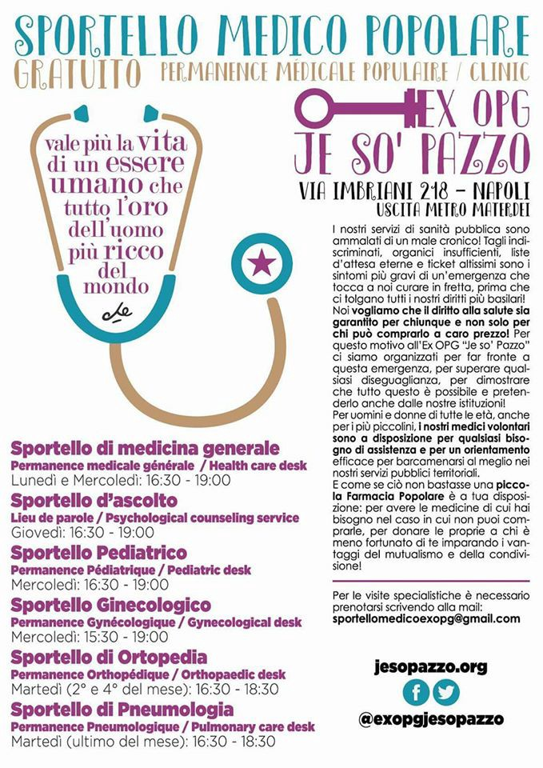

### AYS Daily Digest 07/05/17: About 6000 people rescued at sea
#### Decrease in relocation numbers from Greece in April // Barrack in Belgrade to be demolished soon // Suicide in Milan // EU plans deportations to Iraq

](assets/b6fc6c8c6d2f/1*Q3khn9Spuo_UG4SItrRDRw.jpeg)

Photo by [**SOS MEDITERRANEE France**](https://www.facebook.com/sosmedfrance/)
### Feature

Between Friday and Saturday the Italian coastguard has coordinated dozens of rescue operations that involved the navy, the coastguard, EU border agency Frontex, several NGOs, merchant ships and fishermen that ended up in the successful rescue of around 6000 refugees\. According to the IOM, half were found on Friday including 371 that were rescued by fishermen off the Libyan coast, close to the town of Zuwara\. On Saturday the day was equally intense and teams worked hardly to make sure they could transfer everyone quickly and continue to save more people, sometimes not possible due to lack of resources\. The Libyan coast also participated picking up 170 refugees off Tripoli but failing to rescue other groups\.

[**Sea\-Watch**](https://www.facebook.com/seawatchprojekt/?fref=nf) is one of the NGOs that has been involved in the operations over the weekend and despite the good work they showed some frustration as it was impossible to attend everyone\.

](assets/b6fc6c8c6d2f/1*zrMz6yna9__nCnhEuksarQ.jpeg)

image by [**Sea\-Watch**](https://www.facebook.com/seawatchprojekt/?fref=nf)

With the help of their small plane, Moonbird, they spotted thousands of people in numerous boats but the task was simply too demanding as their comments from Saturday show:

> This feeling of frustration when you cannot help those in need because your hands are tied\. Today the \#Moonbird has sighted over 20 boats in need\. With 274 people on board, the [\#SeaWatch2](https://www.facebook.com/hashtag/seawatch2?source=feed_text) cannot continue Search and Rescue\. 

They also stated today concerning reports of many more people being in danger at sea as since yesterday there had been spotted 8 unattended boats with probably more than 1000 people and the weather was getting worse\. We hope to get news soon from these boats that were left behind and that they were reached in time in the last hours\.

They we also very critical about the lack of support from the European Union and fear a deadly result of the shy European policy of rescue which has proven itself insufficient time after time\.

[**MSF Sea**](https://twitter.com/MSF_Sea) has also been very busy as usual and in cooperation with Seawatch they attended hundreds of refugees taking them to firm land in Italy\. The rescues they did were difficult because of the sea conditions but everyone was reportedly well\.

](assets/b6fc6c8c6d2f/1*1IhQMdj8rX1VokqwYPXPqQ.jpeg)

Photo by [**MSF Sea**](https://twitter.com/MSF_Sea)

 **\-** After a 2nd transfer from [@seawatchcrew](https://twitter.com/seawatchcrew) the [\#Prudence](https://twitter.com/hashtag/Prudence?src=hash) now has 572 men, women & kids on board\. Thank goodness they’re all safe\.](assets/b6fc6c8c6d2f/1*v_vqldH-BbjkG7H2NJ1NqQ.jpeg)

Photo by [**MSF Sea**](https://twitter.com/MSF_Sea) **\-** After a 2nd transfer from [@seawatchcrew](https://twitter.com/seawatchcrew) the [\#Prudence](https://twitter.com/hashtag/Prudence?src=hash) now has 572 men, women & kids on board\. Thank goodness they’re all safe\.
### Turkey

The refugee crisis and the movement of people is certainly not over and many are still trying to leave Syria as the war rages on\. On Saturday, more than 1036 persons were caught trying to cross illegally into Turkey\. 1000 persons tried to cross from Syria and 12 persons were caught trying to cross from Iraq to Turkey\. 10 persons were also caught trying to cross illegally from Turkey to Syria\. Some refugees were also caught close to the borders of Greece and Bulgaria\.
### Greece

[**Mobile Info Team for refugees in Greece**](https://www.facebook.com/mobileinfoteam/?fref=nf) has published the relocation statistics for April and the numbers aren’t exactly encouraging\.

In April the number of relocation applicants transferred to other countries was over 1,200\. This is lower than it was in March, which was a record month with over 1,600 transfers, but it was around the same as it was in February\. On the other hand, the number of pledges \(places made available by other countries\) has risen\. Last month Greece received 2,300 pledges\. These are important to look at as they tell us which countries will receive relocation applications and decide on them in future\. Countries who pledged between 02/04/17 and 30/04/17 include: Sweden \(1,150\), Germany \(500\), Switzerland \(180\), Netherlands \(100\), Ireland \(100\), Finland \(100\), Belgium \(65\), Cyprus \(50\), Lithuania \(50\), Slovenia \(35\), Malta \(20\), Romania \(20\) and Latvia \(14\) \. The biggest story of the month is probably the incredibly high number of pledges made by Sweden \(1,150\) \. Sweden has also already accepted 150 of the applications that were sent to them in April without rejecting anyone\.

For more information, please click on the following [link](http://bit.ly/2pgZLRI) \.
#### Lesvos

It’s well known how bad the conditions are in Moria detention centre but apart from the lack of conditions there’s also a big lack of essential products like medication\. Since there are so many thousands of people stuck on the island this also dries out the resources and people there sometimes have to wait for an appointment for months without getting the appropriate care which leads to a deterioration of their conditions\.

[Better Days](http://Together for Better Days) and Zainabiyya are funding vulnerable cases, working within the framework as well as piloting new referral pathways through collaborations with actors active in medical care on the island\. Through donations they fund dental and medical treatments of dozens of people suffering from debilitating conditions, as well as purchasing medication and paying for diagnostic tests\.

You can support their work that allows refugees to move on, either to Athens where they can receive adequate care, or to a more appropriate shelter where hygiene conditions and medical aid is available and have their conditions visible to asylum experts deciding their fate\. Please consider donating [here](http://www.betterdays.ngo/donate/) \.
#### Mainland

Kathimerini reports that the Education minister will, in the next few days, present a government initiative to enroll child refugees at state schools\.

Around 2,500 refugees are already attending classes at a total of 115 schools across the country, according to current estimates but opposition New Democracy has asked the ministry to explain why only a fraction of the target of 7,000 child refugees had been enrolled at schools and to what extent European Union funding for the project had been absorbed referring significant delays in the realization of policies despite the allocation of EU structural funding for that purpose\. They also showed concerns on how NGOs are involved in this and about the increasing number of unaccompanied minors in Greece and the lack of adequate protection for them\.

In Thessaloniki is starting a teacher training course for anyone planning to offer education for refugees and is centered around teaching English but could be applied to any subject being the only requirement to do this course the ability to participate in English\. If you are interested, please register until May 9th at teachertraining\.thess@gmail\.com\. In case of being interested in future training but unable to attend you can still get in touch\.

Details:

Place: Social Center Steki, Ermou 23, Thessaloniki, 3rd floor
Dates: Thursday, May 11 — Sunday, May 14
Hours: Thur&Fri 7\.30–9\.30pm and Sat&Sun 5–9pm

There is also a **call for English teachers in Lavrio** camp and Organisation Earth is recruiting in the Athens area\. If you are interested plase apply [here](https://docs.google.com/forms/d/1QpXmlPoJz4IdzpeKJ96k5T-VP-U4lGuTDoxU_69Drt8/viewform?edit_requested=true) \.

In the northern camp of Alexandria, the army catering has been stopped and [**Refugee Support Greece**](https://www.facebook.com/RefugeeSupportGreece/) ’s has become more important that ever\. They have opened a small bakery with the support of [Aslam Obaid](https://www.facebook.com/aslam.obaid) which donated Syrian bread ovens that now allows the residents to bake their own bread\. The group supplies all the ingredients but now they need to buy more ovens due to the high demand so please consider supporting them [here](https://mydonate.bt.com/donation/start.html?charity=159328) \.

Also in the north of Greece, a new project called [**TruckShop**](https://www.facebook.com/mobileclothesproject/) **\-Social\-Shop is about to be set up in Thessaloniki** \. The cash program is working well, but non\-food items such as new clothes are still inaccessible due to the cost for many so volunteers hope that this free shop will promote independence while also filling a gap of the cash program\. If you would like to support their work please follow the [link](https://www.betterplace.org/…/50552-truckshop-a-free-shop-f…) \.

](assets/b6fc6c8c6d2f/1*fJ6QHYoUE-RTBtCXSNEUHA.jpeg)

Photo by [**TruckShop**](https://www.facebook.com/mobileclothesproject/)

[**Advocates Abroad**](https://www.facebook.com/advocatesabroad/?hc_ref=PAGES_TIMELINE&fref=nf) has just announced the opening of their new office in Athens\. It’s located at [24 Lagoumitzi Street, Athens](https://www.google.com/maps/place/Lagoumitzi+24,+Athina+117+45,+Greece/data=!4m2!3m1!1s0x14a1bd0166d489e3:0x376f5d2c2ec829dd?sa=X&ved=0ahUKEwi__JLmoc7TAhXOa1AKHRIrA7QQ8gEIJDAA) , office 207 and works between 08:00–19:00, with interpreters available in person and remotely\. A Greek lawyers’ legal aid clinic is also available on Wednesday morning, from 10:30–13:30\.

Their contacts are: \+30 694 888 3150 and [cases@advocatesabroad\.org](mailto:cases@advocatesabroad.org) for both mainland and islands\.

There has been reports from volunteers on the ground about very young children living in an abandoned factory in Patras, where the port that does the ferry link with Italy is and how those children are having to travel by themselves attempting to reach western Europe and then apply for family reunification to try to bring their families together\. It’s reported that children as young as 6 years old are put in these situations and get obviously in a extremely vulnerable situation\.
### Serbia

The Commissariat for Refugees and Migration of the Republic of Serbia has told the volunteers today that the barracks where the refugees live in the centre of Belgrade will be demolished in 20 days\.

They asked for the collaboration of volunteers and NGOs in the field to make the work easier and the plan is, reportedly, to register everyone and get refugees into the Serbian asylum claim sending them to camps although is likely that many refugees wont accept this fate\.

](assets/b6fc6c8c6d2f/1*Ks9_VVgxqfnTDtINR69HmA.jpeg)

Back of the Barracks area viewing the construction site — Photo by [**No Name Kitchen**](https://www.facebook.com/NoNameKitchenBelgrade/)

At the same time volunteers continue to work hard to provide better conditions to the residents of the barracks and [**SoulWelders**](https://www.facebook.com/SoulWelders/) has continued to work on the shower service installed 3 weeks ago setting up the ramps so that the truck has the perfect elevation for the water to drain, improve the drainage system\. In collaboration with [Help\-Na](https://www.facebook.com/HelpNa/) , they have been also doing medical treatments while the showers take place\.

](assets/b6fc6c8c6d2f/1*SBymI8lDuZkZiVQor4fjbQ.jpeg)

Photo by [**SoulWelders**](https://www.facebook.com/SoulWelders/)

](assets/b6fc6c8c6d2f/1*g801f-19qN2xOTKwpnk_HA.jpeg)

Photo by [**SoulWelders**](https://www.facebook.com/SoulWelders/)
### Germany

There were published numbers regarding the situation of refugees in terms of accommodation and the results show that there is still a lot to do to provide decent conditions to many in the country\. The figures show that 15\.000 refugees in Germany still live in emergency shelters, the highest number baing 13\.400 in Berlin\. Another 2\.100 still live in precarious situations such as gymnasiums or other halls with little to no privacy\. 
Last year, 80\.000 persons have left Germany — probably even more, since not all the departures are officially recorded and 25\.000 were deported\.
### France

Calais Migrant Solidarity has done an update about the situation in Calais that continues to be very difficult:

> Many are sleeping in the city now and hanging out in the city parks by day\. Migrants more and more numerous in Calais, nobody knows how many but certainly well over 500, more and more women and children are arriving, still no accommodation, people are just sleeping out without tents because the police destroy any tent they find\. No showers and the police still disturbing food distributions\. Women and children are accommodated by volunteers and local anti\-racists but with numbers increasing it is more and more difficult to find them a place; numerous unaccompanied minors are sleeping in the jungle including boys who are under 15, with the police chasing them, like everybody else they get sprayed in the face with CS gas when they sleep or when they go to try passing, or beaten on the legs so they cannot run and cannot try any longer\. 

](assets/b6fc6c8c6d2f/1*yv4BGU8oMb-7Q0H6WxAODA.jpeg)

Photo by [Calais Migrant Solidarity \(No Borders\)](https://www.facebook.com/groups/calaismigrantssolidarity/)
### Italy

A refugee was found dead this morning in Milan, in the station area\. He committed suicide by hanging on the railroad tracks\. He was found by the police not far from the reception centre and was described as a 31 year old, originally from Mali and had been in Italy for one year and a half now\.

The mayor commented afterwards saying that it’s an absolute priority to strengthen even more the network of social interventions in the country which sounds rather ironic as the “Hub” stopped registering and sheltering newcomers just a few days before this tragedy\.

In a great initiative, The group Feltrinelli and the association [Razzismo Brutta Storia](https://www.facebook.com/razzismobs/) \(Racism ugly story\)have decided to support the guide for migrants « Welcome to Italy » produced by the network Welcome to Europe printing 20'000 copies and distributing them for free in the stores of Feltrinelli in 17 Italian cities\. Some of the copies will be delivered also to the activists of [CarovaneMigranti](https://www.facebook.com/carovanemigranti/) who will distribute them during their tour along Italy form May 13th to 28th\.

You can download the new guides following the links below in [Italian](http://www.lafeltrinelli.it/…/w2italy+italiano+sito+web+fel…) , [English](http://www.lafeltrinelli.it/…/w2italy+inglese+sito+web+felt…) , [French](http://www.lafeltrinelli.it/…/w2italy+francese+sito+web+fel…) and [Arabic](http://www.lafeltrinelli.it/…/w2italy+arabo+sito+web+feltri…) \.

There is also a new medical support service in Naples for free\.

### Donating

Now it’s easy to send phone credit for refugees from far away, just follow the instructions:

](assets/b6fc6c8c6d2f/1*KFWIcIa19Fllc8QjsvHeyA.jpeg)

Image by [**Phone Credit For Refugees**](https://www.facebook.com/top.ups.for.refugees/?fref=nf)
### EU

It was revealed yesterday by an EU official that the European Union’s member states are currently carrying out discussions on forcibly deporting Iraqi refugees to their home country\. It was reported that there has been a meeting on Wednesday about that subject\. The EU ambassador to Iraq said also that the bloc wants to avoid forced returns and will be working with the Iraqi government about this mater\.

At the same time, according to the International Federation of Iraqi Refugees \(IFIR\), dozens of refugees in Britain and the United States are being reportedly prepared to be forcibly removed and deported back to war\-torn Iraq, despite the poor security situation in the country\. Also some figures by the Bureau of Investigative Journalists show that more than 600 Iraqi refugees who spent their childhood in Britain were being removed once they had turned 18 over the past nine years\.

On the same subject it was reported today also that Germany will start deporting refugees from Senegal from the 8th of May, showing clearly the increasing tendency of deportation policies in the European Union\.

> **We strive to echo the correct news from the ground, through collaboration and fairness, so let us know if something you read here is not right\. Anything you want to share — contact us on Facebook or write to: areyousyrious@gmail\.com** 

_Converted [Medium Post](https://areyousyrious.medium.com/ays-daily-digest-07-05-17-about-6000-people-rescued-at-sea-b6fc6c8c6d2f) by [ZMediumToMarkdown](https://github.com/ZhgChgLi/ZMediumToMarkdown)._
