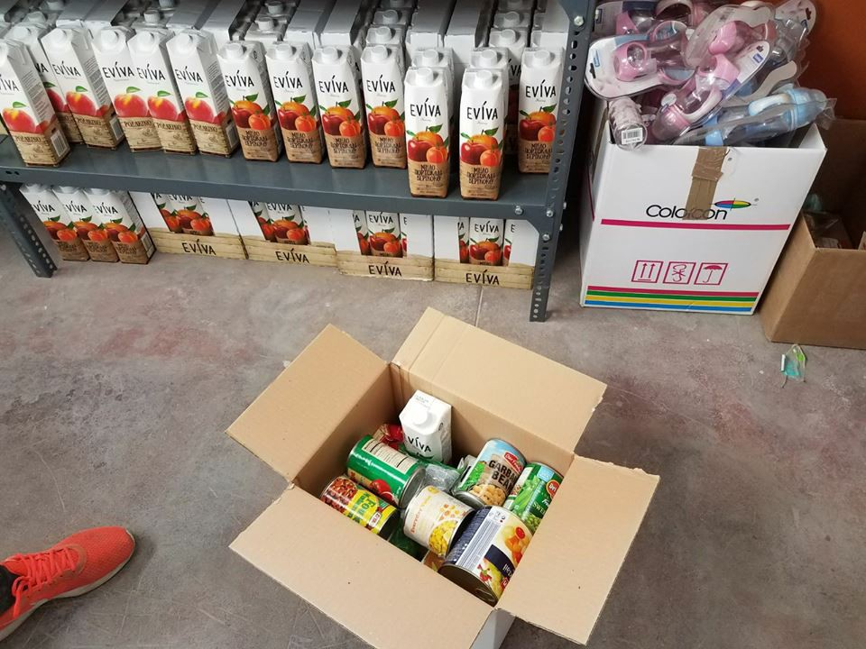

### AYS Daily Digest 08/05/17: 6000 arrivals by sea this weekend, at least 193 lives lost

_Previously unheard audio of a 2013 sinking boat call in the Mediterranean / Evacuation of fighters from Barzeh started / Update on Belgrade barracks demolition / Right wing group attacks solidarity manifestation in Stockholm / Info from Greece and more_

](assets/7c8e127f4c53/1*YiFZGXrt9oLbZ9fGFfS1Ow.jpeg)

source [Sea\-Watch](https://www.facebook.com/seawatchprojekt/)
#### Mediterranean sea during the past weekend

At least 193 people have died in the Mediterranean the past weekend\. 245 are missing among them a pregnant woman who died while waiting to embark on the journey from Libya, [reports](http://www.ilfattoquotidiano.it/2017/05/08/migranti-245-dispersi-in-mare-nel-week-end-donna-muore-di-parto-in-libia-figlio-e-padre-in-italia/3571145/) IlFattoQuotidiano, adding that there were 43245 arrivals since the beginning of the year, with 6000 just from this weekend, which is a 40% increase compared to 2016\. There were two different shipwrecks, in one case 80 people lost their lives, from the second occurring yesterday 113 people are missing while 7 survivors were brought back to Libya and 11 bodies were brought ashore by the sea\. The bodies included an infant, [reports](http://uk.mobile.reuters.com/article/worldNews/idUKKBN1841DC) Reuters\. Many of those rescued bear signs of torture suffered in Libya\.

> Excluding the latest shipwrecks, more than 1,150 people have disappeared or died so far this year trying to reach Italy from North Africa, where a breakdown of law and order has allowed people smugglers to operate with impunity\. 

UNHCR High Commissioner for Refugees, Filippo Grandi [commented on](http://www.unhcr.org/news/press/2017/5/590f216a4/news-comment-united-nations-high-commissioner-refugees-filippo-grandi-mediterranean.html) the past weekend in disbelief about increasing violence used by smugglers\. Grandi said he was “profoundly shocked by the violence used by some smugglers”, somehow finding it shocking that people exploiters would use violence\.

The UN refugee agency has however defended private aid groups rescuing people in the Mediterranean, some of which were targeted and shamefully accused by the Italian right\-wing of cooperating with smugglers in Libya\. Italy’s ruling Democratic Party and the European Commission have also defended the NGOs, [reports](http://m.dw.com/en/unhcr-defends-ngo-charity-groups-over-migrant-rescues-in-mediterranean/a-38747245) DW\.

UNHCR [updated data](http://reliefweb.int/report/world/key-data-europe-sea-arrivals-europe-q1-jan-mar-2017) on sea arrivals in Europe and numbers of dead and missing en route in 2017 in an [infographic](http://reliefweb.int/sites/reliefweb.int/files/resources/56315.pdf) \(pdf\) \.

> **Sea Arrivals** 
 

> 30,617 in Q1 2017
 

> 171,132 in Q1 2016
 

> 361,709 in 2016
 

> 1,015,078 in 2015 

> **Dead and Missing** 
 

> 836 in Q1 2017
 

> 732 in Q1 2016
 

> 5,096 in 2016
 

> 3,771 in 2015 

### “Call Malta”

A previously unheard audio \(posted below\) obtained by the Italian newspaper L’Espresso and [published today](http://video.espresso.repubblica.it/inchieste/cosi-l-italia-ha-lasciato-annegare-60-bambini-in-esclusiva-le-telefonate-del-naufragio/10267/10368?ref=HEF_RULLO) shows a Syrian doctor calling the Italian coast guard from a sinking ship and Italian authorities repeatingly telling him to ‘call Malta’ despite an Italian Navy patrol boat being miles away\. The incident happened in 2013 and there is yet to be an official investigation into the sinking\. L’Espresso writes about there being 268 people, including 60 children\. We will write more about this once there are reactions from the officials\.

#### SYRIA

Evacuation of fighters from Barzeh for the rebel\-held Idlib province in Northwest Syria, as part of evacuation deal agreed with government, has started today, Reuters [reports](http://uk.mobile.reuters.com/article/idUKKBN1840QF) \. White Helmets and medical staff organized a protest in Hama’s countryside:

Syria’s government has dismissed the idea of UN peacekeepers patrolling four safe zones, [reports](http://m.dw.com/en/syria-rejects-un-monitors-for-safe-zones/a-38756673?maca=en-tco-dw) DW\. Walid al\-Moallem, Syria’s foreign minister, said it is “premature” to talk about whether the [deal](http://m.dw.com/en/russia-iran-turkey-agree-on-syria-safe-zones-opposition-cries-foul/a-38698548) with Russia, Turkey and Iran to set up safe zones will succeed\.
#### GREECE

Mobile Info Team posted useful information \(in Eng/Arabic\) on what to do in absence of documents to prove family ties \(see [here](https://mobileinfoteam.blogspot.hr/2017/05/what-can-i-do-if-i-dont-have-documents.html) \) and applying for family reunification from Greece to Germany \(see [here](https://mobileinfoteam.blogspot.hr/2017/05/should-i-apply-for-visa-to-make-family.html) \) \.
#### Leros — arrests following attacks

8 people were arrested in Leros island following numerous racist attacks against refugees and migrants during last week, RSA [reports](https://twitter.com/rspaegean/status/861491786358956032) \.
#### Lesvos
#### The ‘House of Humanity’ facility update

House of Humanity is a project for establishing a safe space for refugees living in Lesvos, Greece\. “We’ve rented a 20,000 square foot facility and, upon opening, can serve up to 550 Syrian, Iraqi, Kurdish, Yazidi, Afghani, Palestinian, African, and Pakistani REFUGEES per day\.” they wrote\. Now they are updating on the progress, which you can also see in a [video](https://www.facebook.com/rafat.hammoud/videos/pcb.1347966478583441/1347963918583697/?type=3&theater) posted today\.

> Over 1500 hangers were used to hang up clothes in the clothing shop which will return to refugees their dignity in the aid distribution process\.
 

> The supermarket is set up but waiting for more stock to line it’s shelves\.
 

> The cafe was built… A fluorescent paint job and it will be ready to serve\!
 

> The entrance and garden area were planted…
 

> An indoor playground for toddlers was built…
 

> Some murals were completed while others just started…
 

> The Art’s Center is well underway and the Women’s Empowerment Center is too\!
 

> The best part is that throughout this process we’ve been able to serve over 800 people… Providing clothing, food, and baby products\!
 

> If not for our amazing team of volunteers \(who happen to also be refugees\) and generous donors we would have never been able to do it…
 

> We are incredibly proud of our progress thus far and cannot wait until all sections are complete\!
 

> THANK YOU for helping us make this happen\! 

Items are needed now to set up a Cafè, see how you can help [here](https://www.facebook.com/Humans4HumanityOrg/posts/1731372466889957?hc_location=ufi) \.

photo source: Rafat Al\-hamoud

There were 44 new registrations on Samos today making a total of 233 over this weekend \(Sat\-Mon\) \.

If you are interested in using your gardening skills to help a community in a refugee camp in Thessaloniki \(in the long term\), consider volunteering in Elpida’s community garden\. It will involve taking care of the 100 plants and getting residents involved in projects developing the garden\. If interested, [contact](https://www.facebook.com/profile.php?id=1466874968&fref=nf) Andrew for more information\.
#### BULGARIA

Only 13 refugees in Bulgaria receive some money as social help from the Bulgarian state, because of their disabilities\. Apart from that, no other refugee in Bulgaria gets any money in some form of subsistence\. The [65 Leva \(33EUR\) a month were taken away](http://bulgaria.bordermonitoring.eu/2015/03/31/no-free-breakfast-for-asylum-seekers-in-bulgaria/) two years ago, [reports](http://bulgaria.bordermonitoring.eu/2017/05/08/only-13-refugees-in-bulgaria-receive-social-assistance/) bordermonitoring\.eu\.
#### SERBIA

The barracks where the refugees live in the centre of Belgrade will all be demolished in 20 days\. Volunteers on the ground said today that there is already a lot of movement in the barracks and 4 buses took over 200 refugees to be registered in the camps\. Serbian Commissioner for Refugees Vladimir Cucić said that a group of around 100 migrants was transferred to the detention center in Adaševci yesterday, and same is expected to be done with another group of about 70 people soon, [reported](http://rs.n1info.com/a247436/Vesti/Vesti/Nastavljeno-izmestanje-migranata-iz-centra-Beograda.html) N1\. The Adaševci transit center is located on the highway next to a single gas station, with nothing around\. Rados Djurovic from the Center for asylum said that people have big problems staying there longer, psychological and otherwise, after having to be there for more than eight, nine months\. This is not a solution for these people, he said to N1\.

No Name Kitchen working on the spot issued a [statement](https://www.facebook.com/NoNameKitchenBelgrade/posts/355090564889234?hc_location=ufi) concerning the situation\.

Residents from the barracks at the Chai Park getting to the bus to go to their designated camps, after realising this is their only chance, photo source No Name Kitchen

BalgrAid needs extra support now to prepare for and help during the eviction/closure of the barracks:

> We have received confirmation that the eviction of 1200 refugees and migrants living at ‘the barracks’ in Belgrade is already starting and this eviction will be done over the next 20 days\. These people are being forced to leave their home once again but many are woefully inequiped to do so\. We urgently need donations so that we can continue to buy and provide essential items such as backpacks, shoes and underware\.
 

> [https://www\.youcaring\.com/belgraid\-797342](https://www.youcaring.com/belgraid-797342) 
 

> A donation of €10 will provide somebody with a pair of shoes, €5 buys a backpack and approximately €2–3 will provide someone with a fresh set of socks and underpants\. Please help us to make this unsettling process as humane and painless as possible\. 

> Big Love
 

> Team BelgrAid 

#### Frontex on the “Balkan Route”

While the latest version of the negotiating mandate is not yet public, _Statewatch_ is publishing earlier versions of the proposed EU agreements with both Serbia and Macedonia, which would allow the deployment of Frontex teams in the countries to carry out border control activities\. Legis examined the agreement and [wrote](http://legis.mk/news/2323/deploying-armed-frontex-teams-on-the-balkan-route-agreements-with-serbia-and-macedonia-on-the-way) on the background and possible consequences of it [being negotiated](ays-06-05-2017-frontex-to-be-deployed-to-serbia-and-macedonia-315bd8baff5f) \. The early draft negotiating directives for both Serbia and Macedonia both include the same summary of what the Council hopes to see in the final agreements, emphasizing broad powers, the ability to carry weapons and exemption from civil and criminal liability, they write\.

Among other concerning parts, the agreement includes, under _Privileges and immunities of the members of the teams and Frontex staff:_

> _They should also enjoy immunity from civil jurisdiction of \[the Republic of Serbia/the former Yugoslav Republic of Macedonia\] for the acts performed by them in the exercise of their offici_ al functions \[…\] immunity from the criminal and civil jurisdiction of the host state and exemption from any obligation to give evidence as witnesses\. 

#### CROATIA

The Croatian Ministry of Internal Affairs updated on the numbers of approved asylums requests until March 2017\. Until now 22 requests have been approved\.
#### ITALY

The first Urban Daspo \(a measure envisaged by Italian law to counteract the phenomenon of violence in the stadiums or places of any sports discipline\) has been “given” to a 22\-years\-old from Nigeria in Saronno, small town in the Italian North, for stationing outside the train station and asking for money, [writes](https://www.autistici.org/lostroligh/primo-daspo-urbano-a-saronno/) Lo Stroligh\. Taken from anti hooligans laws, Daspo is a temporary expulsion from a territory \(in this case the area of the train station in the town for 24h\) \. Other five Nigerian men have been brought to the police station with him and fined\. The urban Daspo was within the new measures proposed by the interior minister Minniti\. It is an administrative measure, applied by the police in autonomy\.

Baobab Experience posted this week’s cooking schedule, find it [here](https://www.facebook.com/permalink.php?story_fbid=1403786143051402&id=1295938570502827) \.
#### SWITZERLAND

The Swiss public may get the chance to vote against the country’s adherence to the EU’s free movement principle as an anti\-immigration body on Sunday announced it would launch a popular initiative on the subject later this year, [reports](https://www.thelocal.ch/20170508/swiss-eu-relations-free-movement-faces-new-challenge) The Local\.
#### UK
#### London — temporary accommodation needed urgently

#### SWEDEN

Number of asylum seekers has increased since the country ended ID checks on crossings with Denmark last week, [reports](https://www.thelocal.se/20170508/more-asylum-seekers-detected-by-swedish-border-controls-after-id-checks-end) The Local\. ID checks on buses, trains and ferries between Sweden and Denmark have been imposed at the start of 2016\. At the same time, the Swedish government announced [strengthening of border control spot checks](https://www.thelocal.se/20170502/breaking-sweden-to-end-id-checks-on-trains-from-denmark) \. The monthly average number of asylum applications in Sweden has been 1,982 in 2017 so far, compared to 4,168 in 2016, and 4,865 in 2015\.
#### Stockholm — attack on a solidarity manifestation

A group of right wing populists attacked a peaceful solidarity manifestation in central Stockholm yesterday afternoon, [reports](https://l.facebook.com/l.php?u=http%3A%2F%2Fwww.dn.se%2Fsthlm%2Fhogerextrema-angrep-manifestation-i-gamla-stan%2F&h=ATPYrCGYV9S6Yd7bvCHKMNj39FZ84ogywdkVHwLXrHd34vYV1hpeEa_2NV0VUQk3DatulAzFs2H-dN087cvernd4PtSJUhLuC4Q9u--itVmEAgPrIIiLRpsJCjBxkxg_x00v9Qs8ezP4iUZRDF79jZ1rZmI8HeiaMPGOn3U-rvkIg2Llbl9CUt7WHhjs29FUitJ4yf_LDV4pQ0LPJEcUW7ikjiGSDa1QYSuOluVvVNdIHX78MwJP_9mhS63b-DZRpJcj2tDI) dn\.sthlm\. Fortunately no one got hurt when around 30 people from the extreme right wing youth populist organisation Nordisk Ungdom crashed the event at around 4pm\. One of the attackers threw a hand flare at the crowd and is now held suspect by the police for some minor crimes\. The aim of the event was to show solidarity and protest against the [new regulations](http://www.regeringen.se/artiklar/2017/03/beslut-fattat-om-nytt-ersattningssystem-for-mottagandet-av-ensamkommande-barn-och-unga/) regarding economic contributions and support that the government decided about on the 9th of March\. The new legislation will be implemented on the 1st of July\. The aim is to make the collaboration between the responsible authority, the Migration Agency and the municipalities responsible for the work on the ground easier and less expensive\. There are different opinions about weather or not this new system will benefit and lower the costs for the state, or actually be good for young migrants\. Neo\-nazi groups in Sweden have been increasingly active, 2016 being a record year with over 3,000 activities carried out by them according to Swedish anti\-racism foundation Expo, [writes](https://www.thelocal.se/20170505/2016-saw-a-surge-in-neo-nazi-activity-in-sweden-heres-why) The Local\.

On May 1st 50 refugee children along with shelter staff were evacuated from the center for lone refugee children prior to a neo\-Nazi march held in the town of Falun, [writes](https://www.thelocal.se/20170508/swedish-refugee-centre-evacuated-before-neo-nazi-march) The Local\. Around 500 people took part in a march by the Nordic Resistance Movement \(NRM\) \. The municipality judged that the risk was high enough to justify moving the children from a shelter in the area to another location for a two day period\. NRM is linked to prior bomb attack on centres for asylum seekers in Gothenburg\.

_Converted [Medium Post](https://areyousyrious.medium.com/ays-daily-digest-08-05-17-6000-arrivals-by-sea-this-weekend-at-least-193-lives-lost-7c8e127f4c53) by [ZMediumToMarkdown](https://github.com/ZhgChgLi/ZMediumToMarkdown)._
