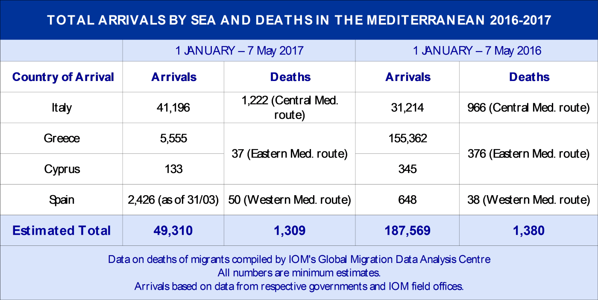
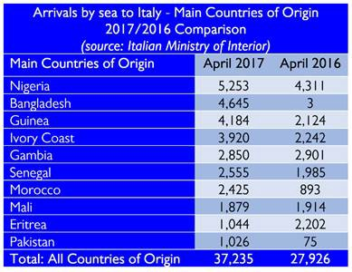
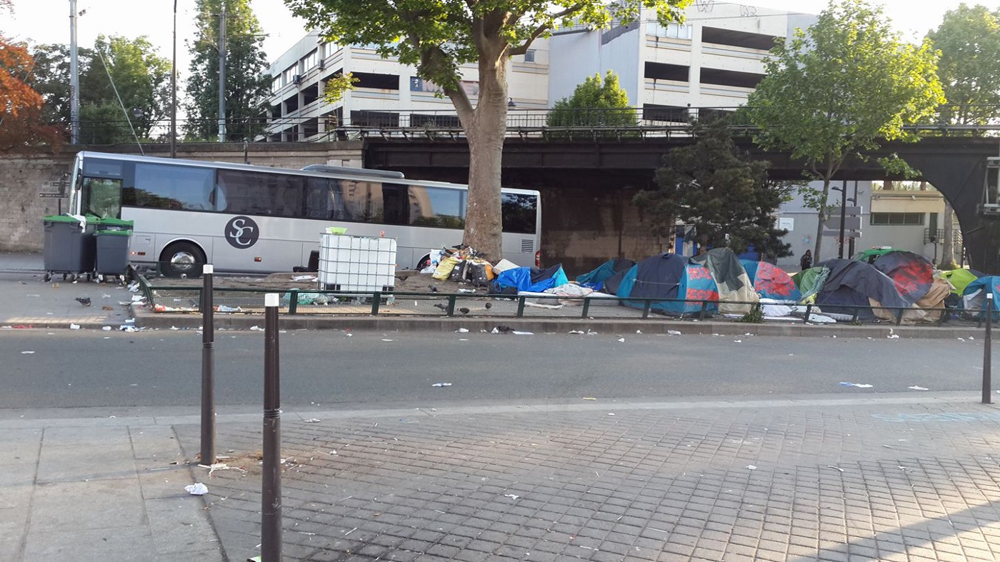
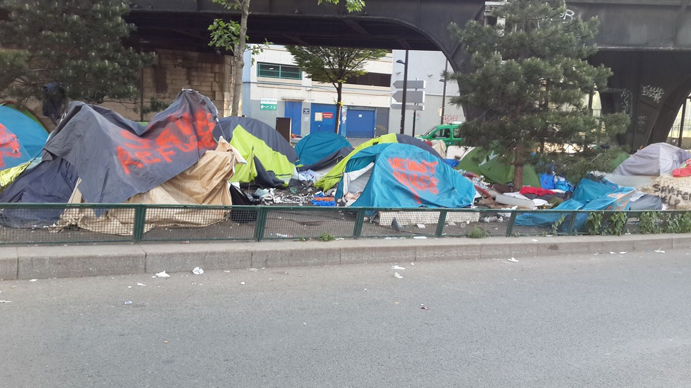

### AYS Daily Digest 9/5/17: Large\-scale evacuations of makeshift camps
#### Hunger strike and evacuation in Belgrade / IOM reports from the sea / Pre\-departure centre to be opened on Chios / 77% more people deported from Austria this year comparing to 2016 / Permanent Centres for Repatriation in Italy / Evacuation at the Porte de La Chapelle in Paris

](assets/a1349184bbbb/1*nyvLKP4ZDrlLXTE1BdXF0A.jpeg)

Belgrade, photo by [Ruhi Loren Akhtar](https://www.facebook.com/ruhi.akhtar.7)
#### FEATURE

■■■■■■■■■■■■■■ 
> **[Milos Markicevic](https://twitter.com/mmarkicevic) @ Twitter Says:** 

> > @[Balkanist](https://twitter.com/Balkanist) massive hunger strike by the refugees at the Belgrade barracks behind the bus stop earlier today. #belgrade #migrantcamp https://t.co/NIuGZt4Kfn 

> **Tweeted at [2017-05-09 13:25:09](https://twitter.com/mmarkicevic/status/861935069107245056).** 

■■■■■■■■■■■■■■ 

These are reactions of the people who are stuck in Serbia, waiting and staying in makeshift camp on the abandoned surface behind the station in the city centre\. They have been staying in the hangars and abandoned factory buildings in the surrounding and the announced evacuation of the area has started\.

The idea that the authorities started applying with some of the approximately 2,000 people staying there is that the minors will be relocated to the camp Krnjača, while the adults will be transferred to the official camp in Sombor\. Some of the volunteers who are helping people who are being relocated have stated that the suspected smugglers are making the process difficult, also causing some serious incidents during the day, intimidating the people and preventing them from taking the food that is being served to them daily in the area behind the station, now ran by BelgrAid and different volunteer groups, previously started by the HFI\.

The Info Park volunteers [report](https://www.facebook.com/infoparkserbia/posts/1305730352814559?hc_location=ufi) that 37 minors were moved to Krnjača during the day, while 55 adult refugees were taken to Sombor\. Some of the refugees might leave the camps to go back to the Belgrade city centre, individuals claim\.

](assets/a1349184bbbb/1*UfOIitOn_E3i2WwkecJxvA.jpeg)

Photo: [Info Park](https://www.facebook.com/infoparkserbia/)

[Team SolidatiTea also reports](https://www.facebook.com/refugeesolidaritea/posts/1042418779193211) about confusion and lack of information among refugees and migrants in Belgrade\.

_“There was a feeling of mass panic; refugees were crowding into a dark room to write their names on ‘the list’, which determined where they would go\. We felt responsible for boys that help us run the tea project and worried for their future\. There is a camp specifically for unaccompanied minors \(under 16\) but this information did not seem to reach them\. Many young boys were boarding the buses to large camps where their minor status may be overlooked and their asylum claim jeopardised\. These young boys are also continually at risk of abuse and human trafficking as they become lost within the system\. The commissariat have the power to make a judgment of age based on appearance\. Without papers no one can argue otherwise\. Laughably, as we speak post\-it notes are being given out as ‘tickets’ for the bus to the minor camp\. A post\-it note to determine a future\. Official?”_

The team will serve the tea until the bulldozers arrive\.

> The Barracks will be “shut down” before May 25th\. 

> The government informed volunteers and refugees that camps will be open, and that all the people will be required to register\. 

> Their fingerprints will not be taken\. 

> The government has made it clear that those without papers in cities will not be tolerated by the police\. 

> To go to a camp people have to register their name in the White house, second floor\. 

> If they come with friends, they may be able to stay in a camp together\. 

> Volunteers will be present in the White house\. \. 

> Transport will be provided to the camps 

#### SEA

**49,310** migrants and refugees entered Europe by sea in 2017 through 7 May, with the vast majority arriving in Italy and the rest in Greece, Cyprus and Spain, [IOM reported](https://www.iom.int/news/mediterranean-migrant-arrivals-approach-50000-2017-deaths-1309) \.

4,841 people have been rescued off the Libyan coast and **218 bodies have been retrieved so far in 2017\.** 
IOM Libya reported this week that since last Friday morning \(5 May\), 685 people have been rescued at sea off Libya, with more than 110 presumed missing\. **The estimated dark number is probably much higher** , [say some of the rescue team members](https://www.facebook.com/seawatchprojekt/photos/a.1579563625595046.1073741828.1578640155687393/1865367653681307/?type=3&hc_location=ufi) of the [Sea Watch](https://www.facebook.com/seawatchprojekt/?fref=nf) \.

> “Having not only risked their lives but perhaps spent all their money and belongings on the chance of reaching a better life and then being rescued only to be transferred to a detention centre must be a horrible and emotionally challenging experience\.” — _IOM Libya Public Information Officer_ 

IOM’s latest detailed Mediterranean infographics is available [here](http://migration.iom.int/docs/MMP/090517_Mediterranean_Update.pdf) \.
#### GREECE
### Family reunification transfers Greece\-Germany limited

The Greek Asylum Service told the Mobile Info Team that the Interior Ministry of Germany has ordered Greece to only allow 70 people monthly to fly from Greece to Germany through “Dublin” family reunification\. This is supposedly because Germany claims to be unable to handle a larger number of applicants\. At the moment around 300 people per months are waiting to be transfered to Germany\.

Please note that this only applies to Dublin family reunification transfers to Germany and not to any other country\. It does not apply to relocation or the visa procedure through the German embassy\.

Please note, that you can still apply for Dublin family reunification to Germany and that the applications are still processed\. There is only a serious delay in the transfer procedure\. — for information in other languages and more updates, please visit the [Mobile Info Team’s page](https://www.facebook.com/mobileinfoteam/?fref=nf) \.
### Preparing for deportation to poor conditions in Turkey

Building of a new, so called _pre\-departure_ centre on Chios has been announced and its exact location will be determined by May 20, [according to](http://www.ekathimerini.com/218253/article/ekathimerini/news/new-migrant-center-planned-on-chios-as-tensions-simmer) the officials\. The pre\-departure centers are places that house refugees who are returning to Turkey\.

By January 9 this year, according to the [Greek sources](http://www.astynomia.gr/newsite.php?&lang) , only 777 people \(predominantly men\) had been returned to Turkey from the Greek islands of Lesbos, Chios, Kos and Samos over nine months; the majority were Pakistanis \(404\), followed by Algerians \(72\), Afghans \(64\) and Syrians \(42\) \. The Turkish law provides only temporary and weak protection for Syrian, Afghan, Pakistani and African nationals\. Still, even that is not effectively implemented and Turkey [reportedly](http://www.fmreview.org/resettlement/tunaboylu-alpes.html) fails to respect the rights of both asylum seekers and refugees\. 
At the same time, a concrete wall, iron barb wire and watch towers will [reportedly](http://harekact.bordermonitoring.eu/2017/05/09/a-new-wall-at-the-turkish-iranian-border-is-being-constructed/) be placed in the border area between Turkey and Iran soon\.
### Athens

The [ECHO Refugee Library](https://www.facebook.com/refugeelibrary/?ref=page_internal) team invite anyone able to join them and build some clever solutions inside their mobile library to send them a message\. “Just a few days work before we prepare to bring the library to new locations around Athens\.”

[Amurtel Centre for Mothers and Babies](https://www.facebook.com/AmurtelHellasforRefugeeMothersandBabies/?fref=nf) is moving to a larger space on Victoria Square, only about a 100 m from the former location\. They are looking for volunteers with a van to help them move and some furniture for the new place:
\- Big table for packing and sorting donations
\- Deep shelves for storage
\- Veranda chairs and table
\- Small kitchen table
\- 2 small desks/tables
\- Desk chairs
\- 1 or 2 burner counter top stove
\- 1 small fridge
\- washing machine
\- Plants
#### AUSTRIA

Almost 2300 have been deported from Austria so far in 2017, according to the Austrian [sources](http://www.bmi.gv.at/cms/bmi/_news/bmi.aspx?id=4D57344130306E444669343D&page=0&view=1) \. Compared to the 1300 in the same time in 2016 this is an increase of 77%\. Further some 1450 people left voluntarily, what raises the total number of people who left/had to leave the country to 3750\.
#### ITALY
### List of new Centres for Repatriation

[The list](https://l.facebook.com/l.php?u=http%3A%2F%2Fwww.corriere.it%2Fcronache%2F17_maggio_09%2Fdove-sorgeranno-nuovi-centri-permanenti-migranti-f9e9cf50-347f-11e7-9331-5ba2d5bdd393.shtml&h=ATMcNaGdeFqXp2MsjTSL_4iJYs6iUiqHEvvFJtJqE-l1Soa633ISCvB8XrSch2sz3Tv2dgi2btqX6ZZHV5Wnu_PMDKZvlUIdqTzRSd0ZPAJ0EeJQS9INU9SZ57Yi4pjB91Y) includes the places where the Permanent Centres for Repatriation will be set, substituting the CIE\. All together, [these locations](http://www.corriere.it/cronache/17_maggio_09/migranti-nuovi-centri-clandestini-identificare-equipaggi-ong-f21d0876-3422-11e7-8367-3ab733a34736.shtml) should host 1,100 people in the next few months; at the moment, Veneto, Liguria and Tuscany are excluded from this plan, but they will have to locate a place where to host at least 100 people each region\. Tomorrow, the municipalities will have to do the same\.
#### Centres by region:

**Lombardia** : Caserma di Montichiari;
**Friuli Venezia Giulia** : il centro di Gradisca d’Isonzo; 
**Piemonte** : il vecchio Cie di Torino; 
**Lazio** : il Cie Ponte Galeria, a Roma;
**Campania** : Caserma Andolfato di Santa Maria Capua Vetere; 
**Basilicata** : Palazzo San Gervaso;
**Sardegna** : il carcere dismesso di Iglesias;
**Sicilia** : il Cie di Caltanissetta;
**Emilia\-Romagna** : il Cie di Modena; 
**Puglia** : il Cie di Bari Palese;
**Calabria** : struttura Mormanno\.

This morning the interrogations in front of the Commission Defense of the Senate will resume, and by Friday morning they should state publicly the conclusions after all the interrogations concerning the sea rescue\. The orientation seems to be towards two new rules, to avoid any suspicion against the NGOs: 
1\) the Coast Guard might be entitled with all the rescuing missions, with the entity in charge of defining the locations for the operations in the sea, preventing the ships to get too close to Libya\. 
2\) All the crews of the private ships could be registered, to avoid collusions of any kind with the smugglers\.
### Accommodating those saved from the sea

This morning, [991 people arrived](http://corrieredelmezzogiorno.corriere.it/salerno/cronaca/17_maggio_09/migranti-bimbo-tre-anni-morto-traversata-sepolto-salerno-6b1f6db8-348c-11e7-8417-4afacc5c5a02.shtml) at Molo Manfredi in Salerno carried by Siem Pilot\. Among them, 701 men, 118 women \(some of them at their ninth month of pregnancy\) and 172 minors\. The ship carried also the corpse of a child \(under 3 years of age\) \. It’s the first time in 17 landings on Salerno’s shores\.

Ship Vos Hestia [arrived in the harbor](http://viveremilano.biz/2017/05/09/migranti-a-vibo-marina-arrivati-548/) of Vibo Valentia Marina, carrying 548 migrants rescued off the Libyan shores\. The group includes 501 men, 47 women \(12 of them pregnant\), 43 minors \(39 of them unaccompanied\) \. 128 of them come from Bangladesh, the most numerous community\. Some cases of scabies have been declared among the migrants, one of malnutrition, a suspected case of tuberculosis, and it seems that a migrant had to have his foot amputated\.
The national plan foresees the transferring of 100 migrants to Lumbardy, 100 to Campania, 100 to Lazio, 50 to Veneto, 50 to Puglia, 50 to Emilia Romagna and 50 to Calabria\.

IOM chart displays that Nigeria, as was the case last year, represents the largest single nationality of migrants arriving in Italy, followed by Bangladesh, Guinea, Cote d’Ivoire and Gambia

IOM spokesperson for Italy, states out loud the drama for the people in Libya waiting to be embarked to Europe\. “The real problem is in Libya, we have information about unspeakable violence, rapes and tortures, and migrants forced to bury other injured migrants alive\. This is the real push factor\. Many manage to leave that country, but the majority faces the risks of the sea”\. The International Criminal Court agrees, while in front of the Security Council of the United Nations, declaring its own intention to open a case on the crimes against migrants in Libya, now a “market for the smugglers of human beings”\.

After a black weekend for the Mediterranean migration, [Di Giacomo talks](http://www.ilfattoquotidiano.it/2017/05/09/migranti-organizzazione-per-le-migrazioni-in-libia-stupri-e-torture-corte-penale-dellaja-apriamo-inchiesta/3572215/) about 6,600 people arrived, some of them reporting signs of torture\. He also stated that the situation would be manageable with Europe’s solidarity, and that last year’s 181 thousand arrivals make for 0\.3% of the Italian population\.

His theories on the reasons for the situation have been backed up by the chief of the International Criminal Court Fatou Bensouda, who confirmed to the Security Council the connections among the migrants’ smuggling, organized criminal and terrorist networks in Libya\. The Court is currently collecting data on the crimes committed at the detention centres\.
#### FRANCE
### Evacuation in the north of Paris

Around a thousand of refugees staying in makeshift camps at the Porte de La Chapelle area of Paris are being evacuated\.

350 members of the police force performed the operation removing the people staying there, mostly of Afghan and different African nationalities\. A total of 1609 people, including 75 women and unaccompanied minors, were taken from the area and sent to the officially provided lodging\. Officials claim that the temporary accommodation will be the place where the people’s legal and other needs will be met and they would be given advice on what to do next, according to particular cases, the [authorities claim](http://mobile.lemonde.fr/immigration-et-diversite/article/2017/05/09/operation-d-evacuation-de-campements-de-migrants-installes-porte-de-la-chapelle-a-paris_5124523_1654200.html) at the moment\.

](assets/a1349184bbbb/1*40cL3eT1Y13dvDACzpccTQ.jpeg)

Photo: [**Faty Tiah**](https://www.facebook.com/fatma.tiah)

Photos: Faty Tiah

_Converted [Medium Post](https://areyousyrious.medium.com/ays-daily-digest-9-5-17-large-scale-evacuations-of-makeshift-camps-a1349184bbbb) by [ZMediumToMarkdown](https://github.com/ZhgChgLi/ZMediumToMarkdown)._
