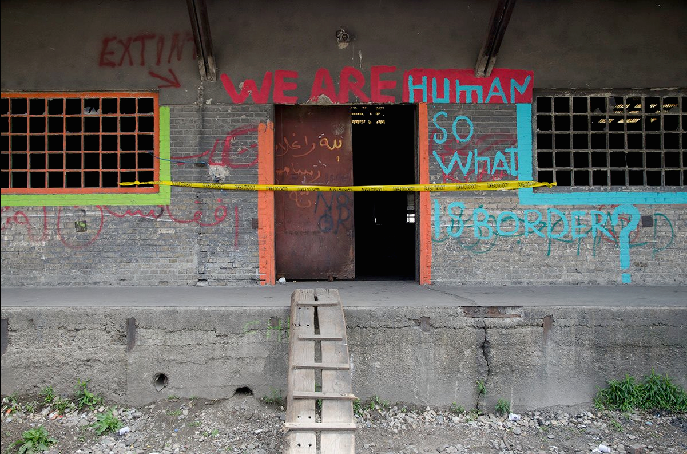

### AYS Daily Digest 10/05/2017: Money talks, humans silenced

_IN THIS ISSUE… More information on the evictions in Serbia / Full video tour of refugee camp in Syria / Positive updates and chances to help in Greece / European Parliament members horrified at conditions in Hungary / More casualties in Italy / Eviction of those gathered around refugee centre in Paris strains local support systems_

Photo Credit: Anonymous Volunteer\. ❤ we thank you
### FEATURE: Money wins over people, again, in Serbia\.

The “evacuation” as in “forcible eviction” of refugees from the barracks in Belgrade continued today, with more footage from volunteers and refugees themselves\. This morning, anyone remaining in the barracks got a rude awakening as a company arrived to spray pest control spray throughout the entire building\. Many individuals had left their belongings inside and now found it covered in pesticide\.

Photo Credit: Anonymous Volunteer — Thank you for contributing\!

Although initial concerns were that the substance was “poison”, it appears to be pesticide in advance of the coming demolition of the building\. The entire area has been slated for demolition in anticipation of the ongoing construction of the highly controversial “Belgrade Waterfront Project”, a project which has many throughout Belgrade and Serbia up in arms due to its funding, stakeholders, and eventual impact on the historic neighbourhood of Savamala\.

Many have wrongly assumed that the government’s approach and systematic targeting of refugees outside of the system is out of a particular anti\-refugee agenda\. The truth is much more banal, yet even more horrifying\. The reality is that refugees are but a small obstacle in the path that the government is pursuing towards “financial investment” in schemes that are rife with corruption and economic destruction\.

The desire to place refugees into a system — that has repeatedly rejected many of them, mind you — is out of a desire to protect the reputation of the system, and the egos and pocketbooks of those managing it\.

Although no one would say that the barracks were a suitable or humane living situation for the hundreds who made it home, the entire official narrative of individuals opting to stay in the barracks is one that is callously out of touch with the very real fears and insecurities of refugees\.

Denying documented instances of individuals refused entry from camps, suppressing reports of violence and inadequate food distribution in camps, and ignoring other reports of individuals who have been pushed back after being admitted into camps, officials maintain an air of complete and utter bewilderment as to why people would choose this situation over camps\.

Additionally, there are multiple reports of officials “softening” their attitudes towards groups that had been assisting refugees in the barracks for months now\. Whereas the previous relationship had been fraught with pushback and threats by police and others, including monitors and checks on volunteers, officials are now trying to bargain with volunteers and grassroots organizations, dangling the idea of camp access in exchange for their departure for the area\. When this doesn’t work, force is threatened\.

In numbers, a report from volunteers is as follows:

> 4 buses left Belgrade today\. \[One\] for kids to Krnjaca, 3 for adults \(one to Sombor, 2 to Sjenica \), potentially 250 people taken\. However people being taken to sid/adasevci camp earlier this week have already returned apparently\. 

A long\-term resident of the barracks posted the following video the morning after initial evictions\.

It appears that a new track of the refugee treadmill is opening, with refugees shuffling and being shuffled from camp to camp, with maybe the chance of escape\.

For those wishing to get an up\-close and personal look at the refugee crisis in Belgrade, might we suggest attending this event “Notes from Invisibility”, which features many respectful, yet intimate photos\.

### TURKEY & SYRIA

For those who have the time, the following is an extensive tour of a refugee camp that is in Syria near the Turkish border\. It can be clearly seen that these camps are not sufficient for the protection and support of a deeply traumatized population\. Furthermore, refugee camps like this one have not been spared attack from various factions in the Syrian war\. The video is courtesy of [One Nation UK](https://www.facebook.com/onenationUK) \.

Across the border and nearing the next border, in Izmir, sadly, things are not much better\. Volunteers at ReVol report that a family of ten in Izmir is in dire straights and is seeking to raise support for them\. Read below:

> Hello friends, we have a family in need of our help\. 

> They have recently arrived from Syria\. They still don’t have IDs, therefore unable to apply for other assistance\. Some children are going to the ReVi School, some work\. The mother is 8\-months pregnant\. The father collects recycling on the streets\. 

> For the first few weeks they were sleeping on carpets that the father found in the trash on the street\. We have given them new mattresses and pillows\. A stove and some food\. 

> The home where they live right now is not good\. We would like to help them to move out and help them until they’re able to get assistance from the UNWFP\. 

> Just as a reference, $200 USD is enough for this family of 12 to have an OK place to live\. So every little bit can make a big difference\. Please donate at [https://revifamily\.org/familyof10](https://revifamily.org/familyof10) 

> Thank you all for the help\! 

They are close to their goal, and together we can help them break it\! ❤
### GREECE

Small slivers of light in Greece, yet more work and support is needed\.
#### Thessaloniki

The [**Keep Steki Plugged In**](https://www.facebook.com/KeepStekiPluggedIn/?hc_ref=PAGES_TIMELINE&fref=nf) project aims to provide support for the Antiracist Initiative of Thessaloniki and theSocial Center / Immigrants’ Place in Thessaloniki which is being threatened with closure and further action due to a debt that totals around 90\.000 euros\! The groups have been trying to stay afloat under these immense debts, which are mostly due to electricity — a basic necessity\. If you can help, please consider donating to this group\!

The campaign is also on [YouCaring](https://www.youcaring.com/KeepStekiPluggedIn) and you can follow updates on the linked facebook page\.

Additionally, InterEuropean Humanitarian Aid has posted a call for volunteers in both Greece \( **Thessaloniki** \) and Serbia\.

> We’re urgently looking for volunteers to join our team in Thessaloniki over the next weeks\. 

> Together with our partners [TruckShop](https://www.facebook.com/mobileclothesproject/) and [Team Bananas](https://www.facebook.com/TBananita/) , we operate a huge warehouse and run distributions and activities in various refugee camps in the area\. 

> In particular, we’re looking for volunteers with a driver’s license \(truck or fork lift license a huge asset\! \), but anyone can make a difference\! 

> Interested?
 

> Check out our volunteering FAQs and sign up on our website: [http://www\.iha\.help/en/help/donating\-time/](https://l.facebook.com/l.php?u=http%3A%2F%2Fwww.iha.help%2Fen%2Fhelp%2Fdonating-time%2F&h=ATOxlkKTCAR2A_UuvQO8xiX3QaXnHok9FppFlrGjw2-qYVH1nJ2VCy0xW8rlLPZG5jYQGvA6ZdOqUebyRoLlVeQRZvtXenUWNNrL1FlekolPEWwmEbeIE0Q6amJyb2yfaPvWXfBWiojqOinZvSDsSMO4Q4Y&enc=AZPjLxzvrUh-x2lU_6nGRICDaM8O_x_bb1U-boxQ_pk2rK01d4B6zRbjOWN6oI2RLRhg_m08eIn7HtC5HA2iNP9B3_tQ-1gNko0FkvEzLiItwqsZZkX9h47PJozCCHIB9I8rpulW4L9b9mQlAHA6-4hNY9Rzxlj_86iGZ_sVKCSOTlZgXIMmJdE_a31gGRJDSMs&s=1) 

> Furthermore, our friends [Aktion Weitblick](https://www.facebook.com/AktionWeitblick/) are looking for a group of 2–3 volunteers to support their project \(cooking & food distribution\) in Serbia\. Contact them directly for more information\. 

#### Athens

Drop in the Ocean, a long\-term presence in refugee support in Greece is now opening a cultural center, specifically targeting refugees who are waiting to be relocated to Norway\. Even after they are notified of their destination, many refugees have to wait for two months before actual relocation\. The “Drop\-in” centre will provide these individuals with information about life in Norway, introductory Norwegian classes, and other cultural projects\! Way to go\!

Another example of solidarity and inclusion winning out comes from a small village 1\.5 hours from Athens, **Kaparelli** \.

Another day in the village at kaparélli, more and more are coming to support the project, refugees and in solidarity, Syrians, Greeks, but also Americans, Brits, Spaniards… want to see, to experience, to work in the fields, to help with Technical support, to be part of this effort more and spreads and can name it “Refugee Village” or… “ productive self\-sufficiency through education and solidarity”

Follow their journey \(in Greek\) [here](https://www.facebook.com/5olikeio/posts/1757078274318794?hc_location=ufi) \.

Intervolve is supporting a new library project, located in a “bright yellow container,” which is getting a new use in **Koutsochero** \!

> Koutsochero is a camp in Central Greece, about 20 km from the city of Larissa, where InterVolve has recently started working\. There are 1000 residents here, about half of whom are children, but there are few activities for them to do and minimal psychosocial infrastructure\. We are hoping to change that, starting with the library…\. 

Photo credit: Intervolve

> We are working with several teachers who live in the camp and who will help us run the space, and yesterday, as we started setting up and putting out the books in preparation for our official opening today\-but we quickly had about a dozen curious children of all ages sitting inside quietly on the colourful cushions, flipping through the books and helping each other sound out the words\. Several of the teenage boys stopped by as well, and were especially excited at the opportunity to practice their English, copying out the words carefully into a notebook\. 

_We would like to give a huge thank you to Team Kalochori for donating the library to us, as well as to volunteer Mandy Gillam who we understand was the original creative force behind establishing the library there\._

Read more about the project [here](https://www.facebook.com/permalink.php?story_fbid=451594981845562&id=219418945063168) \. They also need donations of books to stock the library, so follow closely\!
### HUNGARY

The representatives of second\-largest political group in European Parliament visited Hungarian reception/detention centres and were appalled at what they found\.

> “The conditions asylum seekers are facing in Hungary are grim…\.Within the Röszke Transition Zone on the Hungarian\-Serbian border, women, children and whole families are locked in narrow spaces and require a police escort to even visit a doctor\.” 

Sadly the realities of these camps have been known to volunteers for ages now\.

It is hoped that more visits like this will impress upon European parliament to take more substantive measures at protecting refugees inside of Europe\.

[Source](https://www.neweurope.eu/article/sd-meps-shocked-refugee-conditions-hungary/)
### ITALY

Sadly, groups report two more incidents occurring in Ventimiglia\. One man was seriously burned while attempting to climb onto a train bound for France\. Another fell from a railway and most likely suffered head trauma, but is being treated in a hospital\. [**Alharaz**](https://www.facebook.com/Alharaz311850302563176/) reported on this\.

Photo Credit: Alharaz
### FRANCE

Volunteers and refugees are scrambling after the eviction at Porte de la Chapelle\. Yesterday, police showed up, and people had to scatter again\. Volunteers and activists highlight that no matter the outcome, evictions are always violence and cause massive trauma and re\-victimization to an already vulnerable population\. The article further highlights the absurdity of the situation when a centre that was legitimately set up to house refugees becomes overcrowded — rather than thoughtfully expanding the capacity of the camp, the authorities choose to take measures of violence out on the population that is being “protected\.” It is exactly behaviors like this that help strengthen all structures outside of official ones, including groups that specifically target vulnerable people\. The government on one hand decries the formation of gangs, yet does everything it can to incentivize their formation\. Read the full article [here](http://Eviction of Porte de la Chapelle camps : when insufficiency calls for violence) \.

The same group published a detailed report on the increasing back\-and\-forth between Norway and France\.

> Norway has quite restrictive policies concerning protection quota for Afghan refugees with protection rates as low as 22%, whereas France still grants 80% of Afghan refugees protection\. — Some of the refugees, after getting rejected by Norway, continue their journey to France and hope to be accepted there\. Unfortunately, due to Dublin III, France will send these refugees back to Norway where, without any further legal assistance, refugees might be deported to Afghanistan within a couple of days\. 

The original [article](https://passeursdhospitalites.wordpress.com/2017/05/10/alerte-nouvelles-expulsions-vers-la-norvege-risque-dexpulsion-vers-lafghanistan/) , in French, includes links to where people can support individuals being threatened with deportation\.

[**Solidarité migrants Wilson**](https://www.facebook.com/Solidarit%C3%A9-migrants-Wilson-598228360377940/?fref=nf) is providing assistance to those in the wake of the evictions, under the eyes of police\. \(Translated\)

_“This morning, we offered breakfast to about 100 persons\. There are still people who sleep outside or in unacceptable accommodations\. Minors, fresh arrivals, or those who have been elsewhere during the eviction\. Polices officers watch that no new camp will build up, and are sending away a quite a number of people who are approaching the center\. — But the all the poverty won’t just disappear like with a magic wand\! We will continue to be here every morning\.”_

[**Solidarithé**](https://www.facebook.com/solidarithe/) also posted a comprehensive update complete with maps as can be seen in some of these photos\. Check out the original [post](https://www.facebook.com/solidarithe/posts/1801782720139842) \! As they say, it is helpful for ANYONE sleeping rough on the streets\.

Photo Credit: Solidarithé\.

> **We strive to echo the correct news from the ground, through collaboration and fairness, so let us know if something you read here is not right\.** 

> **Anything you want to share — contact us on Facebook or write to:areyousyrious@gmail\.com** 

_Converted [Medium Post](https://areyousyrious.medium.com/ays-daily-digest-10-05-2017-money-talks-humans-silenced-452c1f76e18) by [ZMediumToMarkdown](https://github.com/ZhgChgLi/ZMediumToMarkdown)._
