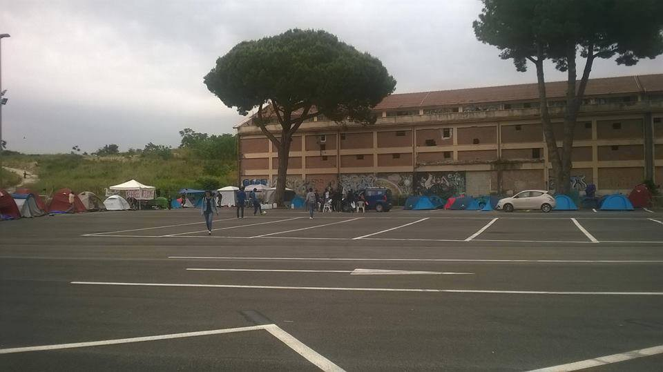
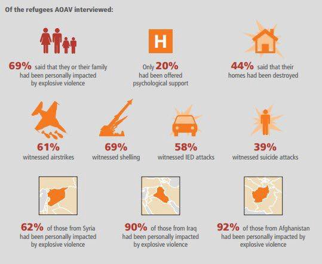

### AYS Daily Digest 11/05/2017: Naval force jeopardizes volunteers and refugees

_Lybian navy puts Sea\-Watch crew and guests at risk\. Miserable conditions for people stuck on Chios and new deportations taking place\. Barracks in Belgrade demolished\. Germany sees increase of Turkish asylum seekers\. Frightening reports from Italy\. Support needed in Calais and Paris\._

 , Credits: Raoul Kopacka](assets/7fce91d841b0/1*7YjyvGwsnjiJct5tOTbAeA.jpeg)

Footage of the incident\. Screenshot: [Sea\-Watch Video](https://www.facebook.com/seawatchprojekt/videos/1865822903635782/) , Credits: Raoul Kopacka
### Feature

“ _I thought now they are sinking our ship\.”_ The moment, when a patrol vessel of the Libyan navy nearly collided into boat of the Sea Watch was horrific for captain Ruben Lampert\. A surveillance camera captured the scene, showing how close the patrol was and put all people on board at risk\.

_“They put the lives of the Sea\-Watch crew as well as those of several hundred refugees into danger during a return operation that breaches both international and sea law\. \[…\] Their aim was to bring a refugee boat from international waters back to Libya”_ , the NGO said in a [statement](https://sea-watch.org/en/libyan-navy-is-putting-sea-watch-crew-and-refugees-into-danger-during-an-illegal-return-operation/) \.

‘ _Especially shocking is the recklessness with which this maneuver and illegal return was performed’_ , says Captain Ruben Lampart\.

[Der Standard](http://mobil.derstandard.at/2000057382579/Kampf-um-Fluechtlinge-vor-libyscher-Kueste) was on board when this maneuver happened and published a background article in German\.

What makes this incident even more extraordinary is the fact, that the Lybian coast guard is funded by the EU\.

During the last weeks Frontex and politicians accused NGOs like Sea\-Watch to collaborate with smugglers and support their business, risking the lives of the people fleeing to Europe\. At the same time the EU is supporting and financing the Lybian coast guard, which reportedly returns boats illegally from international waters to Lybia and with reckless actions jeopardizes both, volunteers and refugees\.

Sea\-Watch got the request to rescue the boat from the Italian coastguard\. “ _We wonder to what extent European authorities were involved in the questionable operation on Wednesday\. If the European Union actually incites the Libyan Coast Guards to carry out illegal actions, that is a scandal”_ , says CEO Axel Grafmanns in a [second release,](https://sea-watch.org/en/pm-sea-watch-demands-independent-investigation-of-the-illegal-return-of-an-overcrowded-wooden-boat/) where the NGO assumes that the EU plays a role in this illegal return operation\. They further demand an independent investigation on the illegal return of the refugees\.

Also the crew of Jugend Rettet witnessed tragic scenes during the last days\. Because their ship was already full, they could not rescue any more people and saw at least five vessels disappearing in the Mediterranean\. “ _The NGO ships are forced to carry the bulk of maritime rescue alone\. There is still no signal from the EU to support the dramatic situation\.”_

### Syria

The Syrian Network for Human Rights [released](http://sn4hr.org/blog/2017/05/11/40490/) it’s new report, documenting some of the worst violations in the Syrian war in April 2017:

> The report documenting the civilian death toll for this month, entitled “1014 Civilians Killed in April 2017”, stresses that the Syrian and Russian regimes have recorded the highest toll of civilian kills since November 2016, where the two regimes were responsible for 71% of total civilian deaths this month\. 

→ [See the full report](http://sn4hr.org/wp-content/pdf/english/The_most_prominent_outcome_of_the_April_2017_en.pdf)
### Greece
#### Islands

A resident of Vial camp, Chios, [reports](https://www.facebook.com/groups/ROYartsaveslives/permalink/1341855759237422/?hc_location=ufi) , that UNHCR stopped the bus connection from the camp to the city, unless they have an appointment\. They had no running water and receive only 90 Euro to live\. The situation on Samos seems to be similar: Resident reportedly get only four liters of water a week \( \! \) and have to face hygenic troubles\.

Meanwhile 14 people were deported from Chios to Turkey on Wednesday noon\. [It’s being said](https://www.facebook.com/refucomm/posts/438884546463353?hc_location=ufi) , they accepted the offer of the Greek government to withdraw their asylum application and [received some cash in return](https://euobserver.com/migration/137762) \. With other people from Lesvos and Samos they boarded a plane and were transferred to Adana\. Another 35 people were deported from Kos today, for tomorrow deportations are [scheduled](https://www.facebook.com/advocatesabroad/posts/427187527641654) from Lesvos\.

■■■■■■■■■■■■■■ 
> **[City Plaza Squat](https://twitter.com/sol2refugees) @ Twitter Says:** 

> > 35 #refugees #deported today from #Kos island of #Greece. 
#StopEuTurkeyDeal #StopDeportations #StopFortressEurope https://t.co/Sem2DmltTy 

> **Tweeted at [2017-05-11 17:22:22](https://twitter.com/sol2refugees/status/862719541922680833).** 

■■■■■■■■■■■■■■ 

But the 14 people were not the only ones leaving Chios\. An independent volunteer, who is familiar with the situation on the ground, released, that Praxis, MdM, Waha, NRC and Save the Children won’t be present any longer\. NRC stated, that the EU funding is expiring in July and will go to the Greek government after\. They are available to stay longer but need ongoing funds to be present\. According to media reports Praksis employees have not been paid for three months now and 25 of them will lose their jobs because of the financial cuts\.

■■■■■■■■■■■■■■ 
> **[Chios Monitor](https://twitter.com/ChiosMonitor) @ Twitter Says:** 

> > "The following organizations are leaving #Chios: Praxis, MdM, Waha, NRC, Save the Children. Uncertain what will happen with the #Refugeesgr" [twitter.com/theurgia_goeti…](https://twitter.com/theurgia_goetia/status/862388214044266496) 

> **Tweeted at [2017-05-11 10:56:57](https://twitter.com/chiosmonitor/status/862622551494754304).** 

■■■■■■■■■■■■■■ 

■■■■■■■■■■■■■■ 
> **[NRC](https://twitter.com/NRC_Norway) @ Twitter Says:** 

> > @[ufroese](https://twitter.com/ufroese) We’re waiting for info on who to hand over to &amp; focusin on serving refugees. We’re available to stay longer, if we have funding. 

> **Tweeted at [2017-05-11 09:54:36](https://twitter.com/nrc_norway/status/862606861576675328).** 

■■■■■■■■■■■■■■ 

■■■■■■■■■■■■■■ 
> **[Bruno Tersago](https://twitter.com/BrunoTersago) @ Twitter Says:** 

> > #Chios Greece/NGO Praksis stops operating in #Vial #Hotspot - 25 employees lose job. Claim not been paid in 3 months [astraparis.gr/apolithikan-ap…](http://astraparis.gr/apolithikan-apo-tin-praksis-25-ergazomenoi-stin-vial/) 

> **Tweeted at [2017-05-11 10:59:02](https://twitter.com/brunotersago/status/862623073274650626).** 

■■■■■■■■■■■■■■ 

On Lesvos 46 new arrivals were registered until morning after two days of no new registrations at all\. Volunteers counted more than 100 arrivals during the day\.
#### Mainland

RTI is inviting everyone to participate at their cultural sensitivity workshop\. It will take place on 16th May 17\.00 o’clock at Solidarity Now location in Thessaloniki\. During these 2\.5 hours they want to build an understanding of cultural difference so that volunteers can better meet the challenges of cross\- cultural work\. Participants are asked to fill out this [sign\-up sheet](https://www.surveymonkey.com/r/VYDDHWZ) \.

Refugee Info Bus ran a photography workshop throughout Greece\. The results will be published soon, a small preview of the amazing pictures can be found on their [Facebook page](https://www.facebook.com/RefugeeInfoBus/posts/1956889257879826) \.

The trial of the arrested people during the [Albatros eviction](https://www.facebook.com/NoBorderCampThessaloniki2016/posts/1312977985483323) in April has again been postponed and is now scheduled to 15th December 2017\.

While there are a lot of news about deportations, at least to individuals announced, that they will be relocated from Filippiada to Sweden after waiting in the camp for almost 14 months\.
### Serbia

While it was reported that the eviction of the barracks in Belgrade will be done within a couple days, authorities apparently prefered a short process\. BelgrAid complains, that “the residents were not given sufficient notice to leave the area”\. Most of them were taken to six open structures across Serbia\. But some are still residing in the Serbian capital with unknown future\.

The government threatened anyone without papers with arrest and deportation\. While it seems, that the eviction was mostly peaceful but chaotic, also some cases of violence —including the use of insecticide in the beginning — were reported\. Nevertheless it is feared, that new makeshift camps will be set\-up in future as the people are receiving insufficent support in the official sites\. Several groups announced, that they will be prepared to respond the new situation\.

](assets/7fce91d841b0/1*izZUtRwUCLS_g0S5eoQckw.jpeg)

The barracks are demolished\. Credits: [BelgrAid](https://www.facebook.com/belgraid/posts/1891930881053924)

People, who now want to move to official camps, can get in touch with [Info Park](https://www.facebook.com/infoparkserbia/?fref=ts) for more information\. Also staff from Novi Sad Humanitarian Center is willing to provide support, Refugee\. Info [reports](https://www.facebook.com/refugee.info/videos/1398856030174540/) \. A map with camps across Serbia can be found [here](https://www.google.com/maps/d/u/0/viewer?mid=1DzRJWy_nFk08arCQNqgnjhnGzjo&ll=44.21863118544868%2C20.95101354999997&z=6) \.

For the ones in and around Belgrade, who want to increase their Serbian language skills, Refugee Aid Miksalište provides courses on Monday, Tuesday, Thursday and Friday at 5 pm\.

](assets/7fce91d841b0/1*766RP2XP-uO7GzPTYic-WA.jpeg)

Language course in Belgrade\. Credits: [Refugee Aid Miksalište](https://www.facebook.com/RefugeeAidMiksaliste/posts/1876372662629349)
### Germany

In 2017 the Federal Office for Migration and Refugees \(BAMF\) so far has worked on more than 1600 asylum applications of Turkish citizens\. Some 18% have been answered positively\. Last year the quota was around 8%\. Most of the asylum seekers are kurds\.
Since the coup attempt in Turkey around 400 people with diplomat or green IDs asked for asylum, reports “Die Welt” \(via [DLF](http://www.deutschlandfunk.de/asylantraege-anerkennungsquote-tuerkischer-bewerber-steigt.1939.de.html) \) \.
### Italy

Six to eight beds per room, no warderobes, no electricity, no windows holes in the ceiling and water on the floor when it rains: These are the conditions in the reception center of San Martino, runned by the Red Cross, described by [Il Secolo XIX](http://www.ilsecoloxix.it/p/genova/2017/05/10/ASms56LH-finestre_migranti_irrespirabile.shtml) \. Set up as a temporarily shelter, people are usually staying for around six months in the former hospital\.

For each of the 50 hosted people the Red Cross received 35 Euros per day to shelter, feed and support them\. Being informed by the media about the conditions in the center, the prefecture had an overview of the place\.

“ _Possible delays in the Public Administration’s payments are not a valid justification,”_ the prefecture commented, “ _two rooms lack windows \(Il Secolo XIX refer of more in this condition\)”\._ The ten guests occupying them will be transferred to another centre\. “ _We will send a letter to the Red Cross urging to take measures to solve these lacks, guaranteeing cleaner spaces and improving the structure’s management”,_ he said\.

In Rome Around 120 refugees sleeps in tents on old parking slot in Via Spinelli\. Most of them are men\. Women and children have the right to sleep in centers, but only at night – in the morning they have to leave the facilities and come back here\. The place shown in the pictures is the new Baobab place after more than 10 evictions\. During some of them all their belongings of the people, including tents, were taken\. There is no electricity and there are no toilets\. It’s up to volunteers to at least provide water in canisters\.

The new Baobab place in Rome\. Credits: AYS volunteer
### France

Help Refugees [reports](https://www.facebook.com/HelpRefugeesUK/photos/a.123267671367248.1073741830.111893659171316/427969517563727/?type=3) a sharp increase of people in Calais and Dunkirk\. Alone during the last week they supplied 700 people with some 18 000 items\. Under the lead of Refugee Youth Service they also set up a child protection team\.

After the eviction of Paris in the beginning of the week they are expecting more arrivals and request thick blankets, sleeping bags and size 41,42,43 trainers\. If you can contribute, please contact calaisdonations@gmail\.com or visit their [fundraiser](https://mydonate.bt.com/fundraisers/calaisdunkirk-refugee-support) \.

](assets/7fce91d841b0/1*aCcCd-fKwAOSsyy6wCMoDw.jpeg)

Volunteers distributing goods in Calais\. Credits: [Help Refugees](https://www.facebook.com/HelpRefugeesUK/photos/a.123267671367248.1073741830.111893659171316/427969517563727/?type=3)

Also in Paris volunteers are in need of support\. Some people were still left on the streets after the eviction and it is likely, that they are still there\. There is a need for hygiene products: Shampoo, Shower Gel, soap, soap for the laundry, body cream, razors and shaving cream, toothbrushes, toothpaste, sanitary towels for women, diapers for kids, handkerchiefs\. Also men’s trousers \(jeans\) Size 38 to 46, socks, shoes from 40 to 45 season, jackets, belts, underwear, T\-shirts, sweaters, shirts s, backpacks, bags Sleeping Bag\.

More volunteers are needed to sort and dress the women and children on Friday and Saturday to dress the men\. Is note by SMS to 0603027372\. you will find all the information and the complete list of emergency room\. Donations can be dropped on Fridays from 15 pm to 19 pm and Saturdays from 9 pm to 16 pm\.

](assets/7fce91d841b0/1*PuSQnRw-rpr958tfZcCzog.jpeg)

Impressions from the eviction\. Credits: [Care4Calais](https://www.facebook.com/care4calais/photos/pcb.1537541399612145/1537535462946072/?type=3&theater)
### Sweden

The government [decided](http://sverigesradio.se/sida/artikel.aspx?programid=83&artikel=6693753) to prolong the border controls from today\. The governments decision means that the Swedish border controls in Skåne, Västra Götaland and at Öresundsbron will be in use as long as the EU\-ministers decides they are needed\. The European Comission has adviced them to be prolonged for at least another six months\.

The police is [critizised](http://www.dn.se/sthlm/polisen-far-kritik-efter-att-manifestation-angreps/) after their actions, or lack of actions, during the demonstration last Sunday\. A volunteer says, even after the police was called because people were harassed by right\-wing extremists, at first they did not protect the unaccompanied minors who were attacked\. The police didn’t take anyone in custody, she says and also questions why the police wasn’t there from the beginning\.

The police spokesperson in Stockholm, Kjell Lindgren, defended the absence of police officers in the beginning of the protest\. She said they do a security evaluation before demonstrations and solidarity events and in this case they assumed that it wasn’t neccessary\. At this point the police is going through material from the event to see, if there is some evidence from the incident that reveals any other crime than the fire bomb\.
### General

In 2016 some 63 000 unaccompanied minors have been registered in the EU\. More than 50 percent have them came from Syria \(19%\) and Afghanistan \(38%\) \. This number means a decrease of around one third but is still five times higher compared to the average of the previous years, an EU report [reveals](http://ec.europa.eu/eurostat/documents/2995521/8016696/3-11052017-AP-EN.pdf/30ca2206-0db9-4076-a681-e069a4bc5290) \.

“Action on Armed Violence” [researched](https://aoav.org.uk/wp-content/uploads/2017/03/The-Refugee-Explosion.pdf) , what kind of violence people seeking refuge in Europe experienced in their countries\.

Key findings of AOAV\. Credits: Action on Armes Violence

Volunteers started a [fundraiser](https://gogetfunding.com/hope-for-salam/) to provide Salam Aldeen, founder of Team Humanity, legal support\. He has been arrested on Lesvos and accused of human trafficking and is facing a trial\.

> **We strive to echo the correct news from the ground, through collaboration and fairness, so let us know if something you read here is not right\.** 

> **Anything you want to share — contact us on Facebook or write to:areyousyrious@gmail\.com** 

_Converted [Medium Post](https://areyousyrious.medium.com/ays-daily-digest-11-05-2017-naval-force-jeopardizes-volunteers-and-refugees-7fce91d841b0) by [ZMediumToMarkdown](https://github.com/ZhgChgLi/ZMediumToMarkdown)._
