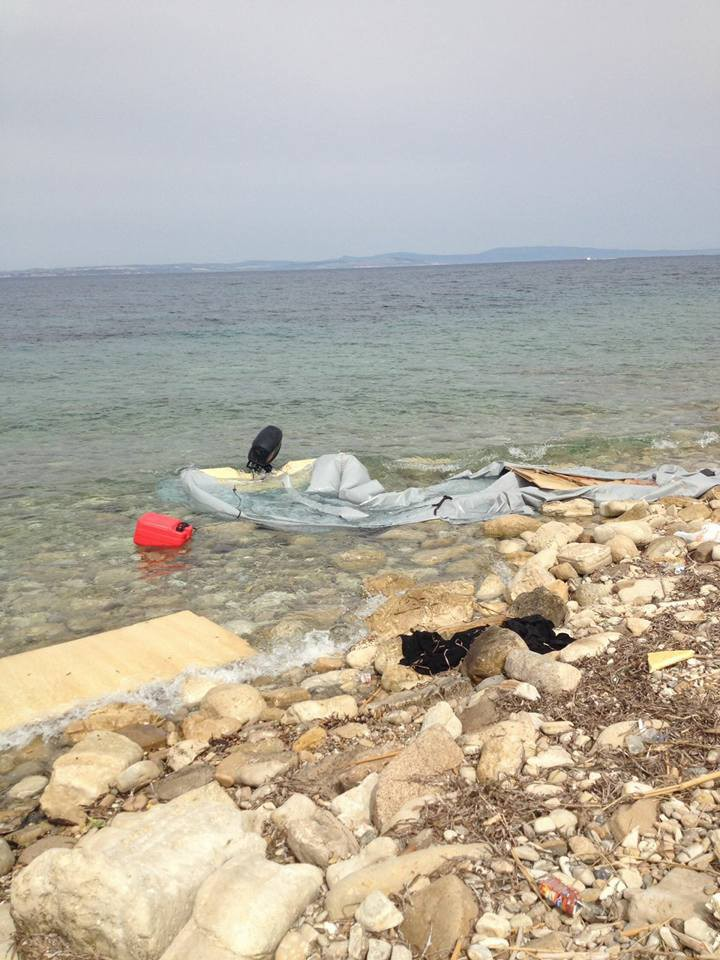
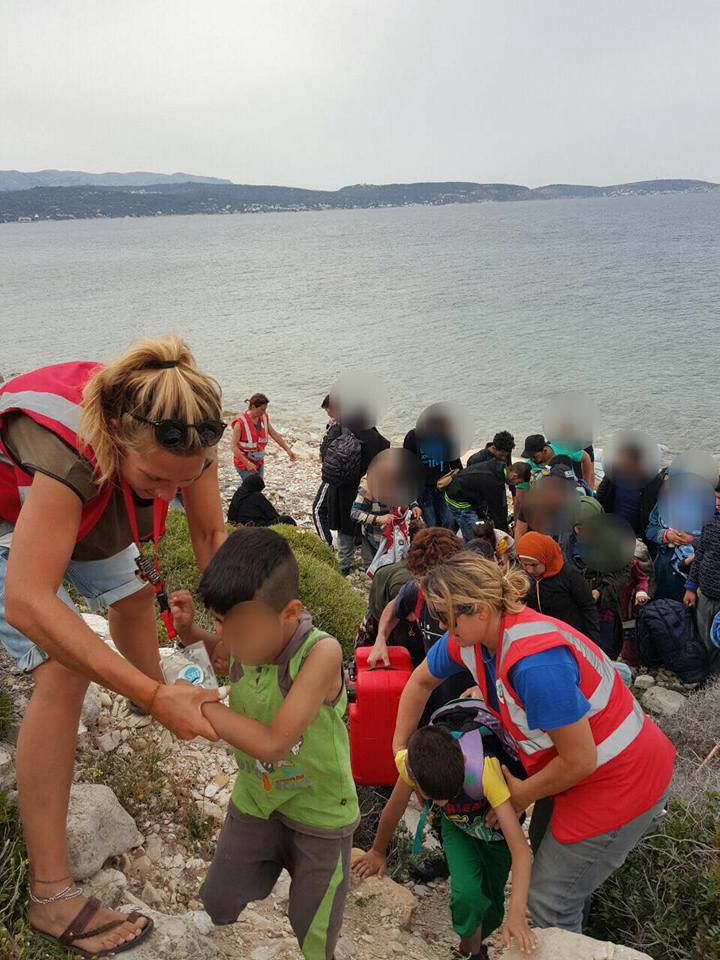
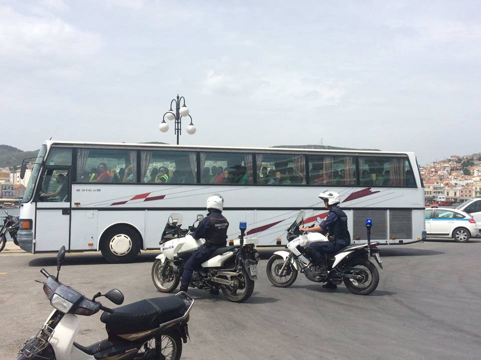
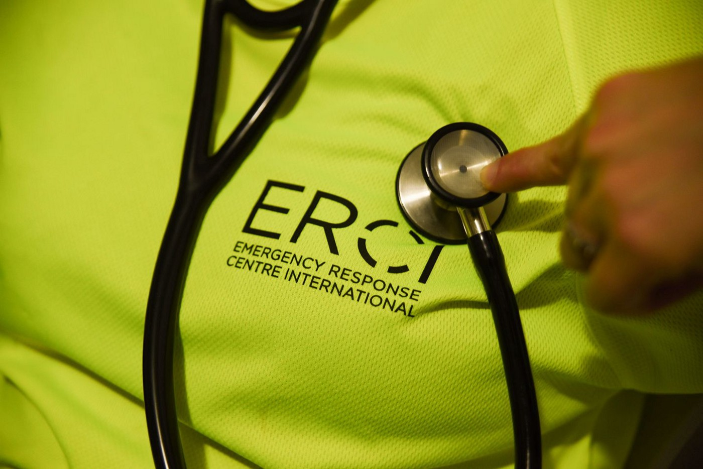
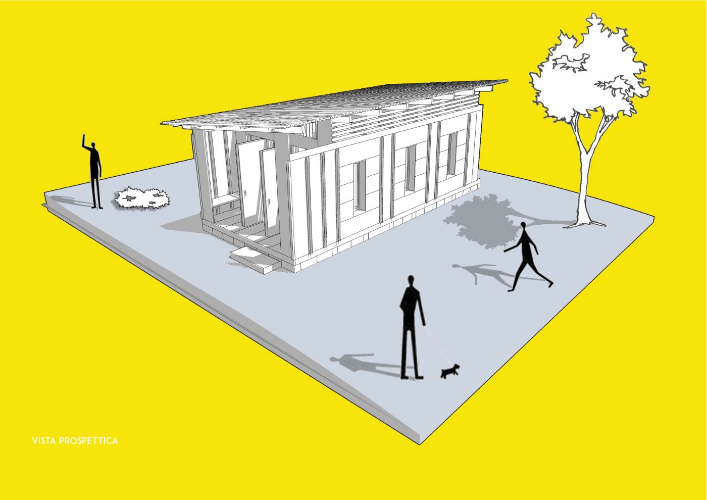
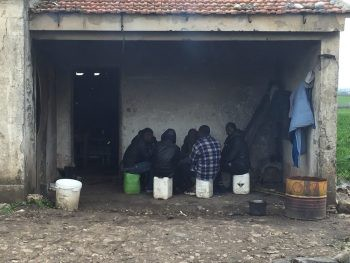
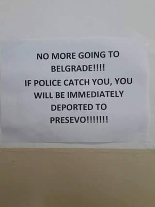
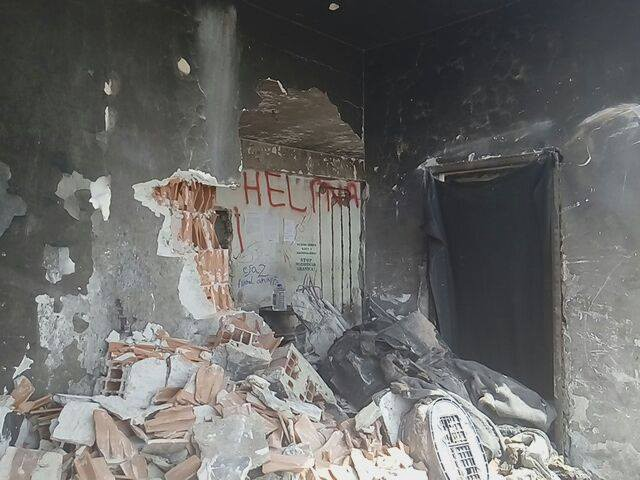
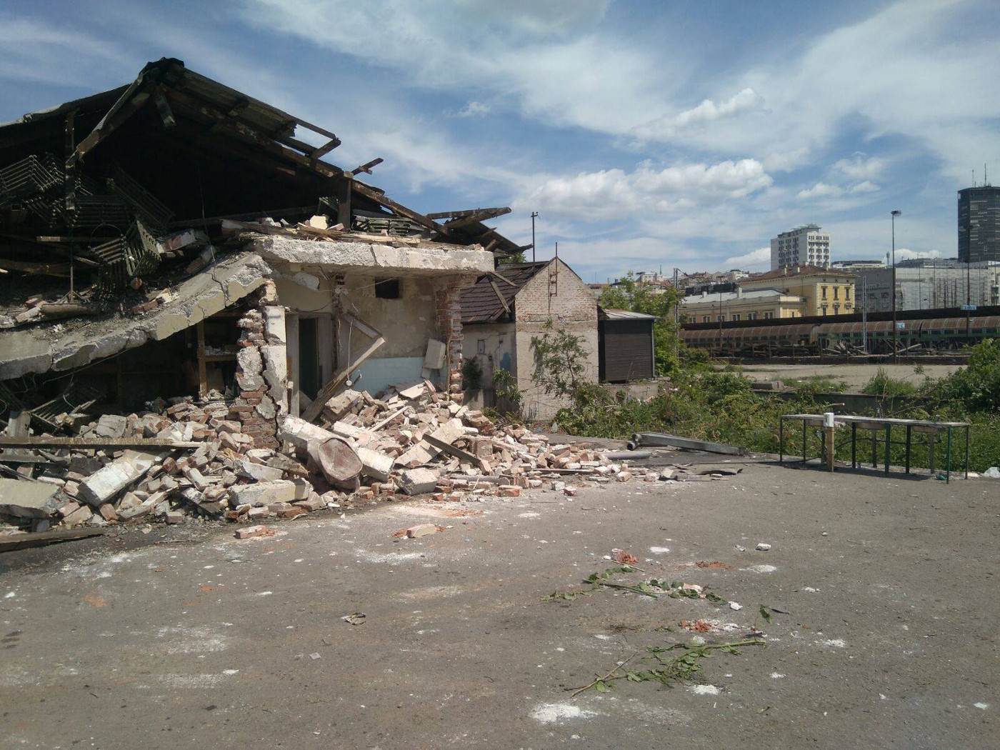
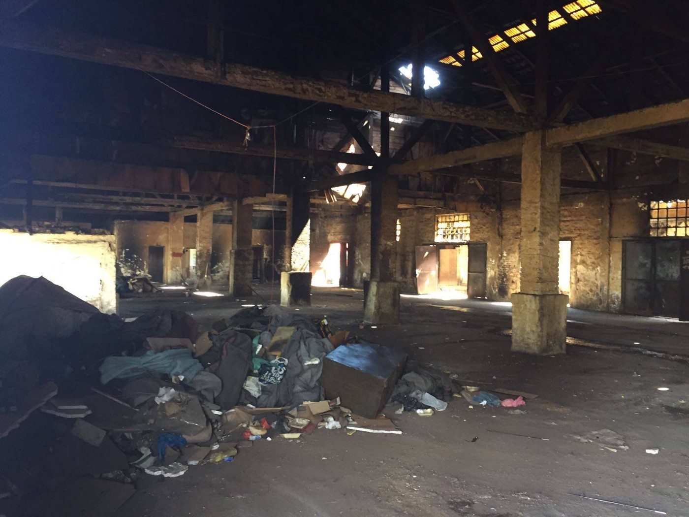

### AYS Daily Digest 12/05/2017

Updates from Athens /// Deportations to Turkey from Chios /// New Statements from MOAS and MSF /// Demolition of the barracks carries on in Belgrade /// Updates on deportations to Afghanistan from Germany

**Athens Update**

Reports from volunteers suggest that the situation in Athens continues to deteriorate\. An Independent Street Team has discovered that on the 28th of April a centre for families and children run by Mellon evicted the unaccompanied minors housed there and told them to go to camps on Crete\. Some of these young people are now living on the streets of Athens and are being supported by self\-organised groups, but many others may still be uncared for while hiding in fear of being made to go to Crete\. This is not an acceptable situation to put any child in\.

There are also increased cases of people experiencing mental health problems as a result of their situation and they often struggle to receive adequate support\. While the Governments and institutions responsible for creating and perpetuating this crisis do nothing, these people are left in vulnerable situations and face difficulties finding places to live and in accessing medical care\.

The Cash Card scheme has at least a two\-month waiting time, leaving people with no money while their application is processed\. This is especially difficult for families who live in independent accommodation as they do not have access to even the basic food served in camps\. Financial support is still not available to people who live in informal accommodation, even though there are 2503 people being housed in this way\.

People are still struggling to complete their initial registration through Skype, even though they try every day on which the service is available in their language\. Some people have been trying for months to complete even this basic first step and as a result are frustrated and angry\. Without papers they are at risk of detention if the police stop them\.

While some people are slowly leaving through the relocation and reunification programmes, the majority are stuck in the endless cycle of the asylum process with many waiting at least six months for interview dates\. This is not a process which supports the human right to physical or mental health, let alone the right to family life\. It is damaging and life\-threatening from beginning to end and yet it is perpetuated by the systems put in place by the Asylum Services and the EU\.

**SYRIA**

[A second evacuation convoy](http://sn4hr.org/blog/2017/05/12/second-evacuation-convoy-launches-barza-neighborhood-damascus-idlib-governorate-may-12/) of residents from the Barza neighbourhood northeast of Damascus city has left for Idlib today, in accordance with the agreement made between the Syrian regime and the committee negotiating on behalf of the neighbourhood residents\.

A new [Map](http://www.aljazeera.com/indepth/interactive/2015/05/syria-country-divided-150529144229467.html) has been published showing who currently has power where in Syria\. The country is divided between the Syrian government, ISIL, Rebel forces, Kurdish forces, Turkey\-backed rebel forces and Golan heights which is occupied by Isreal\.

**SEA**

The last hearing of the Defence commission of the Italian Senate on “ [the contributions of the Italian army to the control of migratory fluxes in the Mediterranean and the impact of the activities of Non Governmental Organizations](http://www.senato.it/static/bgt/listasommcomm/0/4/s/17/index.html) ” is scheduled for next Tuesday, May 16th\.

Both MOAS and MSF, after been questioned in the last weeks, released new statements today, addressing misconceptions and accusations recently made, both in the media and on the political stage, about the organisations, their work, their funding mechanisms and the legal framework within which they operate\.

From the MOAS statement:

> “When questioned about why all our disembarkations are carried out in Italy, and not, say, Malta or Tunisia, our representatives explained that MOAS is not the decision\-maker in this process\. The Maritime Rescue Coordination Centre \(MRCC\) in Rome has assumed de facto responsibility for the coordination of rescue efforts in the area of operations\. Therefore, it is MRCC Rome’s role to allocate ports of disembarkation\. It is also MRCC Rome’s role to coordinate actions with other national coast guard agencies where needed\. We have never approached the Tunisian or Maltese rescue coordination centres first because this is not the accepted protocol as laid out by the MRCC Rome\. 

> Questions of a political nature, regarding maritime SAR protocol, asylum law and so on are best placed to the authorities and European leaders who create and enforce them\. MOAS cannot answer as to the decision\-making processes of national agencies or European policy makers\. 

> \[…\] 

> Throughout the past weeks, the MOAS team has invested a large part of its time and resources to answering all the questions posed to them\. **Our focus must now return to our humanitarian efforts at sea\.** It is abundantly clear to all involved that maritime search\-and\-rescue is not a solution to the complexities and challenges presented by the mass migratory phenomenon\. It is for this reason that MOAS has consistently advocated for safe and legal alternatives to be found\. However, as a humanitarian organisation, as long as lives are at risk we feel an obligation and responsibility to be present to prevent that loss of life to the extent of our abilities\.” 

[Read the full MOAS statement here](https://www.moas.eu/updated-moas-response-concerning-recent-allegations-certain-sections-media/) \.

[Read MSF statement here](http://www.meltingpot.org/MSF-Bufera-di-accuse-non-ci-fermera-dal-salvare-vite-in.html) \(in Italian\)

**GREECE**

**Arrivals**

Two boats with 60 people in one and 55 in the other arrived today at Agia Ermioni on Chios\. Three boats arrived in the morning on Samos with 24 people\. Everyone is reported to be OK\.

A total of 120 people have arrived on Rhodes on the 11th of May

Arrivals on Chios \(CESRT\)

**Deportations**

22 people whose asylum claims have been rejected were deported from Lesvos to Turkey and handcuffed like criminals as they boarded the boat\.

 \)](assets/58de0a0554be/1*S2IxucLrVfe-8wUPuiAzjQ.jpeg)

Deportations from Lesvos to Turkey \(Photos by Open Borders and [dromografos](https://medium.com/u/b25c06e4bcff) \)

**Lesvos**

There were 109 official registrations on Lesvos today\.

[ERCI are looking for volunteer Doctors](https://web.facebook.com/ercintl/posts/629850177214737:0?hc_location=ufi)

ERCI

> _We need qualified doctors for clinic work at a camp on Lesvos Island\. Will need to speak English and Arabic, and if he/she can also speak Farsi or Kurdish, that would be welcomed\._ 

> _Accommodation and transport will be provided\. If you are qualified and interested in this opportunity, please apply by emailing us directly with the subject heading MEDICAL to :_ 

> _aid@ercintl\.org_ 

[United Rescue Aid](https://web.facebook.com/unitedrescueaid/posts/459890757687735?hc_location=ufi) are in need of donations for Moria

They are looking for many items including:
- Bicycles for adults
- Hammocks
- Backpacks and suitcases
- Sunglasses
- Basic food supplies
- Cleaning supplies
- Baby care items
- Basic pharmaceutical items like sun cream
- Summer clothing for men and women
- Hygiene products

**Mainland**

[ATLAS — Aid to LGBTQ Refugees in Greece](https://www.facebook.com/groups/atlasLGBTQ/)

The Support Group for LGBT Refugees in Greece has changed its name to ATLAS\. They offer support and advice to LGBTQ refugees, and their family and friends, in Greece\. They also have a Safe Space in central Athens and hold social events\. Their confidential hotline is answered by trained English, Arabic and Farsi Speakers

\+30 69 45 24 76 13 for Arabic and English speakers \(عربي / انكليزي\)

\+30 69 48 59 43 77 for Farsi and English speakers \(فارسی/ انگلیسی\)

If the line is busy or you call out of hours, you can leave a message with your name and phone number and they will call you back as soon as possible\. They will also call you back if you do not have credit on your phone\. All calls are confidential\.

You can also contact them confidentially via email for support, advice and more information at: **help@atla\-s\.org**

They can also provide you with:
- Legal advice
- Counselling services
- Medical help and sexual health education
- Free HIV and STD testing
- Education Courses and social activities

[Refugee Biryani & Bananas](https://web.facebook.com/RefugeeBiriyaniAndBananas/?fref=hovercard) call for donations

Refugee Biriyani are trying to put together Ramadan food packs as well as supplying nappies and baby milk for families in the north of Greece\. If you can help contact them [here\.](https://mydonate.bt.com/fundraisers/humanitariancrisiseurope)

Info about Financial Assistance

[Refugee\.info](https://web.facebook.com/refugee.info/posts/1399505843442892:0?hc_location=ufi) have released some basic information about financial assistance in response to people asking how long they will receive support after they have been granted asylum, but this depends on the date that the person is informed of their asylum being successful\. If they are notified after May 1st 2017, they can keep getting cash for six more months after the date of notification\. If they were notified before May 1st 2017, they can keep getting cash only through October 2017\. After that, they will not get cash assistance any more\.

**ITALY**

**Rosarno**

Prospective view of Hospital \(ity\) School \(Collettivo Mamadou\)

The ghetto of Rosarno, in Calabria, Southern Italy, is a symbol of the failure of Italian policies towards migrants and refugees\. In the industrial area of San Ferdinando, where the ghetto is situated, slave labour, prostitution, crime, and inhumane conditions are part of daily life\.

From [Progetto Melting Pot Europa](http://www.meltingpot.org/Hospital-ity-school-Una-scuola-per-il-ghetto-di-Rosarno.html#.WRLCXs-pXqA) :

> “In the last years Rosarno has become a required stop\. Those who arrive in Lampedusa can find here a little Africa and a way to make some euros\. Those who run away from shelters and centres find, in the ghetto, freedom of life, even though it can be difficult\. Those who have lost their job, or never found it in the north, arrive in San Ferdinando from desperation\. Yes, Rosarno as an environment contains bleakness and drama but, at the same time, it reveals hope and a will of community\.” 

Here the [Mamadou](https://web.facebook.com/Collettivo-Mamadou-1711634685756321/?ref=page_internal) Collective, from Bozen, in the extreme north of the country, launched a funding campaign to build Hospital\(ity\) School, a multi\-use structure that will open in the Rosarno Ghetto in October 2017\. The structure will have three functions: it will host a medical support station managed by several popular clinics across Italy; it will become the place to organise language classes run by [SOS Rosarno](https://web.facebook.com/sosrosarno.org/?ref=page_internal) and Mamadou Collective; and it will host a legal advice point run by lawyers working in the area\.

From their crowd\-funding page:

> Here, more than **2500** labourers a day, exploited and invisible African people who pick the fruit we find daily on our dining table, live in horrible conditions with open\-air latrines, trash, total lack of minimum services, institutional indifference and organised crime\. 

> For years we have been saying that these people’s struggle is our struggle, that “ **_the word is the only weapon capable of defending our rights and affirming our needs_** ”\. 

Read more [here](http://www.meltingpot.org/Hospital-ity-school-Una-scuola-per-il-ghetto-di-Rosarno.html#.WRLCXs-pXqA) and [here](http://www.cronachediordinariorazzismo.org/hospitality-school-scuola-ghetto-rosarno/) \(in Italian\)

[Donate](https://www.produzionidalbasso.com/project/hospital-ity-school/)

contact: [collettivomamadou@gmail\.com](mailto:collettivomamadou@gmail.com)

**SERBIA**

Announcement in the refugees camp in Obrenovac \(Ravida Ramujkic\)

Demolition of the barracks has continued\. Today they started demolishing barrack B and by the end of this week, A and C will also be flattened\.

Only last week there were around 1,500 refugees living there\. The few who remain in the town are being controlled by the Commissariat, who ask them for their papers when they see them\.

Demolition of the barracks in Belgrade \(Help\-Na\)

**SWITZERLAND**

The Federal Council revealed data today about minor migrants \(between 12 and 18 years old\) stopped at the Swiss borders in 2016\. [Media sources](http://www.tio.ch/News/Ticino/Attualita/1144935/Oltre-7-800-minori-fermati-al-confine-ticinese/) reports that 9416 minors were intercepted by Swiss border agencies during that year\. It is impossible to have figures for unaccompanied minors as the agencies don’t report if minors are travelling accompanied or alone\. A total of 7832 were intercepted in the Ticino canton, 647 at the border crossing of the Vaud and Valais cantons, 369 in the St\.Gallen and Grigioni cantons, with much lower figures for the other border crossings\. 50,6% of the minors \(4767\) applied for asylum at the border and have been transported to facilities of the State Secretariat for migration \(SEM\) \.

[Media sources](http://www.independent.co.uk/news/world/europe/swiss-border-guard-syrian-refugee-stillbirth-woman-pregnant-switzerland-brig-italy-bus-train-milan-a7732421.html) report on the same day that a border agent in the Ticino region is being prosecuted for allegedly causing a Syrian refugee stillbirth after he failed to respond to her husband asking for medical help for his wife\. Read more here\.

**GERMANY**

Officials from the Ministry of the Interior in Nordrhein Westphalia have claimed that deportations to Afghanistan are only used for the following 3 groups — potential terrorists, criminals, and those refusing to integrate\. But, as usual, the facts say otherwise\. The last deportation on the 24th of April included Waris Wafa, a 20\-year\-old Afghani, who was well integrated, had no criminal record and was an active cricket player in the local team, part of the first German league\. He even received a FairPlay award in 2016\. This inhuman deportation policy clearly shows that politicians are trying to impress their right wing voters while ignoring the facts\!

> **We strive to echo the correct news from the ground, through collaboration and fairness, so let us know if something you read here is not right\.** 

> **Anything you want to share — contact us on Facebook or write to:areyousyrious@gmail\.com** 

_Converted [Medium Post](https://areyousyrious.medium.com/ays-daily-digest-12-05-2017-58de0a0554be) by [ZMediumToMarkdown](https://github.com/ZhgChgLi/ZMediumToMarkdown)._
