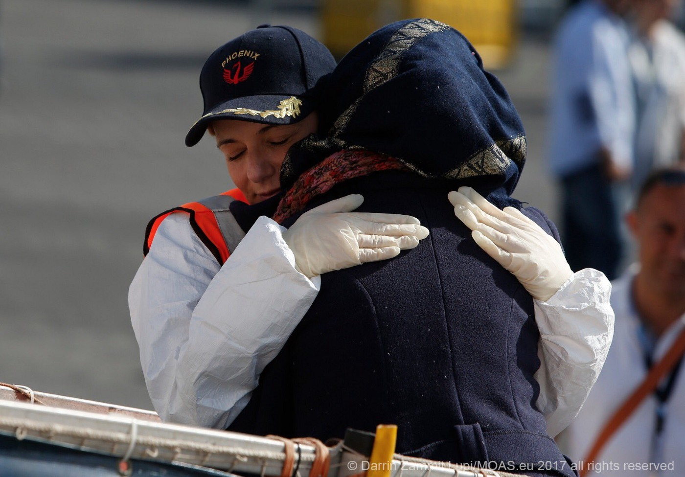
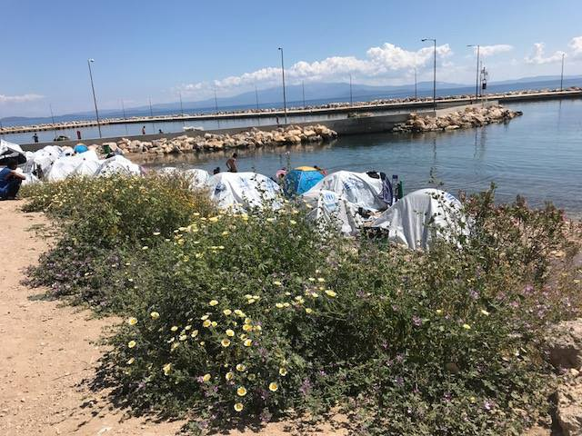
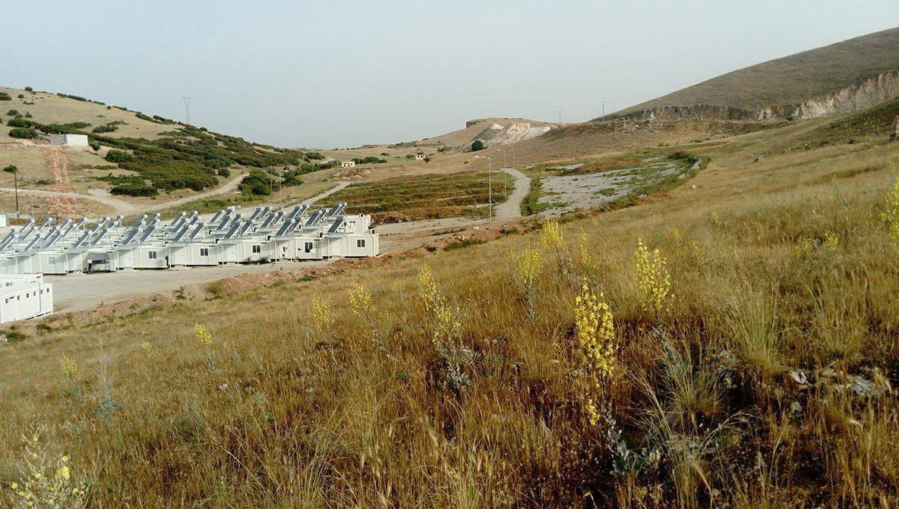
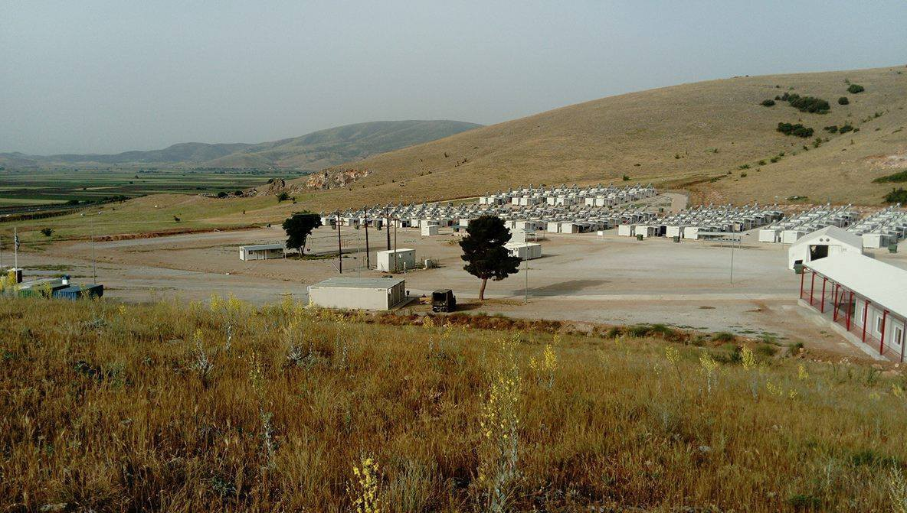
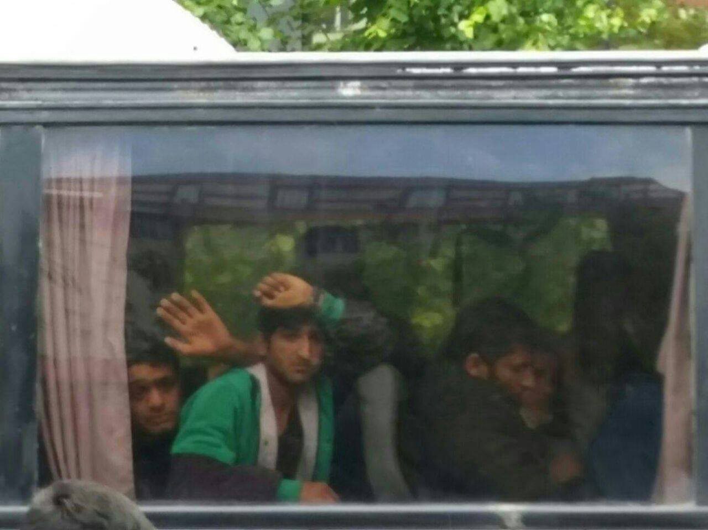
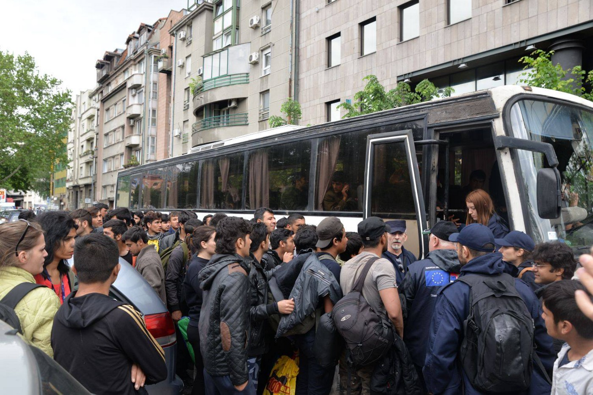
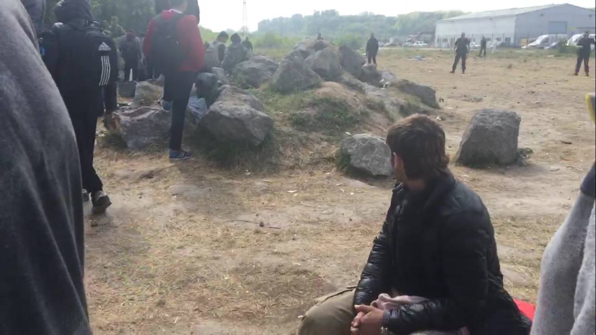

### AYS DAILY DIGEST 13/05/2017: Two parallel realities in Greece

_Migration ministry in Greece claims everything is under total control // Pictures and refugees testimonies are giving a different picture about their life in Greece // Disturbing images and stories from Italy, France, and Sweden // No more refugees in Belgrade // Hungary electrified border fence // Calls to solidarity and empathy // Increase in number of arrivals in Spain and Cyprus_

Just people to people @MOAS
### Greece
#### Living conditions for refugees “acceptably decent”

_“The management of the refugees flow in Greece is under total control,”_ Deputy Migration Policy Minister Yiannis Balafas told to the Greek media this week\. According to him, in the next year, the refugees that have remained in Greece will be housed in apartments\.

He also said that a number of refugees and migrants remains steady this year because a number of people have been relocated to other countries, _“people come and go, it is a continuous process that is under total control,”_ he explained\.

[According to the IOM](http://migration.iom.int/europe) , through the end ot April, 12,496 people have been relocated from Greece to other EU member and associated states since the launch of the EU Relocation Scheme in October 2015\. Most of the people went to France \(3,080\), Germany \(2,423\), Netherlands \(1,211\), Portugal \(969\) and Finland \(780\) \.

Most of the people who have been relocated were Syrians \(10,296\), followed by Iraqis \(1,718\) and Eritreans \(134\) \.

In totally number, there were 252 unaccompanied and separated children who have also been relocated from Greece, most of the are in Finland \(108\), the Netherlands and Spain \(26 each\), Luxembourg \(21\) and Norway \(20\) \. Ireland, Belgium, Germany, Switzerland and Portugal have also taken a number of unaccompanied and separated children\.

Those who are in Greece are accommodated in facilities that are, according to the deputy minister, “ _acceptably decent”_ , while a large number of people are housed in apartments _“and the rent is paid by the European Union and is monitored by the UNCHR under the control of the Migration Policy ministry”_ \.

Many refugees are living in a tents in the official camps on islands, some of them for over a year\. Photo by Bev’s Travel\.

Almost at the same time with this statement, comes the pre\-announcement from the municipality of Larisa that in the coming days, an invitation to homeowners who want to rent their property to refugees will be announced\. The costs will be covered by the UNHCR\. The program, as explained, aims to lower the number of refugees living in the nearby refugee center of Koutsohero to 500\.

Camp Koutsohero is one of the places deputy minister describes as _“acceptably decent”_ \. The different description is coming from people who are forced to live in that place\.

In their _“ [appeal to all humanitarian organizations, educational and human rights organization,](https://m.facebook.com/story.php?story_fbid=1302527636521179&id=687993924641223&hc_location=ufi) ”_ they call everybody to visit this place\. They write that the camp is placed in between two mountains, 20 km away from the nearest city, and close to the gravel pits\. The dust and noise are just part of the problems residents have\. They see snakes, scorpions, and foxes close by their IsoBoxes\. With summer approaching, they are afraid the situation will be even worse\.

**](assets/57990d6b08f6/1*15wKHx7SzELaicEweacYxw.jpeg)

**By [عشتار للهجرة واللجوء](https://www.facebook.com/%D8%B9%D8%B4%D8%AA%D8%A7%D8%B1-%D9%84%D9%84%D9%87%D8%AC%D8%B1%D8%A9-%D9%88%D8%A7%D9%84%D9%84%D8%AC%D9%88%D8%A1-687993924641223/)**

More than 100 children are living in this camp\.

Meanwhile, more people are arriving in Greece every day\. Late evening on Saturday, a boat arrived on Chios carrying 55 people, including 20 children\. During a day, 10 people arrived on Rhodos\. The day before, to Rhodos 26 people arrived\. After the arrival, people were taken to the detention center that is, as witnesses report, unsuitable for children\. There is 23 child inside, including some young as 1 or 2 years\.

According to the latest UNHCR data, from the beginning of this year, 5,765 new arrivals were registered in Greece\.

Due to the unbearable living conditions in camps, some people decided to live in squats\. Only in Athens, there are over 15 squats and around 3,000 people are living inside\. One of them is [Spirou Trikoupi 17](https://www.facebook.com/spiroutrikoupi17/posts/289364511510356?hc_location=ufi) where over 100 people are living in 25 rooms\. They urgently need refrigerators for each floor, to keep food cool and safe to eat\.

Anyone able to help, please contact them directly through an [FB message](https://www.facebook.com/spiroutrikoupi17/posts/289364511510356?hc_location=ufi) or at [st17@riseup\.net](mailto:st17@riseup.net)

 a place for all\.](assets/57990d6b08f6/1*Xw-ia0c00xRxhi4lhnanTQ.jpeg)

By [Spirou Trikupi 17,](https://www.facebook.com/spiroutrikoupi17/posts/289364511510356?hc_location=ufi) a place for all\.
### Italy
#### Attack on the potential accommodation place

The situation in Italy is less presented in the mainstream European media but is in the same way warring as in Greece\. [The latest IOM figures are showing](http://migration.iom.int/docs/MMP/120517_Mediterranean_Update.pdf) that 53,386 people entered Europe by sea in 2017 through 10 May, and nearly 85 percent arrived in Italy\. Among those who arrived there is notable increase of people from Bangladesh and Morocco\. \(In 2016 a record high 8,131 Bangladeshi nationals were registered by the Italian authorities at the landing points in Italy\. In 2017, already 4,645 Bangladeshi have been registered\. \)

IOM field staff in Sicily spoke with some of people who arrived from two Bangladesh who told them that “agents” in Bangladesh organized the entire journeys from Dhaka to Libya\. Some of them first travelled to Dubai, then Turkey, finally reaching Tripoli from Turkey by plane\. At the airport, they met their “employer”, a Libyan national, who seized their documents and exploited them at their workplace until they finally managed to leave\. The trip to Libya costs up to $9\.000\.

In Italy, there is not enough space for all the people who are coming every day\. Those who are already in Italy, are facing different problems, from unstable accommodation, lack of any, xenophobic attacks…

This week, a building \(ex Pineta hotel\), city Foppolo near Bergamo, that was going to become a potential accommodation for asylum seekers, was destroyed and vandalized\. Police is investigating it as the xenophobic attack
### Spain
#### Increase in number of arrivals

The UNHCR report that 5,499 persons arrived by sea and land since January 2017\. Last year at the same period, 2,973 people arrived, which is 85 per cent increase\.

People who are arriving to Spain are mainly from Guinea \(23 per cent\), Côte d’Ivoire \(17 per cent\), The Gambia \(11 per cent\), Cameroon \(10 per cent\), Syria \(9 per cent\) and Algeria \(7 per cent\) \.
### Cyprus
#### Increase of arrivals

Since January 2017, according to the UNHCR, 302 people arrived to Cyprus compared to 43 during the same period last year\.
### Serbia
#### The last days in Belgrade

Today, no refugees were to be found on the streets of Belgrade\. The park and the area around the trains station are deserted\. People are transported — in some cases forcibly — to camps all over the country, including Sombor, Principovac, Sjenica, Obrenovac, Krnjaca… In some of these camps, people are prevented from going back to Belgrade\.

Over the next days, police will increase its controls and all the people without proper documentation found on the streets will face deportation\.

Volunteers from the [Solidatitea group](https://www.facebook.com/refugeesolidaritea/posts/1044746362293786) posted a very upsetting recount on the last day in barracks\.

_“Yesterday the Barracks were demolished, its community crushed\. Over a thousand people displaced again and moved against their will\. We tried to stand in solidarity with them while the authorities pushed them, hit them with tent poles, and decided their futures without a care for their well\-being or dignity\. There was not even the most basic of organization or information\. The men were shouted at in broken English, words that were easily misconstrued and caused unnecessary panic and terror\. No maps were given to enable a successful choice of camp, no translators employed\. Throughout the chaos, we tried to show them that we were equal, brothers, sisters, friends\.”_

The entire report you can find on [their FB page](https://www.facebook.com/refugeesolidaritea/posts/1044746362293786) \.

By Sould Welders\.
### Hungary
#### Electrified border

Hungary is still doing everything to prevent any refugee or asylum seeker from entering its territory\. The media are reporting that the wire which has been erected at the border with Serbia has been electrified\. The government announced that the fence will be further equipped with night vision cameras, thermal imaging cameras, and motion detection systems\.

From the beginning of this year until May 1, 7,864 persons were prevented from entering Hungary, according to [the latest report from the Helsinki Committee](http://www.helsinki.hu/wp-content/uploads/HHC-Hungary-asylum-figures-1-May-2017.pdf) \. During the same period of the time, 1\.495 persons applied for asylum\. From January to April, 101 asylum\-seekers were granted protection \(of which 28 were refugees and 73 were “subsidiary protection” status\) while 2\.240 applications were rejected\. “Recognition rate for those arriving from war\- and terror\-torn countries is extremely low,” the Hungarian Helsinki Committee notices\. As the example, they are giving a number of people from Afghanistan \(recognition rate only 2,2 percent\), Iraq \(3,1 percent\), Somalia \(70 percent, but only 10 people applied\), and Syria \(4,8 percent\) \.

Quoting numbers from the UNHCR, from January to April this year, 124 asylum\-seekers were returned to Hungary under the Dublin Regulation, primarily from Austria \(79\) and Germany \(30\) \.
### France
#### Police and the authorities continue to push refugees away

The extremely dire situation continues to be in France\. [Local media are reporting](http://www.lexpress.fr/actualite/societe/grande-synthe-200-migrants-vivent-dans-un-bois-pres-du-site-incendie_1907267.html) that in Grande\-Synthe, around 200 people live in the woods close to the former camp at La Linière\. Some of them lived in the camp before the fire, some came after they left the reception centers for different reasons, some are new arrivals\.

Some groups are distributing lunch and dinner every day, but people do not have shelter, or even tents or little shacks as they had before, and they are constantly hunted\. There are women and children among them\. Volunteers are forbidden to distribute tents because the state tries to inhibit any point of settlement\.

The camp burned down on 10 April\.

The situation is very bad in Calais, where many people are still sleeping out in the open\. [Care4Calais](https://www.facebook.com/care4calais/) team reports about the group of 150 people who were sleeping rough in the Calais countryside\. While they were distributing help, French riot police arrived and, using violence, pushed them and refugees away\.

The police pushing away refugees and volunteer\. Photo by Care4Calais\.

_“Around 15 men began marching from the back of the field towards the refugees \(and volunteers\) who at this point were sitting peacefully in the field\. Batons held out and pepper spray attached to their belt, the CRS began running at us\. The refugees frantically picked up all of their belongings, shouting to us to run\. It was very clear to see the fear instilled in the refugees, by the CRS\. We ran and were pushed into a small corner of the field whilst the CRS formed a line in front, containing us\. Amongst the group of CRS, one of them had a very protrusive gun aimed at the refugees and ourselves\.”_

The police took all the belongings from the refugees, including their sleeping bags\.

[Cédric Herrou](https://www.facebook.com/Cédric-Herrou-1707778992799992/) , a hero for many people who believe that all people are equal and with the same rights, continues to help those who seek refuge but also to warns about the conditions in the Valley of Roya area\. According to him, black people who come this way, are hunted by the officials\. Some of them were badly beaten\.

Cédric wrote on this FB profile that 50 people are passing only through his home in the Roya\. Much more are helped by other neighbors\.

[Donations are needed in Paris for the Vestaite Saint\-Bernard](https://www.facebook.com/permalink.php?story_fbid=684251598442282&id=598228360377940) \. They need clothes and hygiene products\. They also need volunteers\. For more, visit their FB page\.

Help is needed for [The Collective Solidarity Migrants Wilson](https://www.facebook.com/Solidarité-migrants-Wilson-598228360377940/?fref=nf) that serves t the breakfasts every morning at the door of the Chapel\. They need volunteers, too\.
### Sweden
#### Armed attack on a home for unaccompanied minors

Still non identified perpetrators opened the fire towards a security guard during his night shift at a home for unaccompanied minors, [local media are reporting](http://sverigesradio.se/sida/artikel.aspx?programid=125&artikel=6695860) \. The guard was placed there since there was a potential and expected increase in security risks at this specific home, located in Sjuntorp\.

The police have now evacuated the home and placed the kids elsewhere\. There has for a while been some suspect requests about the home and the safety guard was placed here because of that\. It was around 2 am this night a silver colored Audi arrived, and the guard approached it to see what was going on\.

According to testimonies, there was more than one person in the Audi\. No one got hit by the gunfire and the police are working to identify the perpetrators and motives behind the incident that seems to be to target unaccompanied minors and underage asylum seekers\. The police don’t wanna give any comments since they don’t have enough evidence at this point, but according to the police officer in charge, they are currently seeking for the car and at least three suspected perpetrators\.

> **We strive to echo the correct news from the ground, through collaboration and fairness, so let us know if something you read here is not right\.** 

> **Anything you want to share — contact us on Facebook or write to:areyousyrious@gmail\.com** 

_Converted [Medium Post](https://areyousyrious.medium.com/ays-daily-digest-13-05-2017-two-parallel-realities-in-greece-57990d6b08f6) by [ZMediumToMarkdown](https://github.com/ZhgChgLi/ZMediumToMarkdown)._
