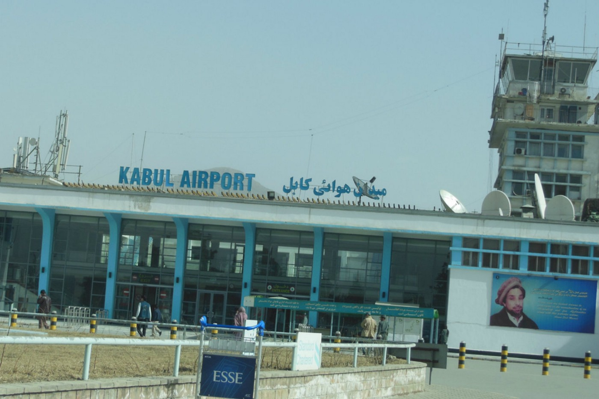
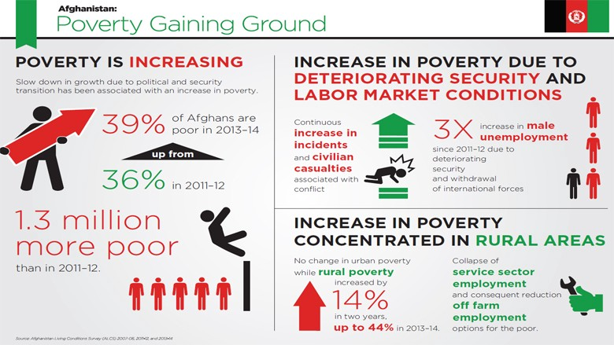

### AYS Daily Digest 15/5/17: Dangerous deportations by the ‘fenced’ Europe continue
#### Deportations to danger and absence of responsibility for the resulting deaths / New arrivals on crowded Greek islands; doctors wanted on Lesvos; new local racist attacks / Europe urges Hungary to pull back the infamous Bill / millions of asylum funds in the hands of the mafia and Church charities in Italy / Europe’s fences damage wildlife

](assets/cf94fbb27b14/1*RoGN1hhdyCSvuM1DiPfnCA.png)

Source of the infographic: [article](http://journals.plos.org/plosbiology/article?id=10.1371%2Fjournal.pbio.1002483)
### Afghanistan — Deportations to insecurity and death threats continue

The recent [Danish deportation](http://politiken.dk/indland/art5950278/Politichef-uddelte-knytn%C3%A6veslag-til-udviste-m%C3%A6nd-p%C3%A5-fly-fra-Rigspolitiet) to Afghanistan on February 28 was followed by some serious reports of violent behavior by the Afghan officials\. The statement from 11 Danish police officials who were on board speaks of agressive actions by the Afghan officials after some of the people [deported from Denmark](https://www.thelocal.dk/20170510/racism-plays-a-key-role-in-migrants-exclusion-in-denmark-report) would not leave the aircraft because of fear\.

Reportedly, the **people were beaten with fists in their faces and torsos by the police officers** , as they remained seated in the aircraft\. According to the Danish police officers’ statements, the local police chief pulled one of the passengers out of the seat by pulling his hair\.

The Afghan refugee who was deported from Germany on February 14, Farhad Rasuli, was killed by the Talibans in Afghanistan on May 10\. His cousin was also murdered and his brother was seriously wounded in the same province that the countries who deport Afghan nationals consider a safe zone\.

This sparked outrage and [reactions](https://www.change.org/p/bundeskanzlerin-angela-merkel-keine-abschiebungen-nach-afghanistan/u/20255558?utm_medium=email&utm_source=70480&utm_campaign=petition_update&sfmc_tk=lseo88Y2PwqICoqySYn8AqC85ebLZDtxx9LPmNTRawzmUe8OwXKX9KpXZWpWb%2Bu8) from many refugees in similar situation, as well as activists, lawyers and people aware of the danger in sending people fleeing persecution forcefully back to the danger, refusing to take responsibility for their safety\.

A group of organizations in Vienna are also organizing [demonstrations](https://www.facebook.com/events/192914171218341/) against the forced deportations to Afghanistan practiced by the Austrian government\.

The [Poverty Status Update report](http://documents.worldbank.org/curated/en/667181493794491292/Afghanistan-poverty-status-update-progress-at-risk) shows that Afghan households have been negatively affected by the crisis triggered by the security risk and political transition\. Poverty increased substantially from 36 percent in 2011–12 to 39 percent in 2013–14\. As a result, 1\.3 million more Afghans were unable to satisfy their basic needs\.
The economic and security [crisis](http://www.worldbank.org/en/country/afghanistan/publication/afghanistan-poverty-status-update-report-2017?cid=EXT_WBEmailShare_EXT) has accentuated deep and widening inequalities between those who have the means to cope with shocks and those who must give up vital assets to stay alive\.

Protests against deportations to other countries people fled from are also organized in other European countries\. The Dutch are currently fighting another scheduled deportation to Sudan, here is the link to their [demonstration event\.](https://www.facebook.com/story.php?story_fbid=1351409988279788&id=667055853381875)
#### SEA

[Boats4People](https://www.facebook.com/boats4people/) published a new [information guide](http://boats4people.org/wp-content/uploads/2017/05/Cim.B4P.Familles-ANG-1.pdf) for families, friends who fear that a loved one may have perished crossing the Mediterranean to Italy, and for individuals or associations assisting them in their search\.
#### GREECE
#### Arrivals

45 people were officially registered this morning on Lesvos, 107 on Chios, 35 on Samos and 16 on Kos, making a total of 203 people\. From Saturday until Monday 356 people were registered on the Greek islands and this morning 49 people arrived by boat to Chios\.

> The drama continues, families crossing every day to Chios island\. The camps are full and worse then ever\. All new arrivals stay in tents and are suffering\. 
 

> Wake up, Europe, this story doesn’t have an end…We are dealing with humans\. — [_Chios volunteer_](https://www.facebook.com/pothiti.kitromilidi?fref=nf) 

### Urgent need for doctors on Lesvos

The local clinic at the camp on Lesvos needs more medical staff\.
The potential doctors who could apply should speak English, additional knowledge of Arabic, Farsi or Kurdish is appreciated\.
Accommodation and transport will be provided\. Those interested in this opportunity please write to aid@ercintl\.org, with MEDICAL in subject of the email\.

](assets/cf94fbb27b14/1*Vqi9qjOaZBX9sorBJfuSFw.jpeg)

[**ERCI — Emergency Response Centre International**](https://www.facebook.com/ercintl/)
### Greeks protest the new austerity package measures with a 24\-hour general strike
- **Strike schedule:** 
Ferries : 48h strike May 16 and 17 2017
Buses Athens:
May 16: strike from 11 a\.m\. until 4 p\.m\.
May 17 \-18: buses will operate from 9 a\.m\. to 9 p\.m\.
Trolley Buses will operate between 8:30 a\.m\. and 9 p\.m\.
Check transport information points for regular updates

### Racist attacks in Aspropyrgos

At least 40 attacks have been reported against migrant workers in Aspropyrgos since last August, Greek [media source](https://left.gr/) claims, adding that the anti\-racism group KEERFA is planning to hold a press conference on Monday afternoon at Athens police headquarters to demand that more be done to bring the assailants to justice\. Reportedly, a known group of men have been stoning houses of the Pakistani workers in the neighborhood of Gorytsa, smashing windows and shouting racist slogans, culminating with the [latest](http://www.ekathimerini.com/218433/article/ekathimerini/news/new-spate-of-attacks-against-migrant-workers-reported-in-aspropyrgos) attacks, on Sunday night\.
#### HUNGARY
#### “Public remarks on the activities of civil society raise serious concerns about the government’s commitment to basic freedoms in a democratic society”

Two United Nations human rights experts today urged the Hungarian government to withdraw their recently proposed Bill on the Transparency of Organizations Financed from Abroad \(T/14967\) \. The Bill, if adopted into law, would severely curtail the rights to freedom of expression and freedom of peaceful assembly and association in Hungary\.

> “We urge the government to withdraw the Bill and to provide a safe and enabling environment for civil society organizations both in practice and rhetoric, in line with their international human rights obligations,” _the experts [concluded](http://www.ohchr.org/EN/NewsEvents/Pages/DisplayNews.aspx?NewsID=21617&LangID=E) \._ 

#### Volunteering teams at the Serbian\-Hungarian border need help

The number of asylum seekers at the Serbian\-Hungarian transit zones is constantly growing\. The transits were originally set up for 250 people and they will soon be filled\. Almost 60 % of the transit’s residents are children, so nearly 200 children live there\.

> We try to give hope and safety in that unpredictable chaos, in which most of these people had to live in for the past years\. Performing our new tasks calls for new resources\. — [_Sirius\.help_](http://www.sirius.help/we-need-help-for-our-work-in-the-transit-zones/) 

](assets/cf94fbb27b14/1*HtBa6zm6Zum77DLdWjJzsA.jpeg)

Photo: [SIRIUS\.HELP](https://www.facebook.com/sirius.help/)

[Here](http://www.sirius.help/donate-now/) are some of the ways you can support or join them\.
#### ITALY
### More than 30 million euro Asylum\-Mafia affair

Italian police have announced the arrest of several people associated with a [mafia network suspected](http://m.dw.com/en/italy-busts-mafia-operation-in-large-migrant-center-in-calabria/a-38847762) of having infiltrated the asylum services, turning them into a market with the help of a Catholic association\. 
Through the center in Calabria, the mafia also made connections with two other facilities and the reception center on Lampedusa\. The Arena clan of a powerful Calabrian [mafia is suspected](http://www.repubblica.it/cronaca/2017/05/15/news/_ndrangheta_smantellata_la_cosa_arena_68_fermi-165476854/) of having made large sums of money by providing services to refugee and migrant shelters in Isola Capo Rizzuto, one of the largest in Italy and Lampedusa\.
#### FRANCE

[We Are Yogis](https://www.facebook.com/Weareyogisparis/) associated with the [BAAM](https://www.facebook.com/baam.asso/?ref=page_internal) , will start a new weekly and free class of yoga and relaxation, from the week of the 22nd, for all asylum seekers\. It will be every Wednesday at 10\.00am\. This class will be composed of breathing exercises, asanas \(postures\), relaxation methods\. In order to attend, please sign in directly with the BAAM\. No previous experience of yoga is needed and mats can be borrowed directly there\. The courses will be taught in french, english and translated into arabic\.
#### EU
### Fencing and \(wild\)life

The European countries have rushed, one after the other, to construct border fencing, usually in the form of a barbed wire, with the official reason being to divert or control the flow of people travelling through \( \! \) those countries\. Apart from damaging the area, representing a symbol of division, fear and closing, the fences have proved to be a \(futile tool in the ‘fight’ against illegal border crossing\) serious threat both to people in the border area but also to the animal life\. These fences represent a major threat to wildlife because they can cause mortality, obstruct access to seasonally important resources, and reduce effective population size\. [This article](http://journals.plos.org/plosbiology/article?id=10.1371%2Fjournal.pbio.1002483) summarizes the extent of the issue and proposes concrete measures\.
#### AUSTRALIA
### “Consider your options” — closing of the detention centre

”The Manus Island detention centre will be completely shut down, and all detainees removed, by October 31\. Papua New Guinea immigration officials [have told](https://www.theguardian.com/australia-news/2017/may/15/manus-island-detention-centre-to-close-by-30-june-detainees-told) refugees that the first compound on the infamous island will be closed by May 28\.

This coincides with the latest [report released on Monday](https://uploads.guim.co.uk/2017/05/14/BRIEFING_-_In_the_Firing_Line_-_Amnesty_International.pdf) by the Amnesty International, whose digital and military experts have verified images and footage from the Good Friday shooting on Manus Island, and their findings contradict claims made by Australian immigration officials\. 
 “This was not an isolated incident\. Refugees trapped on Manus Island have faced several violent attacks in the past\. They are the direct result of an inherently abusive system put in place by the Australian government\.”

We try to report fairly and accurately, and are happy to receive your feedback\. Thank you for contributing with news from the field\. 
If you want to **contact AYS** , we appreciate if you write to our [**official Facebook**](https://www.facebook.com/areyousyrious/) **or email** contact: areyousyrious@gmail\.com

_Converted [Medium Post](https://areyousyrious.medium.com/ays-daily-digest-15-5-17-dangerous-deportations-by-the-fenced-europe-continue-cf94fbb27b14) by [ZMediumToMarkdown](https://github.com/ZhgChgLi/ZMediumToMarkdown)._
