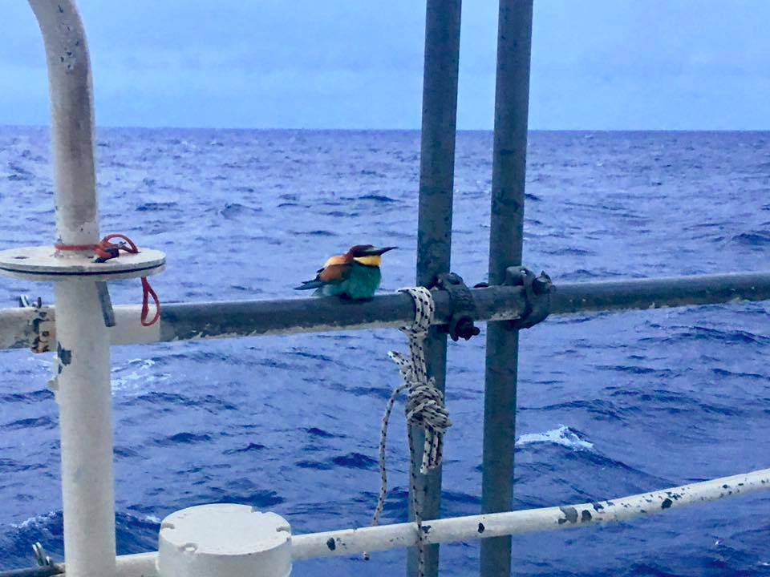
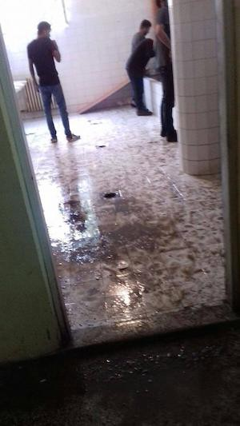
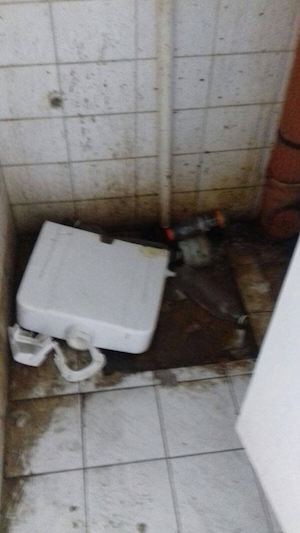

### AYS DAILY DIGEST 14/05/2017: Germany and Italy want to stop refugees at Libya’s southern border

Photo by Brendan Woodhouse
#### Italy
### Germany and Italy want to stop refugees at Libya’s southern border

[_Süddeutsche Zeitung_](http://www.sueddeutsche.de/news/politik/migration-de-maizire-fordert-eu-grenzschutzmission-fuer-libyen-dpa.urn-newsml-dpa-com-20090101-170514-99-441951) reports the German and Italian governments have called for the deployment of an EU border protection mission on Libya’s southern border in an attempt to stop refugees from attempting to reach Europe from Libya\. It comes as [_Reuters_](http://www.reuters.com/article/us-europe-migrants-italy-idUSKBN18A080?il=0) cites Italian coastguard reports that rescuers saved 484 refugees from boats in the Mediterranean on Saturday and found the bodies of seven men who died in an attempt to get to Europe\.

The German and Italian governments have justified the deployment of this border protection mission, saying it is the only way to prevent further deaths\. However, only legal pathways to Europe can effectively undercut the smugglers’ business and stop drownings in the Mediterrenean\.

An investigation by the [_Sunday Times_](https://www.thetimes.co.uk/edition/world/luxury-yachts-used-to-smuggle-migrants-into-eu-sicily-crisis-wgx3p52q8) meanwhile finds that Ukrainian smugglers are running a multimillion\-pound network bringing people from Turkey to southern Europe on luxury yachts\. It says more than 2,000 refugees — mainly from the Middle East and south Asia — have paid more than £5,500 a head for the trip from Turkey to Italy since the beginning of last year, according to figures from Frontex and Italian authorities\. Europol officials say they are investigating the route\.
#### Greece
### New arrivals

One boat with 35 people on board reached Samos this morning\.

A boat with 45 people arrived on Lesvos, including 40 from Congo\.

One boat with 52 people arrived on Chios tonight and another one with around 55 people arrived last night\. The refugees told volunteers that they had spent three days hiding without access to food before their departure from Turkey\.
#### Serbia
### Conditions inside Obrenovac

New photos show the conditions inside the Obrenovac camp, one of the places refugees are being brought to after the eviction of the Belgrade barracks\.

Photos Asociación de Apoyo al Pueblo Sirio de Andalucía

Obrenovac is an ex\-military camp and the refugees are housed in disused buildings\. Refugees there complain in particular about the lack of stimulation and the unsatisfactory food for dinner\.
#### France
### Long\-term volunteers needed in Calais

L’auberge des Migrants urgently needs [long\-term volunteers](http://www.laubergedesmigrants.fr/fr/volontariat/) for two tasks:
- Care for the refugees in Calais\. They still don’t have a place to sleep, and are constantly hunted by the police, which leads to injuries\. L’Auberge is looking for volunteers to take care of minor wounds \(disinfections, bandages\) and to organize transfers to hospitals if necessary\.
- Help the Refugee Community Kitchen prepare meals, set up the kitchen according to local norms and distribute food\.

With ramadan coming up, the Refugee Community Kitchen also needs small bottles of water which can be distributed with food packs to be eaten after sundown\. You can contact calaisdonations@gmail\.com if you can help\.

**We strive to echo the correct news from the ground, through collaboration and fairness, so let us know if something you read here is not right\. Anything you want to share — contact us on Facebook or write to: areyousyrious@gmail\.com**

_Converted [Medium Post](https://areyousyrious.medium.com/greece-9c8bfe621b98) by [ZMediumToMarkdown](https://github.com/ZhgChgLi/ZMediumToMarkdown)._
