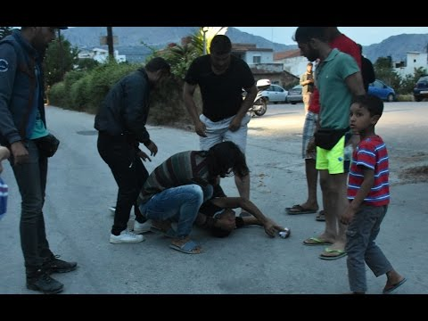
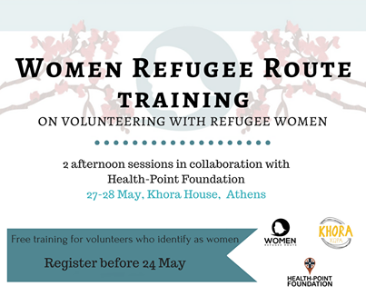

### AYS Daily Digest 17/5/2017 — European countries criticized and urged to meet obligations

_Clashes resulting in deaths in Istanbul / Massive food poisoning at Souda camp, Chios / Possible sanctions for Hungary / Rescue vessels temporarily not allowed to dock at ports of Sicily / Updates from France / Volunteers needed in Greece and more_

Early morning patrols on the Phoenix in the Mediterranean SAR zone \(MOAS\)
### EU member states urged to take action

Non\-complying member states have until June to start accepting asylum seekers from Greece and Italy or face possible sanctions and infringements, EU commissioner for migration Dimitris Avramopoulos said yesterday, adding that it was a question of “political and institutional credibility for the European Union” to take action if nothing is done, [reports](https://euobserver.com/migration/137930) EU Observer\. The “order” is, with differences in severity, addressing Austria, Hungary and Poland who are yet to accept people, EU states like Czech Republic, Hungary or Slovakia, that have failed to pledge additional spaces for asylum seekers for a year, also other EU states such as Belgium, Croatia, France, Germany, Romania, Slovakia and Spain are asked to increase their pledges\. More details are available in the [press release](http://europa.eu/rapid/press-release_IP-17-1302_en.htm) \.

> “There is a month ahead of us and within this month all member states will take up their responsibilities” — Avramopoulos 

Ahead of a September deadline for the relocation of 160,000 asylum seekers from Greece and Italy to other EU countries, today MEPs accused national governments of dragging their feet on refugee transfers, writes European Parliament [News](http://www.europarl.europa.eu/news/en) **\.** With only 18,418 people relocated as of 11 May, in a plenary debate today MEPs criticised EU countries for failing to follow through on their commitments\. They also insisted that relocation alone will not resolve the crisis, with Italian representative Barbara Spinelli adding “As far as Italy is concerned, in 2015 and 2016, there were 5,049 Dublin transfers and 3,936 relocations\. In other words, more people were actually sent back to Italy than were transferred elsewhere\.”

> The number of people eligible for relocation present in Italy and
 

> Greece is below what is foreseen in the Council Decisions\. In Greece, where the number of registered applicants for relocation is expected to remain stable \(27,146 people registered for relocation of which 12,707 have already been relocated\) around 12,400 people still need to be relocated\. In Italy, more than 8,300 people have been registered for relocation so far, of which 5,711 have already been relocated and an additional 700 should be registered soon\. In
 

> addition to this, over 1,100 Eritreans have so far arrived in 2017 and would still need to be registered for relocation, _stands in the [report](https://ec.europa.eu/home-affairs/sites/homeaffairs/files/what-we-do/policies/european-agenda-migration/20170516_twelfth_report_on_relocation_and_resettlement_en.pdf) \._ 

EPs vote on a resolution regarding relocation on Thursday 18 May\.

Numbers for relocation are updated and available [here](https://ec.europa.eu/home-affairs/sites/homeaffairs/files/what-we-do/policies/european-agenda-migration/20170516_update_of_the_factsheet_on_relocation_and_resettlement_en.pdf) \.
#### TURKEY/SYRIA BORDER

Some Syrians on the Turkish border are now losing their land to the construction of a wall being built by the Turkish government, On the Ground News reports\.

#### TURKEY

An Afghan refugee while his hands tied has been brutally stabbed to death in Istanbul\. The criminal reportedly a Turkish citizen tries to target the victims’ heart and throat\. According to witnesses, some other Afghans have also been murdered or injured\. The reason behind the murder and the exact location of the incident is still unknown\. There are several videos circulating online, showing the victims, which we will not post due to graphic content\. The tension has been reported as still present in the area of Fatih district\. There are also claims about reportedly a Turkish man being killed and a group of Turks murdering more Afghans\. We will write about this as soon as there is confirmed information\.

Over 300 Afghanis and Syrians were evacuated from the neighborhood in Istanbul on May 16 amid rising tension after the killing while riot police are stationed on all streets in the neighborhood and riot control vehicles patroling the streets against possible escalations, Hurriyet Daily News [reports](http://www.hurriyetdailynews.com/over-300-afghans-and-syrians-evacuated-from-istanbul-neighborhood-after-killing-of-local.aspx?pageID=238&nID=113198&NewsCatID=341) \.
#### GREECE

The European Commission, through their monitoring mechanism, has identified potentially serious allegations related to one of the humanitarian projects being implemented by a partner in Greece\. An allegation relates to a case of potential sexual exploitation of beneficiaries by the partner’s staff members\. Another allegation concerns potential financial corruption by these staff members, EC [wrote](http://reliefweb.int/report/greece/spokespersons-statement-allegations-misconduct-humanitarian-partner-organisation) \. The Greek authorities have been informed and the case submitted the case to OLAF for immediate investigation\.
#### Massive food poisoning at Souda camp, Chios

The refugees were served chicken for lunch and around 5 ο’clock a lot of people started vomiting and some almost fainted, local source reports\. 35–40 people were taken to the hospital by people, among them children and pregnant women\. The ambulance of Chios came to Souda only one time for a very serious incident\. Till 11, people kept coming to the hospital, some on foot \. Two refugees and 3 children had to spent the night in the hospital\. Local media [reported](http://www.politischios.gr/hios-poli/binteo-foto-maziki-trofiki-dilitiriasi-metanaston-sti-soyda) on the horrible situation\. The poisoning was most likely caused by chicken brought to the camp by one of the caterers which the health service has taken sample from for testing\. Two local catering companies in contract with the Norwegian Refugee Council \(NRC\) deliver daily meals for the refugees and migrants in the camp\. Local volunteer commented: “Volunteer kitchens who have been lovingly prepared nutritious meals with no incidents for over a year — at a much more cost effective price\. But the responsible NGO decided to award contracts to two restaurants … this is what happens\. And PS: This isnt the first outbreak\.”

The situation in other camps is often no better\. At Elliniko camp today the electricity was shut of, residents told us\. He says it made a problem for the people who were then unable to shower, study, use wifi or simply see in the dark\.
#### Athens

Women Refugee Route is running a training in collaboration with [Health\-Point Foundation Dental/Medical Relief](https://www.facebook.com/healthpointfoundation/?fref=mentions) for women volunteers 27–28 May in Athens\. Places are limited\. Register before 24 May [here](https://goo.gl/cz7hFM) \.

In order to meet the increased needs and the risks faced by LGBTI refugees and asylum seekers, SolidarityNow implements a specialized accommodation program, supported by the UNHCR GREECE and funded by European Commission — Civil Protection & Humanitarian Aid Operations — ECHO, known as “Safe Refugee”, under which LGBTI refugees are accommodated in independent apartments in Athens and Thessaloniki\. Contact them at rainbow@solidaritynow\.org
#### Volunteers needed

A Drop in the Ocean is looking for Swedish volunteers for their Drop\-in Centre in Athens\. At the Centre, asylum seekers that are approved for relocation to Norway and Sweden are given an opportunity to take their first steps into the language and culture of the country they are being relocated to\. The Drop\-in Centre is organised like a language café, and offers a range of pre\-integration activities\. They are specifically looking for Swedish volunteers with an educational or similar background to help asylum seekers given relocation to Sweden\. To sign up as a volunteer, go [here](https://app.drapenihavet.no/signup) \. Read more about the Drop\-in Centre [here](http://bit.ly/2pwT7HX) \.

InterVolve is looking for a Kurdish speaking community development volunteer to join their small team in Larissa\. See more on the position [here](https://www.facebook.com/pg/InterVolve-219418945063168/jobs/1717871535177331/?source=post) \.

[The Unmentionables](https://www.facebook.com/theunmentionablesorg/) is in search of volunteers willing to work in Greece\.

One boat landed on north coast of Lesvos last night, carrying 18 people, 2 children, 3 women, 13 men\. Everyone was fine, local source reported\.

Open Cultural Center — OCC published this week’s schedule for Polykastro cultural center, find it [here](https://www.facebook.com/OpenCulturalCenter/posts/1717152321646512?hc_location=ufi) \.
#### HUNGARY

The Danish Refugee Appeals Board issued a [decision](http://fln.dk/da/GlobalMenu/Nyheder/Nyhedsarkiv/2017/03052017.aspx) yesterday to suspend deportations to Hungary under the Dublin Regulation in four cases, due to fear of Hungary not respecting basic human and refugee rights\. Asylum seekers in Hungary risk arbitrary detention and refoulement to Serbia\. The Ilias and Ahmed v\. Hungary ruling of the European Court of Human Rights and UNHCR’s call for the suspension of transfers to Hungary also prompted this decision\.

> Transfers to Hungary under the Dublin Regulation would therefore violate the right to liberty and the requirements of the recast Reception Conditions Directive\. The systemic deficiencies in the asylum procedure and reception conditions of the Hungarian system led the Appeals board to warrant a suspension of the Dublin transfers\.’ 

Continuous to this decision, in a resolution adopted today MEPs agree that Hungary’s current fundamental rights situation justifies launching the formal procedure to determine whether there is a “clear risk of a serious breach” of EU values by a Member State, European Parliament News report\. The situation in Hungary justifies the triggering of the procedure which may result in sanctions for Hungary\.

> The resolution calls for:
 

> \- the launching of [Article 7\(1\) \.](http://eur-lex.europa.eu/legal-content/EN/TXT/?uri=celex%3A12012M007) MEPs instruct the Committee on Civil Liberties, Justice and Home Affairs to draw up a formal resolution for a plenary vote
 

> \- the Hungarian Government to repeal laws tightening rules against asylum\-seekers and non\-governmental organisations, and to reach an agreement with the US authorities, making it possible for Central European University to remain in Budapest as a free institution
 

> \- the European Commission to strictly monitor the use of EU funds by the Hungarian Government 

Aditionally, Hungarian Helsinki Comitee issued a report on the treatment of asylum seeking children in Hungary which can be found [here](https://t.co/8b5aSrbZTu) \.

■■■■■■■■■■■■■■ 
> **[HunHelsinkiCommittee](https://twitter.com/hhc_helsinki) @ Twitter Says:** 

> > Read our latest report: Best Interest Out of Sight: The Treatment of Asylum-Seeking Children in #Hungary [helsinki.hu/wp-content/upl…](http://www.helsinki.hu/wp-content/uploads/Bestinterestoutofsight.pdf) https://t.co/GgmsvEJ36z 

> **Tweeted at [2017-05-17 16:44:43](https://twitter.com/hhc_helsinki/status/864884395899060224).** 

■■■■■■■■■■■■■■ 

#### ITALY

“No collusion between NGOs and human traffickers, rescue at sea of migrants is a must and inevitable” stands in the “verdict” published today regarding allegations about Italian NGOs collaborating with smugglers, at the end of the hearings dedicated to the debate raised by Frontex’s report and the following declarations of Catania’s public prosecutor, Carmelo Zuccaro, [reports](http://www.vita.it/it/article/2017/05/16/ong-la-commissione-difesa-del-senato-archivia-tutto/143385/) Viva\.
#### Rescue vessels temporarily not allowed to dock at ports of Sicily

Italian Police chief Franco Gabrielli said Monday that ships involved in the rescue of asylum seekers in the Mediterranean will not be allowed to dock in Sicily until after this month’s G7 summit in Taormina\. He said the move, which kicks on Monday and runs until May 28, “derives from the need to not put a burden on the police involved in summit security”, ANSA Med [writes](http://www.ansamed.info/ansamed/en/news/sections/politics/2017/05/15/migrant-rescue-ships-to-stop-landing-in-sicily-for-g7_8d2be27d-9905-48b0-8de3-396ba9a69eac.html) \.

Radicali Roma together with Baobab Experience daily give the number of people sleeping on the streets of Rome without a solution from the administration\. At least 140 migrants sleep rough today\. “Every promise is a wound for our city” they write\.

Another person was electrocuted trying to cross to France on top of a train, writes Refugee Youth Service:

> It is with great sadness that we share the news that another human being was killed this week trying to cross into France from Italy\. He was found electrocuted, hiding on top of a train by French police\. Over the past few days, we have seen a huge increase in the numbers of refugees and displaced people arriving into Ventimiglia\. St\. Antonio’s Church, the safe space where we run our activities, provides food and accommodation to women and children as well as unaccompanied minors on the move\. This vital service is very nearly full with around 120 women, young children and unaccompanied minors currently staying there\. 

> Such is the desperation of the displaced population here to get into France that more dangerous risks are being taken, some ending with tragic results\. 

#### FRANCE

Paris\-based [Solidarithé](https://www.facebook.com/solidarithe/?ref=page_internal) updated from the capital:

> While the authorities did evacuate a large number of people, there are still hundreds of people sleeping on the streets of Paris\.
 

> Since the evacuations newcomers have just been moved into other, less visible areas\. With a high police presence around the clock, people are not allowed to even sit in certain areas in ‘fear of starting a new camp’\. With people being constantly shuffled around, people are left with no where to sleep; by pushing them aside they simply become more vulnerable\.
 

> Very worryingly there have also been a rise in random arrests with people being served with 0QTFs \(official papers telling them they need to leave the country\)
 

> We are continuing to serve tea, coffee & information throughout Paris, while moving around and improving our information in order to meet the changing needs of those living on the streets of Paris\. 

](assets/53aed9eaf96f/1*NaYSnsvVOOvPbtQ174KSVA.jpeg)

[Solidarithé](https://www.facebook.com/solidarithe/?ref=page_internal)

Care4Calais reported on torments of one family in Dunkirk:

> This is a three month old baby that I met today living in the woods near to Dunkerque with his parents\. As you can see they have no shelter other than a ripped piece of tarpaulin draped over a branch\. Not too bad today in the sun but there is rain forecast for later this week\.
 

> When I worked in the Calais jungle people sometimes said it was like a piece of Africa in Europe\. To me has never seemed so much like Africa as now\. We are struggling to get enough drinking water out to people, and when we do they gulp it down desperate with thirst\. Sleeping rough there is no access to something even as basic as water and we are buying hundreds of bottles a day and filling jerry cans and cups to go in our vans\. Can this really be happening?
 

> I’ve been here longer than most now and I thought I had seen it all, but even to me Calais is worse than ever\. Every other day the police stop food distributions and routinely and callously take sleeping bags and possessions off the refugees leaving them with nothing\. 

#### NETHERLANDS

Amsterdam municipality wants to open a new pop up hotel in one part of former prison where 600 asylum seekers live, [writes](http://www.nu.nl/amsterdam/4698873/amsterdams-college-wil-pop-up-hotel-in-bijlmerbajes.html) Nu\. Temporary Hotel Utopia used to be run by 80 to 90 percent of the status holders\. The pop up hotel should open mid\-June and will have between 36 and 50 beds and the project should be running until November 1st\. The organization of Hotel Utopia will be owned by the Movement on the Ground company, in collaboration with The Student Hotel and Refugee Company\. The project is for training purposes, the status holders gain work experience that increasing their chances of getting job in the city’s hotel industry, the municipality argues\. The former prison currently houses six hundred asylum seekers\. Two of the six towers are currently empty, one of which will be used for the pop up hotel\. Note that there is no permission for the project yet, as Minister of Security and Justice still has to decide on the matter\. However a positive decision is expected\.

_Converted [Medium Post](https://areyousyrious.medium.com/ays-daily-digest-17-5-2017-european-countries-criticized-and-urged-to-meet-obligations-53aed9eaf96f) by [ZMediumToMarkdown](https://github.com/ZhgChgLi/ZMediumToMarkdown)._
