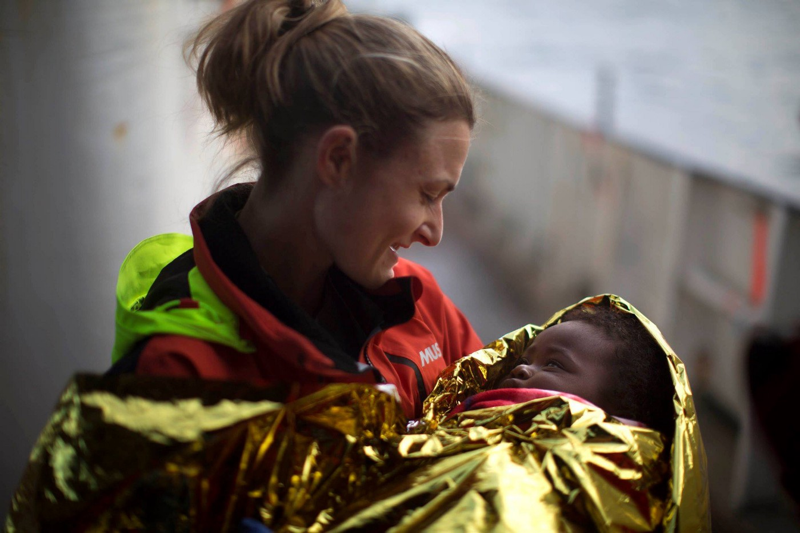
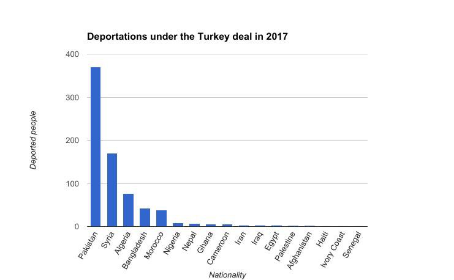
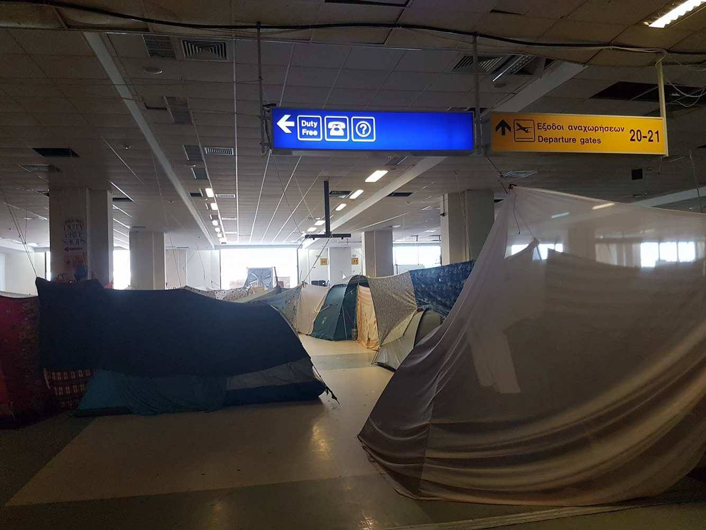
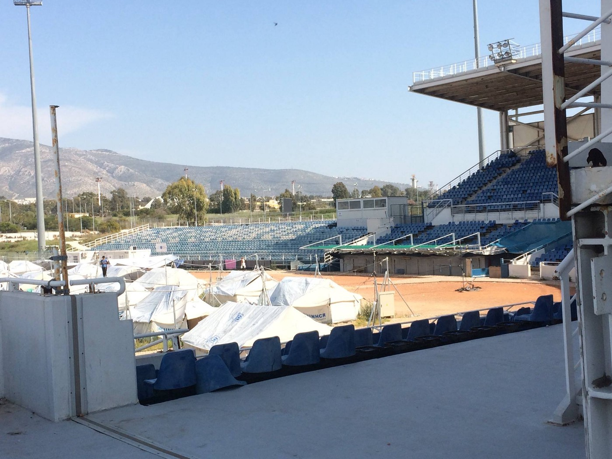
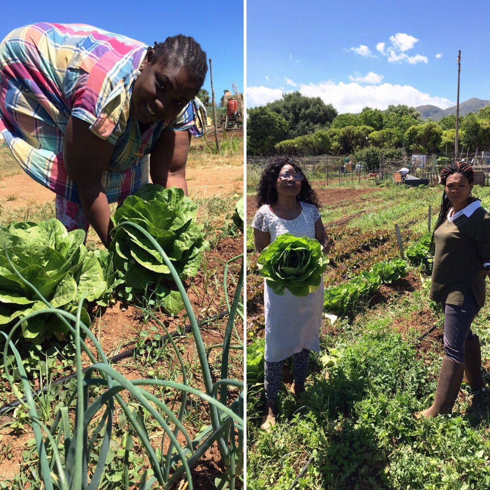
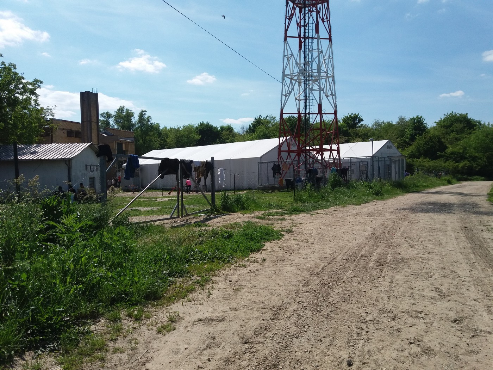
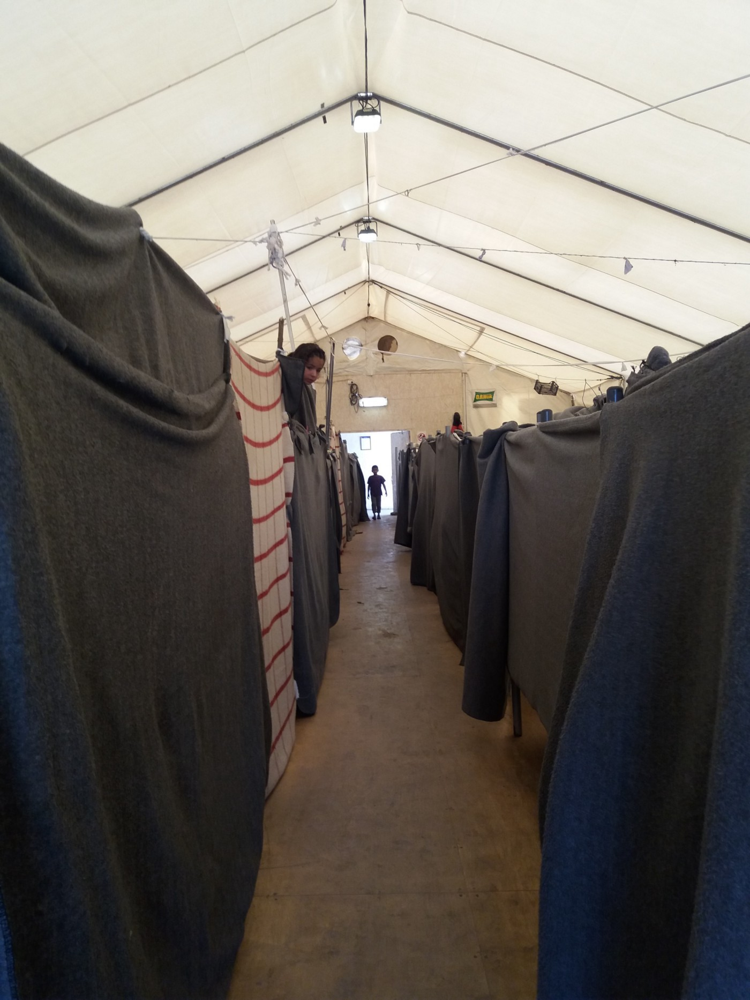
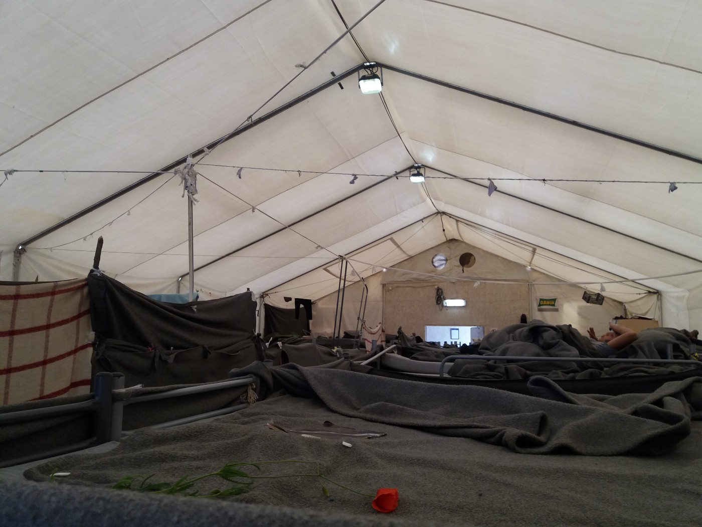
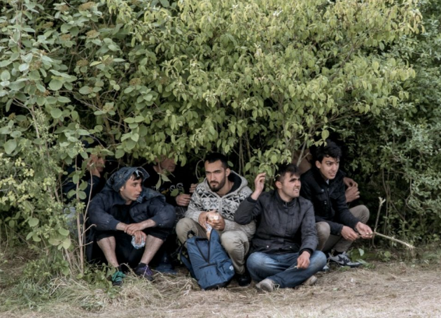

### AYS Daily Digest 18/05/2017: Devastating increase in number of children who are migrating

_140 people saved on rubber boat in the Mediterranean / Update on returns from Greece to Turkey / Eliniko to be emptied and residents moved to remote camp / Unofficial camp in Dunkirk evicted / Women’s empowerment project in Italy needs funding / Adasevic camp in Serbia is a nightmare / And more news…_

Photo by ProActiva Open Arms

**Feature**

[The new report by UNICEF](https://www.unicef.org/media/media_95997.html) shows that 92 percentage of the children who arrived to Italy in 2016 were unaccompanied minors\. Other key findings from the report are showing that the number of children traveling alone has increased by nearly five times since 2010\.

The UNICEF report stresses the importance of keeping families together, and also the need of improving access to health services and education for children along the refugee route\.

What is horrifying is that the number that is counted, 300\.000, probably only is the top of an iceberg, [as Justin Forsyth, UNICEF Deputy Executive Director says](http://www.euronews.com/2017/05/18/unicef-report-reveals-five-fold-increase-of-unaccompanied-child-migrants) \.

Additional key findings from the report include:
- 200,000 unaccompanied children applied for asylum across around 80 countries in 2015–2016\.
- 100,000 unaccompanied children were apprehended at the U\.S\. \-Mexico border in 2015–2016\.
- 170,000 unaccompanied children applied for asylum in Europe in 2015–2016\.
- Unaccompanied and separated children accounted for 92 per cent of all children arriving to Italy by sea in 2016 and the first months of 2017\.
- Children account for approximately 28 per cent of trafficking victims globally\.
- Sub\-Saharan Africa and Central America and the Caribbean have the highest share of children among detected trafficking victims at 64 and 62 per cent respectively\.
- As much as 20 per cent of smugglers have links to human trafficking networks\.

There will soon be an G7 summit in Italy, so it is not a coincidence that the report is coming now\. The aim is to put pressure on the world to trigger UNICEF’s six point plan to protect child migrants and to stand in solidarity with child migrants affected and uprooted of adult people’s wars an conflicts\. [The measures suggested by UNICEF is as follows](https://www.unicef.org/media/media_95997.html) :

1\. Protect child refugees and migrants, particularly unaccompanied children, from exploitation and violence;

2\. End the detention of children seeking refugee status or migrating, by introducing a range of practical alternatives;

3\. Keep families together as the best way to protect children and give children legal status;

4\. Keep all refugee and migrant children learning and give them access to health and other quality services;

5\. Press for action on the underlying causes of large scale movements of refugees and migrants;

6\. Promote measures to combat xenophobia, discrimination and marginalization in countries of transit and destination\.
### Sea

At 7am this morning, Aquarius rescued 140 people from a rubber boat\. Among the passengers there was 33 women and 12 kids\. Watch the video for more details:

■■■■■■■■■■■■■■ 
> **[MSF Sea](https://twitter.com/MSF_Sea) @ Twitter Says:** 

> > UPDATE: The #Aquarius has just rescued 140 people including 33 women and 12 kids from a rubber boat. Dr Connor explains: https://t.co/vdkZ23KqGi 

> **Tweeted at [2017-05-18 06:47:19](https://twitter.com/msf_sea/status/865096445296300032).** 

■■■■■■■■■■■■■■ 

### Greece

Frontex today returned six people, all men from the port of Mytilene to Dikili Turkey\. Three from Algeria, two from Pakistan, one from Bangladesh\. All were denied asylum\.

Besides that we can give you newly updated numbers and nationalities that have been deported from Greece to Turkey under the Turkey deal so far in 2017\. The numbers below are from 18\.5\.

**Total 370**

Pakistan 170

Syria 76

Algeria 42

Bangladesh 39

Morocco 8

Nigeria 7

Nepal 6

Ghana 5

Cameroon 3

Iran 3

Iraq 3

Egypt 2

Palestine 2

Afghanistan 1

Haiti 1

Ivory Coast 1

Senegal 1

For more details, [see here](https://docs.google.com/spreadsheets/d/1xWVKJMQ3z90m8CsZMNFC7TAyjRgA3puRHFbwZ8YIjUk/edit#gid=733488171) \.

**Update from Eliniko camp**

On their FB page, the [Refugee Info Bus](https://www.facebook.com/RefugeeInfoBus/posts/1960451174190301?hc_location=ufi) described a desperate situation for mainly Afghan families, who have fled their war torn country, only to become stranded in this ugly camp\. Residents that have been here for a longer period, some over a year, are living in tents pitched up in the old departure hall, meanwhile more newly arrived people have even more less fortunate living conditions\.

“Eliniko is a limbo,” Refugee Info Bus writes in their update\. A limbo built up in an old airport, hockey\- and football stadium\. People are just waiting\. Since it is mainly Afghan families here, they are even more stuck than other nationalities, since the European Union don’t seem to think that Afghanistan is that bad of a home country\.

Photo by Refugee Info Bus

To be eligible for the EU relocation program, that of course moves in a snails pace but still is something, you have to be of a nationality with at least a 75 percentage recognition rate within the Union member states\. That Afghans don’t have\. They are forgotten, and the empty seats, once filled with people watching sport games, surrounding the camp could have been for Europe to silently watch them from a far without doing anything\.

On Monday, as announced by the officials, the residents will be moved to another camp, three hours drive by bus from Athens, and Eliniko will be cleaned up\. Many of the residents don’t want to move, regardless of the bad conditions, the new camp will be one hour from the civilisations which makes them worried about being even more shut out from normality and access to things such as legal advice and basic things like clothing\.

**Ramadan in a refugee camp**

Ramadan, a month of fasting and prayers for Muslims, is coming soon \(May 28\) \. A volunteers are planing to collect food packs, and they need support\.

[The Holy Ramadan Food Project](https://www.facebook.com/aslam.obaid/posts/10154442492761373?hc_location=ufi) , was a huge success last year when they distributed more than 45\.182 packages of traditional food\. A lot of people that believed it would be their last Ramadan that people will spend in a refugee camp, but to many are still at exactly the same place even this year\.

Donations to the Holy Ramadan Food Project will greatfully be received here:

Bank name: Bank Leerau

Account name: Volunteers for Humanity IBAN: CH96 0658 8570 0771 2190 6

SWIFT: RBABCH22588

Ramadan is the ninth month of Islamic calendar\. Muslims are fasting during Ramadan to mark the firs revelation of the Quran to prophet Muhammad\. This annual observance is regarded as one of the five pillar of Islam\. While fasting from dawn until sunset, Muslims refrain from consuming food, drinking liquids, smoking, and engaging in sexual relations\.
### ISLANDS

**LESVOS**

On May 17, 30 Syrians living in Moria were denied direct transfer to the Kara Tepe Municipal Camp\. Day after, they protested against the decision taken by the Reception and Identification Center for refugees and migrants in Lesbos, Moria\. Some tensions arised and the police claimed that the refugees were causing problems in the traffic\. When the police tried to remove the protesters, due to the claimed traffic issues, some tensions broke out\. The result was that a 27\-year old Syrian was accused for resistance against Authority and he had his refferal today\.

■■■■■■■■■■■■■■ 
> **[ATH Solidarity @Refs](https://twitter.com/pedioareos) @ Twitter Says:** 

> > Arrest of Syrian #refugee #Lesvos #Lesbos for resisting police orders.
#Refugeesgr #antireport #noborders [twitter.com/LesvosNet/stat…](https://twitter.com/LesvosNet/status/865202607933054977) 

> **Tweeted at [2017-05-18 14:16:26](https://twitter.com/pedioareos/status/865209469374009345).** 

■■■■■■■■■■■■■■ 

■■■■■■■■■■■■■■ 
> **[ΑΠΕ-ΜΠΕ](https://twitter.com/amna_news) @ Twitter Says:** 

> > #RefugeesGr Μικρής έκτασης επεισόδια στον καταυλισμό της Μόριας [amna.gr/articlep/15660…](http://www.amna.gr/articlep/156607/Mikris-ektasis-epeisodia-ston-kataulismo-tis-Morias) https://t.co/o8wTA9teOp 

> **Tweeted at [2017-05-18 09:57:02](https://twitter.com/amna_news/status/865144185392963584).** 

■■■■■■■■■■■■■■ 

#### THE MOBILE INFO TEAM

[WHAT TO DO IF YOUR BABY BORN IN GREECE WASN’T ALLOWED A NAME](https://www.facebook.com/mobileinfoteam/posts/1960776364151083:0)

When a child is born in Greece, both parents must be present at the registry office \(“ληξιαρχείο”\) in order to agree to its name\. If only one parent is present, the baby will be given your family name but not a first name\. The first name will be written as “ακο” on the birth certificate\. It is possible to correct this later if both parents go to the registry office with the baby and their white cards\. You will need a Greek interpreter as they usually don’t speak English\.

If your baby was born in Greece but the father is in another country, he has to give his consent for the naming of the baby through the Greek embassy or consulate in that country\. It is advisable that the father of your baby seeks support from a migration counselling service for this\. The original power of attorney needs to be handed over in Greece to the registry office\. Then the baby will officially get a name on his asylum seeker card and birth certificate\.
### Italy

A micro farming project to empower women previously stuck in trafficing is running at [Donne Di Benin City, Sicily\. The project also includes catering and it is organic](https://mydonate.bt.com/events/donnedibenincity) \. The first harvest have kept them busy and it is soon time for their first big music and food event\. The aim is to help the women to run their own business and the funding is used to get them up and running\.

Photo by Donne Di Benin City

Further information from Ventimiglia, northern Italy, [is that a group of boy scouts in the age 16–20 from Genoa have decided to give migrants stuck in Ventimiglia a well needed helping hand](http://www.infomigrants.net/en/post/3250/scouts-to-take-turns-offering-help-to-ventimiglia-migrants) \. They have been handed out food, clothes and information and describe the migrants situation in the city as ”absurd”\. The scouts are planing to continue helping migrants and have several ideas they want to put into reality this summer\.
### Serbia

Today we have recieved pictures and disturbing information from AYS\-volunteers on the field in Serbia\. The camp in Adasevci are more than full with over one thousand of residents\. The camp was one of the places to where people from the barracks were transferred, more or less against their will, and now there is many single man inside\.

Most of the people here are living in big tents, and only a part of them in the closed part, which is a former motel, where in some cases 5 or 6 people are sharing the same room\.

In the tents entire families are crowded together and are sleeping on camp cot that are so close to each other that there in some cases there is not even smallest space between them\. The only separation are ugly grey blankets\. The camp is full of rats and the food is scarce and monotone\. There are the same not over\-exciting dishes served almost every day\. People aren’t allowed to bring food into the camp, and as if that wasn’t enough measures of control towards the residents the staff at least once every week do raids in the camp where they throw away all the food they find\. To get some privacy and to get out of the camp for a while people are going out to the nearby forest\. People also cook in the forest, but people from Komesarijat come and throw away their food\.

Adasevci camp\. Photo AYS\.

Additionally, the Komesarijat za izbeglice \(Serbian Commersiat for Refugees and Migrants\), the authority in charge for refugees in Serbia that also is running the camps where refugees are housed, are extremely rude towards the people\. As refugees informed the AYS\-volunteers, the staff often shouts at them and use rude language while speaking to them\.

Additionally, only once a week people have the possibility to wash their clothes, even families with small children\. Under the tents it is hard to breath and the air is not what it should be\. It is huge violation of the human rights of all the people who are forced to live in this type of accommodation\.

There has started to come reports and information from people labeled as refugees that currently are living in Adasevic, that no one wants to stay here\. During the winter there was about the same number of residents all the time but when the weather was starting to get better people started leaving to try and cross borders\. Lately people from Sid have been picked up and brought to Adasevic camp too, and the number of residents are rising\. In addition, people say that no one wants to stay in Serbia for another year\. [And by looking at statistics](http://www.asylumineurope.org/reports/country/SERBIA/statistics) , it seems likely that people will be stuck for a while unless they take matter into their own hands, since the asylum processes aren’t that fast or the forecasts that positive\.
### Hungary

The conditions for asylum seekers in Hungary are, as everyone knows by now, not for human beings\. As [reported on in yesterdays digest](ays-daily-digest-17-5-2017-european-countries-criticized-and-urged-to-meet-obligations-53aed9eaf96f) , the MEP’s will be monitoring how Hungary is using EU funds\. Ministers in the European Commission says that the recent actions in Hungary and the development within the EU\-member state are testing the ability to defend the unions founding values\. The development in Hungary could be described as a test for the EU and it will be interesting to see how the events is developing in the nearest future, especially since there are several other member states that have questionable values regarding how to treat fellow human beings\. We hope this will make them to think again and come up with more decent solutions even outside of Hungarys well protected borders\.

Article 7 of the Treaty on European Union has the purpose to protect and stand up for the values that is said to be common for the member states\. As a first step, 7\(1\), the member state that is breaking values will be given serious recomendations about changes from the EC\. In the following steps, 7\(2\) and 7\(3\) the measures taken will increase\. [Read more about it here\.](http://www.europarl.europa.eu/news/en/news-room/20170511IPR74350/fundamental-rights-in-hungary-meps-call-for-triggering-article-7)
### Austria

Dublin return successfully challenged at court as the result of cooperaton of Austrian lawyers and Croatian volunteers\.

AYS is very happy to see our friends from Porin camp have safely returned to Austria\. [Follow the link for more information\.](https://www.facebook.com/RefugeesSpielfeld/?fref=nf)
### France

The informal camp Grande Synthe in Dunkirk is emptied\. On the evening of May 18th, families were taken away by vans to accommodation centers, but many have remained to stay overnight\. According to Help Refugees, [that are updating from the place](http://bit.ly/calaisdunkirkfunds) , about 200 people will be sleeping rough in the surrounding areas, like streets and forest\. The 200 people mentioned includes a number of unaccompanied and of course highly exposed unaccompanied minors\.

The police that was closing down the camp confiscated peoples belongings, such as sleeping bags, tents, tarps and other things\.

Photo by Help Refugees

Volunteers from Help Refugees responded instantly and have distributed new sleeping bags, food, water and backpacks to people in need\. This is yet another example of the sometimes as extreme as ridicilous level of conter productive actions performed by authorities and officials\. Some volunteers will remain in the area during the night to be able to respond to further needs\. The weather isn’t with the already vulnerable people either since the rain is falling\. [Donate here](http://bit.ly/calaisdunkirkfunds) if you can spare any money to support the region, where help will continue to be needed\.

[Care4Calais](https://www.facebook.com/care4calais/posts/1544407692258849:0) desperately needs more volunteer drivers to help them get aid delivered\.

If you can bring your own car, or if you are over 25 and can drive one of their vehicles, please do go for any period you can manage\.

The situation is desperate\. Please help us if you can\.

> **We strive to echo the correct news from the ground, through collaboration and fairness, so let us know if something you read here is not right\.** 

> **Anything you want to share — contact us on Facebook or write to:areyousyrious@gmail\.com** 

_Converted [Medium Post](https://areyousyrious.medium.com/ays-daily-digest-18-05-2017-devastating-increase-in-number-of-children-who-are-migrating-30aa65270b9) by [ZMediumToMarkdown](https://github.com/ZhgChgLi/ZMediumToMarkdown)._
