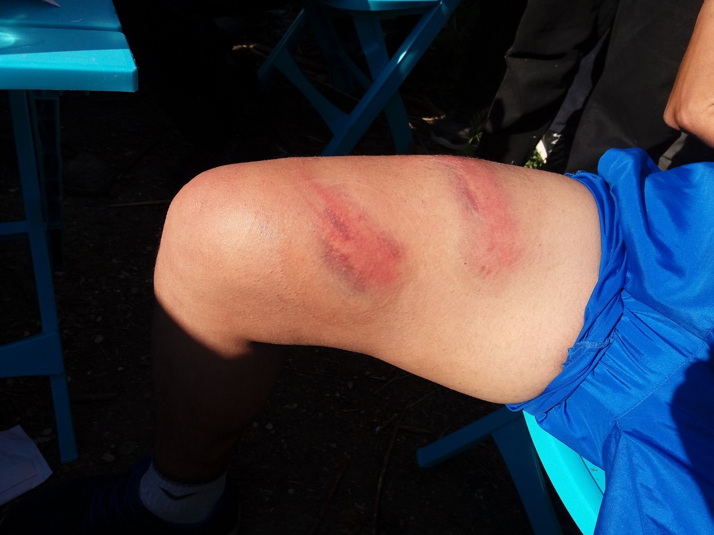
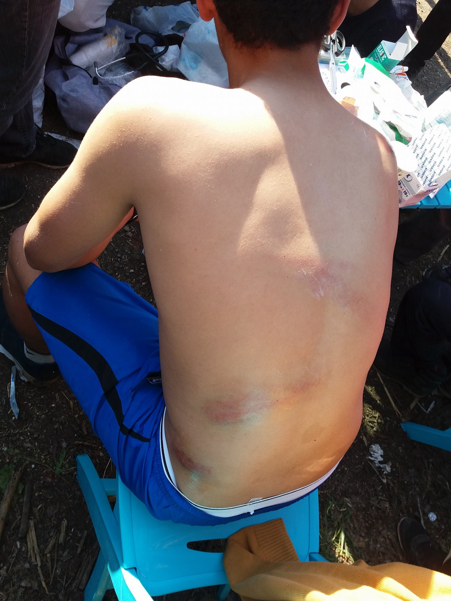
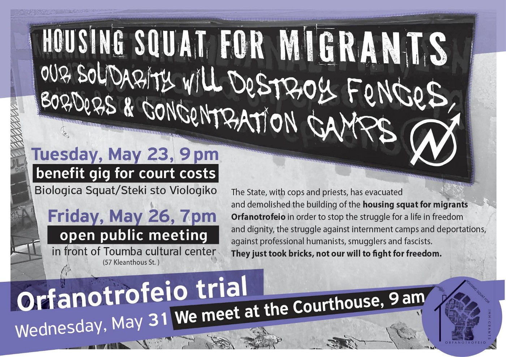
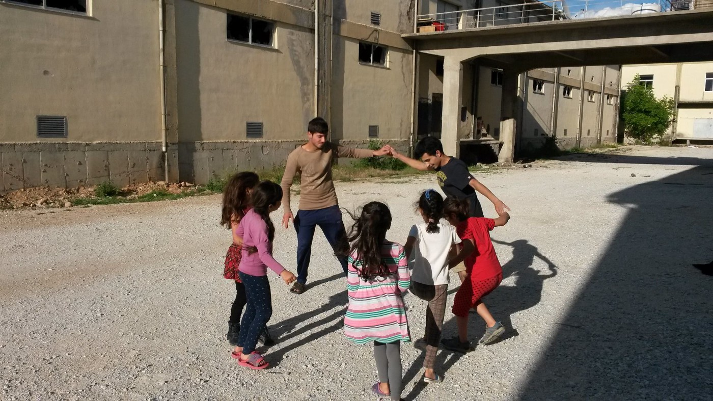
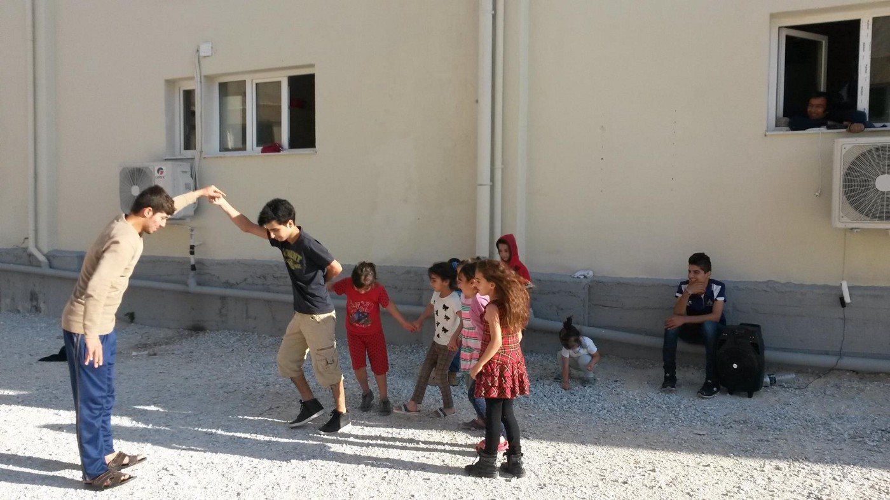
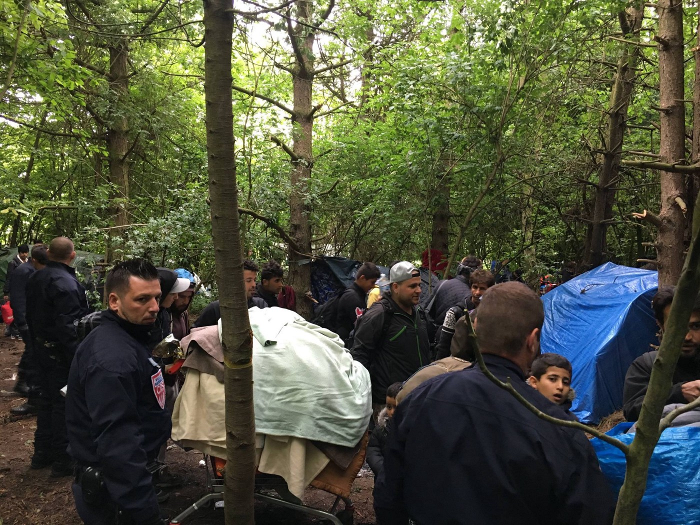

### AYS Daily Digest 19/05/2017: Police brutality returns, capitalizing upon Media short attention span\.

_Also in this issue: calls for solidarity in Greece / attempted and successful evictions in Italy and France / Germany clamps down on asylum law_

](assets/5efbbf99e9c9/1*Ugv5iF3d1vc1E2uoPmUC2Q.jpeg)

Photo Courtesy: [**Underground Railroad**](https://www.facebook.com/Underground-Railroad-189218751575260/)
### FEATURE: Return to brutal police pushbacks from Croatia\.

Various NGOs and civil society organizations are [striving to unite their strategies](http://www.forum.tm/vijesti/nasilne-deportacije-udruge-iz-regije-zajedno-protiv-krsenja-prava-izbjeglica-5679) in order to respond to coordinated efforts on the part of governments across the region in pushing back and deporting refugees and migrants\. After [a campaign to bring attention to the systematic beating](http://welcome.cms.hr/index.php/en/2017/01/30/report-on-illegal-and-forced-push-backs-of-refugees-from-the-republic-of-croatia/) and illegal pushback of refugees and migrants in the winter of 2016/2017, activists and volunteers in Serbia and Croatia noted a reduction of reported incidents of violence against refugees\. However, that has changed\. AYS Volunteers and other volunteers in Šid and Belgrade report more refugees coming to them with stories of beatings\.

Photo credit: Are You Syrious

A detailed account is found below\.

> _Two nights ago, border police in Croatia arrested a group of 15 young men, the youngest of whom was 14\. They arrested them for illegal crossing\. After their arrest in Croatia, they were all taken to the police van and driven to the border with Serbia\. Police officers formed two parallel lines in front of the van and forced the men to come out one after another while beating them hard with sticks\. They also broke their phones purposely and then sent them back to Serbia\. Some from the group were so badly beaten that they needed to go to hospital\. An AYS volunteer in Šid was told that this has been happening almost every night over the last couple of weeks\._ 

Photo credit: Are You Syrious

Some efforts are already being made by Croatian NGOs, such as disseminating contact information for referral in Serbia, but as most refugees lack wireless access and/or have their phones broken or stolen, referrals often come too late\. A recent activist forum in Zagreb featured testimony from four organizations, the Centre for Peace Studies in Croatia, Are You Syrious, the Belgrade Centre for Human Rights, and Legis from Macedonia, and highlighted some general conclusions in order to forge better cooperation\. An ongoing challenge in all of these cases is the lack of information about each incident\. Victims are unable to provide badge information or name their attackers; they cannot describe at exactly what time or where the incident occurred\.

Although there is a risk that this information, if gathered and provided, would allow government entities to individualize the incidents as the actions of a “few bad apples” within the force as opposed to acknowledging the systemic approach, the lack of information prevents any further action being taken, as cases can be dismissed as hearsay or injuries as being sustained in other situations\.

Similarly, in the aftermath of a [detailed report published by the Centre for Peace Studies and Are You Syrious](http://cms.hr/system/article_document/doc/403/CPS_and_AYS_-_Report_on_arbitrary_and_unlawful_practices_by_the_Ministry_of_Interior_and_the_Security_and_Intelligence_Agency__related_to__non_approval_of_international_protection_or_status_of_foreigners_in_Croatia.pdf) about the use of information hidden behind security clearance requirements to reject asylum applications on the basis of the applicant posing a risk to national security, several more rejections have happened\. It is important to continue to put pressure on governments and other bodies to look into these grave injustices\.

We must continue to be vigilant and to collect the stories and hear the voices of people who are being doubly punished — first being pushed out of the system, and then being penalized for being outside of it\. If you have any stories you wish to share of a violent pushback, please contact us\.
### GREECE
#### CHIOS

This week, the number of refugees on Chios exceeds those on Lesvos\. Lesvos had become almost synonymous with the refugee crisis in recent years, but Chios remains an increasingly dangerous hotspot for refugees\. Below is a video that documents the complete failure of infrastructural support for refugees\. Video courtesy of [Chios Eastern Shore Response Team — CESRT](https://www.facebook.com/chiosesrt/?fref=mentions) \. In spite of the sprawl outside of the camp, officials are not giving out tents at a fast enough rate, meaning they have to be provided by independent NGOs\. There were 29 registrations on Chios alone recently, with around 83 on all Greek islands\.

#### LM Village: A “Lidl” help

The following is a report from [**Refugee Support Greece**](https://www.facebook.com/RefugeeSupportGreece/?fref=nf) :

> LM Village is 10 km from the nearest town so every Friday Refugee Support pay for a bus to take the residents to the Market\. This week the residents asked to go to Lidl\. We do have a Free Shop on camp but since catering stopped there is a need for more food\. 

> The trip was a great success and the residents are grateful to all our donors for making this possible\. 

Support like this is helpful in so many ways as it encourages and affirms autonomy and respect for the lives and decisions of refugees\. We hope that volunteers and organizations can implement little ways of supporting the autonomy of refugees wherever they are\!

#### ORFANOTROFEIO

Humans from No Border Camp Thessaloniki posted the following notice of a call for solidarity with those being taken to court in the aftermath of the Orfanotrofeio squat being evicted\. There will also be a benefit concert to help defray the court costs\.

#### DRAMA

[**Everyday, just a smile**](https://www.facebook.com/everydayjustasmile/) brought some much needed fun to the Drama camp in the form of badminton, playing cards, beach volleyball equipment and and backgammon\. A great time was had by all as one can see\. :\)

Photo credit: Everyday, Just a Smile

Photo credit: Everyday, Just a Smile
### SERBIA

Refugee Aid Serbia is organizing a big clean up of their warehouse in order to clear out unneeded winter clothing, in order to make room for summer donations\! Investing in infrastructure at the right time is key to rapid response, so if you have some extra time this weekend, please chip in\.

_“Take your passport with you and join us at 10 AM on Saturday and/or Sunday at the entrance of our warehouse building \(next to Burrito Madre\) [https://goo\.gl/maps/k6NYH21xpZz](https://goo.gl/maps/k6NYH21xpZz) ”_
### ITALY

There were more attempted evictions at Piazzale Maslax on Friday\. During the initial activities, volunteers reported being prohibited access and said many people were not allowed to go and retrieve their items\. However, thanks to some quick thinking, the evictions were halted\. Baobab provides a further update:

> For the time being we have managed to avoid the eviction and the migrants, upon returning from Via Patini, were able to re\-enter the camp and recover their belongings\. Thanks to the efforts of Senator Massimo Cervellini, Congressman Stefano Fassina and Sinistra Italiana \(Italian Left\) Councillor Giovanna Seddaiu , we have been granted 48 hours to obtain the authorization, from the IV Municipality, to stay in Piazzale Maslax beside the east side of Tiburtina Station or to find another solution\. Meanwhile, the Department of Social Policies has found lodgings for 30 persons; they will try to find more in the coming hours\. 

> Seeing the prompt availability today, it is difficult to understand why yesterday there was not even a single bed to be found for a Nigerian girl who was the victim of traffickers — but we have long given up trying to understand the mechanisms of local administrations, which are too detached from the ground and seem disinterested in starting constructive talks\. It would be more useful to try to make the best of the hours separating us from a possible new eviction attempt, by rallying friends and relatives, spreading awareness, and putting pressure on the authorities so that the President of the IV Municipality and the Assessore alle Politiche Sociali Laura Baldassarre authorize and legitimize the existing informal camp\. 

Great work, all\. We hope that people are left in peace\.

Here is a video from yesterday when people were released and allowed to return\.

### SWITZERLAND

[AsyLex Legal Advisory](http://AsyLex) published a detailed document on requesting asylum in Switzerland\. They encourage people to contact them if they have any additional questions\.

### GERMANY

The German parliament passed a series of laws that will make the deportation process faster and easier for the German government to use\. The new asylum laws prohibit men with rejected asylum applications from avoiding deportation on the basis of separation from a child born in Germany\. Additionally, DW reports:

“Deportation orders against [rejected asylum seekers](http://m.dw.com/en/asylum-interviews-a-quick-decision-on-afghans-future/a-38663586) can now be imposed even without assurance that the person in question would be repatriated within three months\. A migrant could therefore be issued a deportation order even if the country origin fails to provide the necessary documentation or passport papers\.”

Additional laws put strong limits on the freedom of movement of individuals who have had their asylum applications rejected, ostensibly under the guise of “national security\.” Read the full report [here](http://m.dw.com/en/german-parliament-passes-tighter-asylum-laws/a-38897488) \.

Furthermore, the German ministry of the interior is facing sharp criticism from activists as it seeks to limit the number of [family reunification arrivals](http://www.dw.com/en/germany-limits-refugee-family-reunions-from-greece/a-38898465) in Germany to 70 per month\. This is ignoring the stipulations of family reunification under the Dublin regulation\. Again and again, it is clear the political will to abide by Dublin tends to be present selectively\.
### FRANCE

More traumatic evictions from Dunkirk with great violence on the part of authorities\. Volunteers reported on a horrifying deportation of parts of Dunkirk\. In addition to multiple hostile encounters with police, who tried their best to confront and drive away volunteers through intimidation, the officers also showed callous disregard and cruelty to the families gathered in that part of the camp\.

Below is an extract from the account made by volunteers Sabrina Wirth\-Sokolik and [Adrian Torres:](https://www.facebook.com/adrian.torres.71868964/posts/10158815083145061?hc_location=ufi)

“This morning we left for the Dunkirk “jungle” beside the former camp across the highway\. We arrived around the time of the lunch time distribution, as usual, and caught up with some friends to see how they were doing\. When they were showing us the area where they were sleeping and the way that the water seeped through their tents overnight, they asked us if we could help get them some waterproof tarps so that they could sleep dry\. We joined forces with some lovely Dutch volunteers and purchased all the necessary equipment at nearby Auchan\. We never imagined the way the rest of the day would end up turning out…\.”

Evictions in Dunkirk\. Photo Credit: Adrian Torres\.

“…hordes of police vans had been gathering along the distribution site, and the area that we had just visited, with all the tents and families, was slowly getting infested with police activity\. Everyone was evacuated without a concrete plan of what was next, they were told “Just go\!” Go where??

> Children were crying and and one officer ended up pulling a woman’s hair and yelling out “F\*ck\!” before he pulled her to the side\. 

…\.Sometimes, the things we witness without a camera on hand are far worse than what we are able to capture when we’re ready\. We experienced some slight intimidation by the police, just a taste of what our friends are experiencing every day\. How can this be happening in France? The country of Liberty, Equality, and Fraternity\. None of the actions that we experienced and witnessed today show any evidence of this\.”

Read the full account of intimidation and racism displayed towards volunteers\.

> **We strive to echo the correct news from the ground, throughcollaboration and fairness, so let us know if something you read here isnot right\.** 

> **Anything you want to share — contact us on Facebook or write to:areyousyrious@gmail\.com** 

_Converted [Medium Post](https://areyousyrious.medium.com/ays-daily-digest-19-05-2017-police-brutality-returns-capitalizing-upon-media-short-attention-span-5efbbf99e9c9) by [ZMediumToMarkdown](https://github.com/ZhgChgLi/ZMediumToMarkdown)._
