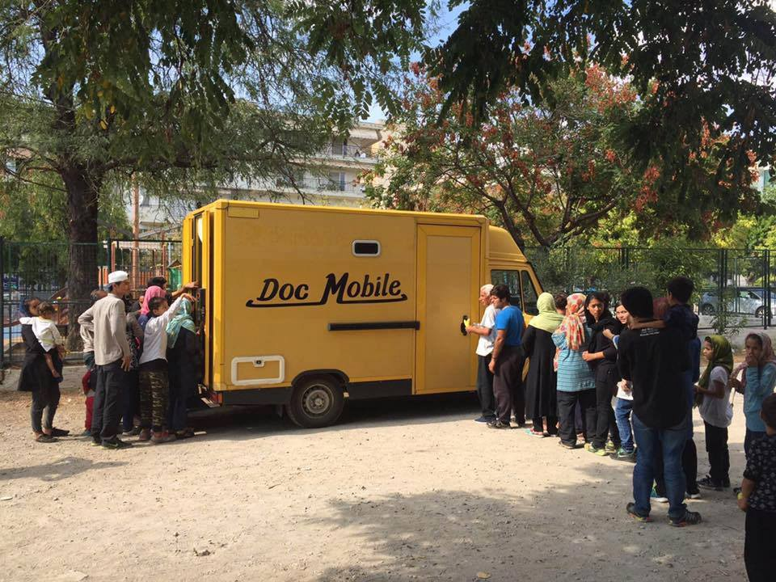
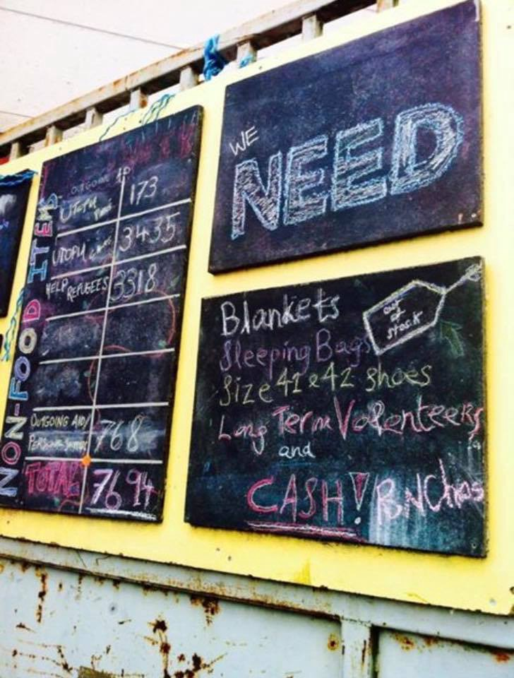

### AYS 21/05/2017:NGOs prepare to withdraw from Greek islands

_Uncertain future for Elliniko residents//5,000 refugees rescued in the Mediterrenean//Dispute over relocation continues//_

 team](assets/aab5c4a0a577/1*uskfGEd3GCRuWlulwXIP7Q.png)

Photo by [Khora Community Center](https://www.facebook.com/KhoraAthens/) team
#### Greece
### NGOs prepare to withdraw from Greek islands

[The Independent](http://www.independent.co.uk/news/refugees-latest-greek-islands-government-unhcr-humanitarian-crisis-fears-a7747656.html) reports the Greek government will take over funding and managing support services on Greek island camps on 31 July, but aid organizations fear the prospect of a “humanitarian gap” resulting from a poorly planned transition\. The Independent says “ _NGOs on the islands have received millions from ECHO, the European Commission’s humanitarian division, but the allocation of funding, as well as the selection of projects to be funded, will soon become the sole responsibility of the Greek authorities_ ”\.

This means that some International NGOs, including the Norwegian Refugee Council and Médecins du Monde could be forced to leave the islands\. The NGOs worry that services they provide will not be able to continue running, or that vulnerable people will fall through the cracks\. Most NGOs agree that in terms of long\-term sustainability, returning management to state authorities can be a good idea, but all insist on the need for an effective transition\.

On Chios, Be Aware and Share \(BAAS\), which oversees a multitude of education projects, says they will also no longer be able to rely on EU funding\. Nicholas Millet from BAAS tells us they haven’t been told “how the government or when the government or if the government is even going to provide education for the children”, adding that “everyone is waiting to hear” how the transition from NGOs to government is going to be organized\.

In the meantime, [BAAS is trying to fundraise 120,000 Swiss Francs within six weeks](https://www.gofundme.com/RefugeeEducationChios) in order to continue operating until at least the end of the year\. “We need to now find enough money so that we can continue our program to ensure that the children can be educated”, Nicholas Millet says — “we’ll stay until we’re not needed”\. “
### 50 refugees arrive on Chios

50 refugees including 21 children arrived this morning on Chios\. Last month, out of 1,156 refugees arriving on Greek islands, 410 were children and 269 were women according to Hellenic Police numbers
### Urgent call\-outs for medical staff

[DocMobile — Medical Help e\.V](https://www.facebook.com/docmobile.org/?fref=mentions) , which offers primary medical care of refugees out of its custom van and ambulance, is currently in need of backup for different locations like Athens and southern Greece\. Available doctors, and nurses can contact kai\.wittstock@hamburg\.de\. DocMobile is also looking for dentists and dental technicians for its new DentistMobile on Lesvos\. Other volunteering opportunities for medics can be found on [Greecevol](http://greecevol.info/task.list.php?tag%5B61%5D=1&filter=set&mysearch=&sort=place) \.
### Uncertain future for Elliniko residents

The Elliniko camps are to close on Monday and many refugees are uncertain of their future\. Amnesty International campaigners Irem Arf, Monica Costa and Lene Christensen have visited the camp this Saturday and talked to Afghan women who said that they don’t know what will happen next and that the uncertainty is killing them\. On Sunday, Amnesty was not allowed inside the camp\.

■■■■■■■■■■■■■■ 
> **[Lene Christensen](https://twitter.com/ChristensenLene) @ Twitter Says:** 

> > This time, Amnesty is not allowed access inside #Elliniko camps. The people living there doesn't know what will happen when the camps close https://t.co/6dSFyluei8 

> **Tweeted at [2017-05-21 08:17:49](https://twitter.com/christensenlene/status/866206381807947776).** 

■■■■■■■■■■■■■■ 

A month ago the human rights group had called on Greece to close Elliniko, criticizing the uninhabitable and unsafe conditions but also urging authorities to “ _provide residents with adequate alternative housing, following a genuine consultation_ ”\.
#### Bulgaria

The number of refugees in Bulgaria has dropped significantly according to the [Balkan News Agency](http://balkaneu.com/number-of-refugees-in-bulgaria-has-dropped-significantly-report/index.html) \. By May 18th there were 3128 people seeking protection in Bulgaria, with a total of 1,007 foreigners staying illegally in Bulgaria removed from the country and around 3,000 more managing to leave the country on their own according to the Bulgarian Interior Ministry\.
#### **Mediterrenean**

**5000 refugees rescued in the Mediterrenean**

[Reuters](http://www.aljazeera.com/news/2017/05/5000-refugees-rescued-route-italy-libya-170520134511012.html) reports 5,000 refugees bound for Italy were rescued in waters off the coast of Libya between Thursday and Saturday\. The refugees told Reuters of arbitrary detention, slavery and beatings in Libya\. One man said he did not plan to go to Europe, but after a few months working at a car wash, a local man destroyed his passport and work permit, making him an irregular migrant, and he was forced into hard labour\.
#### Italy

**10 people die within nine months because of closed borders**

[Repubblica](http://genova.repubblica.it/cronaca/2017/05/20/news/ventimiglia_un_altro_migrante_ucciso_dal_blocco_francese_nascosto_in_un_treno_e_morto_folgorato-165930664/) reports a 30 year old man from Mali died electrocuted inside a train at the Cannes La Bocca train station yesterday\. Refugees take more and more risks to cross the border from Italy to France — only last week a man got electrocuted on top of a train at another French train station near the border, leading to severe injuries on both legs, while a month ago two minors got injured on top of a train in Nice\. The blog [Il Taccuino dell’Altrove](https://taccuinoaltrove.wordpress.com/2017/02/11/i-morti-di-frontiera-tra-ventimiglia-e-menton-7-in-5-mesi/) says ten people died within nine months because of the closed border\.
#### France
### Donations needed in Calais and Dunkirk

The Dunkirk Refugee Women’s Centre has updated its [donation list](https://www.facebook.com/refugeewomenscentre/posts/293691707723133) , insisting on the need to donate quality and already sorted clothes as they do not have the capacity to invest time in sorting\.

Blankets, sleeping bags, size 41&42 shoes and long\-term volunteers are needed in Calais\.

Finally, Care4Calais needs specific items for Ramadan, including dates to break the fast, dried fruit and nuts, cereal bars, biscuits and cakes as well as money for fresh fruit and bread\.
### Dispute over relocation continues

[_Reuters_](http://www.reuters.com/article/us-europe-migrants-eu-poland-idUSKCN18E2JN?feedType=RSS&feedName=worldNews) says Poland refuses to yield to pressure from the EU to take in any asylum seekers under the European Commission’s relocation scheme, despite the threat of legal action\. On [Saturday](http://www.reuters.com/article/us-europe-migrants-poland-idUSKCN18G0RC) , Poland’s ruling party leader Jaroslaw Kaczynski said “ _we have not opened Europe for refugees — Ms Merkel has\. And it is Ms Merkel and Germany that have to bear the consequences, not Poland_ ” — on Thursday, Interior Minister Mariusz said “ _Poland’s position is consistent and clear — we oppose relocation_ ”\.

In an interview with _[Il Corriere](http://www.corriere.it/cronache/17_maggio_20/chi-non-accoglie-profughi-merita-sanzioni-tajani-europa-57f0d2ea-3cca-11e7-bc08-57e58a61572b.shtml) ,_ European Parliament President Tajani has now said the European Commission must initiate infringement procedures against member states which refuse to take their agreed share of refugees\.

This comes after a vote in the European Parliament on Thursday, which urged member states to comply with their commitments to meet their relocation targets by September 2017\.

This goal is unlikely to be met and the Commission likes to point out that Hungary, Poland and Austria remain the only Member States that have not relocated a single person\. However, these countries cannot be the only ones to blame for the slow pace of relocation as many other member states have not increased their commitments — the Commission’s goal was to relocate 3,000 people by month from Greece in order to finish the program by September\. In reality, only 1,368 refugees have been relocated from the 12th of April until the 16th of May\. Hungary and Poland are therefore the perfect scapegoats, able to masks the lack of effort made by the rest of the EU to increase the pace of relocation\.

_Converted [Medium Post](https://areyousyrious.medium.com/ays-21-05-2017-ngos-prepare-to-withdraw-from-greek-islands-aab5c4a0a577) by [ZMediumToMarkdown](https://github.com/ZhgChgLi/ZMediumToMarkdown)._
