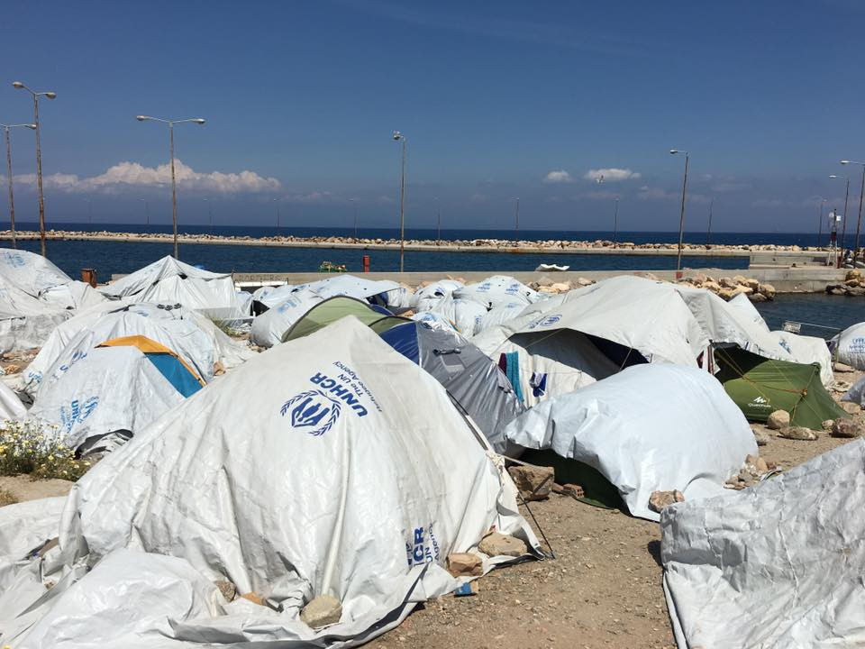
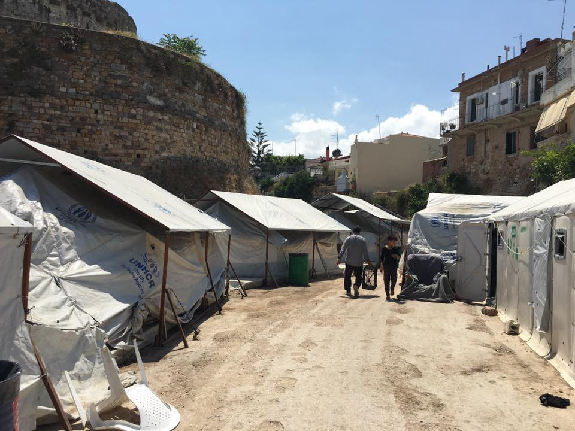
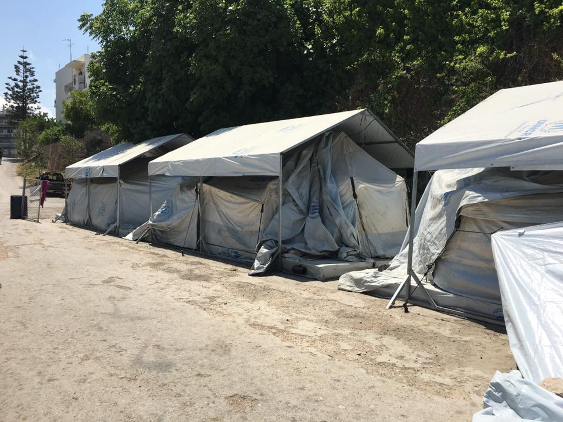
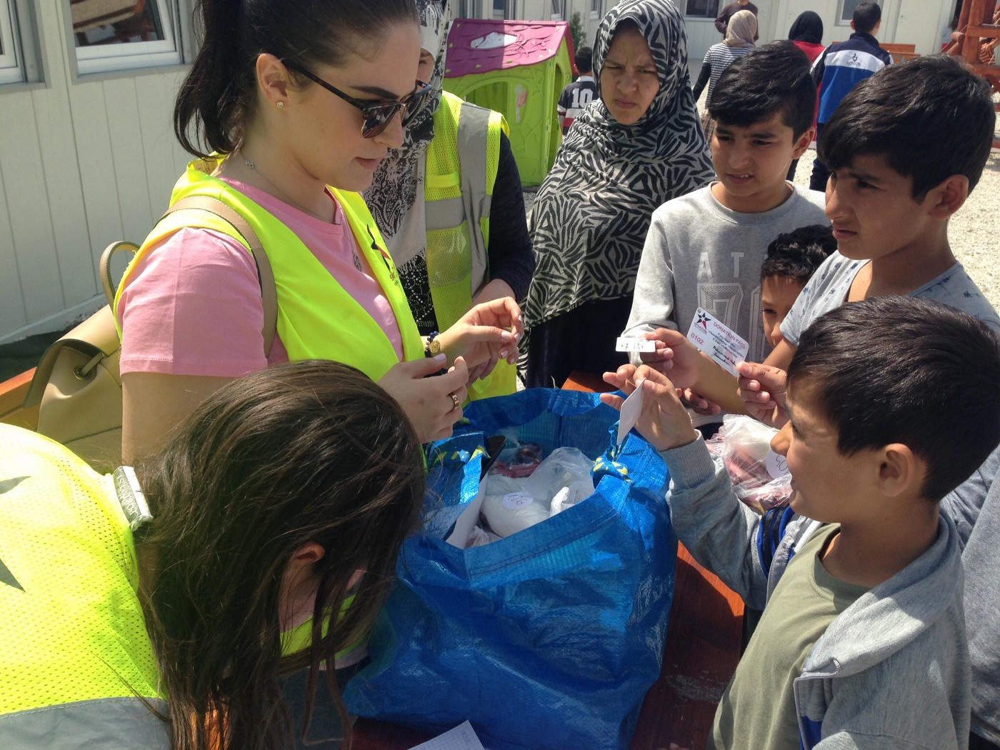
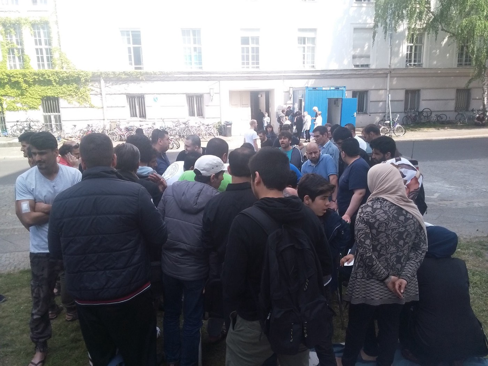

### AYS News Digest 22/5/17: Growing uncertainty among those being \(re\)moved
#### Evacuation of Elliniko leaves many refugees wondering and worrying / Situation on Chios deteriorating, conditions “worse than ever” / Urgent help needed in Gorizia / Swiss people reject the plan to house minors in proper centres / Protests in Germany / Minors missing in Norway

](assets/f453b9c86052/1*Z5EC_tg6PdN5GxUy1QdWwg.jpeg)

Credits: [Stefan Simanowitz‏](https://twitter.com/StefSimanowitz)
#### FEATURE — GREECE
### Chios

Two boats arrived to Chios today: 54 people in the first and 26 people in another arriving to Agathonisi\. At the same time, 66 people arrived to Samos\. 
The 50 new arrivals of yesterday have been registered today on Chios, island that has seen a surge in arrivals lately and conditions there are becoming unbearable, leading to refugees dismissing it as a possible destination when fleeing to the Greek side in the coming weeks\.

> Yesterday, right in front of our eyes, a 16\-year old boy attempted suicide by throwing himself down the castle wall\. I have it on video, in case evidence is necessary — not that anyone cares…\. And then later still, on camera, a wonderful, smart man, a kind Syrian man who has taken it upon himself to single\-handedly distribute clothing and dry food packs to the desperate families in Vial twice per week, a man who volunteers full\-time in the kitchen to cook for the refugee school, this man said that if his second asylum appeal is rejected, he will absolutely kill himself rather than let himself be deported\. 

> It’s all unbearably, devastatingly sad — and also very alarming\. — [_Chios volunteer_](https://www.facebook.com/leslie.schick) 

Chios \(Photo: Leslie Meral Schick\)

### Elliniko evacuation

The gradual evacuation of the old Athens airport Ellinikon has [started](http://www.keeptalkinggreece.com/2017/05/22/authorities-evacuate-last-informal-refugee-camp-of-hellinikon-airport/#.WSKY3wpjntw.facebook) , with parts of the furniture and equipment of the common areas being transported from the last large informal camp in the Athens area\.

■■■■■■■■■■■■■■ 
> **[Liana Spyropoulou](https://twitter.com/LSpyropoulou) @ Twitter Says:** 

> > #Elliniko camp is shutting down. Last meal to be served tomorrow morning. Refugees going to #Thiva or alone in #Athens center #Greece https://t.co/nwFpA5DPhv 

> **Tweeted at [2017-05-22 08:02:34](https://twitter.com/lspyropoulou/status/866564931692482561).** 

■■■■■■■■■■■■■■ 

According to the official information, they will be prioritizing vulnerable groups like single parent families, families with young children, elderly and women traveling alone\. According to the [UNHCR](https://twitter.com/UNHCRGreece/status/866316565402316801) , the first 400 people considered vulnerable were transferred from Elliniko to hotels and apartments\.

Less than a month ago Amnesty International reported that the conditions in the camps were so dreadful that they warranted an immediate shutdown of the camp and the relocation of its residents to other residences\.

The main destination for people who have spent a year in harsh conditions of Elliniko \( [protesting](ays-digest-06-02-hunger-strikes-in-greece-halted-deportations-to-afghanistan-in-germany-185da631cdf2) at a certain point this year\) is the UNHCR’s reception center in [Thiva](http://www.ekathimerini.com/216877/article/ekathimerini/news/old-spinning-mill-to-host-migrants-from-elliniko-site) , as well as other structures in Attica where there is space for hosting these people\. However, there is a growing [skepticism](https://l.facebook.com/l.php?u=https%3A%2F%2Ftwitter.com%2Flspyropoulou%2Fstatus%2F866566060916563969&h=ATPKVKTW2NSyYKM2U-yJdO33OleOQP8v6WEaPR94rqsqZ95ncOT8Kz_q7Z5rYSqsRNoT_YLkURLQjMdt1pieWHuhV33C-CUxiAJVfWdK4ZCnpBu2fi9pJJeMDH-D7I_3uHwsydqU) regarding the relocation of people from Elliniko to Thiva and the way this transition will be processed, especially considering some of the [previous](https://l.facebook.com/l.php?u=https%3A%2F%2Ftwitter.com%2Fufroese%2Fstatus%2F866386123764969477&h=ATPmP6F_6mpZXic_EorvBQJZ32Zg4Ybh50pyedOMhpNGPHgP1B8mFysv2nNWl9w05Bw9AycYeukfWuEPtZYDkQzqeLI3Bss5qWM8qHOdBCMwu7w35D9hTauMrEomnuvjQ6QBnuHM) organized movements of this kind\.

■■■■■■■■■■■■■■ 
> **[Liana Spyropoulou](https://twitter.com/LSpyropoulou) @ Twitter Says:** 

> > "We dont want to go to #Thiva is far away from Athens We are taking our kids and we leave before the evacuation of #Elliniko camp" #Greece https://t.co/kKKZ78fr9b 

> **Tweeted at [2017-05-22 09:57:39](https://twitter.com/lspyropoulou/status/866593892380049409).** 

■■■■■■■■■■■■■■ 

Amnesty International’s request to visit the camps between May 21 and 23 was refused but they interviewed residents outside Elliniko and found out that most are anxious about the moving, as they have been through a lot during their stay there and they don’t want to go to yet another similar camp\. [They stated](https://www.amnesty.org/en/latest/news/2017/05/greece-people-displaced-by-imminent-closure-of-refugee-camps-must-get-safe-and-adequate-housing/) :

> There has been no consultation with Ellinko residents who have been kept in the dark as to when and where they will be moved to\. The authorities must urgently guarantee that no one will be rendered homeless or placed at risk as a result of the closure\. Safe and secure adequate alternative housing which takes account of the particular needs of women and girls must be made available\. 

#### HUNGARY
### New system of distribution

The [SIRIUS\.HELP](https://www.facebook.com/sirius.help/) volunteers have started handing out donations in the transits in a new way\. All families staying there are given an individual card with all the necessary information for the process\. After the card is registered, the relevant information \(name, nationality, age, shoe and dress sizes\) of all family members is available to the volunteers\. Those who need something simply send a message or contact someone at the transit zone and provide the card number and say what they need\. Everything is then packed, marked with the card number, and the volunteers deliver the package to the transit, where the families receive the items\.

](assets/f453b9c86052/1*VEtIgDU56cJ3gjcGSio1ig.jpeg)

Photos: [SIRIUS\.HELP](https://www.facebook.com/sirius.help/)
#### ITALY
### Urgent need for help in Gorizia

The lack of an organized help and support from the organizations and complete absence of responsibility and care from the officials have brought about 150 people in danger as they are left on their own, following the evacuation of the “bunker”\. People are in need of food, basic toiletries and — everything else\. Some have health problems and a man was hospitalized yesterday\.
Last evening [Ospiti in Arrivo](https://www.facebook.com/ospitinarrivo/?fref=nf) brought sleeping bags, hygiene products and food to the 32 people who found a place to sleep thanks to the 2 local associations that provided space for them\. Nobody knows what will happen tonight\. What is known is that 47 people risk sleeping rough tonight\. These volunteers will follow the situation in Gorizia\. [They need help](https://www.facebook.com/ospitinarrivo/posts/1906748356247935) :
\- food \(bread, can food, biscuits, fruit etc\. \)
\- hygiene products \(soap, razors, blades, toothpaste and toothbrushes etc\. \)
#### Trieste

50 people were found in a truck with Turkish liscence plates, in Trieste\. Among them were women, children and elderly people, all from Syria and Iraq\.
### Bari mobilized to help new arrivals

As the coast of Sicily is heavily secured because of the G7 meeting, today’s boat with 250 people from African countries [disembarked in Bari](http://bari.repubblica.it/cronaca/2017/05/21/news/bari_al_porto_sbarcano_250_migranti_la_citta_si_mobilita_per_offrire_cibo_e_vestiti-166038968/?ref=fbpr) , in the region of Puglia, in the south of Italy\. On this first day, the citizens demonstrated good will to help, gathering and collecting aid for all those who had just arrived to the safety of the Italian soil\.
#### SWITZERLAND
### Financing of a new reception centre for unaccompanied refugee minors — refused

Although the Bern cantonal government had approved the extra funds for specialist centres that offer support and protection for young people, the right\-wing party SVP instigated a referendum\. 54\.3 percent of voters rejected the proposed plan, so Bern will not have enough money to lodge young asylum seekers in specialist centres in the future, the media [reported](https://www.thelocal.ch/20170522/bern-voters-say-no-to-extra-funds-aimed-at-helping-young-asylum-seekers) \.

The number of people seeking asylum in Switzerland has dropped in recent months\. The [SEM figures show](https://www.sem.admin.ch/sem/fr/home/aktuell/news/2017/2017-01-23.html) that 1,307 asylum requests were lodged in April this year, 25 percent fewer than the same month last year and the lowest number in any month since February 2011\.
#### GERMANY
### Police stopped a protest in Berlin

Life at the camp at Briener Str\. 16 in Berlin has become unsustainable, local activists [claim](https://enoughisenough14.org/2017/05/22/berlin-police-evicted-brienner-str-refugee-protest-urgent-support-needed/) \. They have started a protest as a reaction to the poor conditions, but also the treatment they receive from the officials working on site\.

> Although many people think the conditions of the camps in Germany are good, in reality there are many camps where there are many problems\. Mistreatment by security personnel \(there are alarming reports about fascists working for security companies\), problems with healthcare, food, hygiene and many other things\. 

“The protesters denounce the continuous abuses by security guards, the existence of bedbugs affecting adults and children, the bad food, being forbidden to take food to the rooms and the worrying hygiene conditions\.”
Their protest was stopped by the authorities and tents, sleeping bags and other belongings of those sleeping in the backyard were confiscated by the police\.

 \)](assets/f453b9c86052/1*sEN8ya9rvdR1ujkr6ApExg.jpeg)

Berlin district administration office forced them to throw out their tents cause law says that, and Now they have to sleep without anything outside of their former camp Infront of briennerstr\.16 in Berlin\. But still they will continue their strike” \(Photos: [Refugees Welcome](https://www.facebook.com/RefugeesWellcome/) \)

Another protest in the line of anti\-deportation protests and actions happening around Austria and Germany has started today in Munich\.

> Hi dear people we are 36 refugees from Refugee Struggle For Freedom and from today 22\.5\.2017 on we are protesting in Ebersberg in Munich\. What we need is your solidarity\.
 

> We are fighting for the right to stay and against deportations\. 

](assets/f453b9c86052/1*dgfpuRo1yD3dozdvlOnYQg.jpeg)

Photo: [Refugee struggle for freedom](https://www.facebook.com/refugeestruggle/)
#### NORWAY
### 143 young people disappeared\!

Figures from the Directorate of Immigration \(UDI\) show that from January to April this year there were 143 single asylum seekers who disappeared from Norwegian asylum reception and whose whereabouts are still unknown, NRK [reports](http://norwaytoday.info/news/143-young-people-have-disappeared/) \. More than half of them were waiting to be sent out of Norway when they reach 18\.

Most of them are simply children who have a huge fear of being sent out on the when they become 18 years old and being [sent back](https://www.google.hr/url?sa=t&rct=j&q=&esrc=s&source=web&cd=5&cad=rja&uact=8&ved=0ahUKEwiat6-XyYTUAhXEIMAKHUEuBloQFghEMAQ&url=https%3A%2F%2Fpasseursdhospitalitesenglish.wordpress.com%2F2017%2F03%2F15%2Falert-an-expulsion-to-norway-may-become-a-deportation-to-afghanistan%2F&usg=AFQjCNGswRzjJRTHusHrrCdnMr3YUVDheA&sig2=yseA8zUZ4N6J3i_JO99D-A) to war\.
#### DENMARK

A three\-metre border fence with barbed wire, motion sensors and surveillance cameras\. This is [the plan](https://www.thelocal.de/20170522/danish-peoples-party-wants-barbed-wire-fence-on-germany-border) of some Danish politicians for the border with Germany, copying the shocking system Hungary has imposed on its borders\. Denmark’s state Refugee Board \(Flygtningenævnet\) recently announced that it found conditions for asylum seekers in Hungary too insecure for Denmark to send its own refugees to the central European country\.

> A situation in which the EU would grant Denmark permission to erect a barbed wire fence on its border is “unthinkable”, said Frank McNamara, border control expert with thinktank European Policy Centre\. 

My soul is free — انا روحي حره
Digital Art by Julie Larah
#### LYBIA
### UNHCR ‘shocked at the harsh conditions’ in detention camps of Lybia

The head of the UN refugee agency has reportedly urged Libyan authorities to free all asylum seekers and refugees from its detention centres\. After visiting one of the detention centres in Tripoli, he stated that, although he finds that the political and security reasons don’t allow them to act properly to end the current suffering of the refugees, they “would be doing whatever they can to help the Libyans manage better these issues”\.

> “The time has come for us, as the UN refugee agency, to step up our presence and activities in the country” 

We agree\.

_Converted [Medium Post](https://areyousyrious.medium.com/ays-news-digest-22-5-17-growing-uncertainty-among-those-being-re-moved-f453b9c86052) by [ZMediumToMarkdown](https://github.com/ZhgChgLi/ZMediumToMarkdown)._
