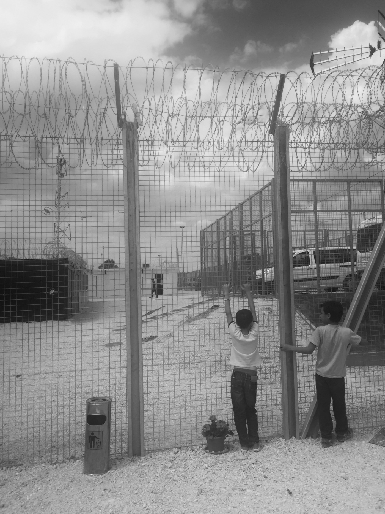

### AYS SPECIAL: Inside the Hungarian closed camp

_“I have spent three months stateside in the past year\. The rest of my time has been split between Greece and Serbia where I have been volunteering with refugees\. During this time, I have had the privilege of meeting some of the strongest, most resilient people I have ever met\. The friends and connections I have made in the past year are unlike any I have ever experienced traveling or in Montana, where I am from\.”_

Recently, I have been working inside of the camps in Hungary\. Newly approved legislation legalized the detention of refugees and migrants for the duration of their asylum application process\.

_“This new law violates Hungary’s obligations under international and EU laws and will have a terrible physical and psychological impact on women, children and men who have already greatly suffered,_ ” said Cécile Pouilly, a spokesperson for UNHCR \(United Nations High Commissioner for Refugees\) \. **_The result are prison like containers surrounded by razor wire containing unaccompanied minors, families, and single men;_** fathers, mothers and an abundance of children are currently being held for roughly two months until they hear whether or not their cases for asylum have been accepted\.

If they are denied asylum and choose to appeal, they must remain locked inside of these containers as they await a second decision\.
#### Trauma that cannot be compared with anything

My personal experience and evaluation coming and going from these closed camps is hard to articulate\. The outside appearance is one of sterility and efficiency\. The self control I must assert within these camps is unlike any I have had to in the past year I have been volunteering\.

I have been threatened with arrest for giving people basic necessities like food, blankets, tents and clothing\. I have engaged in dialogue with countless conservatives in both the US and abroad, trying to explain and adequately convey the love I have for my friends who happen to be refugees, many of whom I now consider to be family\. **_I have sat in meetings where the same officials who are supposed to be in charge of caring for refugees, told me that we were ‘creating a pull factor’ and if we stopped giving food that the refugees, ‘would eventually become hungry enough, and move into camps’\._**

I have bandaged dog bite wounds and treated the macerated feet of my friends with no training while on the phone with a medical association less than 10 miles away, who refused to provide assistance to the very people they claim to help\.

Throughout all of these encounters, I have managed to bite my tongue, attempted to remain calm and approach ignorance and lassitude with understanding and humility\. And still, after all of this, nothing compares to the trauma I witness when I enter these camps\.
#### **Behind the fence**

When I first walked up to the fence, children tried to push their hands through to shake mine\. _“When can you come inside? Why can’t you come inside?”_ My friend and I sat on the ground outside of the fence singing songs for over an hour while a variety of other staff and organizations were allowed to enter\. The children started to sing _‘If You’re Happy and You Know It, Clap Your Hands’,_ so I stood on the other side of what my father would call ‘hog panel’, clapped my hands, snapped my fingers and stomped my feet as though it were completely normal\. We sang it together four times until I couldn’t sing it anymore\. When we were finally allowed to enter, a police officer asked why he didn’t receive the same kind of love and care that I was extending to the children\.

There is a pregnant woman who is 9 months along\. When my friend and I were first speaking with the children on the other side of the fence, we made eye contact\. Just that, a friendly face, brought tears to her eyes, and she laced her fingers through the wire in an attempt to hold my hand\. She brushed tears from her cheeks, and I stood there wondering what kind of identity her child would have\.

If it would be registered in Afghanistan, or if Hungary has the same _jus soli_ policy as the US, where those born in the country are automatically citizens of that country\. It does not\. While still waiting outside, I watched as she was escorted by two armed guards to an ambulance\. She needed to go to the hospital for a checkup\. Her 6 year old child was left behind in the compound with his father\. He cried at the fence as she was being walked to the ambulance, looking back, trying to console him\. He was not allowed to go with her\. I cannot imagine the psychological pain caused by this experience on both this woman and her son\. We hugged briefly as her child cried, and she shrugged her shoulders as if to say, _‘What can I do?’_ \.

While the visible conditions are clean, and people are receiving food, and other items, the psychological trauma that is clearly visible in the adults, and the behavioral changes in the children are more than concerning; they are haunting\.

When we asked the children if they wanted anything, they instinctively ran to their rooms to get the card which has their registration number on it\. It has taken multiple times for us to try and convince children that the items we bring belong to them, and that they won’t be taken away when we leave\.

When we bring new things in, there is either a sense of urgency to grab whatever one can, or form a line to get something\. These habits alone are not healthy, but I still feel as though it does not do justice to the psychological stress caused by being detained for an unknown amount of time, with no sense of agency or power, and the feeling of being observed all of the time\. There are cameras in every corner\. Privacy and silence is close to nonexistent\.
#### We are so lucky

A man asked me very pointed questions: Why was my country allowing this to happen? \(He thought I was Hungarian\. \) Why aren’t there people protesting? Why are children being detained? What did they do wrong? These are questions I have been asked multiple times now by a variety of people\. He said, _“In our country, we had the things that your group is trying to give us\. I don’t need your clothing\. I don’t need your food\. We came here because we didn’t have freedom\. Because Europe promises freedom\. Now, my children are in prison, and we have done nothing wrong\. This is not the way that children are supposed to grow up\.”_ He is right\.

I do not ask such extreme questions anymore\. There is clearly more than enough to protest about\. I do not ask others to feel the same passion I feel for the people I have met\. After all, it is an ocean away\.

I am well aware that this is a personal quest\. I do ask, however, that you keep these people in your thoughts\. Even if it is only a brief moment, the mere acknowledgment of a wrong can be enough\. A short discussion, awareness of personal security and privilege, even within the turbulence of everyday life, can shift one’s perspective entirely\. We are so lucky\.

\(Keegan Nashan for AYS\)

_Converted [Medium Post](https://medium.com/are-you-syrious/ays-special-inside-the-hungarian-closed-camp-98aec8c3e289) by [ZMediumToMarkdown](https://github.com/ZhgChgLi/ZMediumToMarkdown)._
