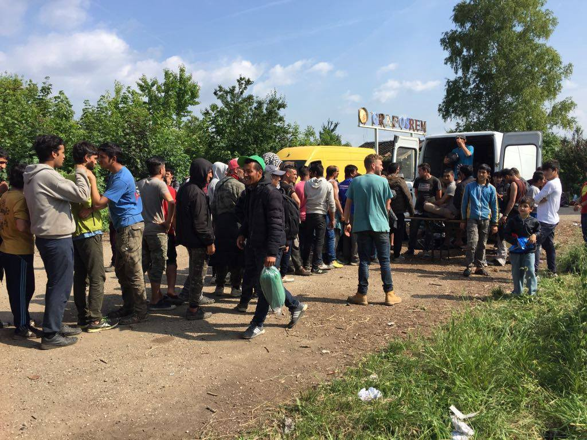

### AYS DAILY DIGEST 26/05/17: G7 Summit opens as rescue ship enters distress nearby

_Chilling statistics on what “route closure” means / Serbia volunteers report more people sleeping rough, need for NFIs / Croatian activists speak out against police brutality against minors / Italian police use emergency service calls to track down refugees / Hunger strike against deportations in Germany / horror in France as people scramble to escape the heat / more…_

](assets/dafe2b653fce/1*E-OzjX-m-RO4VbTP26icpw.jpeg)

Hunger strike in Germany Photo credit: [**Refugee struggle for freedom**](https://www.facebook.com/refugeestruggle/)
### FEATURE

The G7 Summit opened in Italy today where representatives from seven of the most powerful countries in the world have met to discuss various global issues such as security, energy, and the economy\. Understandably, it has become one of the most important events and opportunities for organizations and activists to speak out and make their voices heard\. As U\.S\. President Trump continues his debacle\-fraught European tour, many have voiced well\-grounded alarm over his obstinacy and refusal to cooperate on crucial issues\. The president of the European council, Donald Tusk, confessed that this would be “the most challenging [G7](https://www.theguardian.com/world/g7) summit in years” as President Trump’s approach to topics such as trade, migration, and climate change are fundamentally at odds with the approach of many other participants\.

However, many large organizations are still putting their hope in the summit, or, rather, trying to impart the urgency of looming global issues, one of the most notable being famine and extreme poverty which are two of [the largest issues influencing mass migration](http://reliefweb.int/report/world/millions-children-risk-if-g7-fails-find-long-term-solutions-key-global-and-humanitarian) , on a broader stage\.

In a disturbing turn of events, an MSF rescue ship carrying over 1400 passengers continued to issue unheeded distress signals as they were not allowed to dock in Sicily due to the summit\. As of 16h on Friday, there has been no Italian, EU, or Frontex response to MSF as they carry their precious cargo alone\. MSF in distress\. We wish you relief and if not, a safe trip to port\.

■■■■■■■■■■■■■■ 
> **[MSF Sea](https://twitter.com/MSF_Sea) @ Twitter Says:** 

> > Still no assistance and with the #G7Taormina meaning we can't dock in #Sicily, the first available port is 48hrs away. #MSFboatindistress https://t.co/qb7dOCEexG 

> **Tweeted at [2017-05-26 14:55:03](https://twitter.com/msf_sea/status/868118288336912384).** 

■■■■■■■■■■■■■■ 

■■■■■■■■■■■■■■ 
> **[MSF Sea](https://twitter.com/MSF_Sea) @ Twitter Says:** 

> > After 3 medical evacuations, we have now 1446 #people in this situation. We are asking support to transfer at least 400, but nothing so far. https://t.co/IigZvznNSc 

> **Tweeted at [2017-05-26 11:07:50](https://twitter.com/msf_sea/status/868061107776258048).** 

■■■■■■■■■■■■■■ 

IOM’s update for 2017 lists that arrivals via the Mediterranean have reached 60,521 in 2017, which is less than [one third of the Med arrivals](http://www.iom.int/news/mediterranean-migrant-arrivals-reach-60521-2017-deaths-1530) during the same period last year\. However, although arrivals have dropped, what is even more significant is at what cost\. The death toll for this period last year came to 1,398, which is lower than this year’s toll of 1,530\. When placed in the context of successful landings, the picture becomes even more grim\. The percentage of deaths out of successful landings last year came to 0\.7%, whereas this year, it has skyrocketed to 2\.5%\. These are no longer soft heartstrings, but rather cold hard facts speaking, “stemming migration” will always translate to higher deaths\.

For those interested, the Reliefweb app is a simple way to stay up to date on many impactful crises occurring around the world\. There is also an integrated job search and data analysis capabilities\. Check it out\!

### GREECE

The following video was shot to continue to bring awareness to the desperate situation on Chios\. Many in the volunteering world were utterly flabbergasted as several official reports about Chios neglected to mention that the island is horrifically over\-capacity, minimizing numbers in some ways and maximizing others in order to project the aura of control\.

It has sadly been announced that the [**Mobile Flüchtlingshilfe e\.V\. — Mobile Refugee Relief**](https://www.facebook.com/MobileFluechtlingshilfe/?ref=page_internal) tea tent in Filipiada will close shortly\. Below is their announcement\.

](assets/dafe2b653fce/1*EZBrBGA3D5J-vqhO3VSuRg.jpeg)

Photo Credit: [**Mobile Flüchtlingshilfe e\.V\. — Mobile Refugee Relief**](https://www.facebook.com/MobileFluechtlingshilfe/?ref=page_internal)

> after one year of our work in Filippiada Camp in the cultural center / tea tent, we have now decided to stop our work on site\. There are numerous reasons that have led to this decision, which hasn’t been an easy one\. 

> At this point, we would like to thank everyone for the great cooperation and support we have experienced during our time on site\. Thanks a lot for the energy, efforts, passion and also financial support that many of you have invested in this project\. 

> We hope that all of you will continue supporting our work at other areas and possible future projects\. 

> Your MFH\-team 

](assets/dafe2b653fce/1*Tc-WC-u15AYeeM2Uqou9Eg.jpeg)

Photo credit: [**Mobile Flüchtlingshilfe e\.V\. — Mobile Refugee Relief**](https://www.facebook.com/MobileFluechtlingshilfe/?ref=page_internal)

Humanitarian Support Agency is looking for a TEFL\-certified English teacher to join their team in Lesvos\. Think you make the cut? Contact them [here](http://humanitarian-support-agency.org/?page_id=404) \.
### SERBIA

Aid Delivery Mission reports that there is a great need for NFIs in Šid camp and the surrounding area\. Fortunately, BelgrAID warehouse ran a delivery of basic NFIs to ADM, but there is still much more to be done\. ADM reports:

_More and more people have come to us who are sleeping rough with no tent, really bad clothing and shoes, and in some cases, no shoes at all\. These are the things that make all the difference when you’re sleeping outside in the rain\._

Photo credit: Aid Delivery Mission

More and more people are resorting to spending large amounts of time outside the camp as the [camp conditions continue to deteriorate across Serbia](ays-20-05-2017-desperate-living-conditions-for-refugees-in-serbia-9cfef314e118) \. Of course, there is denial of this across state\-controlled media, and all of those who wish to escape the camps are treated as prisoners\. Sadly, we can only expect more of this throughout the summer\.
### HUNGARY

MigSzol Csoport released another post documenting their continued efforts to call for an official investigation into border violence against refugees and migrants at the Hungarian border\. [Despite their pleas](http://www.migszol.com/blog/whats-really-happening-at-the-serbo-hungarian-border-for-a-year-now) , overwhelming evidence, and international attention by human rights organizations, deafening silence has prevailed in Hungary\. Moreover, the government continues its push to [try and control, demonize, and silence foreign\-funded](https://www.amnesty.org/en/documents/eur27/6366/2017/en/) NGOs in a simple attempt to shut down any opposing voices\. Thus we see how the conversation around refugees has become one that stretches into many different areas and domains of politics\. Continue to watch Hungary\.
### CROATIA

Welcome Initiative and Center for Peace Studies in Croatia released a scathing condemnation of several instances of police violence towards unaccompanied minors\. Several of the cases were of children who were within the Croatian institutional care system and were attempting to leave\. After being intercepted by police, they were beaten and threatened with guns\. The organizations are hoping that more outrage and public awareness of the increasing incidents of targeted violence against refugees and migrants in Croatia will help bring about a formal investigation\.

Read the full story, in Croatian, [here](http://cms.hr/hr/azil-i-integracijske-politike/policijsko-nasilje-prema-djeci-je-nedopustivo) \.
### ITALY

A distressing report out of Italy that will only serve to push vulnerable people away from the emergency services they so desperately need\. A young refugee man who sustained burns while cooking at an abandoned building needed serious medical attention; as a result, his friends called the emergency ambulance service for him\. However, the ambulance brought a small surprise — a police car\. Eighteen people were arrested and one was deported\. The young man is still in hospital with serious burns\.

“According to the volunteer organization NAGA that provides medical and legal support, ‘the operation happened at the same time as the emergency team was intervening, and this put at risk the chance to receive essential healthcare with the safety and the trust needed’\. It’s a serious act that ‘harms the right to access to healthcare that is granted \- according to Italian law \- whatever the legal status of people: health care first\!’

…

The comment of the organization NAGA is very critical: “we can’t help but ask ourselves if and how such operations foster safety and security for the citizenship\. Are we safer if we spread fear of calling the A&E for an accidental burn because now everyone knows that police could come along? We think not\. We believe this episode is a further step in this war that is not de\-escalating, but rather increasing against its victims\.”

Information retrieved from and quote translated from [this article](https://www.osservatoriodiritti.it/2017/05/26/migranti-chiamano-ambulanza-arriva-la-polizia/) \.

Photo credit: InfoMigrants

Read the [testimony](https://www.facebook.com/hashtag/testimony?hc_location=ufi) of the psychological medical team of MEDU at \#CPR [Caltanissetta](https://www.facebook.com/hashtag/caltanissetta?hc_location=ufi) , translated into English below\.

> May 17th, the medical — psychological team of MEDU — doctors for human rights — visited S\., a Moroccan aged 27, who has been in Italy for years, held since 40 days ago at the CPR \(Permanent Centre for Repatriation\. This is the new acronym introduced by the Minniti\-Orlando decree to replace the CIE “Centres for Identification and Expulsion”\) of Caltanissetta — Pian del Lago, one of the 5 currently operating on the national territory\. 

> S\. has been suffering from severe psychological problems since 2010, which necessitated hospitalization in mental health departments and therapeutic communities\. Despite this and the health records produced by his lawyer, his detention was validated and only after the intervention of MEDU, which certified the incompatibility between his condition and detention, S\. was released on May 23rd\. This is another example of how, despite yet another name change, the substantial nature of detention centres for migrants as places of suspension of fundamental rights, especially the right to health care, remains unchanged\. In this regard, MEDU expresses deep concern about the opening of new centres throughout the territory according to the newly approved [\#decree](https://www.facebook.com/hashtag/decree?hc_location=ufi) [\#Minniti](https://www.facebook.com/hashtag/minniti?hc_location=ufi) — Orlando\. 

Retrieved and translated from [here](https://www.facebook.com/MEDUonlus/posts/10155331889514817:0?hc_location=ufi) \.
### GERMANY

In Ebersberg there is an ongoing hunger strike in protest against the increasingly restrictive asylum, monitoring, and deportation regulations that Germany recently instituted\. After several days, however, with increased police harassment, more and more people are leaving the protest, often needing to go to the hospital\.

](assets/dafe2b653fce/1*0EKI_Zcjlb9TqZyLSPBbyQ.jpeg)

Photo credit: [**Refugee struggle for freedom**](https://www.facebook.com/refugeestruggle/)

Police have been increasing monitoring and interference with the protest\. For more information on it, check out this [link](https://enoughisenough14.org/2017/05/26/refugeestruggle-germany-dry-hunger-strike-in-ebersberg/) \. People continue to demand humane treatment, even in the impassive and uncaring face of humanity\.
### FRANCE

The video above highlights the desperation in Paris these days\. A volunteer report:

“This is the desperate situation in Paris today\. People have been living on the streets for weeks or months\. It is only going to get worse if the authorities don’t offer a humane solution\.
It was 100 degrees at times today\. No running water, no showers, sometimes not enough food, tents not allowed, constant police harassment\. No hope and no dignity\.
Paris needs help and it needs it now”

Courtesy of [Timothy Perkins](https://www.facebook.com/timothy.perkins.77/posts/1478418868895452) \.

In addition to this chaos, hundreds of refugees are sleeping rough in the area surrounding Grande\-Synthe camp\. After reports of appalling and violent treatment by police several days previously and many violent relocations, it is hoped some relief will be found soon\.

The European political will seems intent on its oppression of refugees, impassive to any calls for change, yet we will continue\. There are some bright bits of light\.
### NETHERLANDS

An encouraging report from the Netherlands where a group of Somali men were able to successfully appeal and protest the evacuation of a recent squat\. The squat, called Vluchtlumumba had been occupied since April of this year, and residents requested to be allowed to stay until July\. Many of the residents have been in the Netherlands for decades now, and still lack enough support, finding it on their own\. Read the full report [here](https://enoughisenough14.org/2017/05/25/squat-amsterdam-refugee-collective-we-are-here-wins-court-case/) \.

_Converted [Medium Post](https://areyousyrious.medium.com/ays-daily-digest-26-05-17-g7-summit-opens-as-rescue-ship-enters-distress-nearby-dafe2b653fce) by [ZMediumToMarkdown](https://github.com/ZhgChgLi/ZMediumToMarkdown)._
