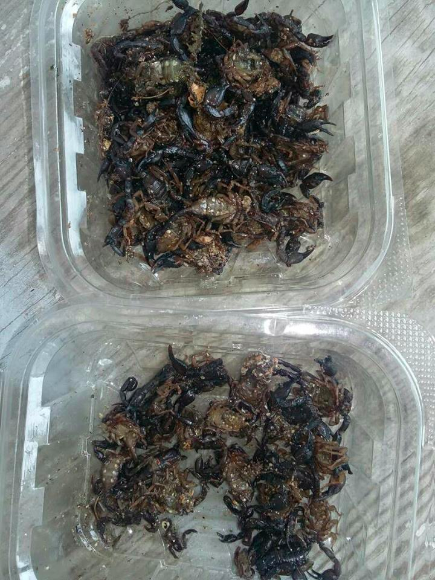
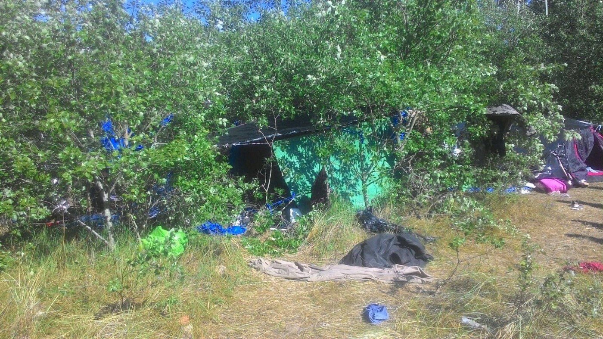
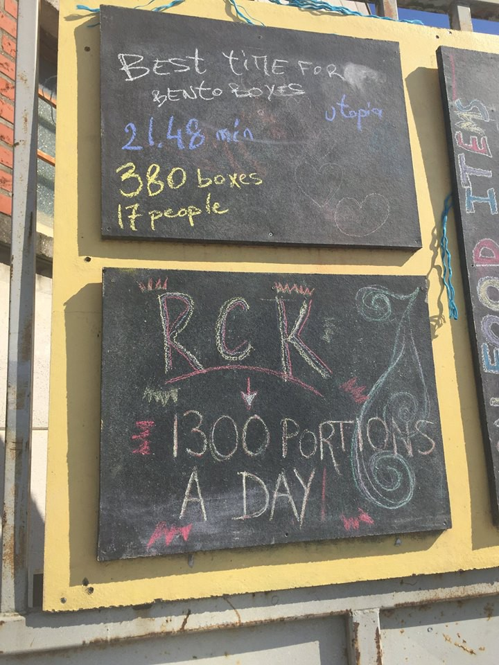
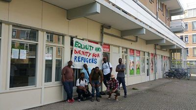

### AYS Digest 28/5/2017: 10,000 refugees rescued over the last four days

_275 people arrive on Samos over the past six days//Donations needed in Calais as police destroys tents and sleeping bags//New building squatted in Amsterdam // Scorpions in the refugee camp in Greece_

](assets/faa8bbf1096f/1*swr2b_dM5HVxm1hLd8bxFQ.png)

Moria graffiti: “”Inside are bakers, nurses, dads, mums, nurses, musicians\.
And doctors, lawyers, dentists\.”
Photo by [Dirty Girls of Lesvos](https://www.facebook.com/dirtygirlslesvos/)
#### Sea
### 1,446 people arrive in Napoli

MSF says its boat the Prudence has arrived in Napoli with 1,446 people and was welcomed by a group of volunteers\.

■■■■■■■■■■■■■■ 
> **[MSF Sea](https://twitter.com/MSF_Sea) @ Twitter Says:** 

> > This is how a group of volunteers welcomed the people onboard #Prudence. Thanks #Napoli! 👍👍👍 https://t.co/MjsXa88BqI 

> **Tweeted at [2017-05-28 09:27:53](https://twitter.com/msf_sea/status/868760729696030721).** 

■■■■■■■■■■■■■■ 

Meridio News reports the boat “Vos Thalassa”, which normally supplies offshore oil platforms, arrived in Sicily with 1,404 refugees and the bodies of five women and two children\. [The Local](https://www.thelocal.it/20170528/54-dead-some-10000-migrants-rescued-between-libya-and-italy-in-4-days) says 10,000 refugees have been rescued over the last four days and at least 54 died\.

60,521 refugees have entered Europe by sea in 2017 through the 24th of May with over 80% arriving in Italy according to the IOM\. 1,448 refugees died between Libya and Sicily during that time\.
#### Greece

**68 refugees arrive on Samos**

Samos Volunteers reports 68 people landed on Samos this morning, bringing the total to 275 arrivals over the last six days\. They add that as very few people leave for the mainland, the camp is getting overcrowded once again and the situation is becoming increasingly critical\.

The European Commission had previously stated that transfers to the mainland should be limited in order to “avoid secondary movement to the rest of Europe”\. Meanwhile, Human Rights Watch has argued that refusing transfers to mainland Greece “ _is an unacceptable excuse for condemning people to conditions that threaten their health and cause huge anxiety”_ , adding that the transfer of vulnerable groups should be accelerated\.

According to official statistics, there are now close to 2,000 refugees on Samos, for a capacity of only 850\. Refugee camps on Chios are over capacity as well and 72 people were registered on the island today alone, as well as 46 on Lesvos\.
### Concerns over “humanitarian gap” on Greek islands

Despite critical conditions in refugee camps, some NGOs funded by the EU could be leaving Greek islands by the end of July, when the Greek government will take over funding and managing support services, as reported by [The Independent](http://www.independent.co.uk/news/refugees-latest-greek-islands-government-unhcr-humanitarian-crisis-fears-a7747656.html) \. Some NGOS fear the prospect of a “humanitarian gap” resulting from a poorly planned transition, while [No Borders](https://www.facebook.com/notes/noborders/truth-lies-and-the-lives-of-others-no-more-victims-of-criminal-indifference-and-/1402292736505281/?hc_location=ufi) worries about the state employees’ training in refugees’ rights and refugee protection\. The group also worries about the lack of access to public services for refugees leaving camps for apartments or more remote locations\. On Chios, the end of EU funding for NGOs could force organizations like the Norwegian Refugee Council and “Be Aware And Share” \(BAAS\) to leave\. BAAS, which which oversees a multitude of education projects, is currently [raising money](https://www.gofundme.com/RefugeeEducationChios) in order to stay on the island at least until the end of the year\.

**129 people detained after trying to leave Turkey**

[Daily Sabah](https://www.dailysabah.com/turkey/2017/05/28/turkey-detains-129-eu-bound-migrants-off-mediterranean-coast) reports 129 people were detained after trying to leave Turkey for Europe\. The refugees reportedly paid $4,000 per person to be smuggled into Italy\.
### Scorpions in Agia Eleni

Refugees in the camp of Agia Eleni worry about the massive presence of scorpions\. We received photos to show this appealing situation, and testimonies of people who are telling us that they are afraid to sleep during the night because of so many scorpions\.

Additionally, they complained about the lack of access to doctors and lawyers in the area, saying that there are no volunteers in the camp at all but one NGO that is in charge for running the camp\.

The first refugees arrived to this camp from Chios, Lesvos and Samos at the beginning of May\. The camp is a former orphanage that ceased to operate in 2006 and was later renovated\. UNHCR said children made up about half of the first group to move in and described the camp as a “collection of 20 spacious stone buildings”, adding that additional work was carried out in the surrounding area to make Agia Eleni safe and accessible to all\. UNHCR also noted that Alternate Minister Theano Fotiou praised the camp as a “model facility”\. Currently, there are around 140 people inside\.

The responsible NGO promised, as we were informed, tehy will address the issue of scorpions\. However, people are living in this camp for over a month and nothing has been done so far\. We hope this will change ASAP\.
#### Serbia
### Restriction of movement in Obrenovac camp

Bordermonitoring Serbia says authorities are trying to lock up all exits of the Obrenovac camp and says only one person per room is allowed to leave\. It adds that refugees might organize a protest\. Previously, it has been announced that all the camps in Serbia are of open type\. What it means in practice is that people are free to go out during the day, but to come back usually before 10pm, and they can leave after 7am\.
#### France
### Donations needed as police destroys tents and sleeping bags in Calais

Care4Calais says it urgently needs donations, especially tarpaulins, sleeping bags and clothes\. The group visited a group of refugees who are sleeping rough and who told them that the police knows where they are and that they get no rest, as every night they are continuously tear gassed and pepper sprayed\. They also say that “ _a couple of nights ago the police went into these woods on a mission, a mission to destroy the beginnings of a new jungle in Calais, throwing belongings out of tents and slashing tents and sleeping bags, leaving people cold, damp and sleepless”_ \.

Photo by Care4Calais

The Refugee Community Kitchen says it now serves 1,300 people a day at four different distributions points and also provides 1,000 liters of water in Calais, “ _where the conditions that people are living are beyond bleak with no facilities at all_ ”\. They need volunteers and you can find out more on how to do so by emailing refugeecommunitykitchen@gmail\.com\.

Photo by Refugee Community Kitchen
#### Italy
### Update on Gorizia

A week ago we wrote on the situation in Gorizia, with around 150 refugees left on their own after the evacuation of the “bunker” and 47 sleeping rough\. Local volunteers say many are still sleeping in the streets, while 50 refugees of the dormitory are without food for Ramadan\. Donations are urgently neeeded, especially rice, flour, eggs, legumes, shoes and underwear\.
#### Netherlands
### New building squatted in Amsterdam

Photo by “We are Here”

“We Are Here” has squatted a new building in Amsterdam with 25 refugees\. The group criticizes the living conditions in official shelters as they are too crowded and force refugees to leave during the day, including when they are sick\.

> **We strive to echo correct news from the ground, through collaboration and fairness, so let us know if something you read here is not right\.** 

> **Anything you want to share — contact us on Facebook or write to:areyousyrious@gmail\.com** 

_Converted [Medium Post](https://areyousyrious.medium.com/ays-digest-28-5-2017-10-000-refugees-rescued-over-the-last-four-days-faa8bbf1096f) by [ZMediumToMarkdown](https://github.com/ZhgChgLi/ZMediumToMarkdown)._
