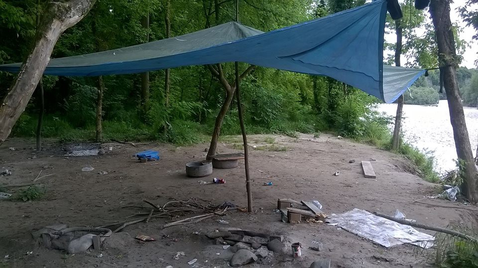

### AYS Daily Digest 29/5/2017: New cases of police violence on the Croatian border
#### New report on police brutality by AYS & Welcome initiative / Bulgaria plans ‘designated areas of movement’ for refugees / Dreadful situation for refugees at “Jungle” near Italian Gorizia / Reunification transfers from Greece to Germany to slow down / Over 140,000 Afghans returned home from neighboring countries

#### New cases of police violence on the border between Croatia and Serbia

A new [report](http://welcome.cms.hr/wp-content/uploads/2017/05/Izvje%C5%A1taj-o-novom-valu-nasilja-prema-izbjeglicama-na-granicama-Republike-Hrvatske.pdf) \(in Croatian\) on another wave of police violence against refugees was published today\. During this year alone, Are You Syrious? and Welcome\! initiative have repeatedly warned of illegal and violent police treatment of refugees crossing mostly from Serbia, to the territory of the Republic of Croatia\. According to the UNHCR in Serbia, in April 2017, 262 persons who temporarily reside in the territory of the Republic of Serbia reported that they were denied international protection or asylum in Croatia\. In the same month, 246 people were expelled from Croatian territory to Serbia\. According to the UNHCR report for Serbia for the week 15 to 21 May 2017, 137 cases of group expelling from Croatia to the area of Serbia were recorded\.

Concerning reports have also been sent to us by Doctors Without Borders \(Médecins Sans Frontières\) \. MSF warns of recent “dramatic increase in violence” on the Croatian side of the border, especially in the vicinity of Šid, Serbia\.

> “This violence always has the same shape: hitting with batons, destroying cell phones, snatching money“ says the coordinator of Doctors Without Borders for Serbia\. 

Refugees are coming to them increasingly on a daily basis for medical help, saying the injuries were made by groups of policemen on the border\. At their clinic in Belgrade, only from 19 to 25 May, ten people came who were injured on the Serbian\-Croatian border\. In the last ten days, the Medical Team has treated 23 similar cases in the clinic in Adaševci\. Some injuries are documented in photos in the above mentioned report\.

**Based on the allegations of refugees given to various organizations, we conclude that it is a frequent and continuous police violence that is carrying all the more serious consequences for the safety and health of refugees\. Violence does not stop, and the number of beaten and expelled refugees is increasing\.**

MUP in Croatia had a responding press conference\. They’ve denied the violence is happening in organised manner, but at the same time confirmed there’s an internal investigation going on since our first reports against unnamed perpetrators in Croatian police\.

■■■■■■■■■■■■■■ 
> **[MSF Sea](https://twitter.com/MSF_Sea) @ Twitter Says:** 

> > "We got caught by the Croatian police and put in a van, then they took us out one by one and beat us very badly". #Europe, 2017. https://t.co/hbxFUD4oKd 

> **Tweeted at [2017-05-29 08:25:42](https://twitter.com/msf_sea/status/869107467371859968).** 

■■■■■■■■■■■■■■ 

#### AFGHANISTAN

Ministry of Refugees and Repatriation on Sunday said that over 140,000 Afghan refugees returned home mostly from neighboring Pakistan and Iran in the past two months\. Totally 250,000 Afghans have submitted documents for seeking asylum in the past two years, MENA [reports](http://menafn.com/1095519666/Afghanistan--Over-140000-refugees-return-home-from-neighboring-countries) \.
#### GREECE
#### Solidarity with Orfanotrofio in Thessaloniki

Last summer the self\-organized [Orfanotrofio](https://en.squat.net/tag/orfanotrofio/) squat in Thessaloniki was evicted and demolished by the Greek government\. One of the squatters now faces charges, the trial is held on 31\.05\.2017\.

■■■■■■■■■■■■■■ 
> **[NoBorders](https://twitter.com/Refugees_Gr) @ Twitter Says:** 

> > Thessaloniki
Orfanotrofeio squat for #refugeesgr trial on Wednesday 31/5
Courthouse 09:00
Solidarity is our weapon
#antireport #skg #antifa https://t.co/nXg3b7diEW 

> **Tweeted at [2017-05-29 19:50:18](https://twitter.com/refugees_gr/status/869279753332809728).** 

■■■■■■■■■■■■■■ 

19 men, 9 women and 8 children arrived to Samos this morning, local volunteer reports\. There were 46 new official registrations on [Lesvos](https://www.facebook.com/hashtag/lesvos?hc_location=ufi) , 72 on [Chios](https://www.facebook.com/hashtag/chios?hc_location=ufi) , a total of 118 today\. Number of official registrations for the last week \(22\.5–27\.5\) was 632\. A total of 390 refugees have entered Greece by sea in the past five days\. 157 landed on Samos, 131 on Chios, and 102 on Lesvos, Kathimerini [reports](http://www.ekathimerini.com/218811/article/ekathimerini/news/390-migrants-enter-greece-by-sea-in-past-five-days) \.

A total of 9,137 people are currently stranded on these islands, [according to](http://www.amna.gr/articlep/158579/Sunolika-390-metanastes-perasan-sta-nisia-tou-B-Aigaiou-tis-teleutaies-pente-meres) the General Police Directorate of the North Aegean\. Of these, 3\.174 are in Lesvos, 3\.949 in Chios and 2\.013 in Samos\.
#### Chios — help needed

Norwegian [**Dråpen i Havet**](https://www.facebook.com/drapenihavet/) working on Chios are now doing several new activities and need more volunteers in June\. If you are over 25, can stay for 10 days or more and wish to join them, send an a email to: jeanette@drapenihavet\.no or visit their [website](http://www.drapenihavet.no/) and sign up\.

[**Refugee Education Chios**](https://www.facebook.com/refugeeeducationchios/posts/482879602058094:0?hc_location=ufi) are campaigning to keep the school in Chios going, see how you can help on their website\.

> The Greek Government has no plans to establish educational provisions for children living in the camps on Chios Island\. Which means the responsibility ends up on civil society\. With conditions getting worse on the Island with overcrowding and scaling back of NGO services, we must remain\! 

If you are planing short\-term volunteering in Greece, [here](https://www.facebook.com/groups/154974621622979/permalink/299277863859320/?hc_location=ufi) is a helpful list of suggestions and recommendations by a fellow volunteer\.
#### BULGARIA

Following the Hungarian treatment of asylum seekers, Bulgaria’s refugee agency proposes introducing ‘designated areas of movement’ for asylum applicants, Balkan Insight [reports](http://www.balkaninsight.com/en/article/bulgaria-steps-to-limit-free-movement-of-asylum-seekers-05-26-2017) \. According to the plan, asylum seekers will not be allowed to leave their region of registration until their asylum procedure has been completed\. Placement in “closed\-type centres’’ is also foreseen for those who violate the borders of the designated zone of movement more than twice\. These actions were made possible by changes to the Law on Asylum and Refugees, enacted in December 2016\.
#### SERBIA

SolidariTea [wrote](https://www.facebook.com/refugeesolidaritea/posts/1057131081055314) about the situation ear the border where they started distributing food:

> …There are hundreds of men and boys living in the ‘jungle’ outside of the camps, surviving on just one meal a day from another volunteer organisation, and trying most evenings to cross the border illegally\. Sadly, it’s the most raw, shocking and desperate version of refugee life that we have witnessed so far\. 

> When arriving to the distribution spot on the first day, we saw guys appearing from hidden spots within the forest, shiftily bringing themselves out into the open to receive breakfast and tea\. We see people lying face down on the muddy floor, sleeping without even a blanket, exhausted from a night of attempting ‘the game’ or escaping the police\. Police presence here is terrifying and fear of deportation is high\. They regularly destroy tents and dwellings in order to discourage people from living outside of the camp system\. Many of the camps are full, and the ones with space have such inadequate facilities people don’t want to be there\. Many camps are in the middle of nowhere, completely isolated with no access for volunteers\. What happens inside is hidden and unregulated\. We are told the food is awful, and some camps don’t even give out a hot meal\. People are not receiving adequate support, care or access to legal help and advice\. There is no quality of life; it is no better than prison… 

SolidariTea
#### ITALY

An amendment promoted by right wing Fratelli d’Italia was approved late last week\. This amendment needs to undergo the Senate approval before it can actually become law and it calls for the cooperatives that work in the reception centres dislocated in the territory to justify every single euro spent for their activities in the reception system\.
Every cooperative receives 35 euros a day per migrant hosted in the structure and of these 35, 2\.5 is the amount received by the migrant \(pocket money\), while the rest is being taken by the cooperatives to guarantee a minimum standard of services \(food, laundry, legal support, Italian classes and so on\) \. What happens in reality is that a lot of cooperatives takes the money without spending it back in services and activities, profiting from the desperation of the migrants living in the centres, Il Giornale [writes](http://www.ilgiornale.it/news/politica/colpo-ai-furbi-dellaccoglienza-dovranno-giustificare-ogni-1402798.html) \. This amendment can detect those who are making money from migration and dreadful living conditions of asylum seekers because the cooperative will have to justify every euro spent by presenting receipts and invoices so to monitor their activity\.
#### Gorizia

On the Jungle, along the Isonzo river, 5 minutes away from the city center of Gorizia:

> In 2015 people who lived in the jungle were all asylum seekers who just arrived from the Balkan route without any sort of aid, support and reception, so that the first to intervene was MSF, opening a humanitarian “camp” and setting up containers\. A the end of 2015 / beginning 2016, MSF left the “camp” and a call for bids was opened to manage the containers \(won by the Consorzio Mosaico\) \. At the end of 2016 the emergency started\. In December there were 40 people in the streets\. At that point, Caritas made available a basement under the containers \(the Bunker\) that was managed by the volunteers of Insieme Con Voi \(they sent new arrivals lists to Prefecture and distributed blankets\) \. These people have always been guaranteed a single meal at the Cappuccini’s \(monks\) and an occasional breakfast\. They never had dinner, yes, but it is not the fault of volunteers, but of the institutions\. The institutions knew about the place, but they always kept silence as they didn’t want attention to be focused on the emergency\. Volunteers managed but never denounced and by doing this they were able to monitor the flows \(they also let Ospiti in Arrivo in without telling anybody\) \.
 

> Let’s say the problems started when flows started to increase and the time to be able to get in the reception structures has increased consequently\. Transfers failed to solve the problem\. The steps to enter the reception system were these: Bunker\-Caritas dorm\-container or Cara \(centre for reception of asylum seekers\) \.
 

> Much of the people in the Bunker were new asylum seekers\. The system collapsed\. Before the closure of the bunker, people also slept in the bathrooms and corridors\.
 

> In the street there may be between 30 and 40 people, most of them “homeless asylum seekers”, banned by the Cara of Gradisca after a huge fight that broke out two days before the closure of the Bunker \(they were the spark of the closure, they actually came to look for a place to sleep in the Bunker that was already full\) \. In the last days there were new arrivals, the day before yesterday 20 according to the Questura\. Another 10 in the previous days\. Insieme Con Voi states that the majority of them found a accommodation at the dormitory\. Some will surely be sleeping rough\. Unfortunately, they are not organised, volunteers continue to bring just food or deliver sleeping bags without denouncing anything\. 

> A part from the asylum seekers present at the moment, the jungle is a safe place also for the asylum seekers of the 2 governative centres because the food they receive there consists often in pasta with oil and nothing else \(see Mauro’s pics of pasta\) \. Until 1 month ago more or less, there were between 7 and 10 more organised cooking facilities \(like those made of wooden tables\) but then police and probable fascist attacks threw the food in the river, broke plates and generally threatened so migrants were forced to leave the place for a while\. After some days, some migrants coming from the dormitory and the Bunker started to go secretly back to the Jungle, in a different spot, in order to cook something as this was the only way they had to get decent food\. Now, with the Ramadan, almost everyone started to go back again, they cook and bring the food back to the dormitory \(which agrees secretly because theoretically migrants cold not bring food inside the building\) \. The only dormitory is managed by Caritas and is full \(around 50–60 people\) \. Those sleeping rough are around 20–40\. Precise numbers are difficult to get because of the constant flow\. Sooner or later there will be another repressive surge, as in June there will be the local elections\. We hope that at least they will be guaranteed to end the Ramadan\. They need everything: food, clothes, underwear, cooking pans, they don’t have anything\. Caritas isn’t doing anything and the Prefecture isn’t taking action either, a part from apparently sending associations to double check the situation\. The resistance comes from the mayor who is denying everything\. Few volunteers are left alone with small support\. 

> Yesterday around 80 people cooked their meals in the jungle\. Some took their food to the dormitory where they’re sleeping, others around 30–40 people slept and ate in the streets\. The exact number is in constant change\. There are 60–80 people in need of everything\. As an independent volunteer said yesterday: Tens and tens of people are sleeping rough, 50 migrants of the dormitory are without food for the Ramadan\. Food is lacking for the others as well\. Urgently needed: rice, flour, eggs, legumes, shoes, underwear\. 

How they cook and what they receive to eat inside the hub

Photos: Mauro Chiarabba
#### SPAIN/MEDITERRANEAN SEA

The Portuguese air force has rescued 34 migrants at sea close to the Spanish coast\. During the patrol the team spotted a small boat in flames cause by an explosion on board from unknown causes\. All the refugees were rescued from this boat that apparently left from Morocco trying to reach Spain, Expresso [reports](http://expresso.sapo.pt/sociedade/2017-05-29-Forca-Aerea-resgata-34-migrantes-apos-explosao-de-barco-no-Mediterraneo) \.

[")](http://www.youtube.com/watch?v=-8DUv_ddgyM)

#### GERMANY
#### Reunification from Greece to Germany

“Family reunification transfer to Germany will slow down as agreed,” Greek Migration Minister Yiannis Mouzalas wrote to German Interior Minister Thomas de Maiziere in a May 4th letter obtained by leftist daily Efimerida ton Syntakton, [reports](https://www.thelocal.de/20170529/greece-germany-agree-to-slow-refugee-family-reunification-report) The Local\. This comes after Germany recently capped the number of refugees eligible for reunification at 70 people per month, compared to 540 in March and 370 in February, and could be affecting “more than two thousand people” while some “will have to wait for years” to reach Germany even though their requests have been approved\.
#### A case of avoided deportation to Greece

The case brought by a Syrian refugee who had entered Germany in July 2015 and applied for asylum in December 2015 has been resolved\. In a hearing at the Federal Office for Migration and Refugees \(BAMF\) he stated that he had already been granted asylum in Greece, but that he had not received any support by the state of Greece and had been living on the streets\. A decision stopping his deportation to Greece was published on May 24th by the German Federal Constitutional Court, [reports](https://www.proasyl.de/en/news/the-federal-constitutional-court-stops-a-deportation-to-greece/) Pro Asyl\.

> The Federal Constitutional Court made an [objection](http://www.bundesverfassungsgericht.de/SharedDocs/Entscheidungen/DE/2017/05/rk20170508_2bvr015717.html) , stating that the Administrative Court should at least have considered the question “how access to shelter, food and sanitary facilities would be safeguarded for recognised refugees returned to Greece at least in the first period after their arrival there”\. 

31\.5\. at 19 a demo is held against deportation in Munich airport\. See more on it [here](https://www.facebook.com/events/1568620766483887/?hc_location=ufi) \.
#### SWEDEN
#### Another deportation scheduled for tomorrow

According to confirmed reports from Sweden, at least 6 Afghan asylum seekers and a family of 7 are on edge of deportation from Sweden back to Afghanistan on 30th of May 2017\. The number of deportation may vary until the last moment, [Afghanistan Migrants Advice & Support Org](https://www.facebook.com/Afghanistan-Migrants-Advice-Support-Org-195295217167437/) wrote\.

> **We strive to echo correct news from the ground, through collaboration and fairness, so let us know if something you read here is not right\.** 

> **Anything you want to share — contact us on Facebook or write to:areyousyrious@gmail\.com** 

_Converted [Medium Post](https://areyousyrious.medium.com/ays-digest-29-5-2017-new-cases-of-police-violence-on-the-croatian-border-31e46ae20c18) by [ZMediumToMarkdown](https://github.com/ZhgChgLi/ZMediumToMarkdown)._
