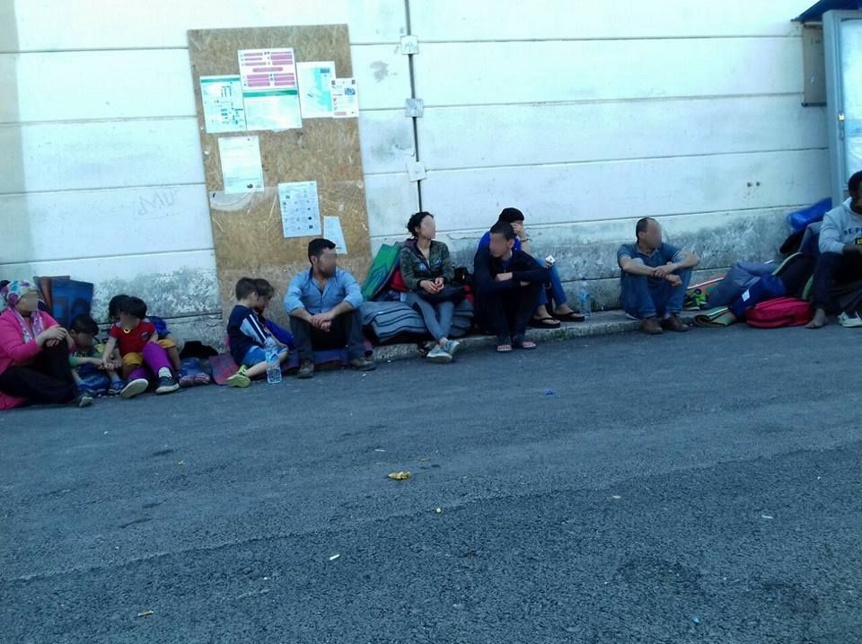
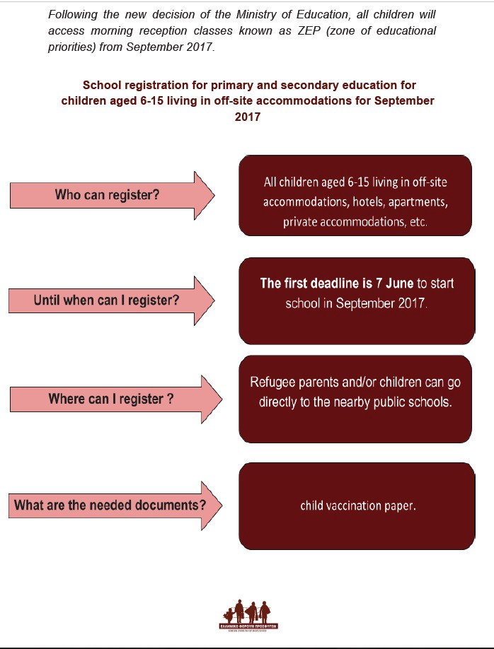
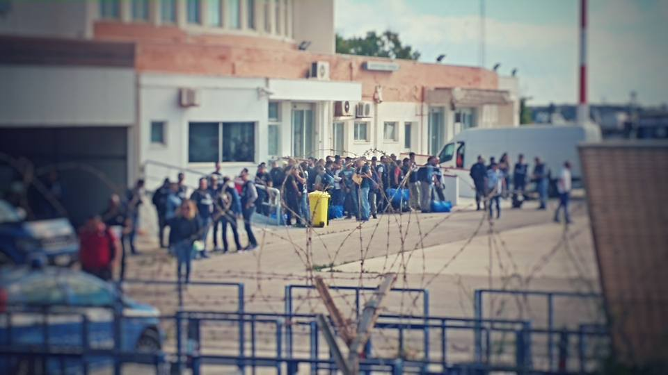
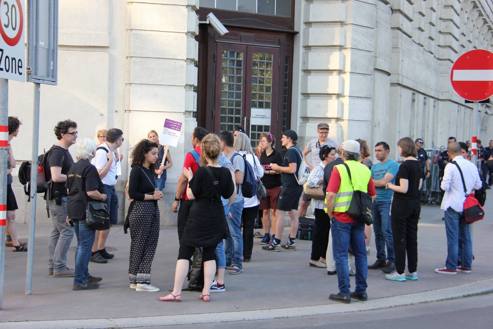
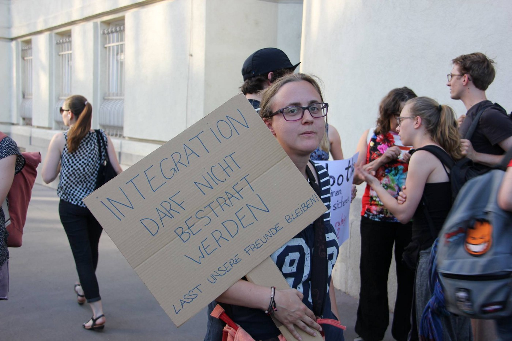
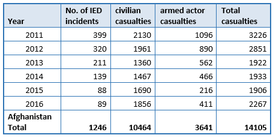

### AYS Daily Digest 31/5/17: \(Will\) the refugees suffer consequences of the NGOs’ misconducts and of common EU political decisions?
#### NGO accused of exploiting the refugees and misuse of funds, refugees and volunteers worried / Bad news are rumoured for the families waiting for reunification / last days to enroll in school in Greece / An asylum seeker won the appeal to the ECHR against deportation from Switzerland / German students protested deportation of a fellow student, police intervenes / Deportations to continue in a number of countries / Slowing \(even more\) the family reunification to Germany, …

Kabul, Afganistan, 31 May 2017
“A woman sits outside a hospital after a blast near diplomatic area of Kabul\. 80 people killed, more than 300 injured\. Meanwhile the EU continues the deportations of Afghan refugees and asylum seekers back to Afghanistan\.” \(By: Art Against\)
Photograph by Mohammad Ismail
#### FEATURE

Serious allegations were directed to the Mercy Corps recently, with claims reported to the NGO by telephone, that two of their workers in Greece have allegedly sexually exploited refugees and misused money intended for their welfare\.

The Greek state is reportedly handing the case to their Supreme Court Prosecutor for further investigation, after minister Mouzalas forwarded a letter of “the EU’s top humanitarian aid official outlining the allegations”\. However, as the Greek [media](http://www.ekathimerini.com/218873/article/ekathimerini/news/greece-orders-financial-probe-of-refugee-ngo) claims, “the NGO allegedly involved was not publicly named, and no details on the claims were provided\.”

In the public statement the NGO issued yesterday, they state that “the two staff members were named in the complaint and are on temporary paid leave pending the outcome of the investigation\.” However, Greek [sources](https://l.facebook.com/l.php?u=http%3A%2F%2Fwww.nooz.gr%2Fgreece%2Fmercy-corps-mideniki-anoxi-se-opoiadipote-morfi-ekmetalleusis30517&h=ATMl0xZZk15eRw-Ns0k-RcmGzLCoPqsuAdabSof3Gnu2hX44KjlwpInk_7r30IFQRkFmT-fL8tF7RgW5cJHCsiGV6pvJvBP6gJA59nj2n0Q2k-mQ-nW2x-kSU1epSx2MxovVzIw0) say the NGO has not issued an apology in the meantime or expressed concrete actions they plan to take straight away, regarding their two employees’ misconduct and the financial accusations\.

> We are doing everything we can to understand the circumstances surrounding this allegation, take timely and appropriate action, and make the situation right\. In order to protect the privacy of the complainant and ensure the integrity of the investigation, we cannot share additional information until the investigation is complete\. _— from the [official statement](https://www.mercycorps.org/press-room/releases/mercy-corps-investigates-allegation-misconduct) by Mercy Corps\._ 

The European Commission published that out of €198 million, which is a total amount of emergency support allocated until March this year, on 1 September Mercy Corps were given **€6\.25 million** for “Multi\-purpose cash grants”\.

The greatest concern of all those on the ground, especially people stranded on the islands where the Mercy Corps are also active, remains the question if the refugees will be the ones ultimately \(literally\) paying the price of the alleged misconduct\. Mercy Corps are officially “providing information and services, safe shelter and psychosocial support”, as well as the much needed cash assistance that some are putting in question until the investigation is completed\. Hopefully the pre\-paid debit cards distribution will not be paused due to the investigation into the allegations of the misuse of funds received and distributed by Mercy Corps\.
#### GREECE
#### Refugee presence in Greece, according to the Government

Governmental figures as of May 30 state that **35,430** refugees are currently staying on the Greek **mainland** , of which in **camps** : 171 in Fylakio;
449 in Nea Kavala, 320 in Alexandreia, 128 in Derveni — Alexil and 88 in Derveni — Dion, 363 in Diavata, 96 in Kavalari and 450 in Softex;
188 in Kavala \(Perigiali\), 208 in Drama, 340 in Serres — Kege, 185 in Lagkadikia, 26 in Pieria \(Ktima Iraklis\), 187 in Veria;
88 in Konitsa, 61 in Doliana, 190 in Agia Eleni, 213 in Filipiada, 179 in Trikala, 1,078 in Koutsochero, 104 in Volos, 408 in Thermopiles, 176 in Andravidas; 
790 in Schisto, 1,999 in Eleonas, 287 in Elliniko I, 221 in Elliniko II and 141 in Elliniko III;
600 in Oinofyta, 715 in Ritsona, 680 in Malakasa, 256 in Elefsina Naval School, 3,101 in Skaramangas, 270 in Lavrio, 107 in Rafina, 338 in the accommodation facility of Lavrio\.

According to these official statistics, there are **13,068** people staying on the **islands** : 3,835 on Lesvos, 3,917 on Chios, 2,243 on Samos, 877 on Leros, 2,463 on Kos and 652 on Rhodes\.
### Islands

135 people arrived on the northern Aegean islands in the last 48 hours\. 
54 of them arrived on Lesvos, 40 on Chios and 41 on Samos\.

54 people were registered on Lesvos and 38 on Chios, making a total of **92 people** whose arrival has officially been registered today on the Greek islands\.
#### Chios — camps are completely out of space

There are currently 3,917 refugees staying on Chios\. The official capacity of the reception facilities on the island is 1,309 people\. 
A large group of refugees with children is on the street now on Chios\.

Samos shares a similar story with 2,243 people staying there, while the capacity is 986 people and the island Kos currently hosts 2,263 people and its official capacity is 1,170\.

 \)](assets/a5912be6828a/1*8DzNjJ_kq2cKd6ucbWLevA.jpeg)

“There is a group of refugees on the island of Chios who have no housing and no place to live\.
The camp management in Vial told them to go look for a place for themselves and told them “we are not responsible for you“
40 people, mostly children…
**We need help on the island of Chios** ” \(Photos: [Alaa Hasan](https://www.facebook.com/ali.surveyor.7) \)
#### Volunteers wanted

The [foodKIND](https://www.facebook.com/foodKIND/?fref=nf) team is seeking volunteers to work with them in Greece between the June 10 and July 5, so please get in touch if you can join them, even if it is only for several days\.
### Enrolling to school

Registration for primary school is under way for children aged 6 to 15\. 
The first school term will start after the summer, in September, and **the last day to register is June 7** \. 
Parents can go straight to the local school and fill in the paperwork\.

Infographic by: Greek Forum of Refugees
### What will happen with the families?

A growing concern in the past days has been the information circling around that the families who have long awaited to reunite with their other family members via the \(ever slow\) family reunification programme will wait indefinitely\. It seems that some families who have been accepted to reunite with their families in Germany have been told that **they will not be relocated until 2018,** although they have previously been told they would be relocated within the next few weeks\.

Some sources claim that anyone that doesn’t make it out before June 30 will wait until 2018\.
#### BULGARIA
### Narrowing down the living space while waiting

The toughened state policy towards refugees in Bulgaria is forming practical ways of functioning\. A draft order in Bulgaria, which is open for public consultation until June 25, will create four zones of movement for refugees, the Bulgarian [media](http://www.novinite.com/articles/180590/Draft+Order+in+Bulgaria+to%C2%A0Create%C2%A04+Zones+of+Movement+for+Refugees) claim\. Asylum seekers will not be allowed to leave their region of registration until their asylum procedure has been completed\. Placement in “closed\-type centres’’ is also foreseen for those who violate the borders of the designated zone of movement more than twice\.
#### SERBIA
### [**NorthStar**](https://www.facebook.com/NorthStarSerbia/?fref=nf) is looking for teachers volunteers

“We are currently seeking an advanced volunteer math teacher in ‘the Workshop’\. We have a class of 3 advanced girls who wish for classes 3–5 times per week, as available\.” 
Contact for more information: info@northstarserbia\.org
#### ITALY

1720 people are considered missing at sea and 1,481 are listed as dead since the beginning of the year, according to the IOM data\.
Only during the past week, 58 people perished in the Mediterranean trying to reach Italy, while 100 more are still missing\. 
People who managed to arrived alive and safe have also [reported](https://www.thelocal.it/20170530/at-least-58-people-died-trying-to-reach-italy-last-week) being attacked at sea by armed men who stole everything they had, including the boat’s motor, while many were wounded by gun shots\.

](assets/a5912be6828a/1*mhT4rOiEijnDXtbfoPPPTQ.jpeg)

Photo by: [SOS MEDITERRANEE](https://www.facebook.com/SOSMEDITERRANEE/)
### Young Africans from Lampedusa to be repatriated

Some 20 North African boys have been transferred by plane to Palermo this morning in Lampedusa \. They had their wrists bond and they were escorted by two policemen per each of them\. They will most likely be shifted to Rome from Palermo and eventually repatriated, the local organizations claim\.

](assets/a5912be6828a/1*lxEMcDgd4cxthPbJ_Y62Aw.jpeg)

Photos: [Mediterranean hope](https://www.facebook.com/Mediterranean-hope-252231521632595/)
#### FRANCE

The police officials have stopped the food distribution done by the Auberge des Migrants team, following the decision that meals can’s be distributed in the evening after 18h\. Also, considering the fact that it is extremely difficult to access water in the area, they’d brought a cistern with drinking water to provide for the refugees, but later on that too was forbidden\.

■■■■■■■■■■■■■■ 
> **[L'Auberge des Migrants](https://twitter.com/AubergeMigrants) @ Twitter Says:** 

> > Évacuation de la distribution du soir, les CRS empêchent les exilés de remplir leurs bouteilles d'eau. Un des seuls accès à l'eau à Calais. https://t.co/TfntiaDKSr 

> **Tweeted at [2017-05-31 21:12:17](https://twitter.com/aubergemigrants/status/870025162351140864).** 

■■■■■■■■■■■■■■ 

[Other](https://www.facebook.com/chiara.lauvergnac?fref=nf) volunteers report: “this morning everybody woken up at 4 am and chased out the ‘jungle’ near the place of food distribution, 6 arrests that I know of; police always go in the early hours of the morning and pepper spray people in the eyes and spray blankets too to render them unusable but this time operation on a larger scale and everything was destroyed: blankets, tarp, any tents — yesterday there was another operation during which tents etc were confiscated and destroyed, today they finished the job\. People are still sticking around, resting because they did not get much sleep and the Afghan family are still there\.”
#### SWITZERLAND
### A Sudanese asylum seeker won the appeal against deportation

Claiming he ran a risk of being persecuted over his political activities if sent back, a young Sudanese didn’t give up after having lost an appeal at a court in Switzerland, and took his case to the European Court of Human Rights\.
In the case of [A\.I\. v\. Switzerland](http://hudoc.echr.coe.int/eng?i=001-174222) , the ECHR’s decision was in the Sudanese’s favor:

> The Court could not rule out the possibility that A\.I\. had attracted the attention of the Sudanese intelligence services\. It found that there were reasonable grounds for believing that the applicant ran the risk of being detained, interrogated and tortured on his arrival at Khartoum Airport\. Consequently, the Court found that there would be a violation of Articles 2 \(right to life\)and 3 \(prohibition of torture\) of the [Convention](http://www.echr.coe.int/Documents/Convention_ENG.pdf) if A\.I\. were deported to Sudan\. _— from the [ECHR press release](file:///C:/Users/karolina.rugle/Downloads/N.A.%20v.%20Switzerland%20and%20A.I.%20v.%20Switzerland%20-%20decisions%20to%20deport%20to%20Sudan.pdf)_ 

In a [second case](http://hudoc.echr.coe.int/eng?i=001-174223) related to another Sudanese man, the ECHR ruled in favour of Switzerland, saying the man, known as N\.A\., was not at risk of being tortured or ill\-treated on his return\.
#### AUSTRIA

Another peaceful protest against the ongoing deportations from Austria to Afghanistan was held in Vienna\.

](assets/a5912be6828a/1*CAdXEaYs6ZDubdBCjb0Blw.jpeg)

Photos: [Christian Volek](https://www.facebook.com/christian.wendelin)

](assets/a5912be6828a/1*YiOXN3Z68TQxgK62BFqh_g.jpeg)

Photos: [Christian Volek](https://www.facebook.com/christian.wendelin)
#### GERMANY
### No deportations in the next days, but Germany “will continue to go down this path”

After the explosion that killed at least 80 people in Kabul, a German official [confirmed](https://www.reuters.com/article/us-afghanistan-blast-germany-deportation-idUSKBN18R1DC?il=0) that in the coming days — because of the officials working at the German embassy in Kabul affected by the explosion — there will be no organized deportations from Germany, but their policy of returns to Afghanistan remains\.
### An escalation of solidarity

Only hours after the deadly attack in Kabul, police came to a school in Nürnberg to take an Afghan student in order to be later deported to Afghanistan\.
The students of the school held a spontaneous demonstration and a sit\-in for their fellow student, a well integrated 20\-year old\. More and more people joined in according to reports of various German [media](http://www.sueddeutsche.de/bayern/nuernberg-geplante-abschiebung-loest-tumulte-an-berufsschule-aus-1.3529011) \. Around 300 people, including those who were passing by, joined the spontaneous solidarity protest\.

](assets/a5912be6828a/1*Nxh8wntggnyh_cPztX_OHw.jpeg)

Photo: [Eisbrecher W\-tal](https://www.facebook.com/eisbrecherwuppertal/)

[Reportedly,](http://www.sueddeutsche.de/bayern/franken-geplante-abschiebung-loest-tumulte-an-nuernberger-berufsschule-aus-1.3529011) the police later used pepper spray and arrested several people, saying it was necessary, although some political parties and organizations later criticized the police actions\. Videos of the circumstances [before the police intervention](https://www.youtube.com/watch?v=29e2kr7Ijxg) and the clash that happened afterwards can be watched online\.

](assets/a5912be6828a/1*j_Jyq_O5JNVX4herZsm-fw.png)

Photo: [Eisbrecher W\-tal](https://www.facebook.com/eisbrecherwuppertal/)
#### SWEDEN
### Stop the deportations to Afghanistan\!

Refugee campaigners called on Swedish authorities to stop deportations after the bomb attack in Kabul\. That happened only a day after Sweden returned a group of failed asylum seekers to Afghanistan\. [Reportedly](https://www.thelocal.se/20170531/campaigners-urge-sweden-to-stop-deportations-of-afghan-asylum-seekers-kabul-attack) , Swedish campaigners for refugee rights have called on authorities to suspend all deportations to Afghanistan and all deportations of minors who came to Sweden without parents or guardians\.

The case of the separated family we [mentioned earlier](ays-digest-28-5-2017-10-000-refugees-rescued-over-the-last-four-days-faa8bbf1096f) has been solved\. The family will soon be reunited at the same accommodation, after being apart since the late 2015\.

Still, the have not received any explanation as to how and why the separation happened in the first place\. It was immediate, after the woman and children had arrived to Arlanda airport, where they met up just to get the information that they had to live at different places\. They are now happy with the decision, even though they still don’t know why this happened, and it caused all of them even more mental stress\. 
The Migration Agencies’ decisions are not easy to follow or understand and the individuals have to pay the price in the end\.
#### AFGHANISTAN
### People under a constant threat and attacks

88% of all civilian casualties from explosive violence in Afghanistan so far this year have been caused by the explosive devices, [sources](http://mailchi.mp/aoav/afghanistan-sees-53-rise-in-civilian-casualties-from-explosive-violence-compared-to-first-5-months-of-2015?e=2f93d8fa53) claim\. Between 2011–2016 Afghanistan has seen 20,625 deaths and injuries from explosive violence\. Of these, 63% \(12,922\) were civilians\. Afghanistan has seen a 53% rise in civilian casualties from explosive violence, comparing to 2015\.

We strive for accuracy and fairness\. Please let us know if you spot partial or inaccurate information, send us your feedback and contribute with information from the ground: areyousyrious@gmail\.com and on Facebook

_Converted [Medium Post](https://areyousyrious.medium.com/ays-daily-digest-31-5-17-will-the-refugees-suffer-consequences-of-the-ngos-misconducts-and-of-a5912be6828a) by [ZMediumToMarkdown](https://github.com/ZhgChgLi/ZMediumToMarkdown)._
