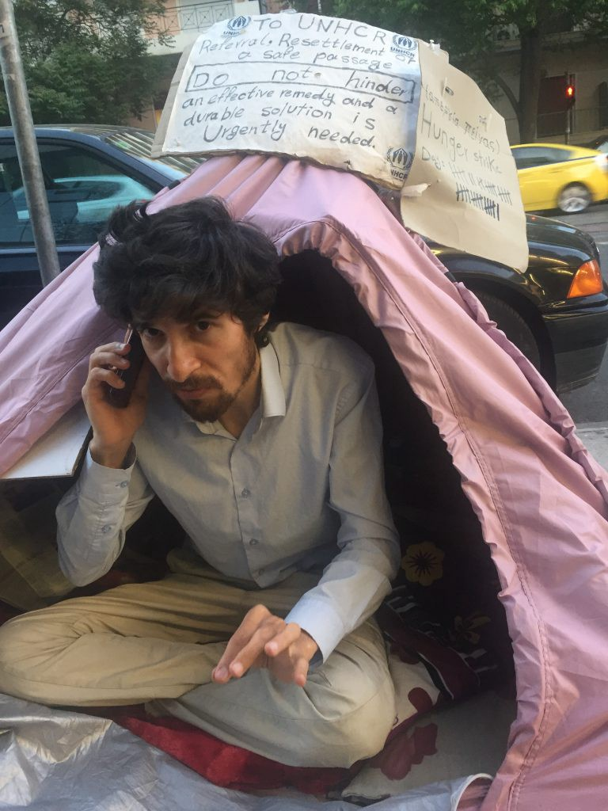
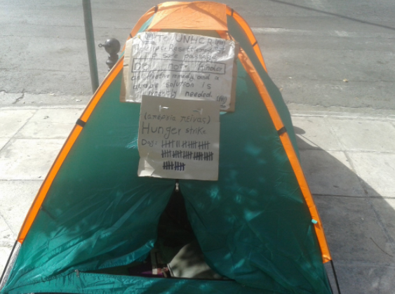

### AYS SPECIAL: Story about Europe, UNHCR and refugees or how everything went wrong

_Anwar Nillufary \(31\) is Iranian Kurd, engineer, is camping outside the UNHC building in Athens for the past 60 days\. He is in a hunger strike asking resettlement and protesting the lack of protection for refugees\. Doctors warned him to stop the strike, but he is determinate to continue until somebody answers his demands\. He has a legal status in Greece, but, like tens of thousands of others, has nothing else\. This is his story, but at the same time, the story of refugees in Greece today_

**Officially, I am a refugee**

Originally Kurdish born from today’s Iran territorial region\. For political and other reasons, I had to abandon this region between ages 18–19\. Since then till almost mid 2014, I had been living in the autonomous Kurdish region in today’s Iraq\. Maybe not officially, but in practice, I actually became a refugee since then\.

Happily, there was a chance which allowed me to enter university and pursue my study\. That was the only reason which kept me in that place for so long and among people, which I never saw any goodness from\. But I stayed because I was hoping to graduate and then get into work, make some money, fix my paper problems and then get the hell out of that region through an immigration process\.

There, I was always being treated as a foreigner and basically with no rights\. At the back of my mind leaving the region as soon as possible was a task I was reminding myself almost every night\. After graduation, I found a job with a construction company in a road and tunnel project\. Before I think of applying for immigration application, I had to first resolve my passport problem which I couldn’t fix easily\.

Due to the nature of any totalitarian regime, getting an Iranian passport inside Iraq was almost impossible\. That’s why I focused on getting Iraqi citizenship and Iraqi passport\. Because after all I had been living there for many years, and all those years my stay was legal\. Practically there was no legal instructions in place to help people in my circumstances applying for citizenship, except in some disputed areas in the country\.

In the company I was working for, my character was assassinated by the same people and they made my life like hell\. The level of pressure was so intense which I couldn’t continue working on my third book\. A suspended book which I intended to publish before I leave the region\. Later they destroyed my career, even wouldn’t let me get many months of my delayed salaries\. A legally obtained residence permit had been weaponized for the purposes of harassment and forcing to flee\.

They took it away from me and told me, ‘’Leave the region, we don’t care how, we don’t care to, where\.’’

**I filed a lawsuit in the court both against those whom vanished my papers for obtaining Iraqi citizenship and also the company, for delaying my payments\.**

Sadly, I couldn’t even fight for my rights in the court, because courts were also under the control of the major party in the region and weren’t independent at all\. The same people who were behind the destabilization of my life there and my second displacement\.

Despite the facts that I was continually receiving threat calls and I no longer could stay in the region, and also had no other way out, yet my appeals to the regional office of the UNHCR in Erbil was also without results\. In practice, they verbally directed me to Turkey or Jordan\.

Later, because of the rise of ISIS, the situation in the region became so much more complicated\. So, I had to face the situations and make a decision no one would ever wish to make\. But eventually I found myself in Istanbul, a while later boarded on an unseaworthy boat heading to Europe\. A place where, I knew nothing about\. Its people, its culture and most importantly, it’s asylum procedures\. Also, integration, safety and stability of foreigners in the continent\.

In September 2014, I arrived in Athens\. In Athens after I was disappointed from smugglers, going to the UNHCR office and looking for an alternative was the best thing I could think of\. Actually, to obtain proper information, guidance and instructions based on which I had hoped, I would be able to arrive at a more decent decision for my best\. I was basically looking for a legal way to leave Greece immediately and arrive in other EU countries and settle there\. So, based on, what I was told by UNHCR, I spent many months in Greece to get legal papers and then leave\.

Sweden, a country which I only knew a little about, was the country I finally went to\. It was a shocking moment to find out my appeals to the Swedish authorities was rejected exactly because of the same papers which supposed to help me have a legal way to leave Greece and go other EU countries to settle there\. Even my appeals to the Swedish authorities for providing me with a lawyer was refused on all the occasions and eventually was illegally sent back to Greece even before the second decision which had to come out from the Migration Court in Sweden\.

Since the poor decision on my case and the illegal deportation from Sweden, which took place on September 2015, I made so many appeals to the office of the United Nations Refugee Agency to help me out by submitting my case for resettlement to another country\.

It’s a very unfortunate and damaging procedures that Refugees even in possession of the legal status still are not allowed to apply for resettlement on their own alone\. According to the current procedures, every refugee resettlement has to happen through the office of the UNHCR\. But the local office of the UNHCR in Greece, despite their own shameful misdirection and one and half a year of deliberate delays to all my appeals which cost me so much money and suffering, not only was still delaying the needed response to my situation but also almost every time I went to their office they just called the Police for me\. I been in the police station and police custody for so many times and so many hours and absolutely for no reason, perhaps only for seeking help and assistance from UNHCR\.

**For the first time in my life, I became familiar with the prison on the Europe’s soil\.**

Greek Asylum office also never responded to none of my written appeals\. EU commission in one of its responses to my appeals suggested that I should consider taking my case to the court and look for a solution there\.

Despite so many appeals to them, but even I couldn’t get a lawyer in this country, not from NGOs nor the private firms\. Practically have no access to legal assistance and legal counseling\. The NGOs even wouldn’t provide me with the lest information in regards to which court should I address my appeals\. After so much efforts I could finally have a chance to discuss this issue with a so called human rights lawyer based in Athens\. She said that she wouldn’t be able to help me with the resettlement nor getting the letter I needed for it, but she might be able to help my case in other EU countries, without guaranteeing anything but charging me 2500 Euros, if not 900 Euros only for giving advice\.

As they were just sending me back to the office of the United Nations Refugee Agency for getting a referral letter from them so all my appeals to both U\.S and Canadian embassy so far was without results and basically, they dismissed the context and the subject of all my appeals to them\.

All those hypocrisies and bureaucracies finally led me to come up with a decision to make a hunger strike in front of UNHCR office in Athens, Greece\. Yet despite 58\-days of a none breaking hunger strike still this office of UNHCR neither wants to help me submit my resettlement application from this office nor wants to direct me to another UNHCR office In/Outside of Europe which does resettlement\.

Refugees even in possession of the legal status still are not allowed to apply for resettlement on their own\. The office of the United Nations Refugee Agency, which is globally in charge of protecting refugees and finding them durable and sustainable solution\. Yet it doesn’t seem that they are doing anything good for refugees\. In fact, the same organization which is making fame and money out of human suffering has become an obsolete, uncaring, reckless and irresponsible one which lost its very prime purposes, selling out all refugees, turning blind eyes to their suffering to sever government’s interests which are finding themselves in inflicting pain and suffering on defenses people\.

**Greece is not safe for refugees\.**

Greece is not protecting Refugees and Refugees have no legal obligations to stay in a country with no functioning asylum system, no protection of any kind and no security at all\. What does international protection mean, if it does not offer the possibility of living a peaceful and normal life?

Quite contrary to what is being called protection, all the efforts are aimed to create the favorable environments for the refugees to be expelled out of the country\. Where there are no choices and options available to the them and therefore are remained deprived of everything\. But the truth is, no one is able to establish a life, be happy and productive and faithfully look forward to his future dreams and progress when and where they are deprived\. It’s also quite simple and clear that I didn’t seek refuge to pay and suffer nor to be looted in Europe rather than finding refuge there\.

Even having a legal status in Greece, yet still it was so much difficult to even find a place to rent\. I made appeals to the authorities at the Asylum Office and UNHCR and also NGOs in charge of refugees for providing proper accommodation or at least helping me out to find a place to rent, but all the concerns were ignored by all of them\.

All I could get from them was to tell me go and look into the kind of newspapers which I can’t understand any of\. Thanks to a mobile App, I could finally find a way to look for advertising apartments\. I called like over 30\-real estate agencies for finding an apartment\. Some of them just wanted to charge two years’ payment in advance, others a bit more generous wanting one year payment in advance, and some of them after learning where I was from was immediately changing their attitude and telling me that they didn’t have a place at all, some of them were saying we don’t have jobs, you can’t find a job, you can’t make money, you can’t pay your rent, so you can’t have a place to rent\.

In practice, all the evidence suggests what they said was correct, seems only politicians don’t know anything about the problems in their countries\.

I found a place with so many difficulties\. There is really no job, economy is down, unemployment rate is catastrophic and there are no signs of improvements\. Even if some miracles happen and we see companies start hiring people, refugees still would be at the end of the queue, unfortunately it’s the reality of refugee lives in this country, discriminations are happening routinely and almost by everyone\. I submitted my resume to many companies, Civil Engineering and construction companies also many others\. But nobody replied\. So, if you don’t make money, if you have no protection of any kind, there would be no way to assure your safety, stability and your survival\.

All I have now is some pieces of worthless papers\. We are basically deprived of everything, no one will have a chance of survival in such harsh environment, it’s exactly like being trapped in a merciless Swamp, perhaps like taking a tree to the desert and expect it not only to survive, but also grow and give you fruits\. No\. it’s impossible\. Because there are no favorable conditions for that to happen\.

From what I can see, the purposes of all these atrocities happening to the Refugees, are exploitations, enslaving them as cheap labor forces with the aim of easing their own financial problems or pushing them out of the country and even perhaps Europe as a whole\.

**I have my own problems, every genuine Refugee does\.**

We need a place to give us, hope, real and equal opportunities, love and respect\. They must stop exploiting refugees\. They need to change the way they look at refugees and their mindset about us\. Because if not, that would be the greatest barrier, in front of refugees to integrate into the host societies\. Because that sense of distrust, injustice and lack of confidence not only will not disappear, but it just grows bigger and bigger\. Maybe those in charge of setting out Refugees and Immigration Policies instead of complaining about parallel and no go zone societies should give deeper thoughts about why these kinds of social behaviors are actually taking place\.

Unfortunately, there is absolutely no sense of respect and responsibility toward refugees in Greece\. It’s called respect regardless of what your response would be to that appeal, because then instead of waiting in uncertainty for God knows how long and losing time, I would spend my time and energy in thinking about what my other options would be, about what to do to get out of this constant nightmare\.

Since my deportation, basically I am on the streets, if I didn’t have some money, with me, a little hard earned money, nobody knows what could happen to me, nobody knows\. Many people died in freezing winter temperatures this year\. I could have been one of them\.

They don’t own people and they must stop gambling with other people’s lives\. I am now a refugee for more than 12\-years, over two of which being in this Europe’s Swamp\. Due to time and geographical restrictions, I can’t even benefit from Europe’s nonfunctioning relocation programs which is currently taking place from Greece and Italy\.

Many, many horrifying stories are happening right in front of our eyes, yet all we see is that NGOs and in some cases governmental institutions and on top of them the United Nations Refugee Agency, is just making fame and profit out of human suffering and continue to do their ugly businesses with the same mindset that belongs to centuries ago, to turn blind eyes to all our sufferings\. If there was a real help on the ground then why a refugee like me should still suffer for so long?

**All a refugee needs, is to be given a legal pathway, a safe passage to a place of refuge\.**

Why this is found to be so difficult to be offered to us? A safe passage to a place of refuge which I would always gladly even pay for it, yet it’s not available to us\. Introducing practical solutions like giving Nansen passport for genuine refugees to let them safely arrive in asylum and resettlement countries not only target all smuggling businesses, but also less people would die taking dangerous risks and also less would suffer from the aftermaths of all these traumas\.

When it comes to Refugees Europe’s policies are finding themselves in a set of shameful policies which, adopted not only by Europe as a whole, but even the United Nations Refugee Agency, with the missions and agendas that only extended suffering of refugees\. Accepting that people suffer, so that others other deterred\. Clear attempts to harm refugees, inflicting wounds, irreparable and lasting damages\. Policies of shame which cost real lives, yet they find comfort in their lies as if it’s so much safer for them\.

I made a mistake seeking refuge in Europe\. Can’t be human enough to give us a place of refuge just let us go\. Let me go\. I’m not asking for anything illegal\. There is a law for that, an EU law\. EU Directive 2001\.51\.EC\. This directive grants refugees a safe passage to the countries of asylum in Europe\. Is Europe implementing this regulation? No\. For allowing refugees to enter the continent? No\. For allowing Refugees to leave the continent, freely without obstacles and inflicting pain and suffering on us? No\.

Governments whether they admit it or not, are now practically backing smuggling networks\. Children are selling their bodies to earn money and pay smugglers right here in Athens\.

I wrote to the European Commission about my case\. They replied to me and said ‘we are sending so much money to Greece, we are doing so many efforts, to make refugees conditions change for better and etc\.’ Yet here I am, on this hunger strike for 57\-days now\. Where are improvements? I read from a journal that 70% of the money EU sending to Greece are just disappearing immediately\. Where all this money is going? It meant to go to refugees, but these thieves spending all that money for other purposes which has nothing to do with refugees\.

Refugees’ predicament is not caused by lack of funding\. According to aid experts, more has been spent on the humanitarian response in Greece than on any Refugee crisis in history\. Yet they can’t find proper accommodation for 50\.000 people?

**The crisis is, instead, the results of deliberate political choices\.**

As part of the deal with Turkey, the European Union agreed to relocate the refugees who were already stuck in Greece\. By refusing to resettle refugees, Europe is whittling away at its commitment for human rights\. These states are undermining their obligations and these are the same states that created the human rights laws and ratified conventions\.

**What is the use of UNHCR?**

The current situation is a direct outcome of UNHCR’s shameful misdirection in 2014, before I approach Greek Authorities\. Since the deportation, I wrote so many times almost to all relevant authorities even NGOs to find a way out\. I wrote to UNHCR, Asylum Office, Directorate of Migration Policies, Interior Ministry, Greek and Europe Parliament and European Commission\. Also U\.S\. and Canadian Embassies\. For their filthy agenda, Greek authorities and UNHCR never gave a response to my appeals\.

I definitely need to be resettled elsewhere\. Both Canada and U\.S embassy directing the issue to the UNHCR office and asking for a letter from them\. So, I was asking UNHCR to issue this paper but the already obsolete, uncaring, reckless and irresponsible UNHCR ignored all my appeals for over one and half a year\. They can’t ignore this for as long as they want, we, refugees, need them to take responsibilities and respond to our rightful needs\.

Why should refugees even suffer from the same Organization, which supposed to protect us? I was hurt by this Organization literally nothing less than those oppressors I fled from\. A bunch of Monsters making fame and money out of human suffering\. The reason I am here on this strike now, is to get a referral letter from UNHCR, or to get assistance for submitting my application for resettlement, or to be directed to the nearest UNHCR office inside/outside Europe which does resettlement\. Because I am looking for a legal way and unfortunately Refugees, even in possession of the legal status still are not allowed to apply for resettlement on their own alone\! Very damaging procedures\. This is crap, but it’s part of our unfair struggle\.

UNHCR, Greek authorities, Europeans and no one else can push anyone to stay in a place where they are not safe and secure, where basically they are deprived of everything, of even the livelihood, where they are not intended to stay at first place\. Nobody has the right to do so\. The Office of the United Nations Refugee Agency in Greece already fooled me once, can’t do it again\. Pushing me to stay in Greece for exploitation purposes or other sinister agendas\. No\. they can’t\.

As a refugee, I am in urgent need of resettlement\. I suffered a lot, from Iranians, Iraqi Kurds, Europeans immoral and inhumane asylum system, even from UNHCR\. It’s simple, please take back your fake protection and let me go\. Don’t kill me here\.

UNHCR must serve refugees’ interests, the United Nations High Commissioner for refugees, not for the British, not for Australians, not for Europeans, not for its employees\. It is simply for refugees\.

Yet looks like the Organization lost its mind, its purpose and the direction it should follow\. They leave refugees, no other options but to let them go straight into the ugly hands of people smugglers\. What is the use of UNHCR when it does nothing good for refugees? It’s like they are only interested in themselves rather than in what is best for refugees\. No refugee would ever go to people smugglers or be pushed to make life and death decisions if there was a real functioning international protection system in place which could offer refugees with Safe Passages or real resettlement opportunities according to the people’s needs on the ground\.

**Take back your fake protection and let me go\.**

The reasons that brought me to start a hunger strike in front of UNHCR are the consequences of a shameful misdirection and incomplete information provided to me by UNHCR when I first arrived on the continent; an immoral and inhumane European asylum system which later led to my deportation from Sweden back to Greece; as well as UNHCR’s and Greek authorities irresponsible and reckless manner in the way they treated the case after my deportation\.

Providing incomplete information which potentially changes the whole direction of one person’s life is an irresponsible act and it should be condemned by everyone because it’s criminal\.

The first time I approached the Asylum office in Greece wasn’t for staying in this country, I approached the Asylum Office on the basis of the information I received from UNHCR\. Because UNHCR was informed that I couldn’t stay and settle in Greece, but I couldn’t go to the people smugglers either, I was looking for legal pathways to leave Greece and settle in Other EU countries\. UNHCR told me to go to the Asylum Office, make your claim there, if successful, get official documents and then legally go to other EU countries and settle there\.

So, I spent months in Greece just to get these papers, then leave, without going back to smugglers, and when I got the papers, I left immediately\. Eventually, I ended up in Sweden\. But, they just asked me two questions, “Have you ever applied for asylum elsewhere in Europe?” And I said yes\. “Do you have papers?” I said yes\. “Can you show it to us?” I said yes\. Then they kept me in the camps for 3\-months and finally told me “We have Dublin regulations, sorry, you need to go back to Greece\.”

They put me on an airplane to Athens and told me Greek authorities will receive you there\. But I was received by Alidapon\. I was in their custody for more than 4\-hours in their Police station near the Airport\. Dehumanizing and criminalizing refugees are the only ways Police have taught in conducting its behaviors with foreigners\. Just wanted a legal way to be able to go and settle in other EU countries and also avoid smugglers\. EU countries in the North have sought to use the Dublin system all to their own advantage and all at the expense of refugees\.

I defiantly need resettlement\. Now, because of Dublin Regulations, I cannot go to other EU countries, so my only hope now is to be resettled in another country outside of this continent like, U\.S\.A, Canada, Australia\. I made a mistake seeking refuge in Europe\. I was looted in Europe rather than finding refuge there\.

As a refugee who suffered so much in this continent, my message is very simple for them, can’t you be human enough to offer people a place of refuge just let us go, you don’t own people, you have no rights to push anyone to actually stay in a Swamp and expect them to thrive and be happy there’’\. Stop killing Refugees, let us go\.

**_\(The story was written by Anwar\. AYS made small editorial interventions, but most of the original text is presented as Anwar wrote it and sent to us\)_**

> **_We strive to echo the correct news from the ground, through collaboration and fairness, so let us know if something you read here is not right\. Anything you want to share — contact us on Facebook or write to: areyousyrious@gmail\.com_** 

_Converted [Medium Post](https://medium.com/are-you-syrious/ays-special-story-about-europe-unhcr-and-refugees-or-how-everything-went-wrong-4a2939d68298) by [ZMediumToMarkdown](https://github.com/ZhgChgLi/ZMediumToMarkdown)._
