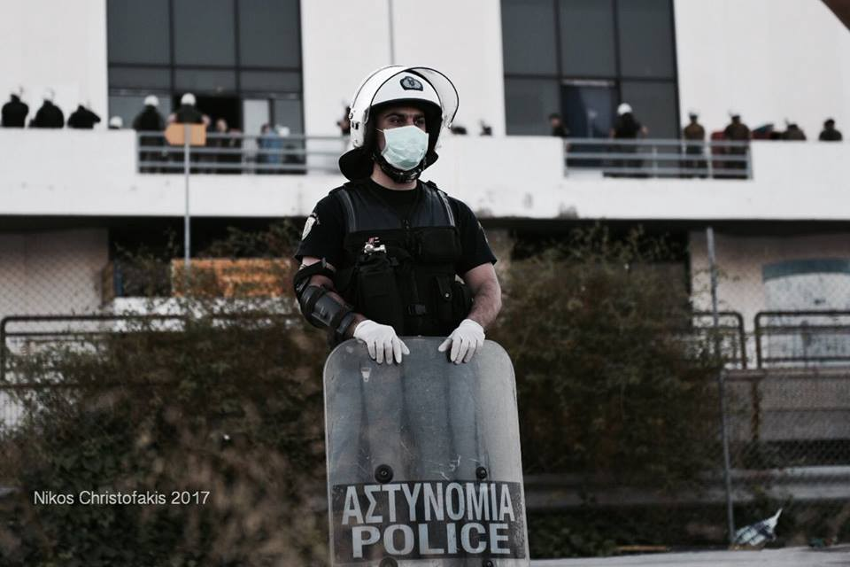
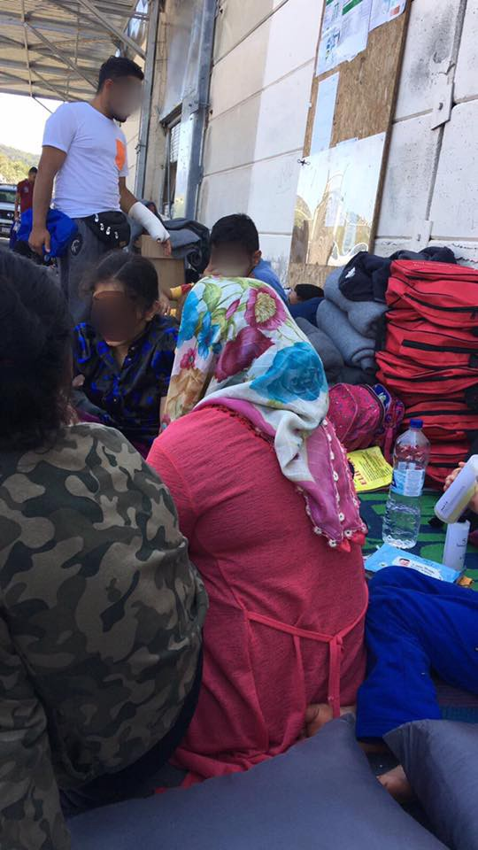
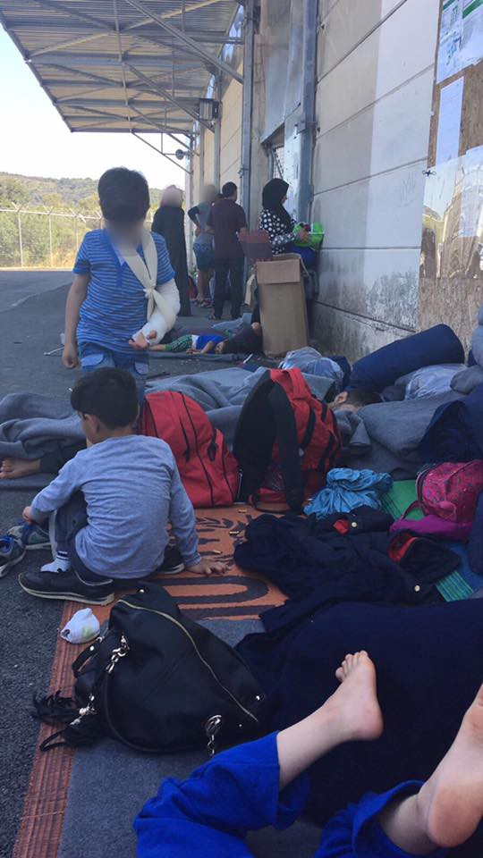

### AYS DAILY DIGEST 2/6/2017: Elliniko camp evacuated
#### Situation still deteriorating on Chios // New team to concentrate on reunification from Greece // No Name Kitchen moves to the border with Croatia // Deportations continue from Austria despite attacks // Partnership between Utopia 56 and MSF

Greek policemen controlling the access to the camp area on Friday morning
### Feature

Police moved today to relocate the remaining refugees from Elliniko camp, something the government had intended to do for a long time\. Over the last few weeks, the Greek government has been trying to persuade refugees, practically all Afghan, to leave by removing vital services\. On 20 May, the NGOs providing medical care, clothing, legal advice, translation, and cleaning were withdrawn\. In the days that followed, WiFi, electricity, and water services were cut off and residents were told to accept transfers elsewhere or lose support\.

](assets/487fe0bf723b/1*FuO0Q-7_eiWV3qxA220mLQ.jpeg)

Photo by [**Marios Lolos**](https://www.facebook.com/marios.lolos.1)

And this morning the police finally did it, coming in large numbers \(about 150 officers\) to the area and blocking off access to the old airport site\. According to reports, using nine buses, they started moving the families to the newly finished camp in Thiva, a camp that has been planned for about one year now, according to volunteers’ reports, but has only now been made available\. About 350 people, mostly families, were reportedly transferred to this new camp, about 70 km north of the capital, and the remaining residents \(over 100 according to reports\) were taken to Petrou Ralli police headquarters for identity checks and later moved to Derveni, a small town by the coast 140 km west of Athens \( not to be confused with the two small refugee camps in Thessaloniki area in the north\) \.

](assets/487fe0bf723b/1*5sMUlAoSS0V1GppfAggRkw.jpeg)

Photo by [**Marios Lolos**](https://www.facebook.com/marios.lolos.1)

](assets/487fe0bf723b/1*z42Q12WKyaRQ9gUQLYIB9w.jpeg)

Photo by [**Marios Lolos**](https://www.facebook.com/marios.lolos.1)

](assets/487fe0bf723b/1*V3osw1xwk-qYjBnvBjoNSA.jpeg)

Photo by [**Marios Lolos**](https://www.facebook.com/marios.lolos.1)

We are not certain exactly how many refugees were still living at Elliniko, a camp that last year hosted around 3000 people but more recently had a few hundred refugees\. According to the Greek government, the last numbers for the three subcamps of Elliniko totaled 649, with 141 at the Baseball camp, 221 at the Arrivals terminal and 287 at the Hockey camp\. Too many people living for too long in dire conditions\. Only those who visited the camp knew how terrible the conditions were in this last makeshift refugee camp in Greece, which has been in the news for the worst reasons when residents were injured or even lost their lives in the many fights that took place there\.
### Greece

In other news from Greece, volunteers reported that arrivals on the islands continue and in the last hours of yesterday, 38 people arrived in the north of Lesvos in one boat\. Also yesterday, there are reports of 11 refugees being deported back to Turkey from Mytilene, of whom three were Algerians, one Moroccan, one Nigerian and six Pakistani, all men\.

Today we received reports of more arrivals on Chios, with eight refugees getting to the island in the morning and 61 others arriving in the evening, continuing the high influx to the island that has been constant in the last few days\.

The official numbers for Chios also tell us that today there were 55 new registrations on this island\.

The situation on Chios continues to be the most worrying, with many people now having to sleep out in the street because there’s simply no space for more guests at the hot spots, as volunteers report:

> I personally saw 12–15 refugees walking out from Vial\. There are reports of more who had already arrived in Souda, only to learn that it’s also full\.
 

> We stopped to talk with a group which was walking to ask where they were headed\. When they said Souda, we told them it’s at least a three\-hour walk and they had small children, so we told them it wouldn’t be worth it to walk the distance\. We told them they would receive the same response at Souda: that Souda is full\. They were from Syria\.
 

> The new “cage” at the Vial “first reception center” was full\. This “cage” is a fenced\-off area inside the large warehouse\. There were 20–30 people or so in there with their belongings\. The new enclosing fence is only 4–5 feet high with no barbed wire\. 
 

> Outside the building there were 40–50 people sitting and sleeping on mats and blankets against the perimeter of the building\. Some had been sitting there for three days, having been told the camp was full\. They have been receiving food\.
 

> While we were there two men, one 18 from Chad and one older man from Damascus, were given space together in a container\. 

AYS

AYS

**Samos volunteers** have told us they have 10 pallets of clothes \(7 are summer clothes\) ready to give away to organizations who need them\. They are on the island and those interested can either come pick them up or have them shipped, covering the shipment expense\. Note that the boxes and pallets are packed and ready to be moved or shipped, so they cannot rearrange the items or boxes\. However, detailed information about the items in each pallet can be found [here](https://drive.google.com/file/d/0Bx8xH_sx7pWGNUdZZVFZQ29sT0U/view) \.

There’s a new tool to check the needs on the island of Lesvos\. [**NeedsHub\.org**](http://needshub.org/) allows you to select the need you want to help and call directly the organization that has the need\.

[**REFUCOMM**](https://www.facebook.com/refucomm/) has published their article on how to register children for Greece’s new refugee school program from next September in English, Arabic, and Farsi\. You can find the details in this [link](https://www.facebook.com/notes/refucomm/how-to-register-your-kids-for-greeces-new-refugee-school-program-updated-version/448331985518609/?hc_location=ufi) \.

A new **Greek law team** is preparing, in the context of a pending case, an informative note for the ECtHR, on the political decision between Greece and Germany to halt the transfer of refugees who should be reunified with their family members in other EU countries\. This decision has been taken in the knowledge that it breaches the human rights of thousands\. Refugees awaiting family reunification with their relatives in Germany for more than 6 months can communicate with Pleiades legal team for refugee protection at pleiadeslegal@gmail\.com\.
### Sea

The Italian coast guard has published a video of some of their intense rescue missions in the Mediterranean that shows the day to day efforts to save those in need\. This is their video\.

### Serbia

AYS is the proud donor of the mobile kitchen facility serving its third field team \- after Hot Food Idomeni and Belgraid, it is now used by No Name Kitchen in Šid\.

No Name Kitchen has moved its activities to Šid recently and they are celebrating their 100th dinner distribution\. They started their dinner project in the barracks of Belgrade back in January, but since they were evicted the group decided to move to move to Šid and take over cooking from ADM group\.

](assets/487fe0bf723b/1*ebNlqJ2WlZTPdsoA7f6Clg.jpeg)

Photo by [**No Name Kitchen**](https://www.facebook.com/NoNameKitchenBelgrade/)

We started this new adventure in Šid on the 29th of May\. Šid is a little Serbian town right at the border with Croatia\. It has become a hot spot in the last two months, especially since the Hungarian anti\-immigration laws were passed, followed by ruthless police brutality\. Here, hundreds of people await their chance for “the game”, as they call the attempts to cross the border\.

> The conditions in Šid are very tough\. As [Are You Syrious?](https://www.facebook.com/areyousyrious/?fref=mentions) and Welcome\! reported, a new wave of police brutality is hitting Croatia these days\. Unfortunately, we hear on a daily basis how people come back after being beaten up, having their phones destroyed and seeing all their money stolen by the authorities\. Also — as we already reported — push backs have become systematic, with people denied the right to seek international protection, which constitutes a breach of international law\. As a result, these people suffer physical and psychological harm\. 

> Since last Monday we have taken over the amazing job that [Aid Delivery Mission](https://www.facebook.com/aiddeliverymission/?fref=mentions) has been so successfully carrying out\. We are distributing dinner right before the break of the fast of Ramadan\. Along with our very beloved friends of [SolidariTea](https://www.facebook.com/refugeesolidaritea/?fref=mentions) , [SoulWelders](https://www.facebook.com/SoulWelders/?fref=mentions) and [Help\-Na](https://www.facebook.com/HelpNa/?fref=mentions) \(among others\), we are trying to fill the gap of a racist and merciless system which refuses to collapse despite its obvious failures\. We bring a friendly face through solidarity, trying to encourage refugees to continue their tireless journey and to remind them that, despite the inhumane laws and practices of our Fortress Europe, “Refugees Welcome” is way more than just a slogan on a wall\. 

Please consider supporting them [here](https://igg.me/at/oHS3nPBOkSI) \.
### Austria

Austrian media reported today that despite the recent attack in Kabul, the country is continuing to deport refugees back to Afghanistan\. Ignoring the attack at the German Embassy, Austria deported 17 Afghans back to Afghanistan\. They did it together with Sweden\. The interior ministry pointed out that the warning against travel to Afghanistan is for another target group — not Afghans but Austrian travelers\. Only 30% of Afghan protection seekers got a residence permit in Austria last year\.
### Germany

It has been only one day since the country decided to stop deportations to Afghanistan after the brutal attack in Kabul that killed approximately 90 people\. Nevertheless, not everyone in Germany is showing the same degree of compassion and the district council of Middle Franconia said it lodged a complaint against the release of the 20\-year\-old Afghan who was arrested in Nuremberg on Thursday\. They still want to put him in custody for pending deportation\.

Another case going through German media at the moment is the case of a family from Nepal, who have been living in Germany for more than 15 years and who were deported yesterday after their asylum application — after going through all the instances — was finally rejected last year\. What makes the case so dramatic \(and the media getting involved\) is their 14\-year\-old daughter, who was born in Germany\. The police picked her up for deportation at school during class, and her parents hadn’t informed her about the imminent deportation\. Online petitions have been started to get the family back to Germany\.

On the other hand, the asylum services are doing an evaluation of the quality of their decisions for Syrian and Afghan refugees\.

After a German soldier posed as a Syrian refugee and got granted asylum \(and had planned terror attacks\), the BAMF \(authority deciding on asylum cases\) , has retrospectively evaluated the quality of 1% of positive decisions of Syrians and Afghans to see whether there are systematic flaws in the decision process\. Of the Afghan cases, only 54% of the decisions were retrospectively judged to be “plausible”, in 41% of the cases the decision making did not involve proper research of the reasons why applicants fled their country, and in many others the standard process was not followed appropriately\. Also the process of interpreting showed many flaws, with interpreters not being qualified enough and being underpaid\. Pro Asyl requests that all negative cases of 2016 and 2017 be re\-evaluated to ensure the proper quality of decisions\.
### France

Utopia has announced a partnership with Doctors Without Borders in order to improve the reception of unaccompanied foreign refugee minors\.

MSF will work with the Utopia 56 association, which has just launched a platform for “citizen housing” for refugees\. It’s an effort to obtain a better distribution of efforts concerning minors, essentially concentrating on the three departments of Seine\-Saint\-Denis, Pas\-de\-Calais and Paris\. With this project, MSF is stepping down from its traditional role as an actor in the emergency zone in the humanitarian disaster zone — as it did at the beginning of the year, with its “mobile clinic” located near the reception center for migrants in Paris\.
The aim of the NGO is to launch a “plea” to “ensure that minors are recognized as such until the end of their legal proceedings and the aim is clear: The State shall protect them all\.”

An information and care center, followed by accommodation at the hotel, will also be provided from the beginning of the school year and Médecins Sans Frontières are going to welcome young migrants who are isolated and stuck in Paris\. In Paris the number of migrants who present themselves as minors could reach 4,500 this year if arrivals continue at the current rate, compared with 1,200 in 2015\. Many come from the Horn of Africa\.
The MSF center will focus on several “clusters” and a legal permanency will be provided by the Immigrant Support and Information Group \(Gisti\) and the Avocats du barreau de Paris, a “social area” with French courses\.

**_We strive for accuracy and fairness\. Please let us know if you spot partial or inaccurate information, send us your feedback and contribute with information from the ground: areyousyrious@gmail\.com and on Facebook_**

_Converted [Medium Post](https://areyousyrious.medium.com/ays-daily-digest-2-6-2017-elliniko-camp-evacuated-487fe0bf723b) by [ZMediumToMarkdown](https://github.com/ZhgChgLi/ZMediumToMarkdown)._
