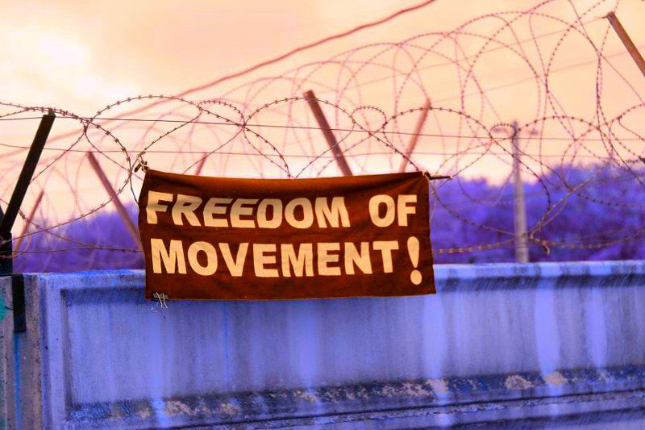
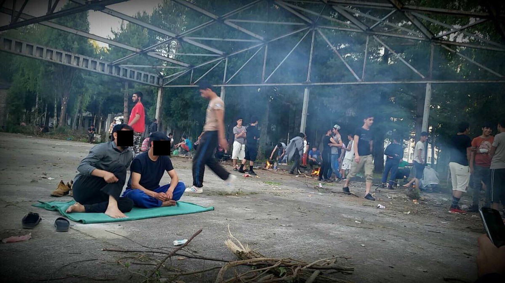
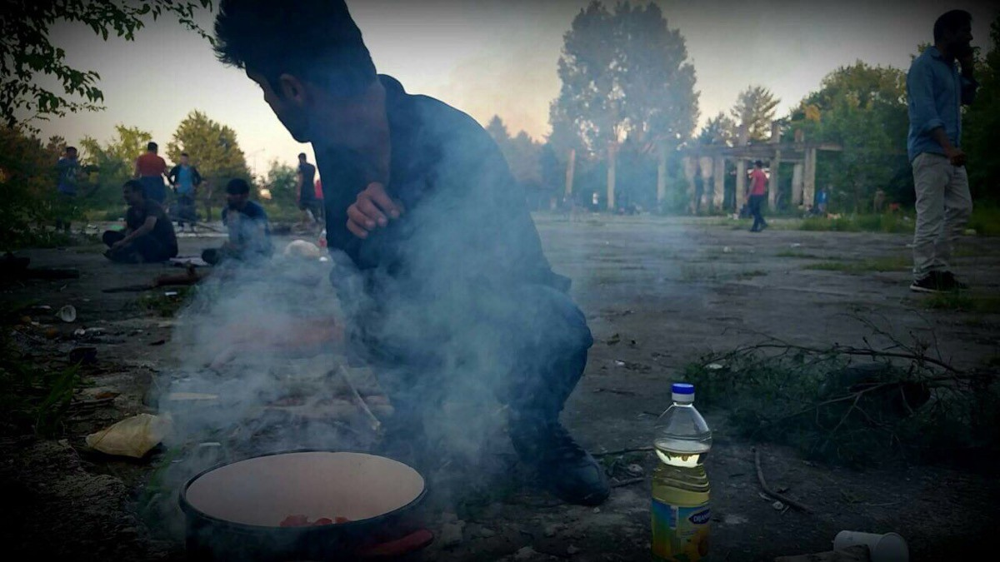
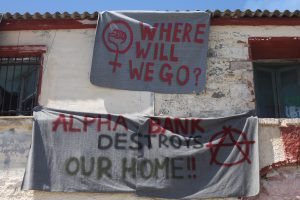
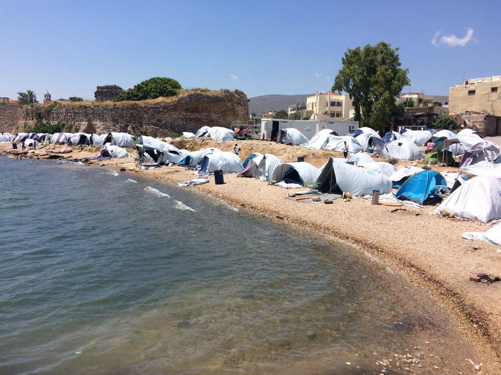
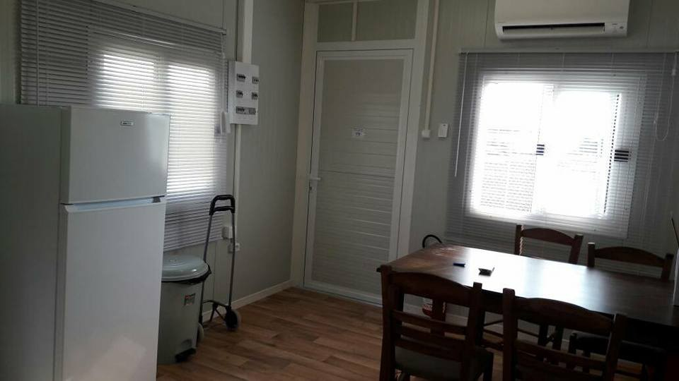
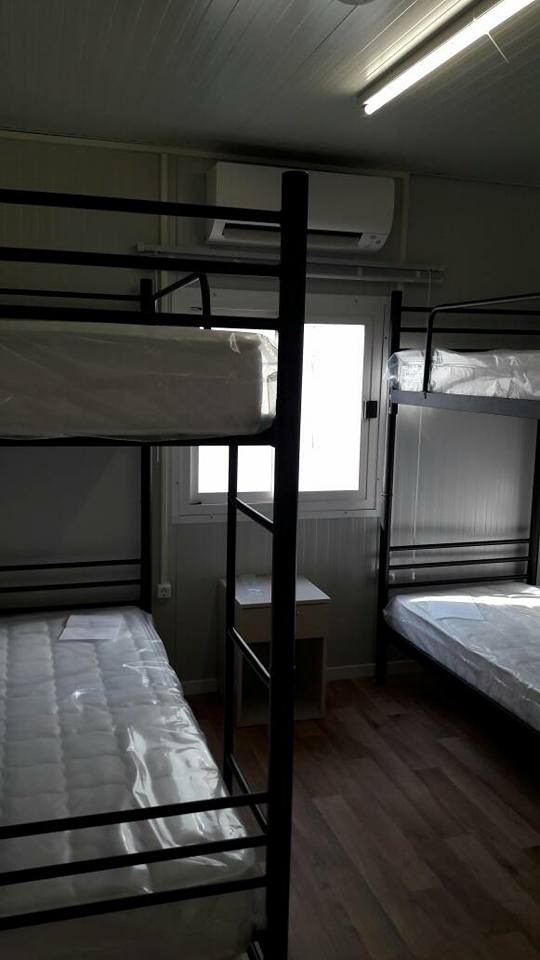

### AYS DAILY DIGEST 3/6/2017 Voices from Serbia

Anti\-Trafficking operations in Greece / Chios beyond breaking point / Sweden to carry on deportations / Unaccompanied Minors in France /

No Border Serbia published a [letter and a statement](https://noborderserbia.wordpress.com/2017/06/03/if-these-laws-stay-in-power-maybe-tomorrow-you-will-be-in-my-positionako-ovi-zakoni-ostaju-na-snazi-mozda-ce-oni-i-vas-uskoro-ugroziti/) on the living conditions of asylum seekers in the country\. People forced to live inside Obrenovac camp shed some lights on the situation inside the camp:

> The conditions in the camp are still as bad as in the beginning\. There is no warm water\. Some of the people went to the river in order to wash themselves\. There is no more cooked food in the camp, people are not allowed to use the camp’s kitchen, so they cook for themselves on fire outside in the yard of the camp\. 

Obrenovac \(No border Serbia\)

> _Every day more than 500 people prepare food in the forest around the camp_ 

Obrenovac \(No border Serbia\)

> _Outside of the camp there is police patrolling all the time\. When they find people, migrants outside of the camp \(as people reported\) police threatens them to bring them to Preševo \(a closed camp near to the macedonian border from where push backs are regularly happening\), even there were cases of beatings\. People are especially reporting about a worker of the Commissariat who physically abuses, beats and humiliates people\._ 

> There is a cell in Obrenovac camp where people are locked up without food for 24h as a punishment\. Racial segregation is visible in the public transport, people are refused entry to buses, or are forced to pay enormous amounts just to get to Belgrade\. 

> _On 27th of may the camp administration locked the front door and all exits of the camp\. \[…\] When people started to organize and were ready to show resistance to this closure, the camp administration decided to open the gate\._ 

> My name is Asa, it has been 11 months now that I am passing these hardest days of my traveling\. I am a refugee from Afghanistan\. As we know freedom is the right of every breathing being\. Right now i am in Belgrade, Serbia, i came here to save my life an be a real servant for human kind but today we are facing a lot of problems by the orders of the governments\. They destroyed the place where more than thousands of refugees passed their nights during their journey and then they send us to camps\. But „camp“ is only a name, in fact it is like jail, they don’t let us to move freely \. Even for shopping\. Even the bus drivers don’t want to take us\. 

> It seems like we are like the enemy of Serbia\. We have many problems around the camp\. There is a group of local mafia , every night they try to beat the refugees\. We cannot move safely in the area outside and around the camp\. Inside the camp the Commissariat group works\. Those people behave with refugees in a very inhumane way\. In fact they forgot about humanity\. Everyone in Serbia has a pet/animal\. If we would touch their pet they are ready to put us in jail forever\. Think about that we are also human\. We have fathers, mothers, sisters, brothers\. \. what will happen to them? 

> Every one says that smugglers are bad people\. First thing i want to ask what is the cause that smugglers started their jobs here in Serbia? The second thing i want to say: who is the bigger smuggler? The government or those who bring a kilo of hashish, when the government today is making business with the lives of thousands of humans? But no one can say anything opposed to this\. Why? 

> Today we are in this problem, but if these LAWS stay in power, maybe tomorrow you will be in my position\. 

> We accept that for most of you, refugees may look like a problem for Serbia, but putting pressure on them\(us\) will only create more problems\. Remember one thing: what you are doing today with us, we will remember it forever\. 

> Please for the love and respect of human kind, let us to be free, we don’t want food, we don’t want cloths for what you should pay for, we only want to move freely, just free movement\. 

> Down with all prisons\! No to segregation and isolation\! 

**TURKEY**
### TURKISH REFUGEES RETURNED TO TURKEY FROM GREECE

Turkish media sources [report](https://turkeypurge.com/greek-police-returns-turkish-refugees-to-turkey-report) that ten people who were investigated as part of an operation targeting people linked to Turkey’s Gülen group were detained on the banks of the Maritza River\. According to their testimonies, the group crossed the river to Greece three days ago and were sent back to Turkey by Greek security forces\.

According to the information gathered by the International Federation of human rights:

> they reached Didymoteicho where they were picked up by police officers and \[led\] to the police station\. There they asked to apply for asylum\. In the police station there was also a Turkish family with three children that had crossed \[the\] Evros\. After a while they were told they would be transferred to the United Nations High Commissioner for Refugees and were put in a white unmarked van\. 

> After a while the van met \[up\] with another car and they were \[led\] to a field\. A group of five masked gunmen, dressed in camo, \[led\] them to the river without saying a single word\. The Turkish nationals saw that there was an inflatable boat waiting there and they repeated their demand to apply for asylum\. 

> Their hands were bound and they were all put on the boat which crossed to the opposite shore with two of the masked gunmen, near an outpost of the Turkish army, where they were abandoned\. After a while, they were found by Turkish police officers\. 

FIDH stated that “the refoulement to the Turkish authorities of people that are in danger of severe violations of their most basic human rights, if it has indeed taken place, is a blatant violation of international law and it is clear it was not the initiative of the local police force\.”
### SUICIDE IN KONYA

Earlier this morning, in Konya \(Central Anatolia\) a 51\-years\-old Syrian refugee, Ahmed Al\-Ahmad, committed suicide in a public park, media [report](http://siyasihaber3.org/suriyeli-multeci-kendini-agaca-asarak-intihar-etti/64069) \.

**AFGHANISTAN**

While a new attack hit a funeral in Kabul, The Mixed Migration Monitoring Initiative \(4Mi\) 1 in Central Asia and South West Asia \(CASWA\) region published a paper on regional migration fluxes, focusing on movements within Afghanistan and zooming in on the shockingly high numbers of protection risks among Afghans on the move\.

Read the paper [here](http://reliefweb.int/report/afghanistan/monthly-migration-movements-afghan-displacement-summary-march-2017)

**GREECE**
### WEATHER WARNING\!

Greek National Meteorology Service EMY issued a weather deterioration warning\. The statements warns of rainfalls, hail and strong winds over the weekend\.

On Sunday 4th June the bad weather will affect central and eastern Macedonia, the islands of the North Aegean Sea, East Thessaly and possibly the Sporades islands and other parts of the mainland\.
### ARRIVALS

One boat landed at the north east coast of Lesvos\. 21 refugees on board, 4 men, 4 women and 13 children\. 16 from Afghanistan, 5 from Iraq\.

**GREEK ISLANDS**
### CALL OUT FROM LESVOS

[No Border Kitchen Lesvos](https://noborderkitchenlesvos.noblogs.org/) published a call for support in their daily work to provide food for refugees and fight deportations\.

No Border Kitchen Lesvos

> The No Borders squat in Lesvos was [evicted](https://noborderkitchenlesvos.noblogs.org/post/2017/04/29/no-yoga-in-the-police-station-evicton-of-old-squat-april-28th-2017/) five weeks ago, and it feels like we’re losing more space every day\. It’s been a month of harsh police crackdowns on squatting and rough sleeping, vicious and increasingly frequent deportations, and dwindling financial support\. The EU is funnelling the thousands of refugees here into Moria detention centre, deporting them to face persecution and death abroad and washing its blood\-stained hands of the whole affair\. 

> No Borders Kitchen are still here, still fighting and still providing food, care and legal support to hundreds of refugees, but our work is more difficult than ever before\. Here’s how the situation has deteriorated for the roughly [4000 refugees](http://mindigital.gr/index.php/%CF%80%CF%81%CE%BF%CF%83%CF%86%CF%85%CE%B3%CE%B9%CE%BA%CF%8C-%CE%B6%CE%AE%CF%84%CE%B7%CE%BC%CE%B1-refugee-crisis/1336-summary-statement-of-refugee-flows-to-eastern-aegean-islands-02-06-2017) trapped on Lesvos, how No Borders is struggling to respond, and what you can do to help out\. 

Read the full article, their statement, their needs and how to help [here](https://noborderkitchenlesvos.noblogs.org/post/2017/06/02/feeding-refugees-and-fighting-deportations-no-borders-call-for-support/) \.
### UPDATES FROM CHIOS

[Refugee Info Bus](https://web.facebook.com/RefugeeInfoBus/?ref=br_rs) published an update from Chios

Souda \(Refugee Info bus\)

> Chios is beyond breaking point\. Yesterday, a single mother with four small children arrived in the Souda camp, where we are working\. 

> They had walked for four hours, in the blazing sunshine to travel from the Vial military camp, where they had registered to try and find accommodation\. They had been registered in Vial, but were told there was no accommodation and they should just find somewhere to sleep\. 

> They slept on the streets for four nights looking for a safe place but found nothing\. She went to get the bus to the Souda camp in the hope of finding a place for her children to sleep, but they were not allowed on, it was full\. 

> So she walked with four toddlers and her son who needed an urgent blood transfusion\. When they arrived in Souda, other refugees helped them by donating a tent and some food but the authorities told them there was no space and they were refused a card to get food, even for the children\. 

> We spoke to Save the Children International, who told us they could do nothing, as it was a Friday afternoon, UNHCR, the UN Refugee Agency said they could do nothing and the Souda camp management team said they could do nothing, “We see this all the time” said a woman shrugging her shoulders\. 

> A volunteer from [Chios Eastern Shore Response Team — CESRT](https://mobile.facebook.com/chiosesrt/?refid=52&__tn__=%2As) stepped in and helped the boy finally get medical attention, and she took him to hospital immediately, where he remains\. The same volunteer helped the family find emergency accommodation last night, while he receives treatment\. 

**MAINLAND GREECE**

**REFUGEES FROM ELLENIKO HOUSED IN THEBES, THIVAS AND DERVENI**

Media [report](https://tvstar.gr/voiotia-articles/87846-oi-protoi-prosfyges-stin-protypi-domi-filoksenias-sti-thiva-video-photo) that 900 refugees, mostly families of Afghan descent, will settle in the standard accommodation structure in Thebes\. The Minister for Immigration Policy and the Mayor of Thebes welcomed the first 500 refugees immediately after the completion of the evacuation operation in Elliniko\.

[Peace mission](https://web.facebook.com/peace.mission.188) published pictures from the new Camp in the area of Thiva\. Here is were several residents of Elleniko are being moved\. In every house/box two families will be hosted\.

Thiva Camp accommodations \(Peace Mission\)

At the same time, refugees moved there and in Derveni are complaining for the isolation of the camps and the lack of Internet connection\.
### LONG WAITING TIME DOES NOT MEAN REJECTION

[Mobile Info team for refugees in Greece](https://web.facebook.com/mobileinfoteam/?ref=page_internal) published a clarification on the long lasting waiting times for application results:

> I REGISTERED FOR RELOCATION MANY MONTHS AGO AND STILL HAVE NO ANSWER, DOES THIS MEAN THERE IS A PROBLEM WITH MY APPLICATION? 

> No\. If you have been waiting for a long time it does not necessarily mean that there is a problem with your relocation application\. There are different reasons why your relocation might take a long time but the main reason is simply because relocation has been slow\. Unfortunately, many people’s applications are still waiting to be sent from Greece\. The Greek Asylum Service can only send an application to another country when that country has officially told Greece that it has places available \(called “pledges”\) \. For example, every month Germany makes 500 pledges to Greece and then Greece can send 500 people’s applications to Germany\. By 28/05/2017 the number of people whose applications had still not been sent was 4,053 but this number is rapidly falling as Greece receives thousands of new pledges every month now\. Around 95% of all sent relocation applications are accepted\. So while your relocation is slow, please try to relax in the knowledge that it is slow in general and there is most probably no problem with your application\. 

Le Figaro [report](http://www.lefigaro.fr/flash-actu/2017/06/03/97001-20170603FILWWW00126-grece-demantelement-d-un-reseau-de-trafic-de-migrants.php) that a combined operation of Europol, Greek Authorities and British Criminal Investigative Police \(CAS\) dismantled a human trafficking ring in Greece\. Authorities arrested 12 people, 7 traffickers and 5 migrants\. Media report that the average price paid to reach continental European countries was between 4000€ and 6000€, between 8000€ and 10000€ for the United Kingdom and 16000€ to reach Canada\.

Greek authorities arrested a 25\-years\-old man who held captive 15 refugees and asked families to pay a ransom to release them, media [report](http://www.ert.gr/803754-2/) \.

**CALL OUT, FUNDRAISING AND VOLUNTEERING**

[ERCI — Emergency Response Centre International](https://www.facebook.com/ercintl/) URGENTLY need 5 doctors to join their team by the 11th June\. Among doctors in general, they need:
 1 Gynaecologist
 1 Paediatric
 2 Nurses

as well as Protection Officers\.

Read more [here](https://web.facebook.com/ercintl/?ref=page_internal) , or contact them: aid@ercintl\.org

The Mother and Baby Project are still fundraising to support refugee babies, young children and their families on the Greek islands\.

Read more and donate [here](https://www.youcaring.com/refugeebabiesandsmallchildrenongreekislands-834524)

Find [here](https://web.facebook.com/groups/AthensVolunteersInformation/) updated information on Volunteering opportunities in Athens

**FRANCE**
### UPDATES FROM CALAIS

Calais [Refugee Community Kitchen](https://web.facebook.com/pg/refugeeCkitchen/posts/?ref=page_internal) reiterated today their commitment to provide food and water at every given opportunity:

> For the last few days our amazing resilient and compassionate volunteers have been having to deal with physical abuse and obstruction from the CRS \(riot police\) \. 
 

>  RCK are committed to being peaceful and non confrontational and will continue to provide food and water when ever we are able, at every given opportunity\. 
 

>  For days now they have created a wall between us and the refugees not allowing food that has been prepared, which is vital, to reach the refugees without stress and violence, if at all\. The temperatures are hot and the need for water is critical\. Where is the humanity? 

> A report from a RCK volunteer of today’s food distribution:
 

> We weren’t allowed to give out any food at lunch time today at the usual spot so we had to go around to different spots close to the distribution spot by the end of it we were literally stopping in the middle of the road and then running out with a box of bentos and water and running back in the van so that CRS or gendarmerie wouldn’t see us\.
 

>  We have distributed like 400 meals though and lots of water but I don’t think it’s feasible to so that everyday\. \.
 

>  I don’t know what we are going to do\. The guy who owns the land where the forest is where refugees live was also there today and he was very angry at the volunteers…He was complaining to us about the fact we were going to go on his land to hand out food rather than make anyone come out but we were stopped straight away\. Literally a game of cat and mouse\. \. 

Police operation in Calais \(Utopia56\)

[Utopia56](http://www.utopia56.com/) and [l’Auberge des migrantes](https://www.laubergedesmigrants.fr/en/home/) published a statement addressed to the French President and Interior Minister about the most recent police abuses in Calais, reported in last weeks digests\.

They collated testimonies about illegitimate police violence, interferences with food distribution and troubles experienced by volunteers and refugees in filing complaint\.

Read the statement [here](http://www.utopia56.com/fr/actualite/violences-policieres-a-calais) \(in French\)
### UNACCOMPANIED MINORS IN PARIS

As reported in yesterday digest, Utopia56 and MSF lauched a partnership to improve the reception of unaccompanied minors in the provinces of Paris, Pas\-de\-Calais and Seine\-Saint\-Denis\.

Currently around 80% of minors are declared to be adults, which makes it much more difficult to be sheltered in state\-run centres\. In the Paris area an informal network of volunteers was established in the last few months, providing housing and activities for minors\.

> A petition is still active asking the Paris City Council to change the situation\.
 

>  
 

>  Mohammad, 14, was threatened with his life by his father in Afghanistan\. Hawa, 16 years was to be excised and married to an old man in Mali\. They traveled thousands of kilometers to find refuge in France, without any family\.
 

>  Today, Mohammad and Hawa, like hundreds of other teenagers, are sleeping in the streets\. One institution, DASES, can offer them the shelter and protection that their entitled to by law\. However DASES puts the majority of these children back into the streets, using dubious and questionable criteria\.
 

>  The situation is urgent, as these kids continue to be at the mercy of cold, hunger and human traffickers\. 

> DASES cannot continue to refuse sheltering them on the basis of their physical appearance and supposed incoherence of their discourse\. 

Read and sign the petition [here](https://www.parisdexil.org/pour-que-paris-protege) \(in French\)

**GERMANY**
### PROTESTS AGAINST DEPORTATIONS

New protests against deportations have been held yesterday and today throughout the country\.

■■■■■■■■■■■■■■ 
> **[Enough 14](https://twitter.com/enough14) @ Twitter Says:** 

> > Spontaneous protests against deportations and for the right to stay continue in #Germany. Pic from #Würzburg yday. #notsafe #bleibistan https://t.co/YkebrHaGyf 

> **Tweeted at [2017-06-03 09:13:07](https://twitter.com/enough14/status/870931342200115200).** 

■■■■■■■■■■■■■■ 

**SWEDEN**
### AFGHANISTAN DECLARED UNSAFE BUT DEPORTATIONS CONTINUE

In an [interview](http://sverigesradio.se/sida/artikel.aspx?programid=83&artikel=6710237) with a Swedish Radio show Michael Ribbingvik, general director of the Migration Agency, stated that even though that the situation in Afghanistan is continuing to deteriorate Sweden will continue to deport Afghan nationals\. He affirmed that, in comparison with Syria and Yemen, the difference is that in Afghanistan there is not a full scale civil war; individuals can thus be sent back to safe areas or parts, based on their individual cases\. The Agency carried out evaluations regarding the situation in Afghanistan, concluding that the situation is likely to worsen rapidly; nonetheless they decided not to take future development into consideration, but rather base decisions on the present and carry on with deportations\.

_Converted [Medium Post](https://areyousyrious.medium.com/ays-daily-digest-3-6-2017-voices-from-serbia-bcaf657d82cb) by [ZMediumToMarkdown](https://github.com/ZhgChgLi/ZMediumToMarkdown)._
