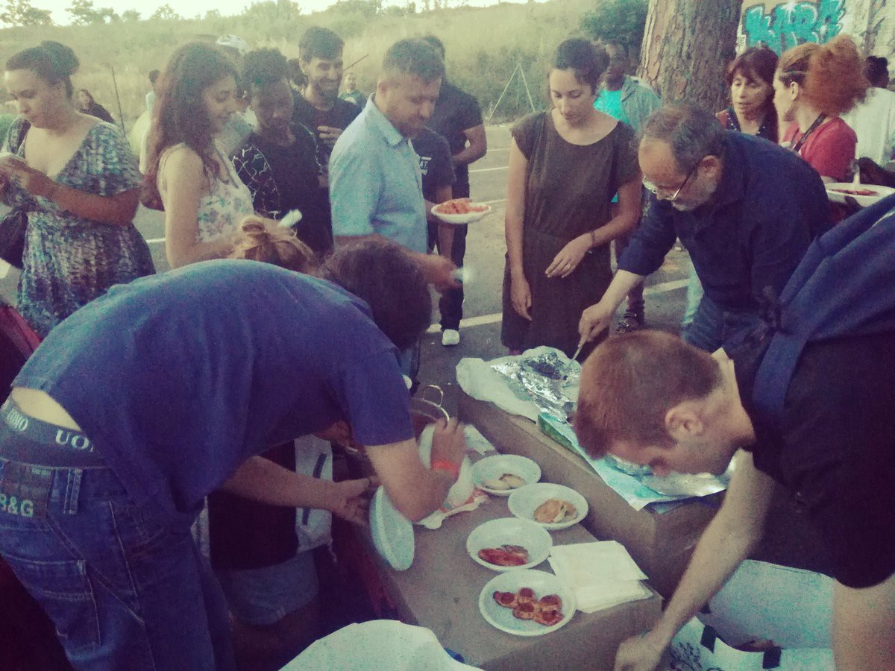
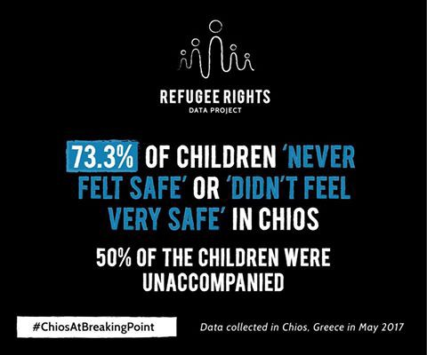
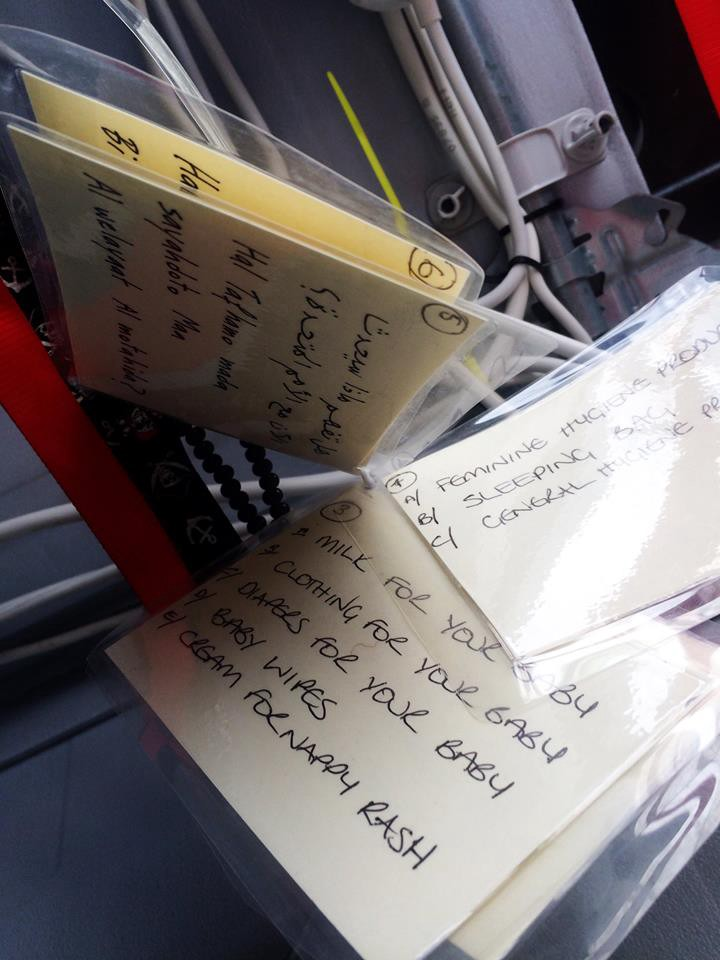
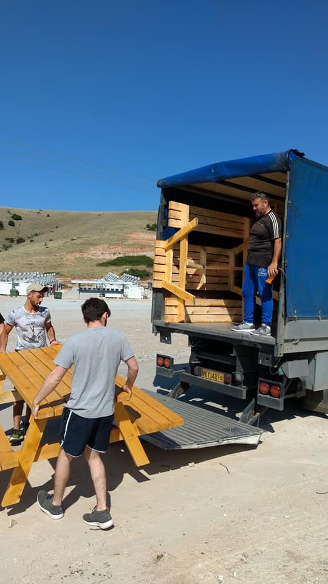
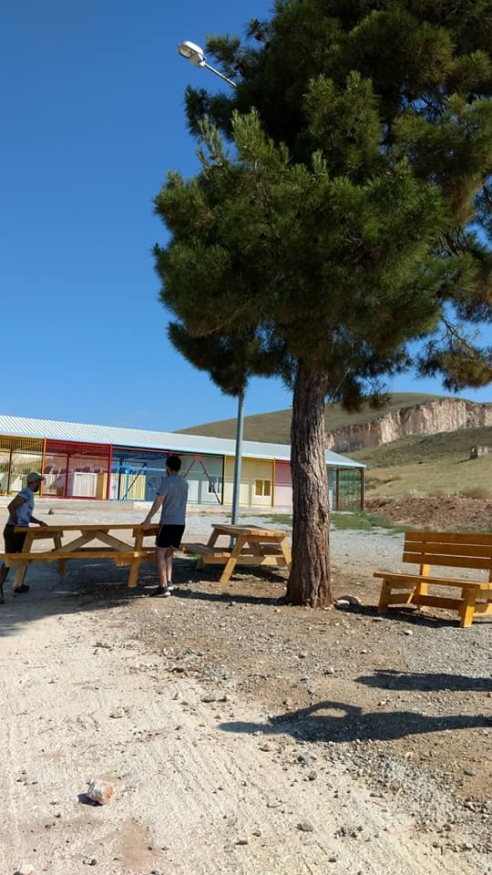
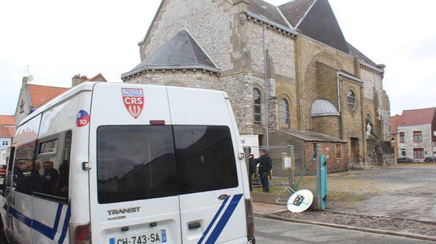

### AYS Daily Digest 6/6/2017: 18th eviction for Baobab, immediately occupied again

_EU Ombudsam to examine EASO work on the Greek islands / Statement against the Skype Lottery / More police in Calais and Dunkerque / 15 arrests for people smuggling in Sicily_

### Feature
#### **18th eviction for Baobab Experience**

> Not even the time to wear his trousers… woken up this way, Paul, arrived from Ivory Coast for a second life and a better future, does not have anything\! \! He has all of us though, because we will not stop\! Solidarity is not a crime, it cannot be thrown away\! Help us\! Tents, sleeping bags, blankets\. Tonight we’ll start again\. 

At dawn this morning, a procession consisting of an armored Police car, coaches, and an armored Carabinieri car, arrived at the Baobab Experience \(Piazzale Maslax\) informal camp in Rome, to take the migrants who are currently guests there to the police station and to dismantle the informal camp\.

Eviction Piazzale Maslax \(Baobab Experience, Amnesty Roma Centro\)

They threw away the tents that had been donated by the town citizenship, as well as migrants’ personal effects\. Among them, passports, IDs, official documents were thrown away and destroyed

While informed that an inventory of all belongings had been previously filed with a lawyer, Police, Local police and Carabinieri refused to take any responsibility and blamed each other for the destruction of personal belongings\.

■■■■■■■■■■■■■■ 
> **[Baobab Experience](https://twitter.com/BaobabExp) @ Twitter Says:** 

> > Buttano tutto, compresi documenti, e si rimpallano le responsabilità. Nemmeno il coraggio di metterci la faccia.

[m.facebook.com/story.php?stor…](https://m.facebook.com/story.php?story_fbid=1356408121102603&id=840615826015171) https://t.co/JSgp2kKqfq 

> **Tweeted at [2017-06-06 08:00:45](https://twitter.com/baobabexp/status/872000293512372225).** 

■■■■■■■■■■■■■■ 

With today’s one, the number of evictions of Baobab Experience reach 18\.

From Baobab Experience:

> The humanitarian camp in Piazzale Maslax is a safe harbour for all those people who experienced a long and horrible journey, made of phisical and psichological tortures\. It is the place that allow them to have still hope in a better life\. In Piazzale Maslax different cultures and nationalities live together, with the same sorrow and the same will to go on\. Among the tents people try to exorcize the past and keep busy, because this city doesn’t offer alternatives\. Throwing all away is nothing else that the nth violation of the rights and the dignity of these women, children and men, whose only choice was to flee their homes\. 

> Throwing away precarious shelters, and those few belongings and personal effect, so important for them, is a show of gratuitous cruelty\. 

On the upside, by 20\.00 tonight 150 people, activists, refugees and citizens, occupied again Piazzale Maslax and started to reorganize a new informal shelter\.

Social dinner after the occupation \(Baobab experience\)

The occupation was followed by a dinner and a party\.

■■■■■■■■■■■■■■ 
> **[Baobab Experience](https://twitter.com/BaobabExp) @ Twitter Says:** 

> > Grazie a tutti quelli che sono passati. Nonostante abusi ed identificazioni, abbiamo voglia di ballare. Ci vediamo al presidio di pz Maslax https://t.co/ZyF3HYQZvB 

> **Tweeted at [2017-06-06 22:08:26](https://twitter.com/baobabexp/status/872213617768366080).** 

■■■■■■■■■■■■■■ 

> Someone won’t get it, many more will understand how we feel: after such a day, made of abuses, identifications at the police station and a destroyed camp, we still want to dance\! 

Donations are needed, contact [Baobab on facebook](https://web.facebook.com/BaobabExperience/?ref=page_internal&_rdc=1&_rdr) \.
### **Greece**
### Reminder of the deadline for registering refugees and asylum seekers to school:
- **June 7** , for children aged 6 to 12

Read more in [yesterday digest](https://medium.com/@AreYouSyrious/ays-daily-digest-5-6-17-recurring-police-beatings-at-the-croatian-border-1d30c1d9538b?source=user_profile---------1-----------) \.
### **Greek Islands**
#### Arrivals and push\-backs

Today one boat with 15 people arrived on Lesvos\. An other one headed to Chios was pushed back last night by the Turkish Coast Guard\.

\#ChiosAtBreakingPoint \(Data refugee rights project\)
#### **EU Ombudsman to examine EASO works in the Greek islands\.**

Following a complaint filed in April by the [European Centre for Constitutional and Human Rights](https://www.ecchr.eu/en/home.html) \(ECCHR\) and [Brot für die Welt](https://web.facebook.com/brotfuerdiewelt/?ref=page_internal) , accepted on June 1st, the Ombudsman will probe the criteria of international protection’s application assessments by the European Asylum Support Office \(EASO\) in the framework of the EU\-Turkey deal\.

According to the EU\-Turkey statement of 18 March 2016, “\[a\]ll new irregular migrants crossing from Turkey into Greek islands as from 20 March 2016 will be returned to Turkey”\. Admissibility interviews form the cornerstone of the administrative procedures: If an asylum claim is rejected as inadmissible, Turkey must, under this arrangement, readmit the person concerned\. The EASO is the agency that conducts the interviews and recommends a decision to the Greek Asylum Service\. Thereby, it plays a decisive role in the assessment of the \(in\)admissibility of applications for international protection\.

ECCHR has serious concerns as to the legality and legitimacy of EASO’s actions in the context of the EU\-Turkey statement\. The complaint argues that EASO’s role in the decision\-making process amounts to maladministration and requests the suspension of EASO’s involvement in admissibility interviews and the limitation of its activities to conduct not in breach of EU law\.

According to ECCHR’s analysis, EASO officers fail to respect core standards of fairness\. The interviews do not permit a fair assessment of individual cases, they do not give room for a thorough investigation of vulnerability and they lack a critical evaluation as to whether Turkey qualifies as a safe third country for the person concerned\.

> Thereby EASO not only violates its own guidelines for conducting interviews, but its involvement in the procedure goes beyond the scope of its powers under EU law\. Consequently, applicants for international protection are deprived of a fair hearing and denied the chance to present and substantiate their asylum case\. 

Read more [here](https://www.ecchr.eu/en/international-crimes-and-accountability/migration/greek-hotspots.html) and [here](https://www.ecchr.eu/en/international-crimes-and-accountability/migration/greek-hotspots.html?file=tl_files/Dokumente/Universelle%20Justiz/CaseReport_Greece_EASO_2017April.pdf) \(PDF\) \.
### **Elsewhere in Greece**
#### **The Skype Lottery**

The Greek refugee council issued a [press release](http://refugees.gr/skype-call-next-life-access-asylum-skype-two-years/) highlighting the inequalities, problems, never ending waiting times created by the decision of the Greek Authorities to register and process asylum application only via Skype\.

The issue has been addressed several times in the last two years \(the decision was implemented in May 2015\) but the situation grew worse\.

> \[…\] the skype system remains “unfair” firstly based on the ground that not everyone has the same access to organisations providing skype calls and secondly based on the ground that the possibility of an answer is a lottery\. Thus, some people calling on their own skype account and get an answer at the first tries whereas some others have to wait for months\. 

> \[…\] When it comes to the languages, the criteria seems to be abstract\. The skype schedule and time slots differs according to the language and we deplore irregularities and serious lack of answer from the authorities for Urdu and Bangla language\. For languages that are not scheduled in the Skype program, persons have to appear to the asylum office on a defined day according to another specific weekly program\. Chinese speakers have reported that only one person enters per week, not to say not a single one\. This difficulty has also been pointed out as experienced by those who come from the Philippines, Somalia and those speaking Amharic and Tigrinya\. 

> The skype preregistration is the first step to access the lengthy procedure for international protection\. \[…\] The asylum applicant card, that individuals receive after the registration, allows access to work, access to accommodation in reception centres, as well as being guaranteed to circulate freely\. All the prerequisite needed to start a new life\. 

> Unfortunately so far, many difficulties are still contributing to make the access to asylum ineffective\. Accordingly, we urge the end of the skype program and call for a direct access for the asylum seeker to register by having a direct access to the Regional Asylum Office\. 

#### **Support the relocation of unaccompanied minors from Greece**

Support METAdrasi in the relocation from Greece of unaccompanied refugee minors\. In April they were able to escort for the first time ever five unaccompanied minors from Greece to Portugal:

> what was considered until recently as inconceivable, was made possible for the first time: to enable and empower unaccompanied children to build their future in other EU countries\. 

This opens new possibilities for hundreds of unaccompanied children who are trapped in Greece and often live in unacceptable conditions, due to lack of availability in suitable accommodation facilities, thus driven into the hands of traffickers\.

Whilst the Portuguese organisations and authorities, that METAdrasi is working with, cover some of the costs, they still require funding to help with the immediate transfer costs and on\-going expenses\. Here are some details\.

The support needed for each kid is broken down as follows:
 €150 covers living expenses for two weeks
 €500 covers the escorted transfer costs of one UM
 €6000 covers the support of one UM for 18 Months

If you are able to help with fundraising challenges and support this cause, you can donate via [http://metadrasi\.org/en/donations\-en/](http://metadrasi.org/en/donations-en/) please specify “Volunteers for UMs” to support the specific project\!
#### Emergency refugees scholarship fund by the University of the People

The online university UoPeople allocated funding for 500 refugees for an initial 10\-Exams program\.

Read more [here](http://www.uopeople.edu/tuition-free/our-scholarships/syrian-refugee-scholarship/)
### **VOLUNTEERING OPPORTUNITIES**

Humanitarian Support Agency are looking for TEFL certified teacher for their English classes in Kara Tepe camp in Lesvos? You can join the HSA team by Applying on their [webpage](http://humanitarian-support-agency.org/?page_id=404) \.

Health\-Point Foundation Dental/Medical relief need Arabic translators

[ IMPORTANT DATES TO BE FILLED: JUNE 8-13 JULY 13-JULY 18 JULY 27-AUG 1 AUG 3- AUG 15 AUG 17-AUG 29 PLEASE NOTE: HPF is a volunteer-led organizaiton Translator position is voluntary and unpaid. Presence is required. LOVE, HPF TEAM")](https://www.facebook.com/healthpointfoundation/posts/435630346812883:0)

[ECHO Refugee Library](https://web.facebook.com/refugeelibrary/?fref=mentions) is in need of a volunteer driver to keep the mobile library rolling through the streets of Athens while our primary driver is away\! UK van, no special license needed\. Please contact them on Facebook @refugeelibrary\.
### **Serbia**
#### Donation needed in Sid camp

Sid camp needs shoes and backpacks urgently\. Trousers, socks, shorts, T\-shirts, underwear and jumpers are also welcomed\.

Get in touch [here](https://web.facebook.com/groups/1236769899744449/) \.
#### Volunteers needed in Obrenovac camp

[Refugee Aid Miksalište](https://web.facebook.com/RefugeeAidMiksaliste/?fref=mentions) is currently working on food preparation and distribution in Obrenovac camp \(45 min from Belgrade\) \. They are looking for volunteers to help cook food together with the local community in the restaurant\. Sanitary booklet, accommodation and one meal per day provided\.

For more information please write to [office@refugeeaidmiksaliste\.rs](mailto:office@refugeeaidmiksaliste.rs)
#### Outdoor furniture delivered to Koutsochero camp

[Intervolve](https://web.facebook.com/InterVolve-219418945063168/?ref=page_internal) unloaded today the first batch of picnic tables and benches at the Koutsochero camp\. Build by [The Timber Project](https://web.facebook.com/thetimberproject.org/?ref=page_internal) , these are the first outdoor furniture in this remote camp\.

Kotsuachero camp \(Intervolve\)
### **Italy**
#### 15 people arrested for people smuggling

Palermo public attorney’s office disposed the arrest of 15 people accused of association for transnational crime to facilitate clandestine immigration and tobacco smuggling, Italian news agency [states](http://www.ansa.it/sicilia/notizie/2017/06/06/terroristi-provenienti-da-viaggi-dalla-tunisia-procura-palermo-indaga_c321abe7-dcc5-4a1f-ab60-cd3da074f550.html) \. The organization would have transported from Tunisia to Marsala \(Sicily\) also people accused by the Tunisian police, for possible linkages with jihadi terrorist organizations\. The organization was representing a “threat to the national security” according to the public ministers\.
#### National civil service activities to be open to refugees and humanitarian protection holders\.

Infomigrants [reports](http://www.infomigrants.net/en/post/3530/italy-opens-national-civil-service-to-refugees) that the government will expand the activities of the country’s civil service to refugees and humanitarian protection holders\. The services were previously available only to Italian citizens\. The national civil service assigns and carries out assistance and social utility or cultural promotion projects\. Labor ministry Undersecretary Luigi Bobba said the project submission phase will involve nearly 3,000 volunteers\.
### **France**
#### More police in Calais and Dunkirk

Media sources report \( [1](http://france3-regions.francetvinfo.fr/hauts-de-france/nord-pas-calais/pas-calais/calais/migrants-calais-gerard-collomb-annonce-renforts-policiers-1267113.html) , [2](http://www.lemonde.fr/immigration-et-diversite/article/2017/06/05/le-ministre-de-l-interieur-envoie-des-policiers-supplementaires-a-calais-et-adopte-une-ligne-dure-anti-migrants_5139128_1654200.html) \) statements released yesterday by interior minister Gerard Collombe announcing police reinforcements in the area of Calais and Dunkirk\.

Three additional units and over 150 police agents will be deployed since next Monday to “suppress breaches in public order and fight smuggling”\. Among the minister priorities is that the _jungles_ won’t grow up again\. In police practice this mean continuous harassments to migrants and volunteers and attempts to stop water and food distribution, as we reported in last weeks digests\.
#### Five arrests at a food distribution in Calais

CRS attempt to stop food distribution \(Riaz Ahmad\)

Volunteers [report](https://web.facebook.com/groups/197381947270598/) that today in Calais CRS police agents went in a church premises and tried to stop the food distribution\. They left after Vincent de Coninck of Secours Catholiqe called the préfecture saying the police were on private ground belonging to the Church\.

Five arrests were nonetheless made at the exit for no reason other than people wanting to eat\.
### **Czech Republic**
#### Halt to relocation after accepting 12 asylum seekers

According to media sources \( [1](https://euobserver.com/migration/138133) , [2](http://www.sfgate.com/news/media/As-Czechs-slam-door-on-migrants-Brussels-warns-898165.php) \) Czech government decided to completely stop relocation program after they accepted only 12 people in 2016 \(last person was relocated in August\), out of 2\.961 that was planned\. Czech interior minister Milan Chovanec declared on Monday that the country would withdraw from the legally binding EU scheme, over broader concerns linked to security and the “dysfunctionality of the whole system” and that the government is ready to take measures against possible EU sanctions\.

> **We strive to echo correct news from the ground, through collaboration and fairness, so let us know if something you read here is not right\.** 

> **Anything you want to share — contact us on Facebook or write to:areyousyrious@gmail\.com** 

_Converted [Medium Post](https://areyousyrious.medium.com/ays-daily-digest-6-6-2017-18th-eviction-for-baobab-immediately-occupied-again-e9012ab9820) by [ZMediumToMarkdown](https://github.com/ZhgChgLi/ZMediumToMarkdown)._
