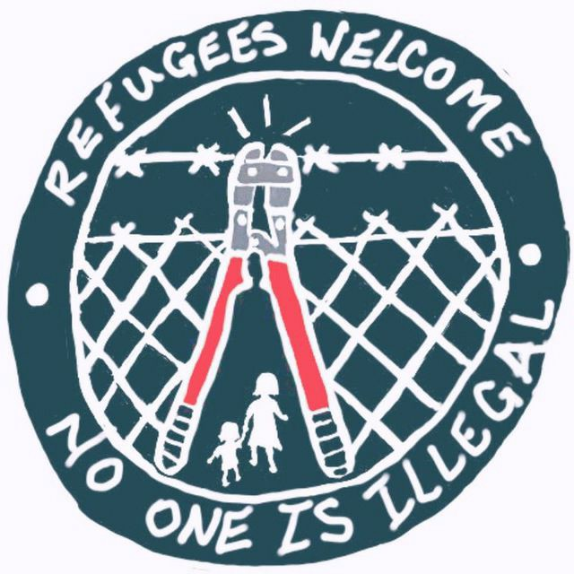
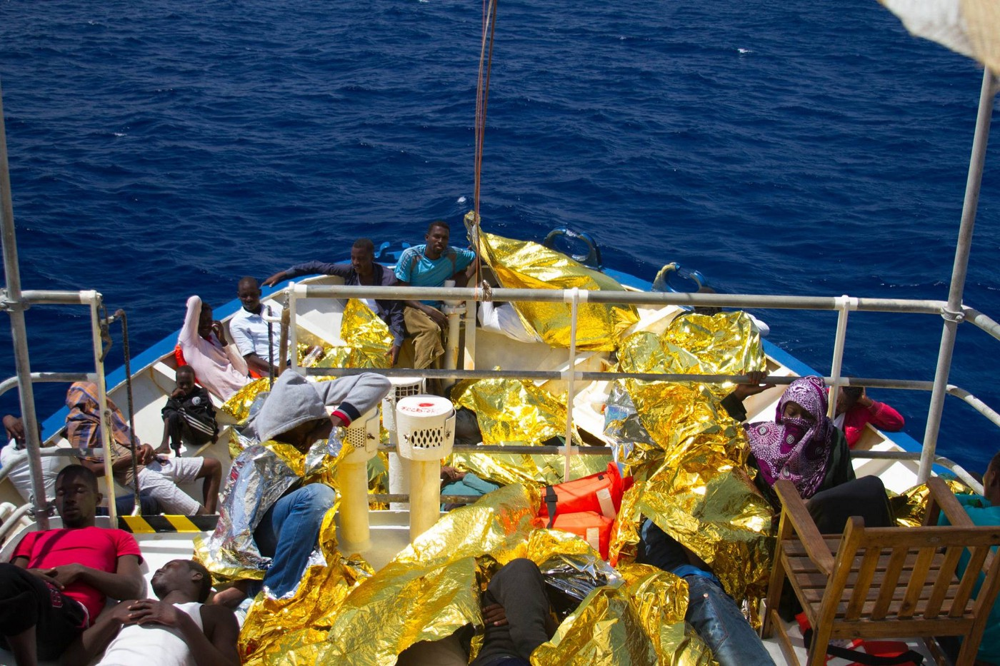
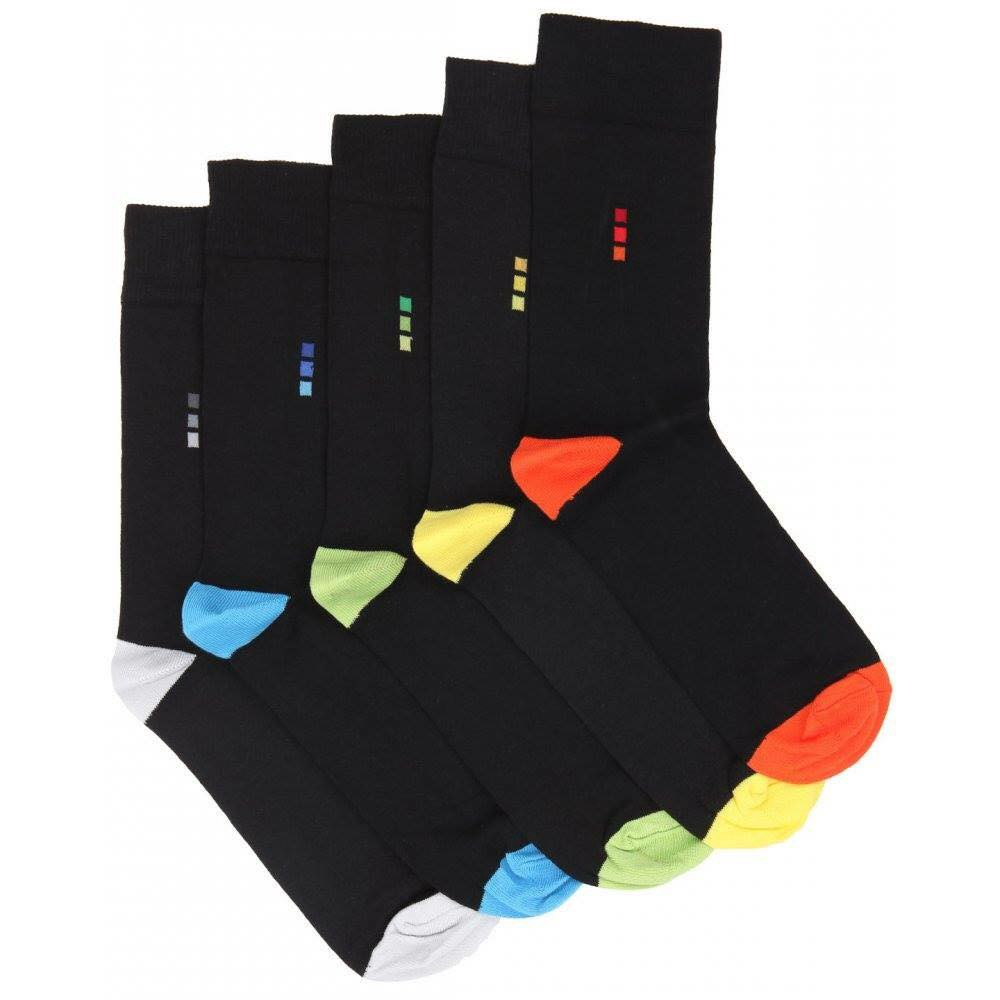

### AYS Daily Digest 10/06/2017: Pregnant woman and 31 children among those rescued at sea

_More than 100 people missing after boat sinks near the Libyan border / Boat with 31 children under 5 years old on board saved at sea / New deportations from Greece / Pan\-European far\-right group strengthening its network in Europe / Traffickers indicted in Bulgaria / Alarming situation in camp at Hungarian border / France continues deportations to Afghanistan_

\#noborder
### FEATURE

The Libyan Coast Guard rescued over 480 people at sea off the coast of Azzawya today\. Despite their efforts, at least eight people drowned and over 100 are still missing\. These recent events add to the more than 900 people rescued off the coast of Libya on this past Thursday and Friday alone\.

All the people rescued are taken to the detention center in Zawia, and from there it is likely that they are returned to the country from which they came\.

At the same time and over several operations, over 1000 people were rescued in the Mediterranean Sea closer to Italy\. A [Sea\-Watch](https://www.facebook.com/seawatchprojekt/posts/1879293952288677 …) crew at one point had on board 220 people rescued from sinking inflatables, including one pregnant woman — Virtue from Nigeria — who was transferred to the ship _Phoenix_ for medical attention\. Unfortunately, two of the passengers did not make it\.

■■■■■■■■■■■■■■ 
> **[Sea-Watch](https://twitter.com/seawatchcrew) @ Twitter Says:** 

> > Meet Chok from Southsudan who just got out of prison in #Libya. So glad we found him on a wooden boat with 44 other people this morning! https://t.co/D6JhTAuHCd 

> **Tweeted at [2017-06-10 08:27:52](https://twitter.com/seawatchcrew/status/873456668016824320).** 

■■■■■■■■■■■■■■ 

That was not the only rescue operation for the crew today\.

The vessel _Prudence_ had 50 people rescued on board today\. Among them, 31 were children under 5 years old\.

■■■■■■■■■■■■■■ 
> **[MSF Sea](https://twitter.com/MSF_Sea) @ Twitter Says:** 

> > You have to be beyond desperate to take a boat like this with your kids. #Prudence has more than 50 on board and 31 are under 5. https://t.co/vqz9A67rRd 

> **Tweeted at [2017-06-10 13:09:42](https://twitter.com/msf_sea/status/873527596222476289).** 

■■■■■■■■■■■■■■ 

This year, over 72,000 people attempted the dangerous route from North Africa to Europe\. It is estimated that over 1,700 died in their attempts\.

Most of the new arrivals are in Italy, one among several countries struggling to find ways to accommodate everyone\. While many locals are trying to help new arrivals, every day we are receiving news about those who are instead finding ways to harm refugees and migrants\. [According to our latest information](https://www.facebook.com/lorena.fornasir/posts/1296567773793650) , starting this Monday, in Pordenone, in the north of Italy, parishes along with local offices of the left wing party will no longer be permitted to house new arrivals\. If this decision is implemented, over 50 more people are destined to sleep in the street\.

Photo by @SeaWatch

While officials are finding ways to make life even more difficult for people who are migrating, not enough is being done on an institutionally level to stop fascists\. [European media are reporting](http://www.dw.com/en/far-right-group-aims-to-stop-informal-migration-to-europe/a-39189556) about a new pan\-European far\-right group‚ Identitarian Generation, that has gathered €73,000 through its crowdfunding efforts\. They are primarily campaigning to stop informal migration to Europe\.

Last month, a group identifying with Identitarian Generation stopped an SOS Mediterranée rescue ship from entering the port of Catania before its vessel was intercepted by the Italian Coast Guard\.

The funds the group gathered through crowdfunding will be used to continue their actions, and they will continue targeting those who are saving lives\. It is said that the person who is representing this group in public is a 23 year old student\.

Nevertheless, what this group is proposing is much closer to the official stance of the EU rather than being a backlash against it\. Both the Identitarian Generation and the EU share the support for the EU’s cooperation with North African countries to close smuggling routes—and essentially migration in general—as well as enthusiasm for the EU\-Turkey deal\.

The group is developing a phone application for their members, tentatively called “Patriot Peer\.” The app’s intended to help like\-minded individuals find each other using geolocation services with the intention of fostering networks throughout the continent sympathetic to the ideas that Identitarian Generation and similar far\-right groups promote\.
### GREECE

More people arrived in Greece today\. Two boats arrived on the shores of Lesvos today, one early this morning carrying 13 people on board, including four children\. A second boat arrived in the afternoon with 55 people on board\.

In the meantime, six refugees were moved from Chios to Lesvos to be deported\.
### The Mobile Info Team

[**Can I check if I can collect my relocation decision, Greek residence permit, or travel document?**](https://www.facebook.com/mobileinfoteam/photos/a.1800063030222418.1073741830.1796286800600041/1975785122650207/?type=3&theater)

> Yes, this is possible\. The Greek Asylum Service website allows
 

> people to check when picking up your Greek residence permit or your travel document\. Please note that the Asylum Service will also always call you to tell you when you can collect it\. Checking this is optional\. You need to compare if your case number is listed on the pages above\. You can find your case number on the middle page of your white card\. It is the second last number\. [This is the link to see if your relocation decision is ready for delivery](http://asylo.gov.gr/en/?page_id=1031) \. [This link is for the residence permit](http://asylo.gov.gr/en/?page_id=1292) \. [This is the link to see if you can collect your travel document](http://asylo.gov.gr/en/?page_id=1289) \. 

### SERBIA

The situation in Serbia for refugees and migrants is getting worse\. People who lived in barracks during the entire winter and relocated across the country at the beginning of May are slowly coming back to Belgrade\. Groups of volunteers in Serbia are trying to help those who are stuck in the streets, among them a Syrian family with three kids\.
### BULGARIA

Local media are reporting an account of two Bulgarians and one Afghan man who are charged with human trafficking after nine people died when a minibus crashed in southern Bulgaria weekend before\. The driver, who also died in the accident, was 16\-year old Bulgarian who did not even hold a driver’s license\. One of the Bulgarians was also charged with causing death through negligence\.

Bulgarian police continue arresting people who are trying to cross the border\. So far this year, 2,054 people passing through Bulgaria have been intercepted and arrested after crossing the border\. At the same time, 52 traffickers have been arrested\.
### HUNGARY
#### Transit zone

From [MigrationAid](https://www.facebook.com/migrationaid.org/posts/762408390628076) :

> “More and more people are quarantined with gastrointestinal symptoms\. People are lying on the floor of the containers because there are too many patients\. The heat is unbearable and the metal containers become warmer\. There is no shadow anywhere\. The air is full of dust which the wind will stir up even more\. People are losing their weight and the kids are getting thinner\. There are some families who have been locked in the barbed wire for two months\. In the first few weeks, we could even ask the people of a relief organization to buy us things in the shop, now it can not be\. They want us to die here?” 

### FRANCE

People from Afghanistan are increasingly facing arrest and detention across the country, [local activists are reporting](https://calaismigrantsolidarity.wordpress.com/2017/06/09/la-france-expulse-vers-lafghanistan-risk-of-deportations-to-afghanistan/) \. This year, the number of Afghans in detention centers has risen to 80, with six of them are facing deportation to Kabul soon\. Several flights have been booked for June, despite reports from Afghanistan about an increase of hostilities across the country\.

The group La Cimade strongly denounces deportations and calls on France to stop immediately all deportations to Afghanistan\.
#### Socks are needed\!

People in Motion

> “When you are living without shelter in the fields, ditches, and woodland around Calais your feet can really begin to suffer\. The chance of a pair of clean socks can make a real difference\. hundreds of pairs of socks are being given out every week — they get wet and uncomfortable quite easily, having wet feet can lead to dangerous illnesses\. The French authorities are preventing us from providing tents and regularly disrupt the distribution of food\. We’ve got a van taking aid to Calais at the end of the week and it would be great to get as many socks as we can\! New men’s formal socks are best — but anything clean and at least nearly new can be used\. If you have socks to donate you can get them to our drop off points or you could order them on Amazon and get them delivered directly to us at: People In Motion, Morfield, Ryelands Road, HR6 8PN 

> **_We strive to echo correct news from the ground through collaboration and fairness, so let us know if something you read here is not right\._** 

> **_If there is anything you want to share — contact us on Facebook or write to: areyousyrious@gmail\.com\._** 

_Converted [Medium Post](https://areyousyrious.medium.com/ays-daily-digest-10-06-2017-pregnant-woman-and-31-children-among-rescued-in-the-sea-e3f150486621) by [ZMediumToMarkdown](https://github.com/ZhgChgLi/ZMediumToMarkdown)._
