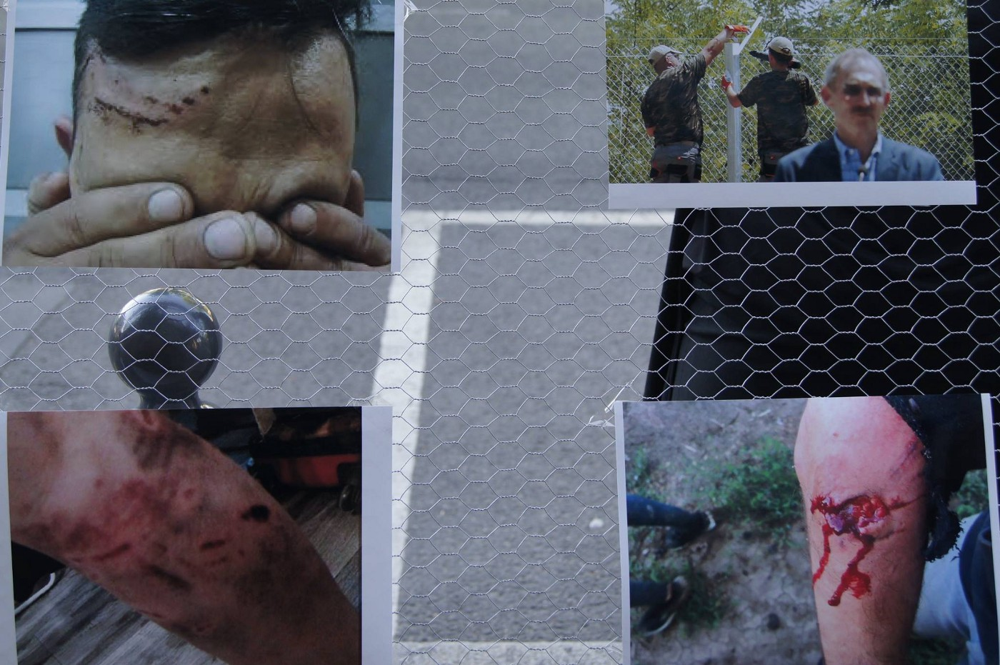
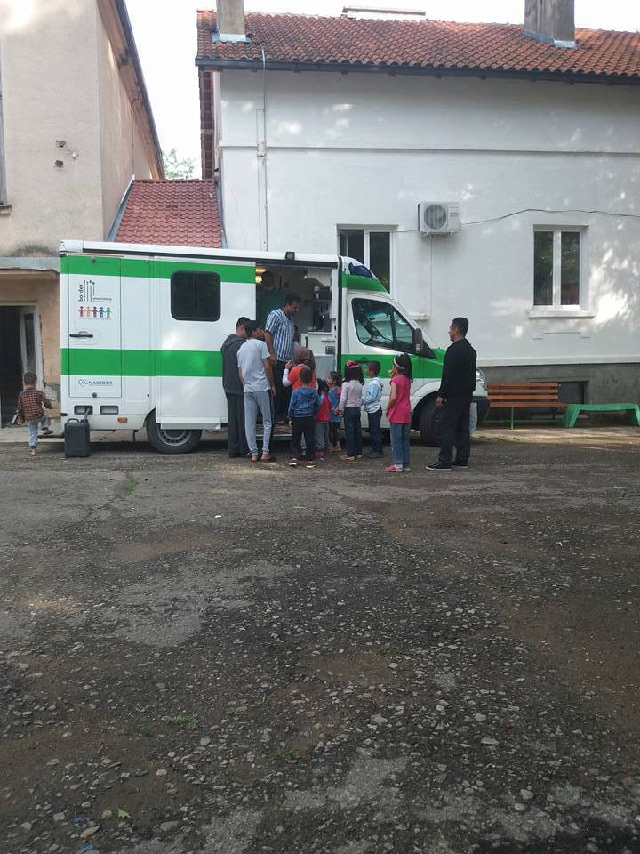
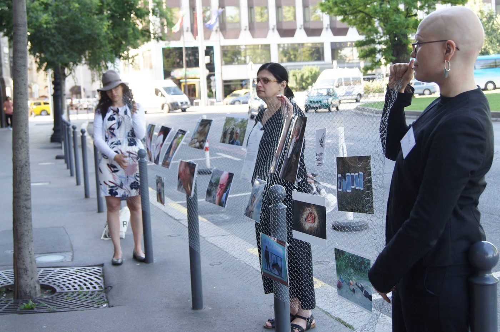
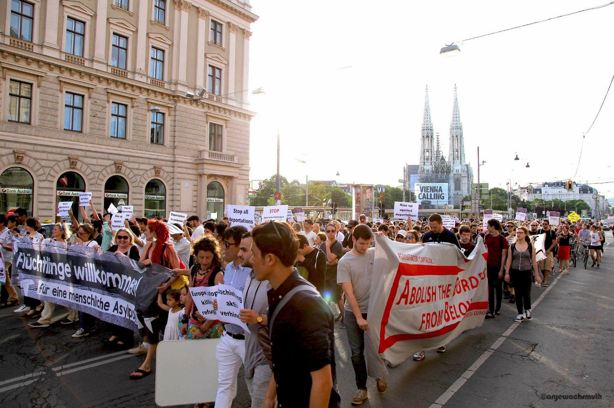
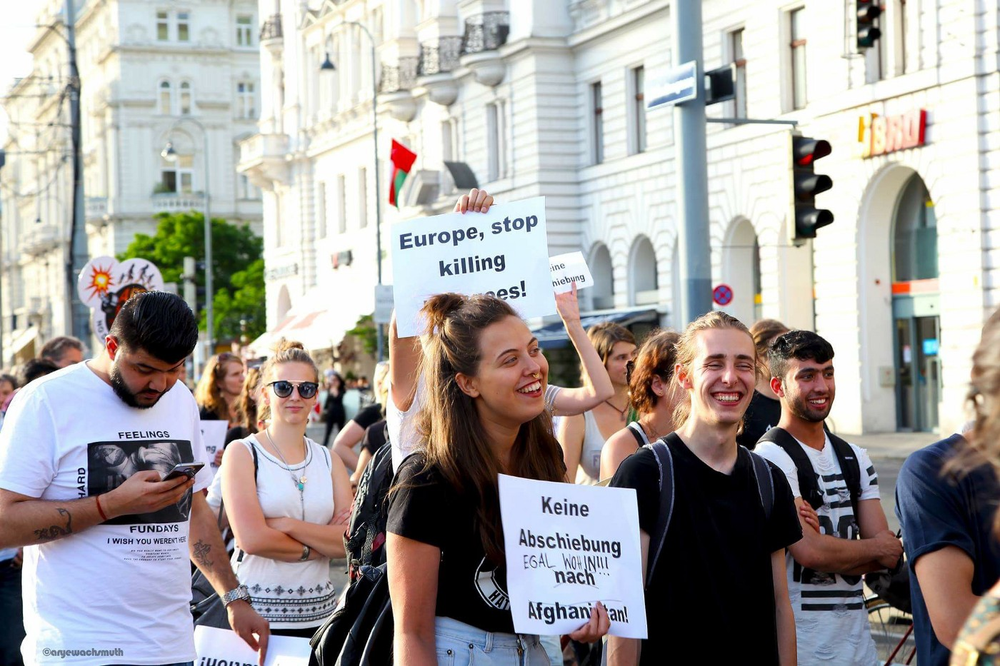
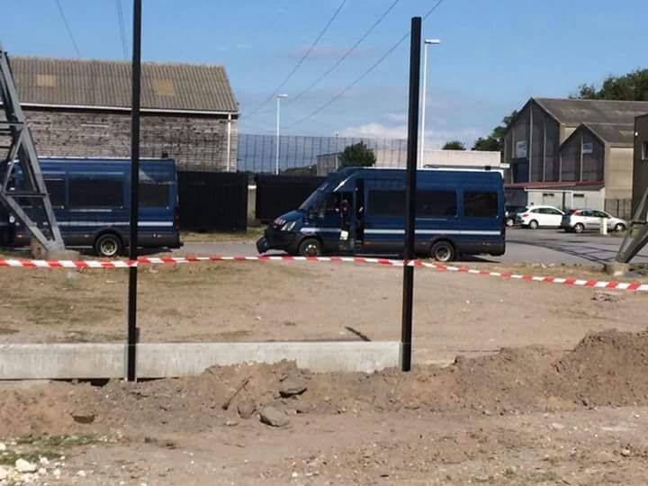

### AYS Daily Digest 9/06/17: Facing down Fortress Europe

_40,000 children at great risk in Raqqa, Syria / a revolving door to Europe in Greece as crackdowns on “Second\-Time Rejection” refugees increases / activities to affirm humanity in Chios and Athens / more mobile dental work bringing smiles in Serbia / Activists in Hungary attempt to hold government to account / Italian undersecretary thanks search and rescue NGOs / In spite of the “victory” against the far right in France, refugees battered back and forth by police / Poland refusing to accept refugee quota_

Photo credit: Migszol Csoport
### FEATURE: Facing down Fortress Europe

On almost any video or article detailing the ever\-improving systems of keeping people out of Europe, you will see a flood of enthusiastic comments, and not simply from the bottomless pits of the internet that will always be unreachable in terms of moral accountability\. We would be myopic to attribute this overwhelming skepticism and apathy towards refugees and migrants only to essentially radical fascists or populists\. Indeed, this myopia can result in shaky arguments that can crumble when confronted with “legitimate criticism\.”

“Well I understand things are bad, but I’m not allowed to go anywhere I please…” “What about police brutality in general, can’t we focus on that?” “Why is it you care more about refugees than about our local homeless?”

We must continue to engage in self\-reflection and critique in order to prepare ourselves for the ongoing battle against human rights\. Pointing out false dichotomies, for instance, highlighting the number of outreach projects that include both refugees and the homeless, and being willing to take ownership of previous oversights is a good place to start\. And necessary\.

If we slip into relying upon simply confronting citizens with the brutal reality of the human cost involved in protecting borders, we open a dangerous Pandora’s box that risks transforming the argument into a simple case of atrocity Pokémon, with each “side” storing up ever\-more salacious anecdotes to be played “against” each other\. We should not remain silent and continue to boost the voices of those being drowned out by the media, which now turn a cold eye, as the “refugee thing” is now “played out” and has decreased in “clickability\.” But we cannot stop there\. We must show people the broader failings as a whole — a massively intricate system that is tied to war, profits, corruption, racism, and many other unsightly realities of our world\. It is a momentous task\.

With the increasing targeting of volunteer efforts and demonizing of aid delivery outside of the “approved system,” it can feel immensely pointless to continue the struggle\. As we hear and see men, women, and children living in rat\-infested, often flooded tents on the beaches of Chios, the optimism and enthusiasm that drew many of us together risks being eroded\.

For the unlucky ones trapped on the other side of the agreements put into place in March 2016, hope seems far away\. Yet, those of us making up the system of support around them must take this opportunity to dig in and delve deeply to get to the bottom of our motives in becoming this system of support\.

_We may not “win,” but we will keep fighting anyway\._
### SYRIA

As the Raqqa offensive continues, civilians are facing a deadly array of choices\. According to UNICEF, due to the so\-called Islamic State’s \(IS\) tactics of war, up to 40,000 children are at risk of serious harm or death\. The Syrian Democratic Forces are continuing their assault on the city which began earlier this week, and reports continue to highlight IS’s willingness to use human shields and hold citizens of the city hostage\.

MSF has released the following statement regarding the situation:

_“Intensified fighting for control of the Syrian city of Raqqa has forced civilians to either stay in their homes and villages under heavy bombardment, or attempt to leave the city and risk their lives crossing active frontlines and minefields\._

_Escaping Raqqa — known as the stronghold of the Islamic State \(IS\) — is fraught with difficulties…\. ‘People are punished if they try to flee, and generally manage to leave only by paying huge bribes’…\._

_MSF calls on all warring parties and their allies to ensure that civilians in Raqqa are protected, and that those who flee the city are able to reach safer areas without endangering their lives\. MSF calls on the countries surrounding Syria to facilitate the entrance of humanitarian aid into Syria, and calls for humanitarian demining activities to be carried out in the north of the country\. MSF also urges international aid organizations to step up the provision of humanitarian assistance to people fleeing Raqqa\.”_

Read the full story [here](http://www.doctorswithoutborders.org/article/syria-airstrikes-or-minefields%E2%80%94-deadly-choice-facing-raqqa%E2%80%99s-residents?utm_medium=social&utm_source=twitter&utm_campaign=social) \.
### GREECE

As asylum rejections continue to come in, Greece is slowly turning into a revolving door, with eleven Syrians being deported by plane on Thursday from Mytilene to Adana\. After her second asylum application rejection from EASO, a Syrian refugee on Samos attempted to commit suicide, but was stopped by the Greek police\.

Disquieting events continue to escalate on Chios as twenty inhabitants of Souda camp were arrested by police, coast guard, and prosecutors\. According to information from local sources:

_The overpopulation of both camps in Chios and of course the spreading of these news globally, might have been the cause of the action by police, coast guard, and prosecutors, who started inspecting the papers of asylum seekers\. The refugees with 2nd rejection on Chios number about 80–100\. Every Thursday, UN and the state give papers to some refugees to travel to Athens\. But during this period of time, this is not enough to keep both camps with the “exact amount of people” they can hold\. Also, the lack of a pre\-deportation camp on Chios contributes to this situation\. So, as my good friends say, these “investigations” and camp invasions will be continued and intensified\._

These disturbing disruptions will only serve to destabilize the camp and make it harder for people to stay calm and enjoy some semblance of normality\.

In other disturbing news, individuals who were rescued from a boat off Lesvos were forced to spend the night on a bus instead of being transported directly to the camp\. A pregnant woman was taken to hospital, but the others were deemed too much of an inconvenience to be taken to accommodation in Moria directly\. For the full story, go [here](https://www.facebook.com/unitedrescueaid/photos/a.220171104993036.1073741830.206321536377993/473660882977389/?type=3) \.

Chios Eastern Short Response Team is opening a third day center on Chios in order to serve residents of Souda and Vial\. The center will focus on arts and music, as well as a sewing project and boutique\. Via this project, residents of the camp will be allowed to sew and customize their own clothing\. For more information on this lovely project, please go [here](https://www.facebook.com/chiosesrt/posts/1353150464754134:0?hc_location=ufi) \.

Full information on METAdrasi summer school initiative for kids around Athens\.

This program is an informal education program for children from 6 to 17 and will offer the following courses:

• Greek language
 • Mathematics
 • English language
 • German language
 • Computer \(science\)
 • Physical education \(gym class\)
 • Artistic and intercultural activities

It will be available to children “living in camps, shelters for unaccompanied minors, rented flats, and squats\.”

Spread the word and hopefully this initiative will help kids not lose more years of learning\!
### SERBIA

The Borderfree Association Mobile Dental clinic took a [well\-received trip](https://www.facebook.com/borderfreeassociation/posts/1789665604384096) to Bosilegrad, a city in south\-eastern Serbia which recently made headlines for being enthusiastically supportive of the refugee community residing there\.

_“Yesterday we arrived in the Bosilegrad camp, where we received a warm welcome from the town mayor and the chief officer of the commissariat\. Introductions were made to the teams here and they showed us around the camp, amidst the curious onlookers\._ 
_While we were preparing the clinic, children would run up to us, pointing at their teeth\. We soon had a queue of eager patients: 46 men, women and children alike, happy to have us in the camp and undeterred by the rainy weather\._ 
_Despite some technical difficulties, we worked late and are back again today to bring many more smiles to their faces\.”_

Photo Credit: Borderfree Association

Dental hygiene and care is an often\-overlooked crucial aspect of health support for refugees, so it is wonderful to see this area being tended\.
### HUNGARY

Activists from MigSzol Csoport set up a powerful exhibition forcing people to confront the realities of the increasingly robust border protection scheme under the Hungarian national security platform\. This campaign was designed to combat the continued ignoring of systematic violence against refugees and migrants attempting to cross the border, which has been documented meticulously by volunteers as well as international human rights organizations\.

Throughout the day on June 9th, activists showed pictures from these reports at an exhibition outside the ministry of the interior, which is the ministry responsible for supporting and promoting the bluntly called “border hunters\.”

“The abuses have been documented in detail, and have proven to be systematic and repetitive\. People who cross the border are captured by as yet unidentifiable groups in uniform\. These groups strip people of their phones and warm clothing and set dogs on them\. After some physical and verbal violence, many people were made to record a short film saying that they were not abused by the police\.

We have been writing to the Ministry of the Interior about this and demanding a response on this serious issue\. Many people also joined us in this fight by sending emails to the Ministry\. Despite the evidence, they denied there was any abuse happening at the border\. The testimonies we collected from refugees and activists working in Serbia, the blog posts we wrote and the demonstrations we organised also did not elicit a response from the authorities\. So we decided to organise an open air exhibition in front of the Ministry of the Interior on the 9th of June from 7:30am\. We will show pictures from the victims of police brutality and we will hang them up along with testimonies on a fence in front of the entrance of the Ministry\. The officers will perhaps believe their own eyes when they cannot turn their heads away\.” Read the full statement [here](https://www.facebook.com/migszolcsoport/photos/a.1453209834730172.1073741908.517382378312927/1453210268063462/?type=3&theater) \.

MigSzol Csoport peaceful protest, photo credit MigSzol\.
### AUSTRIA

Ongoing protests in support of refugees\. Below is a detailed report on the current demonstrations, their demands, and the atmosphere\.

“Coordinated demonstrations were held today in the Austrian towns of Vienna, Graz and Salzburg and were attended by around 500 people in Vienna alone\. The increasing number of deportations from Austria that also took place on the same day as the recent deadly events in Kabul are leading to more and more protests\. According to the organizers it can be seen as a direct reaction to Germany’s decision to stop deporting and to revaluate the situation for people from Afghanistan — in contrast to Austria’s indifference to the subject at the moment\.

Photo Credit: Arye Wachsmuth

The speakers in Vienna also criticized the complicated and sometimes unfair and also unnecessarily long asylum proceedings, not to mention differences in handling many cases, as some are rejected up to nine times, which results in long years of waiting\. The “Bündnis Solidarität statt Abschiebung”, a group alliance from Graz, also published an open protest letter today, signed by several hundred organizations and people from Austria, mainly from Graz\. The letter describes in detail the problem of the deportations to war\-afflicted Afghanistan and quotes the UN’s statistics of violent and deadly casualties during 2016 and at present\. This, among other things, stands in contrast to the claims of the Austrian government which alleges the country to be unsafe for Austrians but safe enough for the rejected asylum seekers\. The signatories demand from the Austrian authorities that they grant asylum to those in need for as long as necessary\.”

Photo Credit: Arye Wachsmuth

Photo and text credit to Arye Wachsmuth\.
### ITALY

The Interior Undersecretary of Italy has stated that although he wishes for more transparency and systematic adherence to rules on part of search and rescue NGOs operating in the Mediterranean, “We are not against search and rescue, search and rescue is our duty and we welcome the fact that NGOs are involved there, we can’t thank them enough\.”

An EUObserver report shed light on and traced back the now\-prevalent claim being levelled against search and rescue NGO operations at sea, particularly MSF, that they are colluding with smugglers\. The report references one from the Intercept that investigated the claims put forward by FRONTEX which said that the operations were enabling smugglers to work “at lower cost\.”

The EUObserver, however, brought to light another possible culprit in the increase of smuggling activity and the use of non\-seaworthy boats, namely the EU “security” operation called Sophia, which allows seized boats to be destroyed\. Not wishing to lose a high\-cost investment and with little chance to reclaim it, smugglers would then be incentivized to resort to dangerous inflatable dinghies\. Read the full [report](https://euobserver.com/migration/138160) on EUObserver\.

BAOBAB Experience will be conducting “collection and distribution of clothes on Sunday 11th at Piazzale Maslax\. Collection from 10\.30 to 12, followed by distribution until 13\.” For more information \(in Italian\), please go [here](https://www.facebook.com/BaobabExperience/posts/1358670777543004?hc_location=ufi) \.
### FRANCE

There is more repression and regulation of independent aid distribution in Calais\. Below is a field report by Help Refugees:

Photo Credit: Help Refugees\.

“Today yet another fence is going up in Calais\. Our main distribution location, where 4–500 people are fed and clothed each day, is now surrounded by police and a growing fence, inaccessible to volunteers or refugees\. No notice was given and no alternative location provided\.

We see this as a step further in the harassment and intimidation of volunteer aid workers, as well as deliberate obstruction of our work\.

Refugees in Calais still have nowhere to sleep except the woods and heaps of asphalt waste, no place to eat, no dignity or protection by the authorities\.

Despite the actions of the authorities and our worries that they will threaten to close our operations, we will continue to find ways to feed those who are hungry, and clothe those who are cold\. If you believe in our work here, please donate to our fundraiser for the region: [http://bit\.ly/calaisdunkirkfunds](https://l.facebook.com/l.php?u=http%3A%2F%2Fbit.ly%2Fcalaisdunkirkfunds&h=ATMwGdKtIw7DiJngqKS60drq4erhpaVLEiHRlAs3Kec43xgpAy9ZUR6vUGPV3ZzDESxhPkL0m0d2ocS3QosVQ3FZaPVDBXPO0bqfJkz_VDvzliLINt6Wv34090VFxZCgDfG9sY2JsvItR9LSaQ-J7LEk-d4Wvg&enc=AZPW2rYCjAtG4PplHEhe4kSHKscUVt_xVuKbK1LUgOPUkZdsveMRIBOJquAk5UYD8CSuu4R3E0vZrDvI17bXPcXfSJRb7_a9dfM8O-Ks9y4HSu9PCnMgPFh8oo_izxD9dF5lvWvRTtCRh6UWOwnmWpdb8XpP0rDNnshixRh0d8Xo3A&s=1) ”

Police are continuing to use tear gas against refugees trying to enter the Center at Porte de La Chapelle refugee center in Paris\. With 60–70 individuals coming per day, and a capacity of 400, the center is over capacity\. However, police have repeatedly targeted unofficial squats and places of refuge throughout the spring, advocating for people to go to official centres that do not have room\. People are caught in a continual loop of expulsion and violence at the hands of the police\.

Watch a video from a report on June 8th \(in French\) [here](http://www.huffingtonpost.fr/2017/06/08/les-migrants-repousses-par-des-gaz-lacrymogenes-devant-le-centre_a_22132184/?ncid=fcbklnkfrhpmg00000001) \.
### POLAND

Polish president Andrzej Duda said on Thursday that Poland will not accept taking refugees under EU\-brokered binding schemes\. **Poland has not taken a single refugee from Italy or Greece under the EU relocation scheme\.** Duda said he would likely organise a referendum on whether to take refugees if Brussels kept insisting that Poland takes them against its will\. The vote could take place in the autumn of 2019, together with Polish general elections\.

> **_We strive for accuracy and fairness\. Please let us know if you spot partial or inaccurate information, send us your feedback and contribute with information from the ground: areyousyrious@gmail\.com and on Facebook_** 

_Converted [Medium Post](https://areyousyrious.medium.com/ays-daily-digest-9-06-17-facing-down-fortress-europe-ae4222f4c67e) by [ZMediumToMarkdown](https://github.com/ZhgChgLi/ZMediumToMarkdown)._
